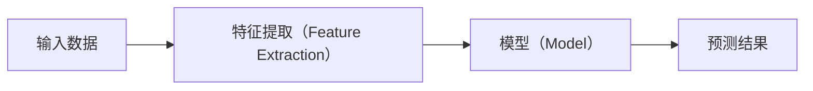

# Language and Terminology Rules

## Primary Language

All generated lecture notes must use **Chinese as the primary language**.

Explanations, intuition, derivations, diagram explanations, code explanations, and supplementary background should all be written mainly in Chinese.

Do not write large sections in English unless the source material itself requires preserving an English expression.

The final notes should read naturally as Chinese course notes, not as translated English notes.

---

## English Terminology

For technical terms, specialized concepts, abbreviations, framework names, algorithm names, mathematical terminology, and other non-everyday English expressions, preserve the English form when useful.

The preferred format on first occurrence is:

```text
中文术语（English Term）
```

Examples:

```text
梯度下降（Gradient Descent）

损失函数（Loss Function）

反向传播（Backpropagation）

注意力机制（Attention Mechanism）

最大似然估计（Maximum Likelihood Estimation）
```

After the first occurrence, normally use the Chinese term alone unless:

- the English term is more commonly used in the field;
- the abbreviation is standard;
- keeping the English form avoids ambiguity.

Example:

```text
卷积神经网络（Convolutional Neural Network, CNN）
```

Later occurrences may use:

```text
卷积神经网络
```

or:

```text
CNN
```

depending on context.

---

## Everyday English Words

Do not mechanically annotate ordinary English words that are already commonly understood or that do not function as technical terminology.

For example, there is usually no need to repeatedly annotate common words such as:

- input
- output
- model
- data
- file
- server

unless the term has a specific technical meaning in the current context.

The purpose of English annotation is to preserve important domain vocabulary, not to turn every sentence into bilingual text.

---

## When English Should Be Preserved Directly

Keep the original English form when the term is normally used in English in technical literature or when translating it would reduce clarity.

Examples include:

```text
Transformer

BERT

GPT

ResNet

PyTorch

TensorFlow

Docker

Kubernetes

API

CPU

GPU

SQL
```

When useful, explain them in Chinese on first appearance.

Example:

```text
Transformer 是一种以注意力机制（Attention Mechanism）为核心的神经网络架构。
```

Do not force awkward Chinese translations for established names.

---

## Abbreviations

When an abbreviation first appears, give the full English name if it is useful for learning.

Preferred format:

```text
主成分分析（Principal Component Analysis, PCA）
```

Then use:

```text
PCA
```

or:

```text
主成分分析
```

consistently afterward.

Do not repeatedly expand the same abbreviation unless necessary.

---

## Mathematical and Statistical Terminology

For mathematical, statistical, and machine-learning terminology, preserve the standard English term on first occurrence.

Examples:

```text
期望（Expectation）

方差（Variance）

协方差（Covariance）

似然函数（Likelihood Function）

后验概率（Posterior Probability）

梯度（Gradient）

雅可比矩阵（Jacobian Matrix）

海森矩阵（Hessian Matrix）
```

If the Chinese translation is uncommon or potentially ambiguous, keep both Chinese and English more frequently.

---

## Code and Programming Terms

Do not translate:

- variable names;
- function names;
- class names;
- library names;
- command names;
- API names;
- code keywords.

Example:

```python
loss.backward()
optimizer.step()
```

In explanation, write:

`loss.backward()` 用于计算反向传播（backpropagation）所需的梯度，而 `optimizer.step()` 根据已经计算出的梯度更新模型参数。

Do not translate code identifiers into Chinese.

---

## Mermaid Diagrams

Mermaid diagrams should use Chinese labels by default when doing so does not reduce technical accuracy.

For important technical terms, use:

```text
中文（English）
```

inside nodes when appropriate.

Example:



Avoid making Mermaid nodes excessively long.

If bilingual labels make the diagram difficult to read, use concise Chinese labels in the diagram and explain the English terminology below the diagram.

---

## Original English Text from Slides

If the slide contains an important original English sentence or definition:

1. explain it mainly in Chinese;
2. preserve the original English wording only when it is useful for terminology or precision;
3. do not copy large blocks of English unnecessarily.

The notes should prioritize understanding rather than reproducing the original slide text verbatim.

---

## Terminology Consistency

Once a translation is chosen, use it consistently throughout the same lecture and across related lecture notes.

Do not alternate randomly between multiple Chinese translations.

For example, if `embedding` is translated as:

```text
嵌入表示（Embedding）
```

do not later switch between:

```text
词嵌入
向量嵌入
嵌入层
embedding
```

unless these terms refer to genuinely different concepts.

---

## Terminology Glossary

If a lecture contains many specialized English terms, add a concise terminology table at the end of the note.

This is a terminology reference only, not a chapter summary.

Use the format:

| 中文术语 | English | 缩写 | 含义 |
|---|---|---|---|
| 梯度下降 | Gradient Descent | — | 利用梯度方向迭代优化参数的方法 |
| 随机梯度下降 | Stochastic Gradient Descent | SGD | 使用随机样本或小批量数据估计梯度 |
| 反向传播 | Backpropagation | — | 利用链式法则计算神经网络梯度的方法 |

Only include terms that are genuinely specialized or useful for later阅读。

Do not include common everyday vocabulary.

---

## Overall Language Style

The notes should sound like a technically rigorous Chinese textbook or university lecture note.

Prefer:

- natural Chinese sentence structure;
- clear logical transitions;
- precise technical terminology;
- Chinese explanations with necessary English annotations.

Avoid:

- literal translation from English syntax;
- excessive bilingual repetition;
- English-heavy paragraphs;
- unnecessary mixing of Chinese and English;
- translating established proper names awkwardly.

The target style is:

**中文负责讲清楚内容，英文负责保留专业术语和原始技术名称。**