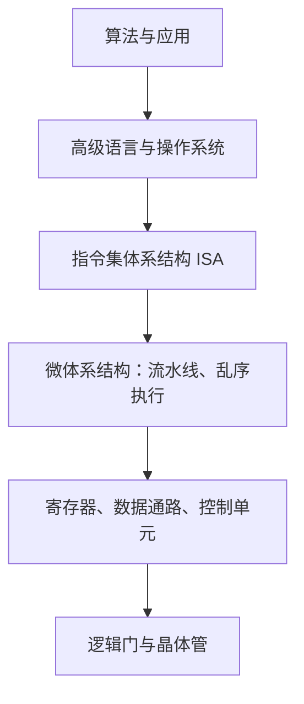

# Chapter 0 课程导论

## 0.1 这门课研究什么

计算机系统通过不同抽象层组织复杂性。高级语言描述算法，编译器把它翻译成机器指令，处理器再通过寄存器、运算单元与控制逻辑执行这些指令。汇编语言位于软件与硬件的交界处，是理解“程序究竟怎样运行”的重要入口。（课件第 5 页）



指令集体系结构（Instruction Set Architecture, ISA）规定软件可见的指令、寄存器和执行语义。微体系结构（Microarchitecture）则决定一颗具体处理器如何实现这些语义，例如怎样安排流水线、缓存和执行单元。同一 ISA 可以有许多不同实现。

课程的两条主线是：

- **汇编程序设计**：数据如何表示，操作数放在哪里，指令怎样改变寄存器、内存和控制流。
- **微机接口**：处理器如何通过接口与外设交换数据，如何借助中断和定时器协调工作。

接口（Interface）或端口（Port）是计算机与外设之间的连接点。课件第 10–12 页区分了串行、并行通信，以及中断控制器、定时器承担的控制功能。这里的物理连接口与后续指令中的 I/O 端口地址相关，但不是同一层次的概念。

## 0.2 为什么学习汇编

### 0.2.1 理解程序的实际行为

操作系统、固件（Firmware）、设备驱动、嵌入式系统、编译器和密码学实现都可能直接涉及汇编。即便日常开发不手写汇编，阅读编译结果仍能帮助定位性能问题和理解语言规则。（第 6–9 页）

课件使用下面的例子说明源代码与机器指令之间的关系：

```c
int silly(int a) {
    return (a + 1) > a;
}
```

若 `a` 取 `INT_MAX`，`a + 1` 超出 `int` 的可表示范围。在 C/C++ 中，这是**未定义行为（Undefined Behavior, UB）**。在没有溢出的合法执行中，表达式恒为真，编译器因而可能把函数优化成直接返回 `1`。

课件展示了某次 Clang 编译中 `-O0` 保留加法、比较，而 `-O1` 直接返回 `1` 的结果。它说明编译器会利用语言语义做优化，不能把这次低优化级别下的回绕结果当作语言保证。课件第 7 页的 “unspecified behavior” 应更正为 “undefined behavior”；Clang 的检查器也将有符号溢出列为 UB 检查项。参见 [Clang UndefinedBehaviorSanitizer 文档](https://clang.llvm.org/docs/UndefinedBehaviorSanitizer.html)。

### 0.2.2 理解优化改变了什么

另一个例子是求和：

```c
int Sum1ToN(int n) {
    int sum = 0;
    for (int i = 0; i < n; i++) {
        sum += i;
    }
    return sum;
}
```

虽然函数名写作 `Sum1ToN`，循环实际累加的是 $0$ 到 $n-1$。在 $n>0$ 且讨论的算术没有溢出时：

$$
\sum_{i=0}^{n-1}i=\frac{n(n-1)}{2}.
$$

编译器可能保留循环、展开循环、使用向量指令，或识别这种求和模式并生成闭式计算。具体结果依赖编译器、版本、优化参数和目标平台。`n<=0` 时原程序返回 `0`，不能无条件套用公式；直接在 C 中写 `n*(n-1)/2` 还可能因为中间乘法而提前溢出。（第 8 页）

有效的观察方法是固定源代码，只改变一个因素，比较指令数量、循环结构、访存与寄存器使用。看见更短的汇编也不能直接断言运行更快，还需要测量。

### 0.2.3 理解局部性能优化

课件以 PTX（Parallel Thread Execution）、ARM NEON 以及移动端推理框架为例，说明高性能实现有时需要控制向量化、通信和硬件资源使用。（第 9 页）

这里的学习重点是：先定位热点，再理解瓶颈，最后判断手工优化是否有收益。课件中的具体项目是教学案例，不表示所有应用都需要手写汇编。

## 0.3 课程内容与学习顺序

第 13 页列出的章节安排如下；本目录现有课件覆盖导论与第 1–3 章。

| 主题 | 教材章节 | 要解决的问题 |
|---|---|---|
| 微处理器与体系结构 | 1–2 | 数据怎样表示，寄存器和内存怎样组织 |
| 寻址方式 | 3 | 指令怎样找到操作数 |
| 数据传送指令 | 4 | 怎样复制数据、使用栈和字符串操作 |
| 算术与逻辑指令 | 5 | 怎样运算并解释标志位 |
| 程序控制指令 | 6 | 怎样实现分支、循环和过程调用 |
| 汇编与 C/C++ 混合编程 | 7 | 不同语言怎样共享调用约定 |
| 基本 I/O 接口 | 11 | 怎样与外设通信 |
| 中断 | 12 | 怎样响应异步事件 |
| 算术协处理器与 SIMD | 14 及补充 | 怎样处理浮点数和并行数据 |

建议先掌握数据位宽、补码和小端序，再学习寄存器与地址转换，最后把寻址公式对应到数组、结构体和栈帧。否则容易把“操作数的值”“保存值的地址”和“地址所属的内存空间”混在一起。

## 0.4 教材、参考资料与工具

课件第 2–4 页的主要教材是 Barry B. Brey 的 *The Intel Microprocessors* 第 8 版。其他参考书包括白洪欢《80X86 汇编语言程序设计基础》、Irvine 的 x86 汇编教材，以及 Kusswurm、Jo Van Hoey 的 x86/x64 汇编教材。

学习时可以把资料分成三类：

| 资料或工具 | 用途 |
|---|---|
| 教材和本课程课件 | 建立概念、完成章节习题 |
| Intel/AMD 架构手册 | 核对指令语义、编码和模式限制 |
| MASM 参考手册 | 核对伪指令、运算符和汇编器语法 |
| Compiler Explorer | 对照 C/C++ 源码与编译生成的汇编 |
| 8086 模拟器、汇编器与反汇编器 | 单步观察寄存器、内存、标志位及机器码 |

架构手册入口见 [Intel 官方手册索引](https://www.intel.com/content/www/us/en/support/articles/000006715/processors.html)。使用工具时应记录目标是 16 位、32 位还是 64 位模式，以及汇编器采用 Intel 还是 AT&T 语法，这些设置直接影响代码含义。

## 0.5 实验与探索性研究

### 0.5.1 基础实验

课件第 14 页将环境搭建、分支、循环、汇编与 C/C++ 混合编程、x64 编程和 I/O 接口列为可选预备实验。这些练习适合用来确认自己能读懂机器状态变化。

### 0.5.2 Project 1：从高级抽象到汇编

项目要求研究一种高级语言抽象在汇编层面如何体现。（第 15–18 页）

抽象泄漏（Leaky Abstraction）的含义是：抽象虽然隐藏实现细节，但在性能、异常行为或资源限制等场景中，底层机制仍可能影响使用者。汇编能帮助找到这种影响来自哪里。

课件给出的选题包括函数调用与栈帧、虚函数与动态分派、异常处理、栈保护、Lambda 与闭包、泛型与模板、智能指针、递归与迭代，以及整数溢出与 UB。

可以按以下步骤组织研究：

1. **缩小问题**：例如“开启优化后，一个捕获整数的 Lambda 是否仍需要独立栈对象”。
2. **提出假设**：说明预期会出现哪些存储、加载或调用指令。
3. **设计对照**：保持平台、编译器版本和代码输入一致，只改变捕获方式或优化级别。
4. **收集证据**：保存源代码、编译选项、关键汇编片段和必要的性能数据。
5. **解释与评价**：区分语言保证、应用二进制接口（Application Binary Interface, ABI）约定和某次编译的实现选择。

课件要求独立完成并提交报告。以上步骤是对研究方法的整理，不是新增作业要求。

### 0.5.3 Project 2 与往年研究案例

当前课件把“评估大语言模型的代码反编译能力”列为暂定方向。第 20–22 页则明确标作往年 Project 2，介绍排序算法发现、二进制函数命名、编译优化和二进制代码摘要等研究。

可研究的问题包括：模型能否识别函数功能，等价指令改写是否影响回答，混淆是否影响理解，以及能否判断两个函数功能相同。评价时应使用可验证的功能结果，不能只凭解释文字是否流畅。

## 0.6 课件中的考核安排

以下仅记录所提供课件第 18–19 页的安排，具体实施以课程后续通知为准。

| 项目 | 课件记录 |
|---|---|
| 探索性研究 | 总评占比 30% |
| 期末考试 | 总评占比 70% |
| 期末考试成绩要求 | 至少 50 分 |
| Project 1 截止日期 | 11 月 10 日 |
| Project 2 截止日期 | 12 月 31 日 |

课件没有在这些日期旁单独标注年份。课程群、入群口令等联络信息请查课程原始通知。

## 0.7 术语表

| 中文术语 | English | 缩写 | 含义 |
|---|---|---|---|
| 汇编语言 | Assembly Language | — | 用助记符和操作数表达机器指令 |
| 指令集体系结构 | Instruction Set Architecture | ISA | 软件可见的机器接口与执行语义 |
| 微体系结构 | Microarchitecture | — | 具体处理器实现 ISA 的组织方式 |
| 固件 | Firmware | — | 面向设备初始化和底层控制的软件 |
| 未定义行为 | Undefined Behavior | UB | 语言规范不对该执行的结果施加要求 |
| 应用二进制接口 | Application Binary Interface | ABI | 参数传递、寄存器使用、数据布局等二进制约定 |
| 抽象泄漏 | Leaky Abstraction | — | 底层机制透过抽象影响上层行为 |
| 反编译 | Decompilation | — | 从低层代码恢复较高层程序表示 |
