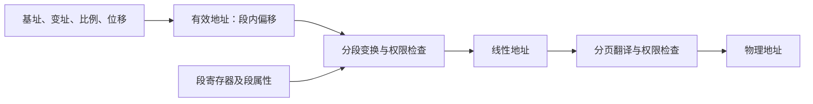
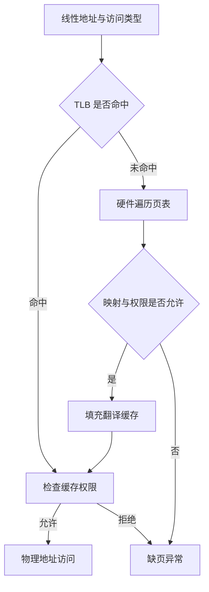

# Chapter 2 微处理器体系结构与内存管理

本笔记对应 [Chapter 2 – The Microprocessor and Its Architecture.pdf](Chapter%202-The%20Microprocessor%20and%20Its%20Architecture.pdf)（共 189 页）。内容包括程序可见寄存器、运行模式、实模式分段、保护模式、分页，以及 TLS、模式切换、地址翻译加速和页表自映射等附录。页码指 PDF 页序。

前置阅读：[第 1 章：微处理器与数据表示](Chapter1.md)。下一章：[寻址方式](Chapter3.md)。计算内存容量时，KiB、MiB、GiB 分别代表 $2^{10}$、$2^{20}$、$2^{30}$ 字节。

## 2.1 编程模型与寄存器

### 2.1.1 程序可见与系统管理状态

编程模型（Programming Model）描述软件能使用的寄存器与机器状态。应用程序常用通用寄存器、指令指针、标志寄存器以及浮点/SIMD 寄存器；操作系统还管理控制寄存器、描述符表和任务状态。（第 5–10、33 页）

课件所谓“程序不可见”主要指普通应用代码不直接使用，不能理解成任何软件都无法访问。例如操作系统可以通过专门指令加载 GDTR、CR3 等寄存器；段寄存器中的隐藏描述符缓存则由处理器维护。

IA-32 基本环境还包括 x87 浮点寄存器栈、MMX 和 XMM 等状态；MMX 与 x87 寄存器资源有关联，`EMMS` 用于结束 MMX 使用后的相关状态整理。具体可用的 SIMD 寄存器和指令集由运行模式及处理器能力决定。

### 2.1.2 通用寄存器及别名

| 64 位 | 32 位 | 16 位 | 低 8 位 | 传统用途或常见角色 |
|---|---|---|---|---|
| `RAX` | `EAX` | `AX` | `AL` | 累加器，乘除法隐含操作数，部分 ABI 中的返回值 |
| `RBX` | `EBX` | `BX` | `BL` | 基址 |
| `RCX` | `ECX` | `CX` | `CL` | 循环计数，移位计数 |
| `RDX` | `EDX` | `DX` | `DL` | 乘除法扩展部分，I/O 端口号 |
| `RBP` | `EBP` | `BP` | `BPL` | 栈帧基址 |
| `RSP` | `ESP` | `SP` | `SPL` | 栈指针 |
| `RSI` | `ESI` | `SI` | `SIL` | 字符串源地址 |
| `RDI` | `EDI` | `DI` | `DIL` | 字符串目的地址 |
| `R8`–`R15` | `R8D`–`R15D` | `R8W`–`R15W` | `R8B`–`R15B` | 64 位模式新增的通用寄存器 |

这些是同一物理架构寄存器的不同宽度视图，不是彼此独立的储存单元。`AH`、`BH`、`CH`、`DH` 对应各自 16 位寄存器的位 15–8。（第 11–18 页）

传统角色并不把所有寄存器用途固定死；只有具体指令的隐含操作数、栈语义和 ABI 约定会施加相应限制。

### 2.1.3 部分寄存器写入

在 **64 位模式**中，写 32 位通用寄存器会把对应 64 位寄存器的高 32 位清零；写 8 位或 16 位部分通常保留其余位。

```asm
MOV RAX, 1111111111111111H ; RAX = 1111111111111111H
MOV EAX, 22222222H         ; RAX = 0000000022222222H
MOV AX, 3333H             ; RAX = 0000000022223333H
MOV AL, 44H               ; RAX = 0000000022223344H
```

因此写 `EAX` 可以建立不依赖旧 `RAX` 高位的新结果。部分宽度写入则可能保留旧值依赖；具体是否引起性能停顿取决于微体系结构，不能把课件关于部分寄存器重命名的描述推广到所有 CPU。

64 位模式仍可使用 `AH` 等高字节寄存器，但**带 REX 前缀的指令无法编码它们**。`SPL`、`BPL`、`SIL`、`DIL` 和扩展寄存器的相关编码需要 REX。模式、寄存器和编码限制必须一起判断。

### 2.1.4 指令指针与段寄存器

`IP/EIP/RIP` 是指令指针（Instruction Pointer）。顺序执行时它前进到下一条指令；跳转、调用、返回等操作会改变控制流。`SP/ESP/RSP` 则表示栈顶位置，不能与指令指针混淆。（第 19、30–32 页）

| 段寄存器 | 名称 | 传统作用 |
|---|---|---|
| `CS` | Code Segment | 代码段，与指令指针配合 |
| `DS` | Data Segment | 默认数据段 |
| `SS` | Stack Segment | 栈段，与栈指针及相关基址寻址配合 |
| `ES` | Extra Segment | 附加数据段，常用于字符串目的操作数 |
| `FS`、`GS` | 附加段寄存器 | 系统数据、线程局部存储等 |

64 位模式下，普通地址计算中 `CS/DS/ES/SS` 的基址按零处理，`FS/GS` 的基址仍有作用；`CS` 的部分属性仍参与模式与权限语义。不能因此说所有段寄存器都完全无效。

## 2.2 标志寄存器

`FLAGS/EFLAGS/RFLAGS` 记录运算状态并控制处理器行为。（第 20–29 页）

### 2.2.1 六个常用状态标志

| 标志 | 位号 | 含义 |
|---|---:|---|
| `CF` | 0 | 进位标志（Carry Flag）：无符号加法进位、减法借位 |
| `PF` | 2 | 奇偶标志（Parity Flag）：结果低 8 位中 1 的个数为偶数时置 1 |
| `AF` | 4 | 辅助进位标志（Auxiliary Carry Flag）：位 3 与位 4 之间的进位/借位 |
| `ZF` | 6 | 零标志（Zero Flag）：结果为零时置 1 |
| `SF` | 7 | 符号标志（Sign Flag）：结果最高位 |
| `OF` | 11 | 溢出标志（Overflow Flag）：有符号结果超出当前位宽范围 |

`CF` 与 `OF` 分别回答无符号和有符号结果是否越界。两者可以同时为 1，也可以只有其中一个为 1。

课件第 23 页的 8 位例题：

| 运算 | 截断后的结果 | CF | OF | SF | ZF | 解释 |
|---|---|---:|---:|---:|---:|---|
| `65H + A3H` | `08H` | 1 | 0 | 0 | 0 | 无符号 $101+163=264$；有符号 $101-93=8$ |
| `BAH + B0H` | `6AH` | 1 | 1 | 0 | 0 | 有符号 $-70-80=-150$ 超出 8 位范围 |

对于加法，两个同号操作数得到异号结果时发生有符号溢出。减法则在两操作数异号、结果符号与被减数不同的情况下溢出。

### 2.2.2 AF 与 BCD 调整

BCD 的每一位只允许 0–9。课件使用 $28+69=97$ 为例：按二进制相加得到 `28H + 69H = 91H`，低半字节的 $8+9$ 产生了半字节进位，调整后得到 `97H`。（第 24–25 页）

十进制调整不仅需要看 AF，也要结合低位是否大于 9、CF 等条件。AF 本身是二进制进位信息，不是“运算结果是否为合法 BCD”的完整判定。

### 2.2.3 方向标志与系统标志

| 标志 | 主要用途 |
|---|---|
| `DF` | 字符串指令的地址增减方向；`CLD` 清零，`STD` 置位 |
| `TF` | 单步调试 |
| `IF` | 控制可屏蔽外部中断，不屏蔽所有异常和 NMI |
| `IOPL` | I/O 特权检查相关字段 |
| `VM` | 传统保护模式下的虚拟 8086 状态 |
| `NT` | 传统硬件任务嵌套相关状态 |
| `RF` | 调试恢复控制 |
| `AC` | 配合其他条件参与对齐检查等机制 |
| `VIF/VIP` | 虚拟中断标志与待处理状态 |
| `ID` | 历史上通过能否修改此位判断 `CPUID` 支持 |

普通 `MOV`、`JMP` 不修改算术状态标志，但不能概括为“所有数据传送与控制类指令都不改标志”。`POPF`、`IRET` 等能恢复或修改部分标志，而且受权限限制。每条指令究竟更新、保持还是令某位未定义，应查该指令的语义。

## 2.3 运行模式与内存管理目标

### 2.3.1 运行模式

| 模式 | 主要特征 | 分页与保护 |
|---|---|---|
| 实模式（Real Mode） | 使用段值左移 4 位与偏移组合地址 | 常规实模式不分页，不提供保护模式式的权限隔离 |
| 保护模式（Protected Mode） | 16/32 位代码，选择子与描述符 | 分段保护；可启用分页 |
| 虚拟 8086 模式（Virtual-8086 Mode） | 在传统保护环境中执行 8086 风格代码 | 由系统监控，可使用分页 |
| 长模式的兼容子模式 | 运行已有的 16/32 位应用代码 | 使用长模式的分页体系 |
| 长模式的 64 位子模式 | 64 位寄存器、扩展通用寄存器 | 使用长模式分页，分段作用减少 |
| 系统管理模式（System Management Mode, SMM） | 固件进行电源与平台控制等操作 | 独立的特殊执行环境 |

长模式（Long Mode）是 AMD 的称呼，Intel 称为 IA-32e。它包含兼容模式与 64 位模式，不包含实模式或虚拟 8086 模式。架构支持某种应用模式，也不代表每个操作系统都实现对应兼容环境。（第 34–39 页）

### 2.3.2 为什么需要地址转换

内存管理要支持三个目标：（第 40–51 页）

- **重定位（Relocation）**：程序的实际物理位置改变后，仍能通过稳定的程序地址运行。
- **保护（Protection）**：不允许一个程序任意读写另一个程序或内核的数据。
- **共享（Sharing）**：让不同进程合法映射同一份代码或数据。

操作系统配置映射与权限，硬件在访存时实施检查。二者协作完成保护，不能将其理解为只需要硬件或只需要操作系统。

### 2.3.3 分段与分页

| 比较项 | 分段（Segmentation） | 分页（Paging） |
|---|---|---|
| 划分方式 | 按代码、数据等逻辑区域划分可变长段 | 按固定大小的页划分 |
| 主要地址信息 | 段基址、段界限、属性 | 虚拟页到物理页框的映射与属性 |
| 常见碎片 | 外部碎片 | 页内的内部碎片 |
| 重定位单位 | 段 | 页 |
| 在 x86 中的组合 | 先将逻辑地址变为线性地址 | 再将线性地址变为物理地址 |

两种机制可以同时使用。不能只按“查一次表、查多次表”断言哪种一定更快，因为处理器还有描述符缓存、TLB 和页表结构缓存。

## 2.4 四类地址与实模式寻址

### 2.4.1 先分清地址层次

| 地址类型 | 含义 | 示例 |
|---|---|---|
| 有效地址（Effective Address, EA） | 段内偏移 | `BX + SI + 10H` 的结果 |
| 逻辑地址（Logical Address） | 段标识与偏移 | 实模式 `1000H:2000H`，保护模式“选择子:偏移” |
| 线性地址（Linear Address） | 分段变换后的地址 | 段基址加 EA |
| 物理地址（Physical Address） | 分页翻译后的物理空间地址 | 页框基址加页内偏移 |

课件通常把线性地址也称为虚拟地址（Virtual Address）。使用平坦内存模型时，普通数据段的基址是 0，EA 与线性地址相同，但启用分页后它们仍不一定等于物理地址。（第 92–99 页）



### 2.4.2 实模式计算公式

在普通的 16 位实模式寻址中：（第 52–62、153–154 页）

$$
\text{线性地址}=(\text{段寄存器值}\ll4)+\text{16 位偏移}.
$$

例如 `1000H:2000H` 对应：

$$
1000H\times10H+2000H=12000H.
$$

段起点以 16 字节对齐，称为段落边界（Paragraph Boundary）。偏移从 `0000H` 到 `FFFFH`，一个完整段窗口长 64 KiB。段值为 `1000H` 时，窗口范围是 `10000H`–`1FFFFH`。

不同逻辑地址可指向同一位置。例如 `1000H:2000H` 与 `1100H:1000H` 都指向 `12000H`。段可以重叠，这正是段窗口的特点。

### 2.4.3 默认的段与偏移配合

| 用途 | 常见组合 |
|---|---|
| 取指 | `CS:IP` |
| 栈操作 | `SS:SP` |
| 16 位寻址中使用 `BP` | 默认 `SS` |
| 16 位寻址中使用 `BX/SI/DI` 且不含 `BP` | 默认 `DS` |
| 字符串目的地址 | 常见为 `ES:DI` |

32 位寻址中，默认段与编码中的 **base 寄存器**有关；具体规则见 [第 3 章](Chapter3.md)。

如果程序所有引用都保持相同段内偏移，而装载器改变段起点，就能把整个段重定位。但程序若硬编码了绝对地址，仍需额外修正，并非所有程序都天然可重定位。

### 2.4.4 20 位地址回绕与 A20

8086/8088 只有 20 根地址线，超过 20 位的地址会截断：

$$
FFFFH\times10H+FFFFH=10FFEFH
\quad\longrightarrow\quad0FFEFH.
$$

`F800H:8000H` 的加法结果为 `100000H`，在原始 20 位地址空间中回绕到 `00000H`。

后来的处理器有更宽地址线。兼容旧程序的 A20 门（A20 Gate）可以屏蔽地址位 20；启用 A20 后，这个历史回绕行为不再成立。因此“实模式永远只能得到 1 MiB 内的地址”是面向 8086 的简化。普通最大 16:16 组合的线性和可以达到 `10FFEFH`，实际行为要结合处理器和 A20 状态判断。

## 2.5 保护模式分段

### 2.5.1 选择子不再直接给出段基址

在保护模式中，段寄存器保存段选择子（Segment Selector）。选择子用于在描述符表中定位段描述符（Segment Descriptor），再取得段基址、界限与访问属性。（第 63–89 页）

$$
\text{选择子}\to\text{描述符}\to\text{段基址与权限},
\qquad \text{线性地址}=\text{段基址}+\text{EA}.
$$

因此不能把保护模式中的 `DS` 值直接乘 16 当作基址。

### 2.5.2 选择子的 16 位结构

| 位 | 字段 | 含义 |
|---|---|---|
| 15–3 | Index | 描述符索引，共 13 位 |
| 2 | TI | 0 选 GDT，1 选 LDT |
| 1–0 | RPL | 请求特权级 |

普通代码/数据段描述符占 8 字节，所以：

$$
\text{描述符地址}=\text{所选表基址}+8\times\text{Index}.
$$

例如 `001BH`：Index 为 3、TI 为 0、RPL 为 3，因此引用 GDT 中索引为 3 的条目，其相对表起点的偏移为 `18H`。

全局描述符表（Global Descriptor Table, GDT）保存系统全局使用的描述符；局部描述符表（Local Descriptor Table, LDT）是可选的局部表。中断描述符表（Interrupt Descriptor Table, IDT）组织中断和异常入口的门描述符，不能靠选择子的 TI 位选中。

GDT 的零号条目保留为不可用的空描述符。传统保护模式下，空选择子可装入部分数据段寄存器，但用它访存会异常；不能直接把这条规则推广到 64 位模式的所有段语义。

### 2.5.3 段描述符与界限计算

以下以 **386 及以后、向上扩展的普通段**为例。286 的格式和位宽不同，64 位模式下某些系统描述符还会占 16 字节。

| 字段 | 作用 |
|---|---|
| Base | 32 位段基址 |
| Limit | 20 位段界限编码 |
| G | 界限粒度，0 为字节，1 为 4 KiB |
| P | 段是否存在 |
| DPL | 描述符特权级 |
| S、Type | 系统/代码/数据类型，读写、执行等属性 |
| A | 已访问状态 |
| D/B、L | 默认操作数/栈相关大小以及 64 位代码属性 |

界限是允许的**最大偏移**，不是长度。设编码值为 $L$：

$$
\text{有效界限}=\begin{cases}
L,&G=0,\\
(L\ll12)\;|\;FFFH,&G=1.
\end{cases}
$$

$$
\text{段长度}=\text{有效界限}+1.
$$

课件第 75–76 页给定 Base=`10000000H`，Limit=`001FFH`：

| 粒度 | 长度 | 最大偏移 | 最后一个字节的地址 |
|---|---|---|---|
| `G=0` | `200H` = 512 字节 | `1FFH` | `100001FFH` |
| `G=1` | `200H × 1000H` = 2 MiB | `1FFFFFH` | `101FFFFFH` |

多字节访问还要确保最后一个字节没有越过界限。向下扩展段的合法范围规则不同，不能直接使用上述“零到界限”的解释。

### 2.5.4 特权级检查

特权级数值越小，权限越高；0 最高，3 最低。

- 当前特权级（Current Privilege Level, CPL）：当前执行代码的特权级。
- 请求特权级（Requested Privilege Level, RPL）：选择子携带的请求级别。
- 描述符特权级（Descriptor Privilege Level, DPL）：目标段允许的级别。

普通数据段访问的核心条件为：

$$
\max(\mathrm{CPL},\mathrm{RPL})\le\mathrm{DPL}.
$$

例如 CPL=3、RPL=0、DPL=2，仍然不允许访问，因为 $\max(3,0)=3>2$。用户程序不能靠把 RPL 写成 0 来提升权限。

栈段装载的特权要求更严格，通常要求：

$$
\mathrm{CPL}=\mathrm{RPL}=\mathrm{DPL},
$$

并且段类型、可写性与存在位也必须合法。这些公式不涵盖门、依从代码段等特殊控制转移规则。（第 81–84 页）

### 2.5.5 描述符表寄存器与隐藏缓存

`GDTR/IDTR` 保存相应表的基址与界限；`LDTR` 通过 GDT 中的系统描述符定位 LDT；任务寄存器 `TR` 引用任务状态段（Task State Segment, TSS）。现代系统的软件调度与传统硬件任务切换需要区分，不能把每个进程机械对应成一个硬件任务。

装载段寄存器时，处理器将描述符中的基址、界限、属性放入隐藏缓存，后续访问不必每次重新查 GDT/LDT。只修改内存中的描述符，并不自动刷新已经缓存的段属性。（第 85–89、158–159 页）

### 2.5.6 平坦内存模型与“进程数上限”问题

平坦内存模型（Flat Memory Model）通常把代码、数据段的基址设为 0，32 位情况下让界限覆盖完整 4 GiB 线性空间。代码、数据、栈仍可具有不同用途和权限；实际隔离常交给分页实现。（第 90–91 页）

课件第 71 页用“每进程两个 GDT 条目”推得 4096 个进程。这只是一个额外假设下的粗略估算，且还忽略了保留条目。多个进程可以共享代码/数据描述符，通过不同页表隔离地址空间，故 **GDT 的条目数不是 x86 可运行进程数的架构上限**。

## 2.6 分页：从线性地址到物理地址

### 2.6.1 页号与页内偏移

分页把虚拟地址空间划分成页（Page），把物理空间划分成对应大小的页框（Page Frame）。页表（Page Table）记录页到页框的映射。（第 92–110 页）

若页大小为 $2^p$ 字节：

$$
\mathrm{VA}=\mathrm{VPN}\times2^p+\mathrm{Offset},
$$

$$
\mathrm{PA}=\mathrm{PFN}\times2^p+\mathrm{Offset}.
$$

VPN 为虚拟页号，PFN 为物理页框号。**翻译页号，不改变页内偏移。** 4 KiB 页大小为 $2^{12}$ 字节，因此低 12 位是页内偏移。

### 2.6.2 多级页表为什么节省空间

假设虚拟地址 $v$ 位，每页 $2^p$ 字节，每个页表项占 $e$ 字节，则单级页表所需空间为：

$$
2^{v-p}\times e.
$$

课件第 100–102 页的**假想系统**使用完整 64 位虚拟地址、4 KiB 页和 4 字节表项，单级页表为：

$$
2^{64-12}\times4=2^{54}\text{ B}=16\text{ PiB}.
$$

若每个子表占一页，则每表容纳 $4096/4=1024=2^{10}$ 项，一层最多消耗 10 个索引位；52 个虚拟页号位需 $\lceil52/10\rceil=6$ 层。

这不是实际 x86-64 页表布局。它的目的在于说明多级页表可按需分配子树：大片未使用的地址区域只需在上层保留一个无效项，无须为每个虚拟页分配末级表项。若地址空间全部被映射，多级结构也会有额外上层开销。

### 2.6.3 经典 32 位二级分页：10–10–12

在传统、非 PAE 的 32 位 4 KiB 分页模型中，页目录项（Page Directory Entry, PDE）和页表项（Page Table Entry, PTE）各占 4 字节。

```text
线性地址 31                         0
         [目录索引 10][页表索引 10][页内偏移 12]
```

一次翻译分为：

1. 从 `CR3` 取得页目录的物理基址。
2. 用目录索引定位 PDE，检查属性，取得下一级页表物理基址。
3. 用页表索引定位 PTE，检查属性，取得物理页框基址。
4. 加上原地址的低 12 位偏移，得到物理地址。

表项地址的计算中要把索引乘以 **表项大小 4 字节**。读取表项后必须区分地址位与属性位，不能把原始 PDE/PTE 整数直接当作基址。

对线性地址 `0301008AH`：（第 123–125 页）

$$
\begin{aligned}
\mathrm{PDIndex}&=(\mathrm{VA}\gg22)\;\&\;3FFH=00CH,\\
\mathrm{PTIndex}&=(\mathrm{VA}\gg12)\;\&\;3FFH=010H,\\
\mathrm{Offset}&=\mathrm{VA}\;\&\;FFFH=08AH.
\end{aligned}
$$

课件图示的页目录基址为 `00010000H`，相应 PDE 地址是 `00010030H`。图中页表基址为 `50001000H`，PTE 地址是 `50001040H`；若该项映射到页框基址 `00030000H`，最终物理地址就是 `0003008AH`。

线性地址本身只能给出索引与偏移；没有页表内容，无法唯一确定物理地址。

### 2.6.4 PSE 与 4 MiB 大页

页大小扩展（Page Size Extension, PSE）允许在相应传统分页配置中由 PDE 直接映射 4 MiB 页。（第 126–130 页）

- `CR4.PSE=1` 且 `PDE.PS=1`：PDE 直接给出 4 MiB 页映射。
- `PDE.PS=0`：该项仍指向普通页表，用 4 KiB 页映射。

大页跳过末级页表，地址划分为 **10–22**；22 位页内偏移覆盖 $2^{22}$ 字节。不同 PDE 可以选择不同页大小，因此 4 KiB 与 4 MiB 映射可以混用。

大页可减少表项数量并扩大 TLB 覆盖范围，但可能增加内部碎片，降低按小页独立设置权限、写时复制的灵活性。

### 2.6.5 PAE：线性地址仍为 32 位

物理地址扩展（Physical Address Extension, PAE）允许系统使用更宽的物理地址。课件先以早期 36 位物理地址模型说明，可寻址 64 GiB 物理空间，而进程的线性地址仍是 32 位。（第 131–136 页）

PAE 使用 8 字节表项，普通页目录和页表各含 $4096/8=512=2^9$ 项。增加的页目录指针表（Page Directory Pointer Table, PDPT）含 4 项，形成 **2–9–9–12**：

```text
[PDPT 索引 2][目录索引 9][页表索引 9][偏移 12]
```

设置 `CR4.PAE=1` 后，PAE 模型可使用 4 KiB 页；若 PDE 的 PS 位选择大页，则直接映射 2 MiB 页，划分为 **2–9–21**。此时大页选择不由 `CR4.PSE` 决定。

PAE 不会把单个 32 位程序的一次线性寻址范围扩展成 64 GiB。物理地址宽度也并非永远固定 36 位，应区分课件的早期模型与后续处理器实现。

### 2.6.6 长模式的四级、五级分页

课件第 137–143 页介绍更宽的长模式地址。典型四级 4 KiB 页模型使用 8 字节表项，每层 9 位索引：

```text
[PML4 9][PDPT 9][PD 9][PT 9][页内偏移 12]
```

共 $9+9+9+9+12=48$ 个有效线性地址位。五级分页再增加一层 9 位索引，得到 57 位。是否支持五级分页、物理地址究竟实现多少位，都必须检查处理器能力和系统配置。

| 配置 | 地址划分 | 终止翻译的表项 | 页大小 |
|---|---|---|---|
| 四级分页，普通页 | 9–9–9–9–12 | PTE | 4 KiB |
| 四级分页，较大页 | 9–9–9–21 | PDE | 2 MiB |
| 四级分页，更大页 | 9–9–30 | PDPTE | 1 GiB，需硬件支持 |
| 五级分页，普通页 | 9–9–9–9–9–12 | PTE | 4 KiB |

这里“四级分页”是所选分页机制的名称。使用大页时查表提前终止，不代表操作系统切换成传统的二级或三级分页模式。

### 2.6.7 规范地址

64 位寄存器里的地址必须满足规范形式（Canonical Form）。在课件采用的普通规则下，已实现最高地址位以上的位都必须复制该最高位，即符号扩展。

- 48 位模型：位 63–48 必须等于位 47。
- 57 位模型：位 63–57 必须等于位 56。

例如 48 位模型下：

```text
0000 7C00 1810 2000   合法的低地址区域
FFFF 8010 BC00 1000   合法的高地址区域
0000 8010 BC00 1000   非规范：位 47 为 1，高位却没有扩展为 1
```

规范地址仍可能没有对应映射，或缺少访问权限。**规范形式检查、页表存在检查与权限检查是不同问题。** 不满足规范形式通常产生 `#GP`，栈相关访问可能产生 `#SS`，不应把所有无效地址都归类为缺页。

### 2.6.8 课件页表练习的假设边界

第 106–108 页给出：32 位虚拟地址、16 TiB 物理内存、4 KiB 页、4 字节表项。

按纯数学模型：物理地址需要 44 位，其中页框号 32 位、偏移 12 位；虚拟地址按 10–10–12 划分，需两级页表。

但 4 字节表项的全部 32 位已被页框号占满，没有剩余位保存 x86 所需的存在位、权限等属性。因此这只是一个抽象练习设定，不能直接作为真实 x86 二级分页格式使用。

## 2.7 页级保护与缺页异常

### 2.7.1 页表不仅保存地址

课件第 111–121 页重点介绍三类属性：

| 位 | 名称 | 含义 |
|---|---|---|
| `P` | Present | 项有效、可用于翻译；为 0 时访问会触发缺页异常 |
| `R/W` | Read/Write | 控制是否允许写入 |
| `U/S` | User/Supervisor | 控制用户态是否可访问 |

上层表项的权限约束整个子树。对普通用户态访问，可以把路径上 R/W、U/S 的组合理解为取交集：任何一级不允许写，最终映射就不能供用户态写；任何一级不允许用户访问，用户态就无法通过该路径访问。

内核写保护还受到 `CR0.WP` 等控制，扩展机制也有其他权限位。因此课件的“所有属性直接按位与”是教学简化，不是对全部分页字段的统一算法。

### 2.7.2 缺页不只意味着内存中没有页面

缺页异常（Page Fault, `#PF`）可以由页不存在、写只读页、用户态访问内核页，以及其他分页检查失败引起。操作系统可能补充页面后重试，也可能终止非法访问的进程。

课件的字符串例子：

```c
char *p = "Hello";
p[2] = 'M';
```

在 C 中修改字符串字面量本身就是未定义行为；常见实现又把它放在只读映射中，因此可能通过页级保护触发异常。正确的可修改版本是：

```c
char p[] = "Hello";
p[2] = 'M';
```

语言层禁止修改与硬件如何拦截是两层解释，不能因为某次没有异常，就认为修改字面量合法。

### 2.7.3 相关控制寄存器

| 寄存器或位 | 作用 |
|---|---|
| `CR0.PE` | 启用保护模式 |
| `CR0.PG` | 启用分页 |
| `CR2` | 保存最近一次缺页异常的线性地址 |
| `CR3` | 页表根的物理地址及相关控制信息，格式随模式变化 |
| `CR4.PSE` | 传统分页中的页大小扩展 |
| `CR4.PAE` | 物理地址扩展相关控制，也是进入长模式的条件之一 |

`CR2` 保存的是导致缺页的**线性地址**。异常处理期间若再次缺页，值可能被覆盖，因此处理程序需要及时保存所需信息。

## 2.8 地址转换的性能

### 2.8.1 TLB 与页表遍历

内存管理单元（Memory Management Unit, MMU）负责地址转换和权限检查。转译后备缓冲区（Translation Lookaside Buffer, TLB）缓存近期的虚拟页到物理页映射及相关属性。（第 144–147 页）



**TLB 未命中不等于缺页异常。** 页表中可能存在完全合法的映射，只是尚未缓存在 TLB 中。

页表结构缓存（Paging-structure Cache）缓存上层遍历信息；数据缓存缓存实际指令、数据，也可能缓存页表所在的内存。它们与 TLB 的缓存对象不同。

### 2.8.2 页大小与表结构大小

较小页面减少页内浪费，并有利于细粒度写时复制；较大页面减少页表开销并提高 TLB 覆盖范围。页大小选择是权衡，4 KiB 并非对所有任务都最优。（第 109、148 页）

PSE 等大页机制改变的是**被映射区域**的大小，区域可以包含程序代码或数据，不只是业务“数据”。它不会把每张页表自动变成 2 MiB 或 4 MiB。普通页目录、页表通常是 4 KiB，但传统 PAE 的顶层 PDPT 只有 4 个 8 字节项，不能说所有层级表结构都固定为 4 KiB。

### 2.8.3 VIPT 与翻译预取

虚拟索引、物理标记（Virtually Indexed, Physically Tagged, VIPT）缓存可以利用页内偏移进行缓存索引，同时让 TLB 翻译虚拟页号，最后用物理标记比较确认命中。在满足相应缓存组织约束时，两项工作可以部分并行。（第 180 页）

第 177–179 页的预取地址翻译（Prefetched Address Translation）是研究扩展：利用页表布局与地址关系提前取得部分下层表信息，减少串行依赖造成的等待。它不是每一颗 x86 处理器必然采用的架构机制。

## 2.9 附录：线程、模式切换与页表自映射

### 2.9.1 线程局部存储

线程局部存储（Thread-Local Storage, TLS）让同一个变量在不同线程中拥有不同实例。（第 155–157 页）

```c
__thread int tid;   /* 课件采用的编译器扩展语法 */
```

实现上，可以让每个线程具有独立的线程数据区，并通过 `FS` 或 `GS` 基址加固定偏移访问。线程切换时切换相应线程状态，同一条访存指令就会访问当前线程自己的实例。具体使用哪个段、哪些偏移由操作系统和 ABI 决定。

这解释了为什么 64 位模式虽然大幅弱化分段，仍保留 `FS/GS` 基址的实用价值。

### 2.9.2 从实模式进入保护模式

引导加载程序（Boot Loader）完成必要初始化，并把控制权交给内核。课件第 160–175 页介绍传统启动背景中的模式切换；现代固件和不同启动协议交接时的状态不一定相同。

概念流程为：

1. 准备 GDT、合法的代码/数据描述符和必要的中断处理安排。
2. 通过 `LGDT` 加载 GDTR；需要访问 1 MiB 以上区域时确认 A20 状态。
3. 设置 `CR0.PE=1`。
4. 执行远跳转（Far Jump），加载新的 `CS` 选择子及代码属性。
5. 装载数据段、栈段和栈指针，进入受控的保护模式执行环境。

**课件第 163、172 页把第 3 步标为 `CR0.PG`，应改为 `CR0.PE`。** `PE` 控制保护模式，`PG` 控制分页；保护模式可以在分页关闭时运行。可对照 [Intel 系统编程手册](https://www.intel.com/content/dam/support/us/en/documents/processors/pentium4/sb/25366821.pdf) 的控制寄存器和模式切换章节。

回到实模式同样需要准备合适的代码段、关闭分页、清除 PE 并通过控制转移重新建立段和栈状态。这是系统代码流程，不能只清一个位就假设当前代码和地址立即仍然有效。

### 2.9.3 进入长模式

课件第 176 页的核心条件可整理为：在符合要求的保护模式环境中准备长模式页表，启用 `CR4.PAE`，装载 `CR3`，设置扩展功能使能寄存器中的 `EFER.LME`，再启用 `CR0.PG`，最后转移到具有 64 位代码属性的代码段。

其中 `CR0.PE` 应已开启。`LME` 表示允许进入长模式；激活长模式与真正开始执行 64 位代码仍是两个相关但不同的步骤。页表映射必须覆盖切换过程要执行的代码、访问的数据和栈。

上述内容是机制说明，不是完整、可直接启动的引导程序。

### 2.9.4 页表递归映射

普通 CPU 访存使用虚拟地址，但页表遍历使用物理地址寻找页表。操作系统要修改页表，也需要一种可用的虚拟映射。（第 181–185 页）

递归映射（Recursive Mapping）让某个顶层表项指向页目录自身，使一段虚拟地址窗口映射出页表结构。它与恒等映射（Identity Mapping，虚拟地址数值等于物理地址）不是同义词。

在课件的 **32 位非 PAE 二级分页**例子中，选择页目录索引 `300H` 作为自引用项，可得到：

$$
\begin{aligned}
\mathrm{PTEVA}(va)&=C0000000H+4\times(va\gg12),\\
\mathrm{PDEVA}(va)&=C0300000H+4\times(va\gg22).
\end{aligned}
$$

为什么出现这两个基址？`300H << 22 = C0000000H` 选中页表窗口；再把下一层索引也设为 `300H`，就得到页目录自身所在页面 `C0300000H`。

对 `va=E4321000H`：

```text
目录索引 = 390H
页表索引 = 321H
页内偏移 = 000H

PTEVA = C0000000H + E4321H × 4 = C0390C84H
PDEVA = C0300000H + 390H × 4   = C0300E40H
```

这些结果是 **PTE/PDE 在递归窗口中的虚拟地址**，不是目标数据页的物理地址。公式依赖自引用索引、分页模式和相关表项存在，不能直接用于任意操作系统。

### 2.9.5 页表权限也是安全边界

第 186–189 页以历史漏洞 Total Meltdown（CVE-2018-1038）说明：若页表自引用窗口被错误设置为用户可访问、可写，用户程序可能修改本应用以外的映射和权限。

本例的概念重点是，页表本身也必须受到访问控制保护。索引 `1EDH` 等值属于课件中的历史实现，不能当作所有 Windows 版本的固定布局；随机化索引也不能代替正确的 U/S、R/W 权限。

## 2.10 课件中容易混淆的结论

| 容易误记的说法 | 应保留的条件或更正 |
|---|---|
| 64 位处理器实现全部 64 位地址空间 | 地址寄存器宽度与实际实现的线性/物理位数不同 |
| 保护模式下段寄存器仍乘 16 | 段寄存器保存选择子，基址来自描述符 |
| 每个进程占两个 GDT 条目，所以最多 4096 个进程 | 条目共享和分页使这个假设不具备普遍性 |
| 进入保护模式设置 `CR0.PG` | 应设置 `CR0.PE`；PG 控制分页 |
| TLB miss 就是缺页 | 缓存未命中后可通过合法页表完成翻译 |
| PAE 让每个 32 位进程直接寻址 64 GiB | 它扩展物理空间，线性地址仍是 32 位 |
| 只读位无条件阻止所有写入 | 还须考虑访问特权和控制寄存器等条件 |
| 自引用映射等于恒等映射 | 前者映射页表自身，后者强调 VA=PA |
| 页表结构永远是 4 KiB | 传统 PAE 顶层 PDPT 是例外 |

## 2.11 练习与自检

第 152 页的教材题号：**2-13、14、16、21、25、27、28、29、31、35、36、44、46**。完整题干需结合指定教材。

| 自检问题 | 核对结果 |
|---|---|
| `RAX=FFFFFFFFFFFFFFFFH`，执行 `MOV EAX,1` | `RAX=0000000000000001H` |
| 实模式 `1234H:5678H` 的地址和 | `179B8H` |
| 选择子 `001BH` 的 Index/TI/RPL | 3 / 0 / 3 |
| Limit=`FFFFFH`、G=1 的普通向上扩展段长度 | 4 GiB |
| CPL=3、RPL=0 能访问 DPL=2 普通数据段吗 | 不能 |
| 4 KiB 页的页内偏移位数 | 12 |
| 32 位 VA、4 字节项、4 KiB 页的经典划分 | 10–10–12 |
| 长模式 8 字节项、4 KiB 子表包含多少项 | 512 |
| `CR2` 记录物理地址还是线性地址 | 导致最近一次缺页的线性地址 |

## 2.12 术语表

| 中文术语 | English | 缩写 | 含义 |
|---|---|---|---|
| 编程模型 | Programming Model | — | 软件可见的寄存器与机器状态 |
| 有效地址 | Effective Address | EA | 内存操作数的段内偏移 |
| 逻辑地址 | Logical Address | — | 段标识与段内偏移的组合 |
| 线性地址 | Linear Address | — | 分段之后、分页之前的地址 |
| 物理地址 | Physical Address | PA | 翻译后的物理空间地址 |
| 段选择子 | Segment Selector | — | 描述符索引、表选择位及 RPL 的组合 |
| 段描述符 | Segment Descriptor | — | 段基址、界限与属性记录 |
| 全局描述符表 | Global Descriptor Table | GDT | 全局描述符集合 |
| 局部描述符表 | Local Descriptor Table | LDT | 可选的局部描述符集合 |
| 中断描述符表 | Interrupt Descriptor Table | IDT | 中断和异常入口的描述符集合 |
| 当前特权级 | Current Privilege Level | CPL | 当前代码的特权级 |
| 请求特权级 | Requested Privilege Level | RPL | 选择子携带的请求级别 |
| 描述符特权级 | Descriptor Privilege Level | DPL | 目标描述符规定的级别 |
| 页目录项 | Page Directory Entry | PDE | 页目录中的条目 |
| 页表项 | Page Table Entry | PTE | 页表中的条目 |
| 物理地址扩展 | Physical Address Extension | PAE | 支持更宽物理地址的分页机制 |
| 转译后备缓冲区 | Translation Lookaside Buffer | TLB | 地址翻译与权限缓存 |
| 内存管理单元 | Memory Management Unit | MMU | 实施地址转换和访存检查的硬件 |
| 线程局部存储 | Thread-Local Storage | TLS | 每线程独立的变量实例 |
| 递归映射 | Recursive Mapping | — | 借助自引用项映射页表自身 |
