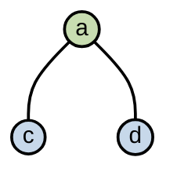
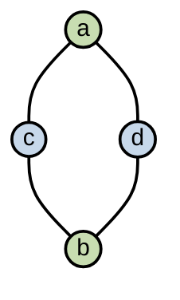
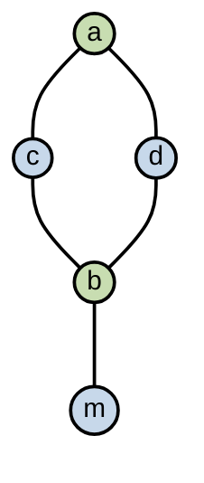
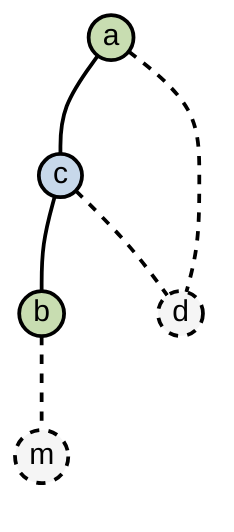
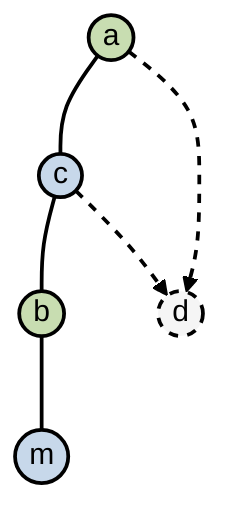

# Chapter 11 — Register Allocation（寄存器分配）

编译器中间结果会产生很多“临时变量（temporary）”。CPU 的寄存器数量非常有限。但伪汇编指令中的 temporary 可以有几百上千个。

因此必须决定：

哪些 temporary 放寄存器，
哪些 temporary 放内存。

这就是： Register Allocation

## 11.0. Register Allocation: Why & What &How

### 11.0.1. 为什么做寄存器分配？

* 寄存器比内存快
* 寄存器比 cache 快 2~7 倍
* 物理机器寄存器数量有限

### 11.0.2. 寄存器分配器的任务

把很多 temporary 分配到 K 个机器寄存器

要求

* 确保分配的临时变量在使用时是正确的且使用不超过 K 个寄存器
* 最小化 load/store ，最小化用来保存 spilled values（物理机上存储存不下的寄存器） 的空间
* 分配算法本身高效

### 11.0.3. Register Allocation: How

1. Graph Coloring（图染色）

    特点：

    * 经典
    * 效果好
    * 质量高
    * 较慢
2. Linear Scan（线性扫描）

    特点：

    * 更快
    * JIT 常用
    * HotSpot / JVM / ART 常用


### 11.0.4.  Graph Coloring Register Allocation

把寄存器分配问题转化成图染色问题

interference graph（冲突图）

* 节点 = temporary
* 边 = 两个变量不能使用同一个寄存器
* 颜色 = 寄存器
* 目标：相邻节点不能同色。


```text
      b
     / \
    a   c
```

因为 a 与 c 不相邻，a 和 c 可以共享寄存器。


## 11.1. Coloring By Simplification （图染色简化）

Register allocation 是 NP-complete，Graph coloring 也是 NP-complete，因此不可能高效找到最优解。

使用线性时间近似算法

* Build
* Simplify
* Spill
* Select


### 11.1.1. Build

构建  interference graph 冲突图

* 节点 node = temporary
* 边 `edge(t1,t2)`表示： t1 和 t2 不能共享寄存器
    * 为什么会冲突？

        最常见原因：live range overlap 两个变量同时活跃。


### 11.1.2. Simplify

#### 11.1.2.1. 思路

令机器中寄存器数量为 K

如果图 G 的某节点 m 度数 < K 那么令 G' = G-m，若 G' 可以被 K 种颜色染色，那么 G 一定可以用 K 种颜色染色。

因为 m 最多只有 K-1 个邻居。因此染色完 G' 之后至少剩一个颜色。


#### 11.1.2.2. Simplify Stack

##### 核心算法

不断删除 degree < K 的节点，并压栈这个节点。删除节点后其他节点 degree 会下降。于是可能产生更多 degree < K 节点。


##### Simplify Example

假设：K = 2

初始图

```text
       b
     / | \
    c  |  m
   /   |
  a----d
```

1. m 度数=1，删除

    ```text
    stack = [m]
    ```


    图变成

    ```text
         b
       / |
      c  |
     /   |
    a----d
    ```


### 11.1.3. Spill

#### 11.1.3.1. 思路

如果所有节点 degree >= K 怎么办？

解决方案：选择某节点 spill，即放内存。

optimistic coloring 重要思想：“先假装它不存在。”

即先删掉它继续，以后再看看能不能染色成功。


#### 11.1.3.2. Spill Example

##### spill

当前图

```text
      b
     /|
    c |
   /  |
  a---d
```

K=2。

当前栈：{m}

所有节点 degree >=2

选择 b 作为 spill candidate，删除 b

压栈：

```text
stack = [m,b]
```

##### 继续 simplify

现在：

当前图

```text
    c 
   /  
  a---d
```

K=2。

当前栈：

```
[
b
m
]
```

现有节点都可能 degree<2。

于是继续 simplify。

最终

```text
stack = 
[
c
a
d
b
m
]
```

### 11.1.4. Select

#### 11.1.4.1. 思路

反向恢复图，pop stack，恢复节点，选择颜色

为什么一定能染色？因为 simplify 阶段保证恢复时邻居数 < K。

#### 11.1.4.2. Select Example

```text
top
c
a
d
b
m
bottom
```


##### 恢复 c

给颜色：

```text
c -> blue
```


```text
top
a
d
b
m
bottom
```

##### 恢复 a

a 与 c 相邻：


##### 恢复 d

d 与 a 相邻


##### 恢复 b

b 与 c、d 相邻，它们都 blue。

```text
b -> green
```


##### 恢复 m

m 只连 b。

因此：

```text
m -> blue
```


##### 最终成功

无 spill。


### 11.1.5. Actual Spill

#### 11.1.5.1. 思路

如果恢复某节点时，邻居已经占满 K 种颜色。那么无法染色。这时 Actual Spill 意味着必须把该变量放内存。

#### 11.1.5.2. 示例



恢复 d 发现邻居：

```text
a -> green
c -> blue
```

已经占满 K=2。因此 d 无法染色。d 成为 Actual Spill



spill 后怎么办？

必须重写程序，在这个需要 spill 的变量每一格定义前插入 load，每一个定义后插入 store。

spill variable 会变成很多小 live range。因此重新 build graph 后，可能更容易染色。

