# Chapter 11 — Register Allocation（寄存器分配）

编译器中间结果会产生很多“临时变量（temporary）”。CPU 的寄存器数量非常有限。但伪汇编指令中的 temporary 可以有几百上千个。

因此必须决定：

哪些 temporary 放寄存器，
哪些 temporary 放内存。

这就是： Register Allocation

## 11.0. Register Allocation: Why & What &How

### 11.0.1. 为什么做寄存器分配？

* 寄存器比内存快
* 寄存器比 cache 快 2~7 倍
* 物理机器寄存器数量有限

### 11.0.2. 寄存器分配器的任务

把很多 temporary 分配到 K 个机器寄存器

要求

* 确保分配的临时变量在使用时是正确的且使用不超过 K 个寄存器
* 最小化 load/store ，最小化用来保存 spilled values（物理机上存储存不下的寄存器） 的空间
* 分配算法本身高效

### 11.0.3. Register Allocation: How

1. Graph Coloring（图染色）

    * 经典
    * 效果好
    * 质量高
    * 较慢

2. Linear Scan（线性扫描）

    * 更快
    * JIT 常用
    * HotSpot / JVM / ART 常用


### 11.0.4.  Graph Coloring Register Allocation

把寄存器分配问题转化成图染色问题

interference graph（冲突图）

* 节点 = temporary
* 边 = 两个变量不能使用同一个寄存器
* 颜色 = 寄存器
* 目标：相邻节点不能同色。


```text
      b
     / \
    a   c
```

因为 a 与 c 不相邻，a 和 c 可以共享寄存器。


## 11.1. Coloring By Simplification （图染色简化）

Register allocation 是 NP-complete，Graph coloring 也是 NP-complete，因此不可能高效找到最优解。

使用线性时间近似算法

* Build
* Simplify
* Spill
* Select


### 11.1.1. Build

构建  interference graph 冲突图

* 节点 node = temporary
* 边 `edge(t1,t2)`表示： t1 和 t2 不能共享寄存器
    * 为什么会冲突？

        最常见原因：live range overlap 两个变量同时活跃。


### 11.1.2. Simplify

#### 11.1.2.1. 思路

令机器中寄存器数量为 K

如果图 G 的某节点 m 度数 < K 那么令 G' = G-m，若 G' 可以被 K 种颜色染色，那么 G 一定可以用 K 种颜色染色。

因为 m 最多只有 K-1 个邻居。因此染色完 G' 之后至少剩一个颜色。


#### 11.1.2.2. Simplify Stack

##### 核心算法

不断删除 degree < K 的节点，并压栈这个节点。删除节点后其他节点 degree 会下降。于是可能产生更多 degree < K 节点。


##### Simplify Example

假设：K = 2

初始图

```text
       b
     / | \
    c  |  m
   /   |
  a----d
```

m 度数=1，删除

```text
stack = [m]
```


图变成

```text
        b
    / |
    c  |
    /   |
a----d
```


### 11.1.3. Spill

#### 11.1.3.1. 思路

如果所有节点 degree >= K 怎么办？

解决方案：选择某节点 spill，即放内存。

optimistic coloring 重要思想：“先假装它不存在。”

即先删掉它继续，以后再看看能不能染色成功。


#### 11.1.3.2. Spill Example

##### spill

当前图

```text
      b
     /|
    c |
   /  |
  a---d
```

K=2。

当前栈：{m}

所有节点 degree >=2

选择 b 作为 spill candidate，删除 b

压栈：

```text
stack = [m,b]
```

##### 继续 simplify

现在：

当前图

```text
    c 
   /  
  a---d
```

K=2。

当前栈：

```
[
b
m
]
```

现有节点都可能 degree<2。

于是继续 simplify。

最终

```text
stack = 
[
c
a
d
b
m
]
```

### 11.1.4. Select

#### 11.1.4.1. 思路

反向恢复图，pop stack，恢复节点，选择颜色

为什么一定能染色？因为 simplify 阶段保证恢复时邻居数 < K。

#### 11.1.4.2. Select Example

```text
top
c
a
d
b
m
bottom
```


##### 恢复 c

给颜色：

```text
c -> blue
```


```text
top
a
d
b
m
bottom
```

##### 恢复 a

a 与 c 相邻：


##### 恢复 d

d 与 a 相邻

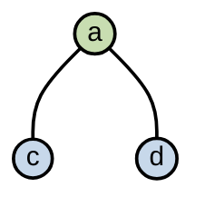
##### 恢复 b

b 与 c、d 相邻，它们都 blue。

```text
b -> green
```
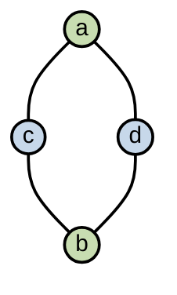

##### 恢复 m

m 只连 b。

因此：

```text
m -> blue
```
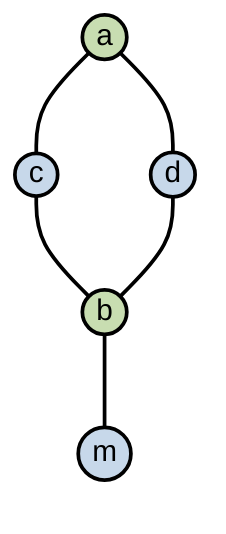

##### 最终成功

无 spill。


### 11.1.5. Actual Spill

#### 11.1.5.1. 思路

如果恢复某节点时，邻居已经占满 K 种颜色。那么无法染色。这时 Actual Spill 意味着必须把该变量放内存。

#### 11.1.5.2. 示例

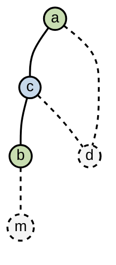

恢复 d 发现邻居：

```text
a -> green
c -> blue
```

已经占满 K=2。因此 d 无法染色。d 成为 Actual Spill

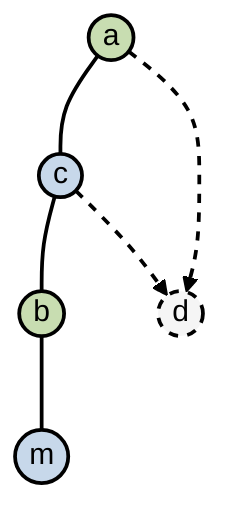

spill 后怎么办？

必须重写程序，在这个需要 spill 的变量每一格定义前插入 load，每一个定义后插入 store。

spill variable 会变成很多小 live range。因此重新 build graph 后，可能更容易染色。

### 11.1.6. 总结

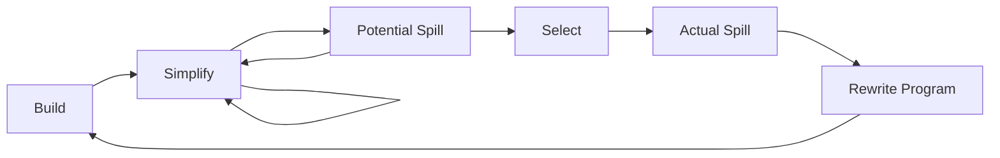

### 11.1.7. 示例

例如 K=4

build

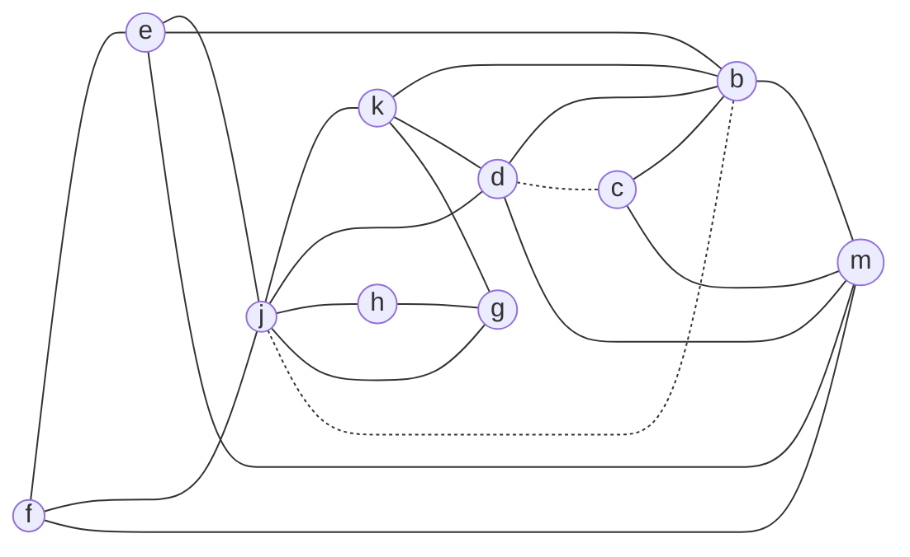

其中虚线表示 MOVE 实线表示冲突

simplify 掉 g

stack：

```text
TOP
===
g
===
down
```
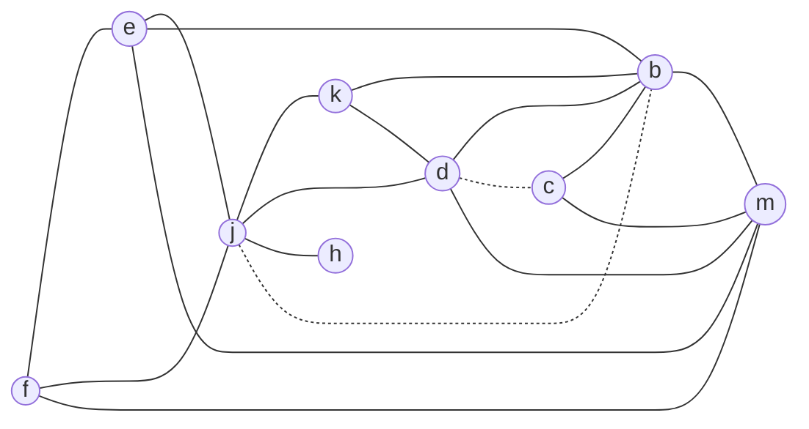

simplify 掉 h

stack：

```text
TOP
===
h
g
===
down
```
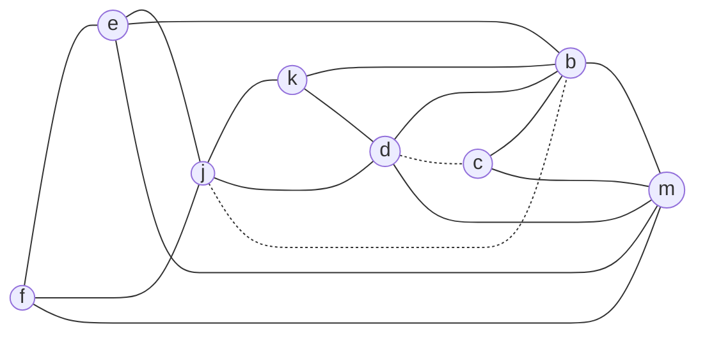

simplify 掉 k

stack：

```text
TOP
===
k
h
g
===
down
```
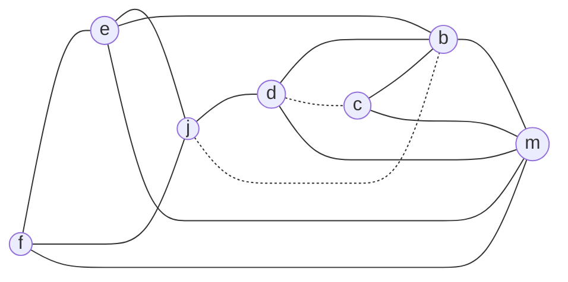

simplify 掉 d

stack：

```text
TOP
===
d
k
h
g
===
down
```
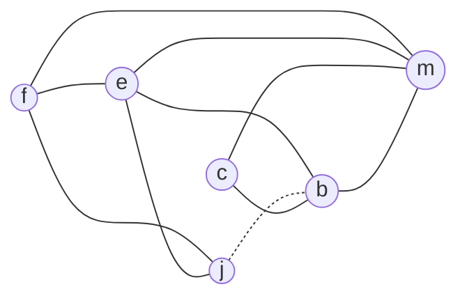

simplify 掉 j

stack：

```text
TOP
===
j
d
k
h
g
===
down
```
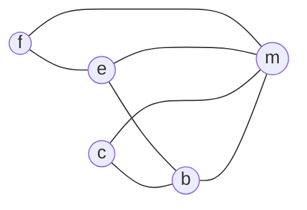

simplify 掉 e

stack：

```text
TOP
===
e
j
d
k
h
g
===
down
```
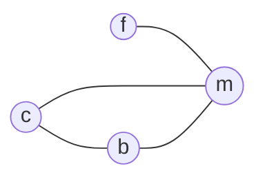

simplify 掉 f

stack：

```text
TOP
===
f
e
j
d
k
h
g
===
down
```
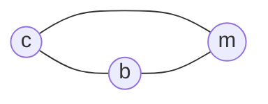


simplify 掉 b

stack：

```text
TOP
===
b
f
e
j
d
k
h
g
===
down
```
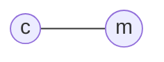

最终 stack：

```text
TOP
===
m
c
b
f
e
j
d
k
h
g
===
down
```

染色即可：

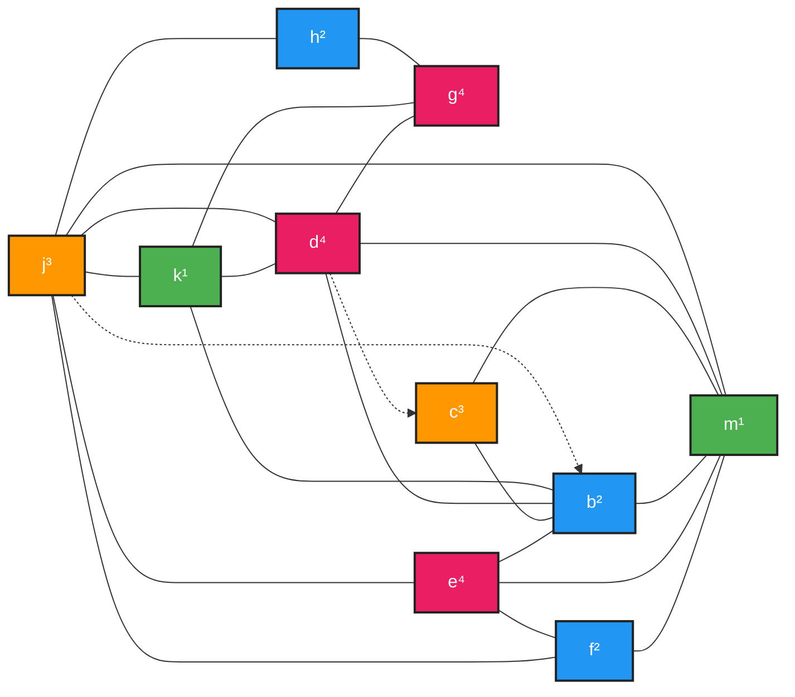


## 11.2. Coalescing 合并

### 11.2.1. 合并的动机

合并主要用于消除 move 指令。若 `MOVE t1, t2` 的两端最终分配到同一寄存器，这条 move 就没有意义，可以删除。

如果 MOVE 指令的源和目的在干涉图中没有边，则这条 MOVE 可以被消除。源节点和目的节点被合并为一个新节点，新节点的边是原两个节点边的并集。

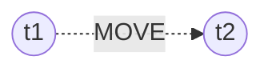

Coalescing 可能改善可着色性。合并后，某些节点可能邻居数减少。

问题是：新合并节点比原节点更受约束，因为它拥有两个节点边的并集。原本 K 可着色的图，若鲁莽合并，可能变成不可 K 着色。解决思路是 conservative coalescing：只在安全时合并。安全表示合并不会让图不可着色。判断方法包括 Briggs 和 George。

### 11.2.2. 保守合并 conservative coalescing

#### 11.2.2.1. Briggs 合并条件

如果合并后的节点 ab 拥有少于 K 个 significant-degree 邻居，则 a 和 b 可以合并。

这个策略可以保证能着色的图可以被着色，因为可以直接把 ab simplify 掉

#### 11.2.2.2. George 合并条件

节点 a 和 b 可以合并，如果对 a 的每个邻居 t，要么 t 已经与 b 冲突，要么 t 是 insignificant degree（度数 < K 可以被简化）。这种合并是安全的。

这是因为每个邻居 degree 都不会增加。

### 11.2.3. 流程

```mermaid
flowchart LR

A[Build]
-->B[Simplify]-->B[Simplify]-->G[coalesce]-->H[freeze]-->C[Potential Spill]--->B

G-->B

H-->B

C-->D[Select]-->D-->E[Actual Spill]

E-->D

E-->F[Rewrite Program]

F-->A
```


#### 11.2.3.1. build

第一步 Build：构造干涉图，并把每个节点分类为 move-related 或 non-move-related。move-related 节点是 move 指令的源或目的。

#### 11.2.3.2. Simplify

第二步 Simplify：一次删除一个非 move-related 且度小于 K 的节点。

#### 11.2.3.3. Coalesce

第三步 Coalesce：在简化后的图上执行保守合并。如果合并后的节点不再 move-related，它就可以进入下一轮 simplify。Simplify 和 Coalesce 反复执行，直到只剩 significant-degree 或 move-related 节点。

#### 11.2.3.4. Freeze

第四步 Freeze：如果 simplify 和 coalesce 都无法应用，就找一个低度的 move-related 节点，冻结它相关的 move。也就是放弃合并这些 move。这样该节点以及相关节点可能被视为 non-move-related，随后恢复 simplify 和 coalesce。

#### 11.2.3.5. Spill


如果没有低度节点，就选择一个 significant-degree 节点作为潜在溢出，并压栈。

#### 11.2.3.6. Select

弹出整个栈并分配颜色；若有 actual spill，就重建图。

### 11.2.4. 示例

K=4

图为：

```mermaid
graph LR
    j((j)) --- k((k))
    k --- d((d))
    d --- b((b))
    k --- b
    j --- d
    j --- h((h))
    h --- g((g))
    k --- g
    d -.- c((c))
    c --- b
    c --- m((m))
    b --- m
    e((e)) --- b
    e --- m
    f((f)) --- e
    f --- j
    f --- m
    e --- j
    j -.- b
    j --- g
    d --- m

    classDef node fill:#fff,stroke:#000,stroke-width:4px,color:#000;
    class j,k,d,h,g,c,b,e,f,m node;


```

simlify g h k

```mermaid
graph LR
    
    d((d)) --- b((b))
    j --- d
    d -.- c((c))
    c --- b
    c --- m((m))
    b --- m
    e((e)) --- b
    e --- m
    f((f)) --- e
    f --- j((j))
    f --- m
    e --- j
    j -.- b
    d --- m

    classDef node fill:#fff,stroke:#000,stroke-width:4px,color:#000;
    class j,d,c,b,e,f,m node;
```

coalesce c&d  , b&j.


```mermaid
graph LR
    
    c((c&d))--- b((b&j))
    c --- m((m))
    b --- m
    e((e)) --- b
    e --- m
    f((f)) --- e
    f --- b
    f --- m

    classDef node fill:#fff,stroke:#000,stroke-width:4px,color:#000;
    class j,d,c,b,e,f,m node;
```

总之染色

```mermaid
graph LR

    c((c&d)):::n1
    e((e)):::n2
    m((m)):::n3
    f((f)):::n4
    b((b&j)):::n4


    c((c&d))--- b((b&j))
    c --- m((m))
    b --- m
    e((e)) --- b
    e --- m
    f((f)) --- e
    f --- b
    f --- m

    classDef node fill:#fff,stroke:#000,stroke-width:4px,color:#000;
    class j,d,c,b,e,f,m node;


    %% 样式
    classDef n1 fill:#4CAF50,stroke:#222,color:#fff,stroke-width:2px;
    classDef n2 fill:#2196F3,stroke:#222,color:#fff,stroke-width:2px;
    classDef n3 fill:#FF9800,stroke:#222,color:#fff,stroke-width:2px;
    classDef n4 fill:#E91E63,stroke:#222,color:#fff,stroke-width:2px;
```

```mermaid
graph LR

    c((c)):::n1
    d((d)):::n1
    e((e)):::n2
    m((m)):::n3
    f((f)):::n4
    b((b)):::n4
    j((j)):::n4
    k((k)):::n2
    h((h)):::n2
    g((1)):::n1


    j((j)) --- k((k))
    k --- d((d))
    d --- b((b))
    k --- b
    j --- d
    j --- h((h))
    h --- g((g))
    k --- g
    d -.- c((c))
    c --- b
    c --- m((m))
    b --- m
    e((e)) --- b
    e --- m
    f((f)) --- e
    f --- j
    f --- m
    e --- j
    j -.- b
    j --- g
    d --- m

    classDef node fill:#fff,stroke:#000,stroke-width:4px,color:#000;
    class j,d,c,b,e,f,m node;


    %% 样式
    classDef n1 fill:#4CAF50,stroke:#222,color:#fff,stroke-width:2px;
    classDef n2 fill:#2196F3,stroke:#222,color:#fff,stroke-width:2px;
    classDef n3 fill:#FF9800,stroke:#222,color:#fff,stroke-width:2px;
    classDef n4 fill:#E91E63,stroke:#222,color:#fff,stroke-width:2px;
```


## 11.3. Precolored Nodes 预着色节点

### 11.3.1. 思路

有些寄存器有特殊用途：

* 参数寄存器
* 帧指针
* 返回值寄存器等。


对于这些寄存器，用一个永久绑定到该寄存器的 temporary 表示，比如 FP。

这样的 temporary 是 precolored。

* 每种颜色只有一个 precolored node。
* 所有 precolored nodes 之间互相冲突。

普通 temporary 可以被分配成与某个 precolored register 相同的颜色，只要二者不干涉。例如调用约定寄存器可以在过程内部作为临时变量复用。


不能 simplify 预着色节点，预着色节点（precolored nodes）代表真实机器寄存器，它们的颜色已经固定了，不能像普通临时变量一样“删除后再重新分配颜色”。

也不应该 spill 预着色节点到内存，因为机器寄存器本来就是寄存器。

### 11.3.2. 具体规则

#### 11.3.2.1. George Criterion

George 合并准则：a 和 b 可以合并，如果 a 的每个邻居 t 要么已经与 b 干涉，要么 t 是低度节点。

当节点对涉及一个预着色节点时，总是选择非预着色节点作为 a 来测试规则。

> 因为做试探的节点可以理解为要删掉的节点，或者理解为和 b 共用寄存器的节点，只能非预着色节点用本来该有的寄存器，没有说本来该有的寄存器还能用别的的。

```text
涉及 precolored 节点时：
  a = 非预着色节点
  b = 预着色节点
检查 Adj(a)
```

例如 K=3，r3 和 c。如果合并 r3 和 c，就会使 c 被强制染成 r3，且不能 spill c。

```mermaid
graph LR
    r3((r3))
    r2((r2))
    r1((r1))
    a((a))
    b((b))
    c((c))
    d((d))
    e((e))

    %% 左侧三角
    r3 --- r2
    r3 --- r1
    r1 --- r2

    %% 中间连接
    r2 --- a

    %% 右侧图
    a --- b
    a --- c
    a --- d

    b --- c
    b --- d

    c --- d
    c --- e
    d --- e

    %% 虚线边
    r2 -.- b
    a -.- e
    r1 -.- d
    r3 -.- c

    %% 外层弧线
    r3 ==> c
```


#### 11.3.2.2. Temporary Copies of Machine Registers


##### 预着色节点

着色算法通过 simplify、coalesce、spill 循环，直到只剩预着色节点。

由于预着色节点不能 spill，前端需要尽量缩短它们的 live range，方法是:

* 生成 move 指令，把值搬入/搬出预着色节点。

##### 易失寄存器

caller-save registers（调用者保存寄存器）在寄存器分配里需要特殊处理，原因是函数调用(call)会“隐式破坏”这些寄存器。caller-save（易失寄存器）调用函数的人负责保存


```text
enter: use r7
...
exit:  use r7
```
改写为：
```text
enter: use r7
t231 ← r7
...
r7 ← t231
exit:  use r7
```

例子中 r7 是 callee-save register：入口处保存 r7 到 t231，退出前把 t231 恢复到 r7。

如果函数寄存器压力高，t231 会 spill；否则 t231 会与 r7 合并，move 指令相当于被删除。

#### 11.3.2.3. Caller-Save and Callee-Save Registers


如果一个局部变量或编译器 temporary 不跨过程调用 live，通常应分配到 caller-save register。

任何跨多个过程调用 live 的变量，应该保存在 callee-save register。


##### Caller-Save and Callee-Save Registers：spill 选择

如果变量 x 跨过程调用 live，它会与所有 caller-save 预着色寄存器冲突，因为可能被调用者保存到不会被安全储存的 caller-save 寄存器中。

```text
enter: use r7
t231 ← r7
...
r7 ← t231
exit:  use r7
```

也会与为 callee-save 寄存器创建的新 temporary（如 t231）干涉，因为 t231 被认为是活跃在整个函数的

从而可能导致 spill。

那么spill什么代价最小？

优先 spill 度数高但使用次数少的节点。

问题是 x 和 t231 哪个先 spill？

t231 通常只有入口和出口使用，使用次数少；而跨调用变量 x 可能真实参与计算。启发式往往会选择 spill t231，因为保存 callee-save 到内存比频繁 spill x 更划算。


### 11.3.3. 示例

#### 11.3.3.1. 案例

K=3

代码：

```s
enter:
    c <- r3
    a <- r1
    b <- r2
    d <- 0
    e <- a

loop:
    d <- d + b
    e <- e − 1
    if (e > 0) goto loop

    r1 <- d
    r3 <- c
    return
```

```mermaid
graph LR
    
    r1((r1))
    r2((r2))
    r3((r3))
    a((a))
    b((b))
    c((c))
    d((d))
    e((e))

    
    %% Left triangle
    r1 --- r2
    r2 --- r3
    r3 --- r1

    %% Connections to right cluster
    r2 --- a
    r2 --- c

    r1 -.- a
    r1 -.- d
    r3 -.- c

    %% Right cluster
    a --- b
    a --- c
    a --- d
    a -.- e

    b --- c
    b --- d
    b --- e
    b -.- r2

    c --- d
    c --- e

    d --- e

    %% Outer curved edge
    r1 --- c
```

没法 simplify and freeze

r3 和 c，r3 是预着色的，c不符合 George 

ae也是两个都不符合

#### 11.3.3.2. 选择实际 spill 的节点

肯定degree多，使用少的节点最适合 spill

假设循环 10 次，则使用 $(循环外出现次数 + 循环次数 \times 循环内部出现次数) / 度数$

| Node | Uses + Defs outside Loop | Uses + Defs within loop | Degree | Spill Priority |
|------|--------------------------|-------------------------|--------|----------------|
| a    | ( 2                      | + 10 × 0 )              | / 4    | = 0.50         |
| b    | ( 1                      | + 10 × 1 )              | / 4    | = 2.75         |
| c    | ( 2                      | + 10 × 0 )              | / 6    | = 0.33         |
| d    | ( 2                      | + 10 × 2 )              | / 4    | = 5.50         |
| e    | ( 1                      | + 10 × 3 )              | / 3    | = 10.33        |


c 最适合 spill


```mermaid
graph LR
    
    r1((r1))
    r2((r2))
    r3((r3))
    a((a))
    b((b))
    d((d))
    e((e))

    
    %% Left triangle
    r1 --- r2
    r2 --- r3
    r3 --- r1

    %% Connections to right cluster
    r2 --- a

    r1 -.- a
    r1 -.- d

    %% Right cluster
    a --- b
    a --- d
    a -.- e

    b --- d
    b --- e
    b -.- r2


    d --- e

```

#### 11.3.3.3. 继续化简

Coalesce a e，因为符合 george criterion

```mermaid
graph LR
    
    r1((r1))
    r2((r2))
    r3((r3))
    a((a&e))
    b((b))
    d((d))

    
    %% Left triangle
    r1 --- r2
    r2 --- r3
    r3 --- r1

    %% Connections to right cluster
    r2 --- a

    r1 -.- a
    r1 -.- d

    %% Right cluster

    b --- d
    b --- a
    b -.- r2


    d --- a

```

Coalesce  b &r2，因为符合 george criterion

```mermaid
graph LR
    
    r1((r1))
    r2((r2&b))
    r3((r3))
    a((a&e))
    d((d))

    
    %% Left triangle
    r1 --- r2
    r2 --- r3
    r3 --- r1

    %% Connections to right cluster

    r1 -.- a
    r1 -.- d

    %% Right cluster
    a --- r2
    a --- d

    r2 --- d
```


Coalesce r1&ae

```mermaid
graph LR
    
    r1((r1&a&e))
    r2((r2&b))
    r3((r3))
    d((d))

    
    %% Left triangle
    r1 --- r2
    r2 --- r3
    r3 --- r1

    %% Connections to right cluster
    r1 -.- d

    %% Right cluster
    r1 --- d

    r2 --- d
```

r1与d之间的 move 不可再优化

```mermaid
graph LR
    
    r1((r1&a&e))
    r2((r2&b))
    r3((r3))
    d((d))

    
    %% Left triangle
    r1 --- r2
    r2 --- r3
    r3 --- r1

    %% Right cluster
    r1 --- d

    r2 --- d
```

simplify d

```mermaid
graph LR
    
    r1((r1&a&e))
    r2((r2&b))
    r3((r3))

    
    %% Left triangle
    r1 --- r2
    r2 --- r3
    r3 --- r1
```

stack：

```
top
====
d
c
====
down
```

select d

```mermaid
graph LR
    
    r1((r1&a&e))
    r2((r2&b))
    r3((r3))
    d((d))

    
    %% Left triangle
    r1 --- r2
    r2 --- r3
    r3 --- r1

    %% Right cluster
    r1 --- d

    r2 --- d
```


由于我们 spill 了 c，而且发现 c 是一个 actual spill，所以现在

rewrite

程序为：


```s
enter:
    c1 <- r3
    M[Cloc] <- c1
    a <- r1
    b <- r2
    d <- 0
    e <- a

loop:
    d <- d + b
    e <- e − 1
    if (e > 0) goto loop

    r1 <- d
    c2 <- M[Cloc]
    r3 <- c2
    return
```

重新构建冲突图

```mermaid
graph LR

    c1((c1))
    c2((c2))
    r1((r1))
    r2((r2))
    r3((r3))
    a((a))
    b((b))
    d((d))
    e((e))


    c1 --- r2
    c1 -.- r3
    c1 -.- r1
    r3 -.- c2

    c2 --- r1

    r3 --- r2
    r3 --- r1

    r2 --- r1
    r2 --- a
    r2 -.- b

    r1 -.- a
    r1 -.- d

    a --- b
    a --- d
    a -.- e

    b --- d
    b --- e
```

coalesce c1&r3 , c2&r3

```mermaid
graph LR

    r3((r3&c1&c2))
    r1((r1))
    r2((r2))
    a((a))
    b((b))
    d((d))
    e((e))


    r3 --- r2
    r3 --- r1

    r2 --- r1
    r2 --- a
    r2 -.- b

    r1 -.- a
    r1 -.- d

    a --- b
    a --- d
    a -.- e

    b --- d
    b --- e
```

coalesce a&e, b&r2

```mermaid
graph LR

    r3((r3&c1&c2))
    r1((r1))
    r2((r2&b))
    a((a&e))
    d((d))


    r3 --- r2
    r3 --- r1

    r2 --- r1
    r2 --- a

    r1 -.- a
    r1 -.- d

    a --- d

    r2 --- d
```

coalesce ae&r1

```mermaid
graph LR

    r3((r3&c1&c2))
    r1((r1&a&e))
    r2((r2&b))
    d((d))


    r3 --- r2
    r3 --- r1

    r2 --- r1

    r1 --- d

    r2 --- d
```

simplify d

```mermaid
graph LR

    r3((r3&c1&c2))
    r1((r1&a&e))
    r2((r2&b))
    r3 --- r2
    r3 --- r1

    r2 --- r1
```

现在已经只有预着色节点了，按照这个结果着色

| Node | Color |
| ---- | ----- |
| a    | r1    |
| b    | r2    |
| c1   | r3    |
| c2   | r3    |
| d    | r3    |
| e    | r1    |


代码转换如下：


```s
enter:
    r3 <- r3
    M[Cloc] <- r3
    r1 <- r1
    r2 <- r2
    r3 <- 0
    r1 <- r1

loop:
    r3 <- r3 + r2
    r1 <- r1 − 1
    if (r1 > 0) goto loop

    r1 <- r3
    r3 <- M[Cloc]
    r3 <- r3
    return
```

去掉无用代码

```s
enter:

    M[Cloc] <- r3
    r3 <- 0

loop:
    r3 <- r3 + r2
    r1 <- r1 − 1
    if (r1 > 0) goto loop

    r1 <- r3
    r3 <- M[Cloc]
    return
```