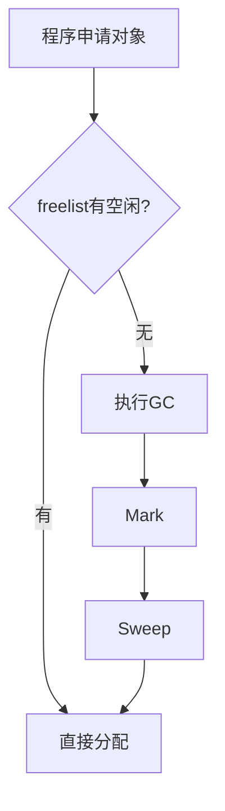

# 13. Chapter 13: Garbage Collection

## 13.0. 内存管理

### 13.0.1. Storage Organization（存储组织）

典型内存布局：

* Code（代码区）

  * 可执行代码

* Static（静态区）

  * 编译期大小已知的数据
  * 如：

    * 全局常量
    * 编译器生成的数据

* Stack（栈区）

  * 函数调用时产生的活动记录（activation record）

* Heap（堆区）

  * 程序动态申请/释放的数据

例如：

* C：

  * malloc
  * free

* Java：

  * new


### 13.0.2. Manual Memory Management（手动内存管理）

C/C++ 使用：

* malloc
* free

来进行：

* 动态分配
* 动态释放


#### 13.0.2.1. 手动管理的问题

容易导致：

* 内存泄漏（memory leak）
* double free（二次释放）
* use-after-free（释放后继续使用）

还有：

* 类型安全问题

#### 存储错误难以发现

Bug 的表现：

* 可能距离错误发生点很远
* 时间上延迟很久

### 13.0.3. Automatic Memory Management（自动内存管理）

自动内存管理：内存回收自动进行。

Garbage（垃圾）：已经分配，但不再使用的存储。


```cpp
node p, q;

p = new node();
q = new node();

q = p;

delete p;
```
执行 `q = p;` 后

```text
p --> Node1
q --> Node1
```

Node2 无人指向，Node2 已变垃圾。

再执行 `delete p;` 结果

```text
p = null
q --> Node1
```

问题是 Node1 还被 q 使用，但已经 delete。

于是 q 变成悬空指针（dangling pointer）

## 13.1. Garbage Collection 垃圾回收

### 13.1.1. Garbage Collection（垃圾回收）： What


垃圾回收：

* 在没有显式 free 的情况下，
* 自动回收“不再使用”的内存。

垃圾回收由：

* 运行时系统（runtime system）

完成。

不是编译器


### 13.1.2. Garbage Collection: How

理想情况是所有未来不会再使用的对象都是垃圾。但判断对象未来是否还会使用，是不可判定的。

因此必须使用保守近似（conservative approximation）

核心思想是使用可达性（reachability）作为近似。

* 如果对象无法从程序变量通过指针链访问则是垃圾。


对象 x 可达，当且仅当：

* 寄存器包含指向 x 的指针
* 或另一个可达对象指向 x

但是垃圾不一定是不可访问的，因为有可访问但是之后不会被用的

### 13.1.3. Directed Graph（有向图）

程序变量和堆对象形成有向图（directed graph）

节点表示对象，边表示指针关系

程序变量是根节点（roots），包括：

* 寄存器
* 栈变量
* 全局变量

若存在路径：

```text
r -> ... -> n
```

则 n 可达。


## 13.2. Mark-and-Sweep（标记清除）


### 13.2.1. Mark 阶段：

* 从 Root 搜索
* 标记访问到的节点

可用 DFS

```text
DFS(x)
    if x 未标记:
        mark(x)

        对 x 的每个字段 fi 递归调用 DFS:
            DFS(x.fi)
```


### 13.2.2. Sweep（清除）

Sweep 阶段：

* 线性扫描整个堆
* 未标记对象加入 freelist
* 清除 mark 位

空闲块链表 freelist，以后 new 时直接取。


### 13.2.4.  整体流程




### 13.2.5. Mark-Sweep 的代价

#### 13.2.5.1. 时间复杂度

* 堆大小：H
* 可达对象大小：R


GC 时间：$\mathcal{O}(R)$


Sweep 时间：$\mathcal{O}(H)$


总时间：$c_1R + c_2H$


#### 13.2.5.2. 摊还代价

H-R 次才需要一次回收，所以摊还代价：

```text
(c1R + c2H)/(H-R)
```

若  R 很接近 H 则：

* 回收很少垃圾
* 却扫描整个堆

极其浪费。

### 13.2.6. DFS 的问题

#### 13.2.6.1. 栈深度

DFS 是递归的。极端情况链表长度 = H，则：

DFS 栈深度 $\mathcal{O}(H)$ 可能比堆还大。


#### 13.2.6.2. 显式栈

不用递归，自己维护 stack。

```text
function DFS(x)
    if x is a pointer and record x is not marked
        mark record x
        t ← 1
        stack[t] ← x // push the start of DFS on stack
        while t > 0
            x ← stack[t]; t ← t – 1 // pop an item from the stack
            for each field fi of record x
                if x. fi is a pointer and record x.fi is not marked
                    mark x. fi
                    t ← t + 1; stack[t] ← x. fi
```

优点避免递归爆栈，问题仍然需要可能和堆一样大的额外空间。


### 13.2.7. Pointer Reversal（指针反转）


能否不使用额外栈？

#### 13.2.7.1. 核心思想

把 DFS 返回路径临时存在对象指针本身里。

原本：`A -> B`，遍历时临时改成：`B -> A`，用于“返回”。回来后再恢复。


#### 13.2.7.2. pointer Reversal 示例

这些页是在演示：

```text
       Root
         |
         A
       /   \
      B     C
             \
              D
```

---

# 思想

正常 DFS：

```text
Root
 -> A
   -> B
返回
   -> C
      -> D
```

---

# Pointer Reversal

访问 B 时：

把：

```text
A -> B
```

临时变：

```text
B -> A
```

这样：

无需栈。

就能回去。

---

# 本质

## “边”充当返回地址。

---

# 第34-43页：完整 Pointer Reversal 算法

---

# done[x]

表示：

```text
x 已处理多少字段
```

因为回溯后：

需要知道：

```text
下一步处理哪个 child
```

---

# t

相当于：

```text
stack top
```

但：

不是实际栈。

---

# 最核心语句

```text
x.fi ← t
t ← x
x ← y
```

---

# 含义

## Step1

保存原链接。

---

## Step2

把 parent 压入“隐式栈”。

---

## Step3

进入 child。

---

# 回溯时

```text
t ← x.fi
x.fi ← y
```

恢复原图。

---

# Pointer Reversal 最大意义

## 优点

不用：

```text
O(H)
```

辅助栈。

---

## 代价

算法非常复杂。

现实系统较少直接使用。

---

# 第44页：Mark-Sweep 总结

## 优点

* GC 时对象不移动
* 能处理循环引用

---

## 缺点

* GC 时程序暂停
* 堆碎片化

导致：

* cache miss
* 分配复杂

---

# 讲解

---

# 为什么“不移动对象”是优点？

若对象地址改变：

所有指针都要更新。

很贵。

---

# 为什么会碎片化？

例如：

```text
[活][死][活][死][活]
```

回收后：

```text
[活][空][活][空][活]
```

空闲空间不连续。

大对象可能无法分配。

---

# 总结整章核心

---

# GC 本质

```text
图遍历
```

---

# Mark-Sweep

## Mark

找活对象

## Sweep

回收死对象

---

# Reachability

GC 的核心判定标准：

```text
从 Root 能否访问
```

---

# Pointer Reversal

核心思想：

```text
利用图本身存储DFS返回路径
```

实现：

```text
O(1)额外空间
```

遍历。

---

# 一句话理解整章

> 垃圾回收本质上是在“对象引用图”中，从 Root 出发做图搜索，把未访问节点视为垃圾并回收。 
