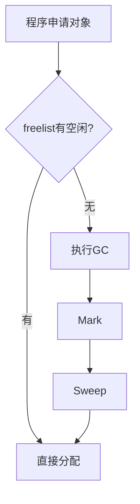
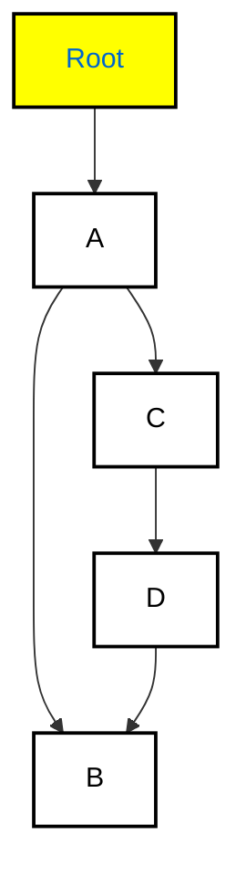
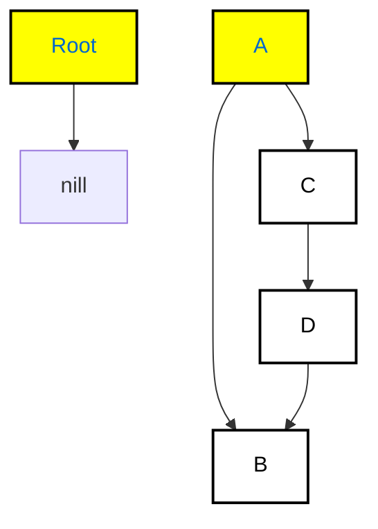
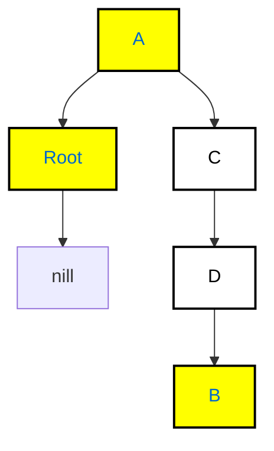
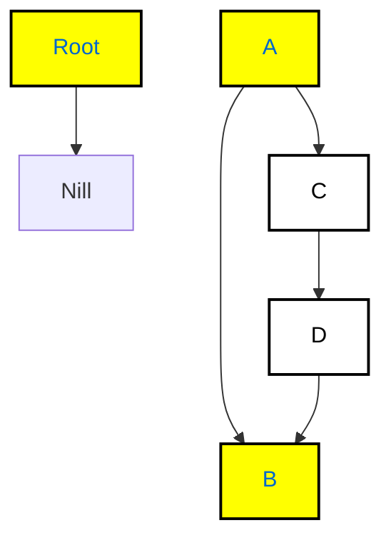
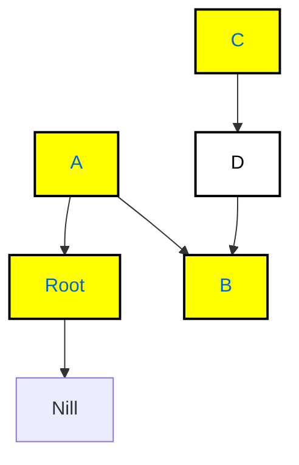
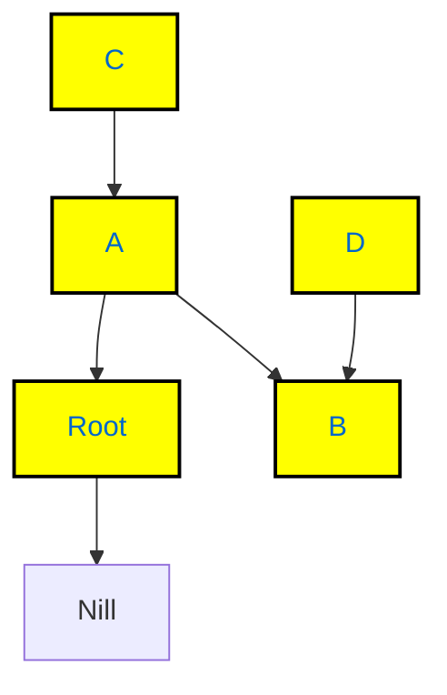
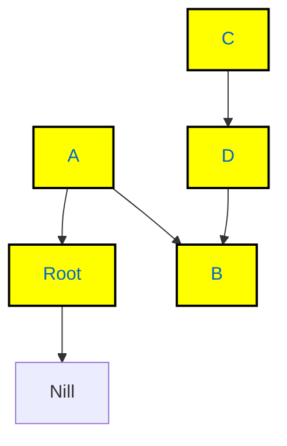
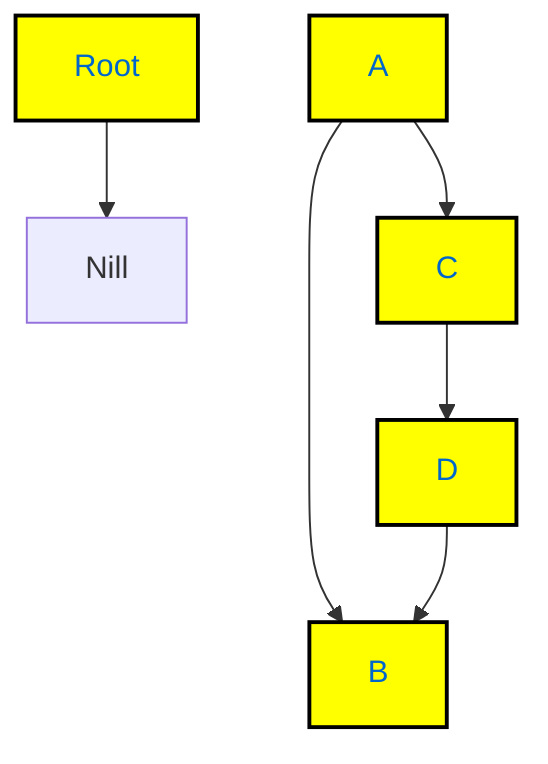
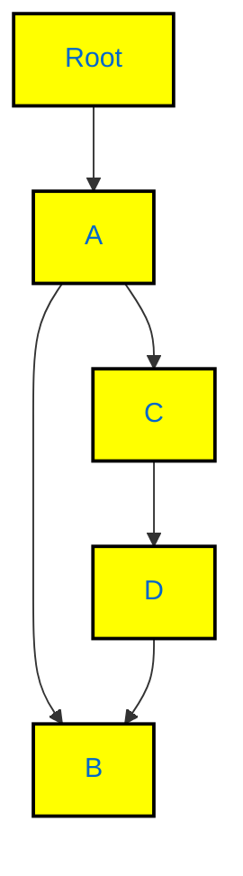

# 13. Chapter 13: Garbage Collection

## 13.0. 内存管理

### 13.0.1. Storage Organization（存储组织）

典型内存布局：

* Code（代码区）

  * 可执行代码

* Static（静态区）

  * 编译期大小已知的数据
  * 如：

    * 全局常量
    * 编译器生成的数据

* Stack（栈区）

  * 函数调用时产生的活动记录（activation record）

* Heap（堆区）

  * 程序动态申请/释放的数据

例如：

* C：

  * malloc
  * free

* Java：

  * new


### 13.0.2. Manual Memory Management（手动内存管理）

C/C++ 使用：

* malloc
* free

来进行：

* 动态分配
* 动态释放


#### 13.0.2.1. 手动管理的问题

容易导致：

* 内存泄漏（memory leak）
* double free（二次释放）
* use-after-free（释放后继续使用）

还有：

* 类型安全问题

#### 存储错误难以发现

Bug 的表现：

* 可能距离错误发生点很远
* 时间上延迟很久

### 13.0.3. Automatic Memory Management（自动内存管理）

自动内存管理：内存回收自动进行。

Garbage（垃圾）：已经分配，但不再使用的存储。


```cpp
node p, q;

p = new node();
q = new node();

q = p;

delete p;
```
执行 `q = p;` 后

```text
p --> Node1
q --> Node1
```

Node2 无人指向，Node2 已变垃圾。

再执行 `delete p;` 结果

```text
p = null
q --> Node1
```

问题是 Node1 还被 q 使用，但已经 delete。

于是 q 变成悬空指针（dangling pointer）

## 13.1. Garbage Collection 垃圾回收

### 13.1.1. Garbage Collection（垃圾回收）： What


垃圾回收：

* 在没有显式 free 的情况下，
* 自动回收“不再使用”的内存。

垃圾回收由：

* 运行时系统（runtime system）

完成。

不是编译器


### 13.1.2. Garbage Collection: How

理想情况是所有未来不会再使用的对象都是垃圾。但判断对象未来是否还会使用，是不可判定的。

因此必须使用保守近似（conservative approximation）

核心思想是使用可达性（reachability）作为近似。

* 如果对象无法从程序变量通过指针链访问则是垃圾。


对象 x 可达，当且仅当：

* 寄存器包含指向 x 的指针
* 或另一个可达对象指向 x

但是垃圾不一定是不可访问的，因为有可访问但是之后不会被用的

### 13.1.3. Directed Graph（有向图）

程序变量和堆对象形成有向图（directed graph）

节点表示对象，边表示指针关系

程序变量是根节点（roots），包括：

* 寄存器
* 栈变量
* 全局变量

若存在路径：

```text
r -> ... -> n
```

则 n 可达。


## 13.2. Mark-and-Sweep（标记清除）


### 13.2.1. Mark 阶段：

* 从 Root 搜索
* 标记访问到的节点

可用 DFS

```text
DFS(x)
    if x 未标记:
        mark(x)

        对 x 的每个字段 fi 递归调用 DFS:
            DFS(x.fi)
```


### 13.2.2. Sweep（清除）

Sweep 阶段：

* 线性扫描整个堆
* 未标记对象加入 freelist
* 清除 mark 位

空闲块链表 freelist，以后 new 时直接取。


### 13.2.4.  整体流程


```mermaid
flowchart TD
    A[程序申请对象]
    B{freelist有空闲?}
    C[直接分配]
    D[执行GC]
    E[Mark]
    F[Sweep]

    A --> B
    B -->|有| C
    B -->|无| D
    D --> E
    E --> F
    F --> C
```


### 13.2.5. Mark-Sweep 的代价

#### 13.2.5.1. 时间复杂度

* 堆大小：H
* 可达对象大小：R


GC 时间：$\mathcal{O}(R)$


Sweep 时间：$\mathcal{O}(H)$


总时间：$c_1R + c_2H$


#### 13.2.5.2. 摊还代价

H-R 次才需要一次回收，所以摊还代价：

```text
(c1R + c2H)/(H-R)
```

若  R 很接近 H 则：

* 回收很少垃圾
* 却扫描整个堆

极其浪费。

### 13.2.6. DFS 的问题

#### 13.2.6.1. 栈深度

DFS 是递归的。极端情况链表长度 = H，则：

DFS 栈深度 $\mathcal{O}(H)$ 可能比堆还大。


#### 13.2.6.2. 显式栈

不用递归，自己维护 stack。

```text
function DFS(x)
    if x is a pointer and record x is not marked
        mark record x
        t ← 1
        stack[t] ← x // push the start of DFS on stack
        while t > 0
            x ← stack[t]; t ← t – 1 // pop an item from the stack
            for each field fi of record x
                if x. fi is a pointer and record x.fi is not marked
                    mark x. fi
                    t ← t + 1; stack[t] ← x. fi
```

优点避免递归爆栈，问题仍然需要可能和堆一样大的额外空间。


### 13.2.7. Pointer Reversal（指针反转）


能否不使用额外栈？

#### 13.2.7.1. 核心思想

把 DFS 返回路径临时存在对象指针本身里。

原本：`A -> B`，遍历时临时改成：`B -> A`，用于“返回”。回来后再恢复。

临时变量 T 用于储存当前节点的父节点

临时变量 x 用于储存当前节点

#### 13.2.7.2. pointer Reversal 示例

##### 处理 root

T = NULL

x = root


```mermaid
flowchart TB
    Root["Root"] --> A["A"]
    A --> B["B"]
    A --> C["C"]
    C --> D["D"]
    D --> B

    style Root fill:#ffff00,stroke:#000,stroke-width:2px,color:#0066cc
    style A fill:#ffffff,stroke:#000,stroke-width:2px,color:#000
    style B fill:#ffffff,stroke:#000,stroke-width:2px,color:#000
    style C fill:#ffffff,stroke:#000,stroke-width:2px,color:#000
    style D fill:#ffffff,stroke:#000,stroke-width:2px,color:#000
```


##### 进入 A

T=root

x=A


```mermaid
flowchart TB
    Root["Root"] --> nill
    A["A"] --> B["B"]
    A --> C["C"]
    C --> D["D"]
    D --> B

    style Root fill:#ffff00,stroke:#000,stroke-width:2px,color:#0066cc
    style A fill:#ffff00,stroke:#000,stroke-width:2px,color:#0066cc
    style B fill:#ffffff,stroke:#000,stroke-width:2px,color:#000
    style C fill:#ffffff,stroke:#000,stroke-width:2px,color:#000
    style D fill:#ffffff,stroke:#000,stroke-width:2px,color:#000
```

##### 进入 B

T = A

x = B


```mermaid
flowchart TB
    Root["Root"] --> nill
    A["A"] -->  Root["Root"] 
    B["B"]
    A --> C["C"]
    C --> D["D"]
    D --> B

    style Root fill:#ffff00,stroke:#000,stroke-width:2px,color:#0066cc
    style A fill:#ffff00,stroke:#000,stroke-width:2px,color:#0066cc
    style B fill:#ffff00,stroke:#000,stroke-width:2px,color:#0066cc
    style C fill:#ffffff,stroke:#000,stroke-width:2px,color:#000
    style D fill:#ffffff,stroke:#000,stroke-width:2px,color:#000
```

B 没有子节点了，返回 A。


T=root

x=A


```mermaid
flowchart TB
    Root["Root"] --> Nill
    A["A"] --> B["B"]
    A --> C["C"]
    C --> D["D"]
    D --> B

    style Root fill:#ffff00,stroke:#000,stroke-width:2px,color:#0066cc
    style A fill:#ffff00,stroke:#000,stroke-width:2px,color:#0066cc
    style B fill:#ffff00,stroke:#000,stroke-width:2px,color:#0066cc
    style C fill:#ffffff,stroke:#000,stroke-width:2px,color:#000
    style D fill:#ffffff,stroke:#000,stroke-width:2px,color:#000
```

##### 进入 C

T = A

x = C



```mermaid
flowchart TB
    Root["Root"] --> Nill
    A["A"] --> B["B"]
    A --> Root["Root"] 
    C["C"]
    C --> D["D"]
    D --> B

    style Root fill:#ffff00,stroke:#000,stroke-width:2px,color:#0066cc
    style A fill:#ffff00,stroke:#000,stroke-width:2px,color:#0066cc
    style B fill:#ffff00,stroke:#000,stroke-width:2px,color:#0066cc
    style C fill:#ffff00,stroke:#000,stroke-width:2px,color:#0066cc
    style D fill:#ffffff,stroke:#000,stroke-width:2px,color:#000
```

##### 进入 D

T = C

x = D



```mermaid
flowchart TB
    Root["Root"] --> Nill
    A["A"] --> B["B"]
    A --> Root["Root"] 
    C["C"]
    C --> A["A"]
    D --> B

    style Root fill:#ffff00,stroke:#000,stroke-width:2px,color:#0066cc
    style A fill:#ffff00,stroke:#000,stroke-width:2px,color:#0066cc
    style B fill:#ffff00,stroke:#000,stroke-width:2px,color:#0066cc
    style C fill:#ffff00,stroke:#000,stroke-width:2px,color:#0066cc
    style D fill:#ffff00,stroke:#000,stroke-width:2px,color:#0066cc
```

##### 回溯 C
T = A

x = C


```mermaid
flowchart TB
    Root["Root"] --> Nill
    A["A"] --> B["B"]
    A --> Root["Root"] 
    C["C"]
    C -->D["D"]
    D --> B

    style Root fill:#ffff00,stroke:#000,stroke-width:2px,color:#0066cc
    style A fill:#ffff00,stroke:#000,stroke-width:2px,color:#0066cc
    style B fill:#ffff00,stroke:#000,stroke-width:2px,color:#0066cc
    style C fill:#ffff00,stroke:#000,stroke-width:2px,color:#0066cc
    style D fill:#ffff00,stroke:#000,stroke-width:2px,color:#0066cc
```

##### 回溯 A
T = root

x = A


```mermaid
flowchart TB
    Root["Root"] --> Nill
    A["A"] --> C["C"]
    A --> B
    
    C -->D["D"]
    D --> B

    style Root fill:#ffff00,stroke:#000,stroke-width:2px,color:#0066cc
    style A fill:#ffff00,stroke:#000,stroke-width:2px,color:#0066cc
    style B fill:#ffff00,stroke:#000,stroke-width:2px,color:#0066cc
    style C fill:#ffff00,stroke:#000,stroke-width:2px,color:#0066cc
    style D fill:#ffff00,stroke:#000,stroke-width:2px,color:#0066cc
```

##### 回溯 Root

T = NULL

x = Root


```mermaid
flowchart TB
    Root["Root"] --> A["A"]
    A["A"] --> C["C"]
    A --> B
    
    C -->D["D"]
    D --> B

    style Root fill:#ffff00,stroke:#000,stroke-width:2px,color:#0066cc
    style A fill:#ffff00,stroke:#000,stroke-width:2px,color:#0066cc
    style B fill:#ffff00,stroke:#000,stroke-width:2px,color:#0066cc
    style C fill:#ffff00,stroke:#000,stroke-width:2px,color:#0066cc
    style D fill:#ffff00,stroke:#000,stroke-width:2px,color:#0066cc
```

#### 13.2.7.3. pointer Reversal 代码

```cpp
function DFS(x)
  if x is a pointer and record x is not marked
    t ← nil
    mark x; 
    done[x] ← 0
    while true
      i ← done[x]
      if i < # of fields in record x /* process the i_th field */
        y ← x. fi
        if y is a pointer and record y is not marked
          x. fi ← t;
          t ← x;
          x ← y
          mark x;
          done[x] ← 0
        else
          done[x] ← i + 1
  else
    /* decide termination & back-track to parent.*/
    y ← x; x ← t
    if x = nil then return
    i ← done[x]
    t ← x. fi; x. fi ← y
    done[x] ← i + 1


```

### 13.2.8. 碎片

外部碎片：程序想分配大小为 n 的记录，堆中有许多小于 n 的空闲记录，但没有合适大小的空闲块。

内部碎片：程序使用过大的记录且没有拆分，未使用空间位于记录内部而非外部。

## 13.3. Reference Counting（引用计数）

### 13.3.1. Reference Counting（引用计数）： What

与其等内存耗尽，不如当没有指针指向某记录时就收集它。

为每个记录维护有多少指针指向它，即 reference count；计数随记录存储。新引用建立时增加计数；当计数变为0时，该记录不可达，是垃圾，可被收集。

引用计数：

* 每个对象有一个引用计数器
* 每次引用对象时，计数器加一
* 每次释放对象时，计数器减一

当计数器为零时，对象被回收。

注意，释放对象可能连带导致子节点计数器减一

### 13.3.2. Reference Counting： How


如何维护引用计数：

* 编译器在每次赋值操作中插入额外指令来操作 reference counts。
* 每当 p 存入 x.fi，即 x.fi=p 时
    * p 的计数增加，
    * x.fi 原先指向对象的计数减少。
* 若某记录 z 的计数变为0
    * z 放入 freelist
    *  z 指向的其他记录的计数也要减少。


### 13.3.3. Reference Counting 的问题

#### 13.3.3.1. 问题

处理链式的 free 会导致程序很慢

#### 13.3.3.2. 解决

当记录 z 放入 freelist 时，与其立即递减 z.fi 指向记录的计数，不如在 z 从 freelist 移出时再做这种“递归”递减。

理由：

* 把递归递减工作切成更短片段，使程序运行更平滑，对交互式或实时程序重要；
* 递归递减只在 allocator 一个地方完成。例子：z.fi -> p，p.fi -> q。

### 13.3.4. 难以解决的问题

1. 无法处理循环引用

2. 代价很大

## 13.4 Copying Collection（复制收集）

复制收集基本思想：把内存分成两部分，通过复制进行收集。

* from-space 是程序正在使用的区域；
* to-space 在垃圾收集前未使用。

当 from-space 用尽时，遍历程序变量与 from-space 构成的图，把所有 reachable records 复制到 to-space。复制完成后，roots 指向 to-space 副本；整个 from-space 不可达；交换 from-space 和 to-space 的角色。to-space 副本是 compact 的：占据连续内存，没有碎片。


TODO

## 13.6. 垃圾收集的接口

虽然 garbage collector 属于 runtime，但带GC语言的编译器需要与GC交互：生成分配记录的代码；为每次GC描述 roots 的位置；描述 heap 上数据记录的布局；为某些增量收集生成 read/write barrier 指令；等等。

