以下内容基于你上传的 **Chapter14-1.pdf：Object-Oriented Languages, Chapter 14**，按 **第 1–18 页逐页**整理：每页包含 **原文翻译、页面描述、讲解**；表格用 **HTML**，代码用 **代码块**，结构图尽量用 **Mermaid**。

---

# Chapter 14 Object-Oriented Languages 逐页翻译与讲解

## Page 1：Object-Oriented Languages / Chapter 14

### 1. 原文翻译

**Object-Oriented Languages**
面向对象语言

**Chapter 14**
第 14 章

### 2. 页面描述

这是章节封面页，只包含本章标题：**Object-Oriented Languages**。说明本章主题是面向对象语言，后续会讨论类、继承、字段布局、方法调用、动态分派等内容。

### 3. 讲解

这一章主要不是从“如何用面向对象写程序”的角度讲，而是从 **编译器如何支持面向对象语言** 的角度讲。也就是说，它关心的是：

* 类在语言语法中如何表示；
* 对象在内存中如何布局；
* 字段访问如何生成代码；
* 方法调用如何编译；
* 继承如何影响字段和方法；
* 动态方法为什么需要虚表，也就是 vtable。

可以把本章理解为：
**面向对象语言特性在编译器和运行时中的实现机制。**

---

## Page 2：Object-Oriented Languages

### 1. 原文翻译

**Object-Oriented Languages**
面向对象语言

* **Class-based, object-oriented (OO) language**
  基于类的面向对象语言

  * **All (or most) values are objects**
    所有值，或者大多数值，都是对象。

  * **An object is an instance of a class**
    对象是类的一个实例。

  * **Objects encapsulate state (fields) and behavior (methods)**
    对象封装状态和行为。状态对应字段，行为对应方法。

* **Some important features of OO languages**
  面向对象语言的一些重要特性：

  * **Inheritance**
    继承

  * **Encapsulation**
    封装

  * **Polymorphism**
    多态

### 2. 页面描述

这一页介绍了面向对象语言的基本概念。重点有两个：

第一，面向对象语言通常是 **class-based**，也就是以类为核心组织程序。对象是类的实例。

第二，对象由两部分组成：

* **fields**：字段，用来保存状态；
* **methods**：方法，用来定义行为。

页面最后列出面向对象语言的三个核心特性：继承、封装、多态。

### 3. 讲解

这页是整章的基础。可以用下面这个模型理解：

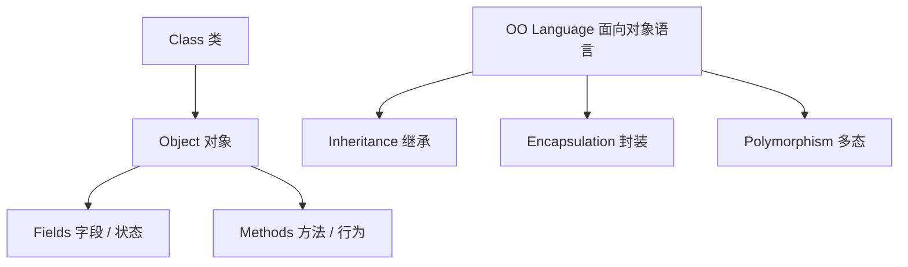

其中：

<html>
<table>
  <tr>
    <th>概念</th>
    <th>英文</th>
    <th>含义</th>
    <th>例子</th>
  </tr>
  <tr>
    <td>类</td>
    <td>Class</td>
    <td>对象的模板，定义对象有哪些字段和方法</td>
    <td>Car, Vehicle, Truck</td>
  </tr>
  <tr>
    <td>对象</td>
    <td>Object</td>
    <td>类的实例，运行时真实存在的数据结构</td>
    <td>new Car 创建出的某辆车</td>
  </tr>
  <tr>
    <td>字段</td>
    <td>Field</td>
    <td>对象内部保存的数据</td>
    <td>position, passengers</td>
  </tr>
  <tr>
    <td>方法</td>
    <td>Method</td>
    <td>对象可以执行的操作</td>
    <td>move(), await()</td>
  </tr>
  <tr>
    <td>继承</td>
    <td>Inheritance</td>
    <td>子类自动拥有父类的字段和方法</td>
    <td>Car extends Vehicle</td>
  </tr>
  <tr>
    <td>封装</td>
    <td>Encapsulation</td>
    <td>把状态和行为绑定到对象内部</td>
    <td>对象自己管理自己的字段</td>
  </tr>
  <tr>
    <td>多态</td>
    <td>Polymorphism</td>
    <td>同一个调用在运行时可能执行不同子类的方法</td>
    <td>v.move() 可能调用 Car_move 或 Truck_move</td>
  </tr>
</table>
</html>

这一章后面最关键的问题是：
**如果一个变量静态类型是父类，但运行时指向子类对象，那么字段和方法到底怎么找？**

---

## Page 3：Outline

### 1. 原文翻译

**Outline**
大纲

* **Classes**
  类

* **Single Inheritance of Data Fields**
  数据字段的单继承

* **Multiple Inheritance**
  多继承

* **Testing Class Membership**
  测试类成员关系 / 判断对象是否属于某个类

* **Private Fields and Methods**
  私有字段和方法

### 2. 页面描述

这一页是本章大纲。它列出了本章要讲的五个主题：

1. 类；
2. 数据字段的单继承；
3. 多继承；
4. 类成员关系测试；
5. 私有字段和方法。

### 3. 讲解

这页相当于路线图。整章逻辑可以概括为：

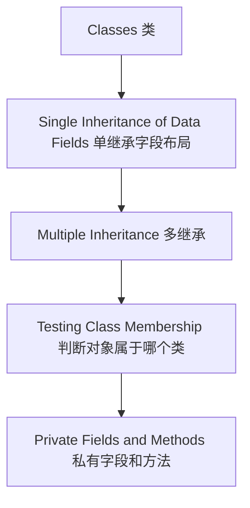

本 PDF 目前展示到第 18 页，主要覆盖了前两个部分：

* **Classes**
* **Single Inheritance of Data Fields**
* 以及动态方法调用的基本实现。

后面大纲中的多继承、类成员测试、私有字段方法，在这个 PDF 的后续部分可能会继续讲。

---

## Page 4：Outline

### 1. 原文翻译

**Outline**
大纲

* **Classes**
  类

* **Single Inheritance of Data Fields**
  数据字段的单继承

* **Multiple Inheritance**
  多继承

* **Testing Class Membership**
  测试类成员关系

* **Private Fields and Methods**
  私有字段和方法

### 2. 页面描述

这一页和 Page 3 内容基本相同，但是 **Classes** 被加粗，表示接下来进入第一部分：**Classes 类**。

### 3. 讲解

这一页是章节切换页，用来告诉听众：
现在开始讲第一个主题 **Classes**。

从编译器角度看，“类”不仅仅是语法概念，它还会影响：

* 类型系统；
* 作用域规则；
* 对象创建；
* 字段访问；
* 方法调用；
* 继承关系；
* 运行时对象布局。

下面几页会用一种扩展语言 **Object-Tiger** 来说明如何给 Tiger 语言加入面向对象机制。

---

## Page 5：Object-Tiger

### 1. 原文翻译

**Object-Tiger**

* **Extend the Tiger language with new declaration syntax to create classes:**
  扩展 Tiger 语言，加入新的声明语法，用来创建类：

```text
dec → classdec

classdec → class class-id extends class-id { {classfield } }

classfield → vardec

classfield → method

method → method id(tyfields) = exp

method → method id(tyfields) : type-id = exp
```

### 2. 页面描述

这一页开始介绍 **Object-Tiger**，也就是在 Tiger 语言基础上加入面向对象扩展。

新增的语法包括：

* 类声明；
* 类继承；
* 类字段；
* 方法声明；
* 带返回类型的方法声明。

### 3. 讲解

这一页讲的是 **语法扩展**。

原始 Tiger 语言中有变量声明、函数声明、类型声明等。现在为了支持面向对象，需要加入类声明：

```text
class B extends A {
    ...
}
```

意思是：

* 声明一个类 `B`；
* `B` 继承自类 `A`；
* 类体 `{ ... }` 中可以包含字段和方法。

可以把语法结构拆开看：

<html>
<table>
  <tr>
    <th>语法规则</th>
    <th>含义</th>
  </tr>
  <tr>
    <td><code>dec → classdec</code></td>
    <td>声明可以是一种类声明。</td>
  </tr>
  <tr>
    <td><code>classdec → class class-id extends class-id { {classfield } }</code></td>
    <td>类声明由 class 关键字、类名、extends、父类名和类体组成。</td>
  </tr>
  <tr>
    <td><code>classfield → vardec</code></td>
    <td>类成员可以是变量声明，也就是字段。</td>
  </tr>
  <tr>
    <td><code>classfield → method</code></td>
    <td>类成员也可以是方法。</td>
  </tr>
  <tr>
    <td><code>method → method id(tyfields) = exp</code></td>
    <td>方法可以没有显式返回类型，由表达式决定。</td>
  </tr>
  <tr>
    <td><code>method → method id(tyfields) : type-id = exp</code></td>
    <td>方法也可以显式声明返回类型。</td>
  </tr>
</table>
</html>

用一个例子表示就是：

```tiger
class Vehicle extends Object {
    var position := 0

    method move(x: int) =
        position := position + x
}
```

这表示：

* `Vehicle` 是一个类；
* 它继承自 `Object`；
* 它有一个字段 `position`；
* 它有一个方法 `move`。

---

## Page 6：Object-Tiger

### 1. 原文翻译

**Object-Tiger**

* `class B extends A { ... }`

  * 声明一个新类 `B`，它扩展了类 `A`。
  * 它必须位于声明 `A` 的 `let-expression` 的作用域中。
  * `A` 的所有字段和方法都会隐式属于 `B`。
  * `A` 的某些方法可以在 `B` 中被重写，也就是有新的声明。参数类型和返回类型必须完全相同。
  * 但是字段不能被重写。

* 有一个预定义的类标识符 `Object`，它没有字段，也没有方法。

* 类 `B` 中的每个方法都有一个隐式的形式参数 `self`，类型为 `B`。

  * `self` 不是保留字，只是一个在每个方法中自动绑定的标识符。

### 2. 页面描述

这一页解释 Object-Tiger 中的继承规则。

重点包括：

* 子类继承父类的字段和方法；
* 子类可以重写父类方法；
* 子类不能重写父类字段；
* 所有类最终都继承自预定义类 `Object`；
* 每个方法中都有隐式参数 `self`。

### 3. 讲解

这一页很重要，因为它定义了 Object-Tiger 的类语义。

#### 3.1 类继承

```tiger
class B extends A {
    ...
}
```

表示：

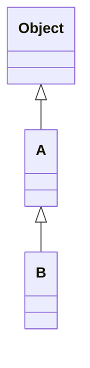

`B` 会自动拥有 `A` 的字段和方法。

例如：

```tiger
class A extends Object {
    var x := 0

    method f() = x := x + 1
}

class B extends A {
    method g() = x := x + 2
}
```

这里 `B` 虽然没有显式声明字段 `x`，但它继承了 `A.x`，所以 `B` 的方法 `g()` 里可以使用 `x`。

#### 3.2 方法可以重写

子类可以重新定义父类已有的方法：

```tiger
class A extends Object {
    method move(x: int) = ...
}

class B extends A {
    method move(x: int) = ...
}
```

但是要求：

* 方法名相同；
* 参数类型相同；
* 返回类型相同。

也就是方法签名必须保持一致。

#### 3.3 字段不能重写

如果父类有字段 `position`，子类不能再声明一个同名字段 `position`。

原因是：字段布局需要稳定。如果允许子类覆盖字段，字段偏移量会变复杂，编译器生成字段访问代码时就难以保证一致性。

#### 3.4 self 的含义

每个方法都有一个隐式参数 `self`。例如：

```tiger
class B extends A {
    method f(x: int) =
        self.g(x)
}
```

这里 `self` 表示当前对象，类似 Java 的 `this`。

注意这一页特别说：

> self is not a reserved word

也就是说，`self` 不是语言关键字，而是编译器自动在每个方法中绑定的一个普通标识符。

---

## Page 7：Object Tiger

### 1. 原文翻译

**Object Tiger**

* 新增表达式语法，用来创建对象和调用方法：

  * `new B`
  * `b.x`
  * `b.f(x, y)`：这里的值 `b` 会作为方法 `f` 的隐式 `self` 参数。

```text
exp → new class-id
    → lvalue . id()
    → lvalue . id(exp{, exp})
```

### 2. 页面描述

这一页介绍 Object-Tiger 中的新表达式语法：

* `new B`：创建类 `B` 的对象；
* `b.x`：访问对象 `b` 的字段 `x`；
* `b.f(x, y)`：调用对象 `b` 的方法 `f`，并传入参数 `x, y`。

### 3. 讲解

这一页从“声明类”转到“使用类”。

#### 3.1 创建对象

```tiger
new B
```

表示创建一个类 `B` 的实例。

可以理解为：

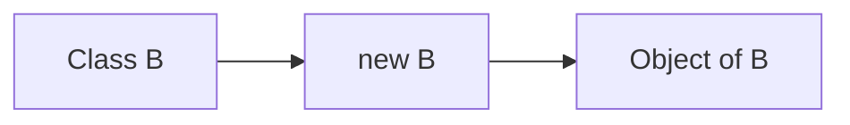

#### 3.2 字段访问

```tiger
b.x
```

表示访问对象 `b` 的字段 `x`。

编译器要做的事情是：

1. 找到 `b` 指向的对象；
2. 确定字段 `x` 在对象内存布局中的偏移量；
3. 从对应偏移位置取出字段值。

#### 3.3 方法调用

```tiger
b.f(x, y)
```

表面上看传入了两个参数 `x` 和 `y`，但实际上还隐式传入了 `b`：

```text
f(self = b, x, y)
```

所以 `b.f(x, y)` 可以理解为：

```text
B_f(b, x, y)
```

其中 `b` 是隐式的 `self`。

#### 3.4 新表达式语法总结

<html>
<table>
  <tr>
    <th>表达式</th>
    <th>含义</th>
    <th>编译器需要做什么</th>
  </tr>
  <tr>
    <td><code>new B</code></td>
    <td>创建 B 类对象</td>
    <td>分配对象内存，初始化字段，设置类描述符</td>
  </tr>
  <tr>
    <td><code>b.x</code></td>
    <td>访问对象字段</td>
    <td>根据字段偏移量读取对象内存</td>
  </tr>
  <tr>
    <td><code>b.f(x, y)</code></td>
    <td>调用对象方法</td>
    <td>传入 self，并根据静态或动态方法规则找到目标代码地址</td>
  </tr>
</table>
</html>

---

## Page 8：An Object-Oriented Program

### 1. 原文翻译

**An Object-Oriented Program**
一个面向对象程序

```tiger
let start := 10

class Vehicle extends Object {
    var position := start

    method move(int x) =
        (position := position + x)
}

class Truck extends Vehicle {
    method move(int x) =
        if x <= 55
        then position := position + x
}

class Car extends Vehicle {
    var passengers := 0

    method await(v: Vehicle) =
        if (v.position < position)
        then v.move(position - v.position)
        else self.move(10)
}

...
in
...
end
```

页面右侧问题：

**What are the variables in scope on entry to await?**
进入 `await` 方法时，哪些变量在作用域中？

### 2. 页面描述

这一页给出一个 Object-Tiger 程序示例。

程序中有三个类：

* `Vehicle`：父类，包含字段 `position` 和方法 `move`；
* `Truck`：继承自 `Vehicle`，重写了 `move` 方法；
* `Car`：继承自 `Vehicle`，新增字段 `passengers`，新增方法 `await`。

页面提出问题：
进入 `Car.await(v: Vehicle)` 方法时，哪些变量在作用域中？

### 3. 讲解

#### 3.1 类结构

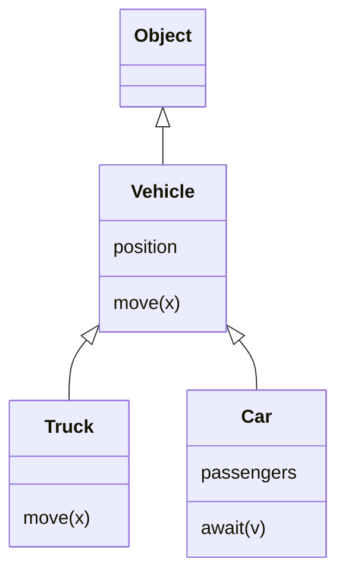

#### 3.2 代码含义

`Vehicle` 类：

```tiger
class Vehicle extends Object {
    var position := start

    method move(int x) =
        (position := position + x)
}
```

说明：

* `Vehicle` 有字段 `position`；
* 初始值是外层变量 `start`；
* 方法 `move` 会让 `position` 增加 `x`。

`Truck` 类：

```tiger
class Truck extends Vehicle {
    method move(int x) =
        if x <= 55
        then position := position + x
}
```

说明：

* `Truck` 继承 `Vehicle`；
* 它重写了 `move`；
* 只有当 `x <= 55` 时才移动。

`Car` 类：

```tiger
class Car extends Vehicle {
    var passengers := 0

    method await(v: Vehicle) =
        if (v.position < position)
        then v.move(position - v.position)
        else self.move(10)
}
```

说明：

* `Car` 继承 `Vehicle`；
* 它新增字段 `passengers`；
* 它有方法 `await`，参数 `v` 的类型是 `Vehicle`；
* 如果 `v.position < self.position`，就让 `v` 追上自己；
* 否则自己再移动 10。

#### 3.3 进入 await 时作用域里有什么？

进入 `await(v: Vehicle)` 时，至少有：

<html>
<table>
  <tr>
    <th>变量 / 名称</th>
    <th>来源</th>
    <th>含义</th>
  </tr>
  <tr>
    <td><code>self</code></td>
    <td>方法隐式参数</td>
    <td>当前 Car 对象</td>
  </tr>
  <tr>
    <td><code>v</code></td>
    <td>方法显式参数</td>
    <td>传入的 Vehicle 对象</td>
  </tr>
  <tr>
    <td><code>position</code></td>
    <td>从 Vehicle 继承来的字段</td>
    <td>当前 Car 对象的 position，即 self.position</td>
  </tr>
  <tr>
    <td><code>passengers</code></td>
    <td>Car 自己声明的字段</td>
    <td>当前 Car 对象的 passengers</td>
  </tr>
  <tr>
    <td><code>move</code></td>
    <td>从 Vehicle 继承的方法，也可能被动态分派</td>
    <td>可以通过 self.move 调用</td>
  </tr>
  <tr>
    <td><code>start</code></td>
    <td>外层 let 绑定</td>
    <td>Vehicle.position 初始化时使用的外层变量</td>
  </tr>
</table>
</html>

不过需要注意：
在方法体中直接写 `position`，通常会被理解为 `self.position`。

所以：

```tiger
if (v.position < position)
```

可以理解为：

```tiger
if (v.position < self.position)
```

---

## Page 9：An Object-Oriented Program (Cont)

### 1. 原文翻译

**An Object-Oriented Program (Cont)**
一个面向对象程序，续

```tiger
let start := 10
...
class Car extends Vehicle {
    var passengers := 0

    method await(v: Vehicle) =
        if (v.position < position)
        then v.move(position - v.position)
        else self.move(10)
}

var t := new Truck
var c := new Car
var v : Vehicle := c

in
    c.passengers := 2;
    c.move(60);
    v.move(70);
    c.await(t)
end
```

### 2. 页面描述

这一页继续上一页的程序，展示对象创建和方法调用。

关键代码包括：

```tiger
var t := new Truck
var c := new Car
var v : Vehicle := c
```

以及执行部分：

```tiger
c.passengers := 2;
c.move(60);
v.move(70);
c.await(t)
```

### 3. 讲解

这一页的核心是：
**静态类型和运行时类型可能不同。**

#### 3.1 对象创建

```tiger
var t := new Truck
var c := new Car
var v : Vehicle := c
```

含义：

<html>
<table>
  <tr>
    <th>变量</th>
    <th>静态类型</th>
    <th>运行时对象</th>
  </tr>
  <tr>
    <td><code>t</code></td>
    <td>Truck</td>
    <td>new Truck</td>
  </tr>
  <tr>
    <td><code>c</code></td>
    <td>Car</td>
    <td>new Car</td>
  </tr>
  <tr>
    <td><code>v</code></td>
    <td>Vehicle</td>
    <td>同一个 Car 对象</td>
  </tr>
</table>
</html>

也就是说：

```tiger
var v : Vehicle := c
```

这里 `v` 的静态类型是 `Vehicle`，但是它实际指向的是一个 `Car` 对象。

可以画成：

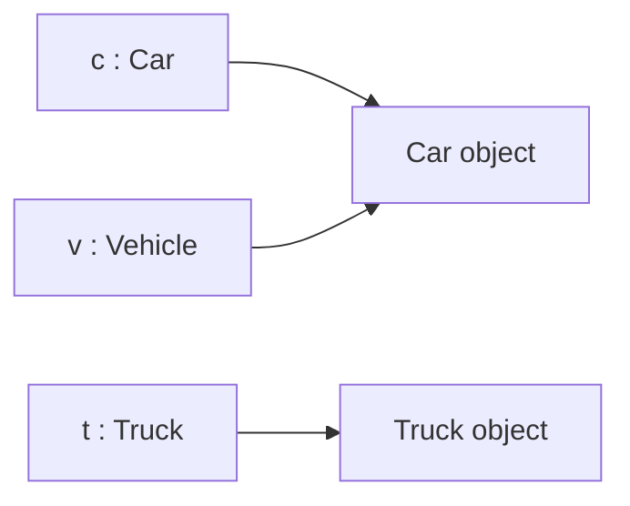

#### 3.2 执行语句分析

```tiger
c.passengers := 2;
```

设置 `Car` 对象的 `passengers` 字段为 2。

```tiger
c.move(60);
```

`c` 是 `Car` 类型，`Car` 没有重写 `move`，所以使用从 `Vehicle` 继承来的 `move`。

```tiger
v.move(70);
```

这句最关键。

虽然 `v` 的静态类型是 `Vehicle`，但是运行时 `v` 指向的是 `Car` 对象。
如果 `move` 是动态方法，就需要根据运行时对象决定调用哪个方法。

因为 `Car` 没有重写 `move`，所以最终仍然调用 `Vehicle.move`。

```tiger
c.await(t)
```

调用 `Car.await`，传入的参数是 `Truck` 对象 `t`。
由于 `Truck` 是 `Vehicle` 的子类，所以可以作为 `Vehicle` 类型参数传入。

#### 3.3 这页想引出的问题

本页真正想引出的是：

* `v.position` 怎么访问？
* `v.move(70)` 到底调用哪个方法？
* 如果变量类型是父类，但对象实际是子类，编译器怎么生成代码？

这些问题对应后面几页的主题：字段布局和动态方法分派。

---

## Page 10：Generate Code to Fetch Fields

### 1. 原文翻译

**Generate Code to Fetch Fields**
生成访问字段的代码

* `v.position`

  * `v` 属于类 `Vehicle`。
  * 为了求值它，编译器必须生成代码，从 `v` 指向的对象，也就是 record 中取出字段 `position`。

* 怎么做？

* 一个简单想法：

  * 从变量 `v` 的环境条目中取得 `Vehicle` 的类描述符。
  * 从这个描述符中取得 `position` 的偏移量。

* 但是在运行时：

  * `v` 可能包含一个指向 `Car` 或 `Truck` 的指针。
  * 那么 `position` 字段会在哪里？

### 2. 页面描述

这一页开始讨论编译器如何为字段访问生成代码。

例子是：

```tiger
v.position
```

表面上看，`v` 的类型是 `Vehicle`，字段 `position` 属于 `Vehicle`。
但问题是：运行时 `v` 可能实际指向 `Car` 或 `Truck` 对象。

所以编译器必须保证无论 `v` 指向哪个子类对象，都能在相同偏移位置找到 `position`。

### 3. 讲解

这一页是从语义进入实现的关键页。

#### 3.1 字段访问的核心问题

字段访问本质上是内存访问：

```text
v.position
```

编译后可能类似：

```text
MEM[v + offset(position)]
```

问题在于：
`offset(position)` 必须是多少？

#### 3.2 如果没有继承，很简单

如果 `Vehicle` 对象布局固定：

```text
Vehicle object:
+----------------+
| class desc ptr |
+----------------+
| position       |
+----------------+
```

那么 `position` 的偏移就是固定的。

#### 3.3 有继承后变复杂

如果：

```tiger
class Car extends Vehicle {
    var passengers := 0
}
```

那么 `Car` 对象既有 `Vehicle` 的字段，也有自己的字段：

```text
Car object:
+----------------+
| class desc ptr |
+----------------+
| position       |
+----------------+
| passengers     |
+----------------+
```

只要 `position` 仍然放在和 `Vehicle` 一样的位置，字段访问就没问题。

这就引出下一节：
**single inheritance 中字段布局的 prefixing 方法。**

---

## Page 11：Outline

### 1. 原文翻译

**Outline**
大纲

* **Classes**
  类

* **Single Inheritance of Data Fields**
  数据字段的单继承

* **Multiple Inheritance**
  多继承

* **Testing Class Membership**
  测试类成员关系

* **Private Fields and Methods**
  私有字段和方法

### 2. 页面描述

这一页再次显示大纲，但这次加粗的是：

**Single Inheritance of Data Fields**

说明接下来进入第二部分：
**数据字段的单继承实现。**

### 3. 讲解

前面已经讲完类的语法和基本语义，现在开始讲编译器实现问题：

> 在单继承语言中，子类对象应该如何布局字段，才能让父类字段访问始终有效？

核心目标是：
如果一个变量静态类型是父类，那么它访问父类字段时，即使运行时对象是子类，也能用同一个偏移量找到字段。

这要求子类对象的前半部分必须和父类对象兼容。

---

## Page 12：Single Inheritance

### 1. 原文翻译

**Single Inheritance**
单继承

* **Single-inheritance languages:**
  单继承语言：

  * 每个类只扩展一个父类。

* 对于单继承语言，如何生成获取字段的代码？

### 2. 页面描述

这一页定义单继承语言，并提出问题：

如果每个类只有一个父类，那么字段访问代码该如何生成？

### 3. 讲解

单继承的结构是一棵树：

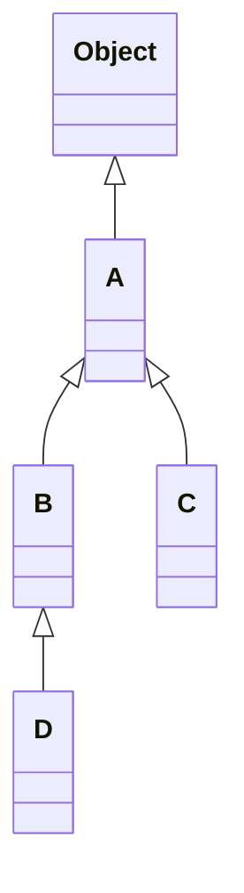

每个类只有一个直接父类，因此对象字段布局可以沿着父类链逐步扩展。

这使得一个简单有效的策略成为可能：

> 子类对象开头部分完全复制父类字段布局，然后把自己的新字段追加到后面。

这个策略叫 **prefixing**，下一页会具体解释。

---

## Page 13：Fields

### 1. 原文翻译

**Fields**
字段

* **Prefixing**
  前缀布局 / 前缀化

  * 当 `B` 继承 `A` 时，`B` 中那些从 `A` 继承来的字段，会被放在 `B` 的 record 的开头，并且顺序和它们在 `A` record 中出现的顺序相同。

  * `B` 中没有从 `A` 继承来的字段，会被放在后面。

代码：

```tiger
class A extends Object { 
    var a := 0
} 

class B extends A { 
    var b := 0
    var c := 0
} 

class C extends A {
    var d := 0
} 

class D extends B {
    var e := 0
}
```

### 2. 页面描述

这一页介绍单继承下字段布局的核心方法：**prefixing**。

页面下方的图展示了对象布局：

```text
A: a

B: a, b, c

C: a, d

D: a, b, c, e
```

也就是说，子类对象的开头总是父类字段。

### 3. 讲解

#### 3.1 prefixing 是什么？

如果 `B extends A`，那么 `B` 对象的字段布局必须以 `A` 的字段布局作为前缀。

例如：

```tiger
class A extends Object {
    var a := 0
}

class B extends A {
    var b := 0
    var c := 0
}
```

那么布局是：

```text
A object:
+---+
| a |
+---+

B object:
+---+
| a |  <- inherited from A
+---+
| b |
+---+
| c |
+---+
```

#### 3.2 为什么要这样做？

因为如果一个变量的静态类型是 `A`，它可能指向 `A`、`B`、`C`、`D` 的对象。

只要所有子类对象中，字段 `a` 都在同一个位置，那么访问 `a` 的代码就不需要关心运行时对象到底是哪一个类。

#### 3.3 本页例子的字段布局

<html>
<table>
  <tr>
    <th>类</th>
    <th>继承关系</th>
    <th>字段布局</th>
    <th>说明</th>
  </tr>
  <tr>
    <td><code>A</code></td>
    <td><code>A extends Object</code></td>
    <td><code>a</code></td>
    <td>A 自己声明字段 a。</td>
  </tr>
  <tr>
    <td><code>B</code></td>
    <td><code>B extends A</code></td>
    <td><code>a, b, c</code></td>
    <td>先放继承自 A 的 a，再放自己的 b 和 c。</td>
  </tr>
  <tr>
    <td><code>C</code></td>
    <td><code>C extends A</code></td>
    <td><code>a, d</code></td>
    <td>先放继承自 A 的 a，再放自己的 d。</td>
  </tr>
  <tr>
    <td><code>D</code></td>
    <td><code>D extends B</code></td>
    <td><code>a, b, c, e</code></td>
    <td>先放继承自 B 的 a,b,c，再放自己的 e。</td>
  </tr>
</table>
</html>

#### 3.4 字段布局图

```text
A object:
+-----+
|  a  |
+-----+

B object:
+-----+
|  a  |
+-----+
|  b  |
+-----+
|  c  |
+-----+

C object:
+-----+
|  a  |
+-----+
|  d  |
+-----+

D object:
+-----+
|  a  |
+-----+
|  b  |
+-----+
|  c  |
+-----+
|  e  |
+-----+
```

#### 3.5 重点结论

使用 prefixing 之后：

* 父类字段在所有子类对象中的偏移量都不变；
* 编译器可以根据静态类型生成字段访问代码；
* 不需要运行时动态查找字段；
* 单继承下字段访问可以非常高效。

---

## Page 14：Methods

### 1. 原文翻译

**Methods**
方法

* 一个方法实例的编译方式很像函数。

  * 它会变成机器代码，存放在指令空间中的某个特定地址。

* 例如，方法实例 `Truck_move` 在机器代码标签 `Truck_move` 处有一个入口点。

* 每个类描述符包含一个指向父类的指针，同时也包含一个方法实例列表。

### 2. 页面描述

这一页开始讨论方法的编译。

它强调：

* 方法最终会被编译成机器代码；
* 每个方法有一个入口地址；
* 类描述符中不仅有父类指针，还会保存方法实例列表。

页面右边画了一个 instruction space，里面有一个标记为 `Truck_move` 的代码区域，表示方法代码在指令空间中的位置。

### 3. 讲解

#### 3.1 方法和函数的关系

方法和普通函数很像，都会被编译成机器代码。

比如：

```tiger
class Truck extends Vehicle {
    method move(int x) =
        if x <= 55
        then position := position + x
}
```

可能被编译成类似：

```text
Truck_move:
    ...
    machine instructions
    ...
```

#### 3.2 方法和函数的区别

方法比函数多一个隐式参数 `self`。

所以：

```tiger
t.move(10)
```

可以理解为：

```text
Truck_move(self = t, x = 10)
```

#### 3.3 类描述符

每个类在运行时通常有一个 **class descriptor**，也就是类描述符。

类描述符中包含：

* 指向父类描述符的指针；
* 方法列表；
* 可能还包含字段信息、类名、类型信息等。

这一页明确说：

> Each class descriptor contains a pointer to its parent class, and also a list of method instances.

可以表示为：

```text
Class Descriptor for Truck:
+------------------------+
| parent -> Vehicle desc |
+------------------------+
| methods list           |
|   move -> Truck_move   |
+------------------------+
```

用 Mermaid 表示：

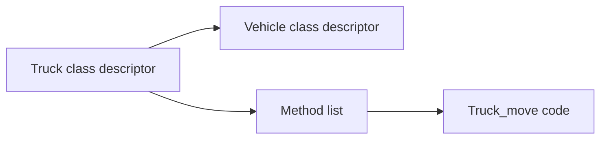

#### 3.4 重点

字段访问主要依赖 **对象内存布局**。
方法调用主要依赖 **方法代码地址** 和 **类描述符中的方法列表**。

---

## Page 15：Static Methods

### 1. 原文翻译

**Static Methods**
静态方法

* 一些面向对象语言允许某些方法被声明为 `static`。

* 为了编译形如 `c.f()` 的方法调用，编译器：

  * 找到 `c` 的类，假设它是类 `C`；
  * 在类 `C` 中搜索方法 `f`，假设没有找到；
  * 搜索 `C` 的父类，假设它是类 `B`，以此类推；
  * 假设在某个祖先类 `A` 中找到了静态方法 `f`，那么编译器可以把它编译为对标签 `A_f` 的函数调用。

图示：

```text
c.f()  --->  A_f
```

### 2. 页面描述

这一页介绍静态方法调用的编译。

如果方法是静态的，编译器可以在编译时确定目标方法地址。
因此 `c.f()` 可以直接编译为调用某个固定标签，比如 `A_f`。

### 3. 讲解

#### 3.1 静态方法的核心特点

静态方法调用在编译时就能确定调用目标。

例如，如果编译器知道：

* `c` 的静态类型是 `C`；
* `C` 没有 `f`；
* 父类 `B` 没有 `f`；
* 祖先类 `A` 有静态方法 `f`；

那么：

```tiger
c.f()
```

可以直接编译成：

```text
call A_f
```

#### 3.2 静态方法查找过程

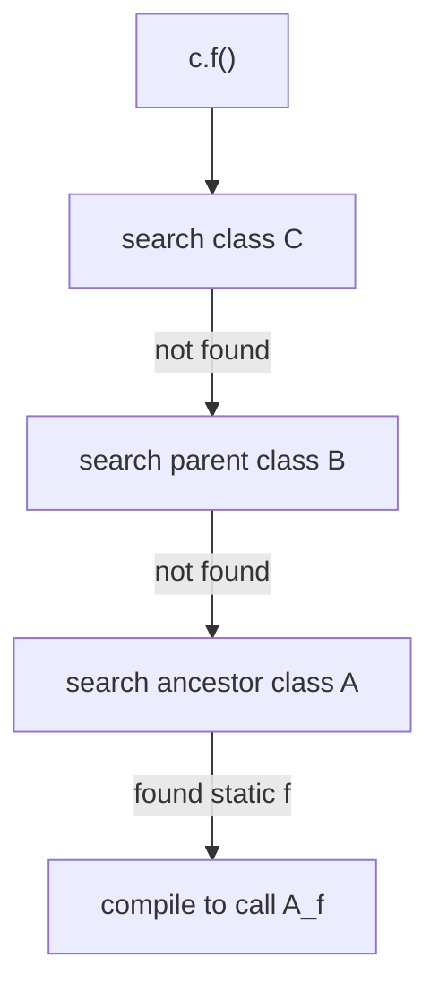

#### 3.3 静态方法为什么简单？

因为它不需要考虑运行时对象的真实类型。

编译器只根据静态类型和继承链就可以决定：

```text
c.f() -> A_f
```

#### 3.4 静态方法调用与动态方法调用对比

<html>
<table>
  <tr>
    <th>方法类型</th>
    <th>目标地址何时确定</th>
    <th>是否需要运行时查找</th>
    <th>例子</th>
  </tr>
  <tr>
    <td>静态方法</td>
    <td>编译时</td>
    <td>不需要</td>
    <td><code>c.f()</code> 直接变成 <code>call A_f</code></td>
  </tr>
  <tr>
    <td>动态方法</td>
    <td>运行时</td>
    <td>需要</td>
    <td><code>c.f()</code> 需要根据对象真实类决定调用谁</td>
  </tr>
</table>
</html>

---

## Page 16：Dynamic Methods

### 1. 原文翻译

**Dynamic Methods**
动态方法

* 如果 `A` 中的方法 `f` 是一个动态方法，那么我们能不能把 `c.f()` 转换成 `A_f()`？

  * `f` 可能在某个类 `D` 中被重写，而 `D` 是 `C` 的子类。
  * 在编译时无法判断 `c` 是指向类 `D` 的对象，还是指向类 `C` 的对象。如果是 `D` 的对象，就应该调用 `D_f`；如果是 `C` 的对象，就应该调用 `A_f`。

* 如何解决这个问题？

代码：

```tiger
Class A extends Object {
    var x := 0
    method f()
}

Class B extends A {
    method g()
}

Class C extends B {
    method g()
}

Class D extends C {
    var y := 0
    method f()
}

c.f()
```

### 2. 页面描述

这一页指出动态方法调用的问题：

虽然 `c` 的静态类型可能是 `C`，但是运行时它可能指向 `C` 对象，也可能指向 `D` 对象。
而 `D` 重写了 `f`，所以调用 `c.f()` 时到底应该执行 `A_f` 还是 `D_f`，编译时无法确定。

### 3. 讲解

#### 3.1 类继承结构

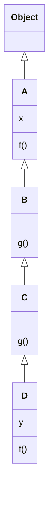

#### 3.2 方法来源

<html>
<table>
  <tr>
    <th>类</th>
    <th>字段</th>
    <th>方法</th>
    <th>说明</th>
  </tr>
  <tr>
    <td><code>A</code></td>
    <td><code>x</code></td>
    <td><code>f()</code></td>
    <td>A 定义 f。</td>
  </tr>
  <tr>
    <td><code>B</code></td>
    <td>继承 <code>x</code></td>
    <td><code>g()</code>，继承 <code>f()</code></td>
    <td>B 新增 g。</td>
  </tr>
  <tr>
    <td><code>C</code></td>
    <td>继承 <code>x</code></td>
    <td>重写 <code>g()</code>，继承 <code>f()</code></td>
    <td>C 覆盖 B.g。</td>
  </tr>
  <tr>
    <td><code>D</code></td>
    <td><code>x, y</code></td>
    <td>重写 <code>f()</code>，继承 <code>C.g()</code></td>
    <td>D 覆盖 A.f。</td>
  </tr>
</table>
</html>

#### 3.3 为什么不能直接编译成 A_f？

如果写：

```tiger
c.f()
```

而 `c` 的静态类型是 `C`，那么从继承链看，`C` 没有定义 `f`，它继承的是 `A.f`。
于是编译器可能想直接生成：

```text
call A_f
```

但问题是，运行时 `c` 可能实际指向 `D` 对象。

因为：

```tiger
var c : C := new D
```

这是合法的，因为 `D` 是 `C` 的子类。

如果运行时对象是 `D`，那么 `D` 重写了 `f`，应该调用：

```text
D_f
```

而不是：

```text
A_f
```

#### 3.4 核心问题

动态方法调用的问题就是：

> 编译时只知道静态类型，运行时才知道真实对象类型。

所以需要一种机制，让程序在运行时根据对象真实类型选择方法。

这个机制就是下一页的：

**dispatch vector / virtual table / vtable**

---

## Page 17：Dynamic Methods

### 1. 原文翻译

**Dynamic Methods**
动态方法

* 类描述符必须包含一个向量，也叫：

  * dispatch vector；
  * virtual table；
  * vtable。

  这个向量中，对于每一个非静态方法名，都有一个方法实例。

* **Prefixing**：当类 `B` 继承自 `A` 时，方法表以 `A` 已知的所有方法名的条目开始，然后继续添加 `B` 声明的新方法。

代码：

```tiger
Class A extends Object {
    var x := 0
    method f()
}

Class B extends A {
    method g()
}

Class C extends B {
    method g()
}

Class D extends C {
    var y := 0
    method f()
}
```

### 2. 页面描述

这一页给出动态方法调用的解决方案：
每个类描述符中维护一个 **vtable**。

图中展示了：

* `A` 的方法表有 `A_f`；
* `B` 的方法表有 `A_f` 和 `B_g`；
* `C` 的方法表有 `A_f` 和 `C_g`；
* `D` 的方法表有 `D_f` 和 `C_g`。

这说明：

* 如果子类没有重写方法，就沿用父类方法；
* 如果子类重写方法，就在相同表项位置替换成新的方法实现；
* 新增方法则追加到方法表后面。

### 3. 讲解

#### 3.1 vtable 是什么？

vtable，全称 virtual table，也叫 dispatch vector。
它是一个方法指针数组，用于支持动态分派。

可以理解为：

```text
class descriptor:
+----------------+
| parent pointer |
+----------------+
| vtable         |
+----------------+

vtable:
+----------------+
| method f ptr   |
+----------------+
| method g ptr   |
+----------------+
```

#### 3.2 方法表也使用 prefixing

字段布局有 prefixing，方法表也有 prefixing。

如果 `B extends A`，那么：

* `B` 的方法表前面部分和 `A` 的方法表兼容；
* 如果重写父类方法，就在同一个槽位替换方法指针；
* 如果新增方法，就追加到后面。

#### 3.3 本页例子的 vtable

<html>
<table>
  <tr>
    <th>类</th>
    <th>字段布局</th>
    <th>方法表 / vtable</th>
    <th>说明</th>
  </tr>
  <tr>
    <td><code>A</code></td>
    <td><code>x</code></td>
    <td><code>[A_f]</code></td>
    <td>A 定义了 f。</td>
  </tr>
  <tr>
    <td><code>B</code></td>
    <td><code>x</code></td>
    <td><code>[A_f, B_g]</code></td>
    <td>B 继承 f，新增 g。</td>
  </tr>
  <tr>
    <td><code>C</code></td>
    <td><code>x</code></td>
    <td><code>[A_f, C_g]</code></td>
    <td>C 继承 f，重写 g。</td>
  </tr>
  <tr>
    <td><code>D</code></td>
    <td><code>x, y</code></td>
    <td><code>[D_f, C_g]</code></td>
    <td>D 重写 f，继承 C.g。</td>
  </tr>
</table>
</html>

#### 3.4 字符画表示

```text
A object:
+----------------+
| class desc ptr |
+----------------+
| x              |
+----------------+

A vtable:
+-------+
| A_f   |
+-------+


B object:
+----------------+
| class desc ptr |
+----------------+
| x              |
+----------------+

B vtable:
+-------+
| A_f   |  <- inherited f
+-------+
| B_g   |  <- new g
+-------+


C object:
+----------------+
| class desc ptr |
+----------------+
| x              |
+----------------+

C vtable:
+-------+
| A_f   |  <- inherited f
+-------+
| C_g   |  <- override g
+-------+


D object:
+----------------+
| class desc ptr |
+----------------+
| x              |
+----------------+
| y              |
+----------------+

D vtable:
+-------+
| D_f   |  <- override f
+-------+
| C_g   |  <- inherited g from C
+-------+
```

#### 3.5 为什么 vtable 能解决动态调用？

假设：

```tiger
c.f()
```

`f` 在 vtable 中的偏移位置是固定的，比如第 0 个位置。

那么无论 `c` 指向什么对象：

* 如果 `c` 指向 `C` 对象，那么 `C` 的 vtable 第 0 项是 `A_f`；
* 如果 `c` 指向 `D` 对象，那么 `D` 的 vtable 第 0 项是 `D_f`。

所以运行时只要：

1. 从对象中取出 class descriptor；
2. 从 class descriptor 中取出 vtable；
3. 在固定偏移位置取出方法指针；
4. 调用这个方法指针。

这样就实现了动态分派。

---

## Page 18：Dynamic Methods

### 1. 原文翻译

**Dynamic Methods**
动态方法

* 为了执行 `c.f()`，其中 `f` 是一个动态方法，编译后的代码必须执行以下指令：

  1. 从对象 `c` 的偏移量 0 处取出类描述符 `d`。
  2. 从 `d` 中 `f` 的固定偏移位置取出方法实例指针 `p`。
  3. 跳转到地址 `p`，并保存返回地址，也就是调用 `p`。

### 2. 页面描述

这一页总结动态方法调用的底层执行流程。

核心是三步：

```text
object c -> class descriptor d -> method pointer p -> call p
```

这就是典型的 vtable 动态分派过程。

### 3. 讲解

#### 3.1 动态调用的执行流程

对于：

```tiger
c.f()
```

如果 `f` 是动态方法，那么不能直接编译成：

```text
call A_f
```

而应该编译成运行时查找：

```text
d = c[0]
p = d[offset(f)]
call p
```

#### 3.2 用伪代码表示

```text
# c.f()

d := MEM[c + 0]              # 取出对象 c 的 class descriptor
p := MEM[d + offset(f)]      # 从 vtable 中取出 f 对应的方法地址
CALL p                       # 调用该方法
```

#### 3.3 用 Mermaid 表示

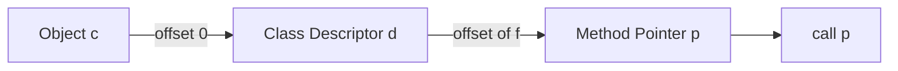

#### 3.4 对应内存结构

```text
Object c:
+---------------------------+
| class descriptor pointer  |  offset 0
+---------------------------+
| field 1                   |
+---------------------------+
| field 2                   |
+---------------------------+

Class descriptor d:
+---------------------------+
| parent class pointer      |
+---------------------------+
| method table / vtable     |
+---------------------------+

vtable:
+---------------------------+
| method f pointer          |  fixed offset for f
+---------------------------+
| method g pointer          |
+---------------------------+
```

#### 3.5 为什么 offset(f) 是 constant？

因为方法表使用 prefixing。
父类中的方法在所有子类方法表中的位置保持不变。

例如：

```text
A vtable: [A_f]
B vtable: [A_f, B_g]
C vtable: [A_f, C_g]
D vtable: [D_f, C_g]
```

`f` 一直在第 0 个槽位。
所以编译器可以把 `offset(f)` 编译为常量。

但是槽位里的内容可能不同：

* `C` 的第 0 项是 `A_f`；
* `D` 的第 0 项是 `D_f`。

这就是动态分派。

---

# 全章前 18 页核心总结

## 1. 本章讲什么？

这 18 页主要讲：

<html>
<table>
  <tr>
    <th>主题</th>
    <th>核心问题</th>
    <th>解决方法</th>
  </tr>
  <tr>
    <td>类</td>
    <td>如何在 Tiger 中加入 class、method、field？</td>
    <td>扩展语法，加入 class declaration 和 method expression。</td>
  </tr>
  <tr>
    <td>对象创建</td>
    <td>如何创建对象？</td>
    <td>使用 <code>new B</code>。</td>
  </tr>
  <tr>
    <td>字段访问</td>
    <td>父类变量可能指向子类对象，字段偏移如何保持一致？</td>
    <td>字段布局使用 prefixing。</td>
  </tr>
  <tr>
    <td>静态方法</td>
    <td>方法目标能否编译时确定？</td>
    <td>如果是 static method，直接编译为固定标签调用。</td>
  </tr>
  <tr>
    <td>动态方法</td>
    <td>运行时对象类型不同，方法实现可能不同，怎么办？</td>
    <td>使用 class descriptor 和 vtable。</td>
  </tr>
</table>
</html>

---

## 2. 最重要的两种 prefixing

### 字段 prefixing

```text
A fields: a
B fields: a, b, c
D fields: a, b, c, e
```

作用：
保证父类字段在子类对象中的偏移不变。

### 方法表 prefixing

```text
A vtable: [A_f]
B vtable: [A_f, B_g]
C vtable: [A_f, C_g]
D vtable: [D_f, C_g]
```

作用：
保证同一个方法名在所有相关类的 vtable 中偏移不变。

---

## 3. 字段访问 vs 方法调用

<html>
<table>
  <tr>
    <th>操作</th>
    <th>例子</th>
    <th>依赖结构</th>
    <th>是否动态</th>
  </tr>
  <tr>
    <td>字段访问</td>
    <td><code>v.position</code></td>
    <td>对象字段布局</td>
    <td>通常偏移静态确定</td>
  </tr>
  <tr>
    <td>静态方法调用</td>
    <td><code>c.f()</code></td>
    <td>编译时类层次查找</td>
    <td>否</td>
  </tr>
  <tr>
    <td>动态方法调用</td>
    <td><code>c.f()</code></td>
    <td>class descriptor + vtable</td>
    <td>是</td>
  </tr>
</table>
</html>

---

## 4. 最核心的一句话

这部分的核心可以概括为：

> 单继承面向对象语言通过 **字段前缀布局** 保证父类字段访问稳定，通过 **方法表前缀布局与 vtable** 支持动态方法分派。

英文关键词可以记成：

```text
Single inheritance uses prefixing for field layout,
and vtables for dynamic method dispatch.
```

中文解释：

```text
单继承语言中，子类对象以前缀方式保留父类字段布局；
动态方法调用则通过对象的类描述符找到虚表，再从虚表中取出真正要调用的方法地址。
```
