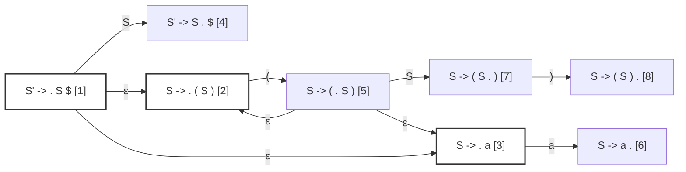
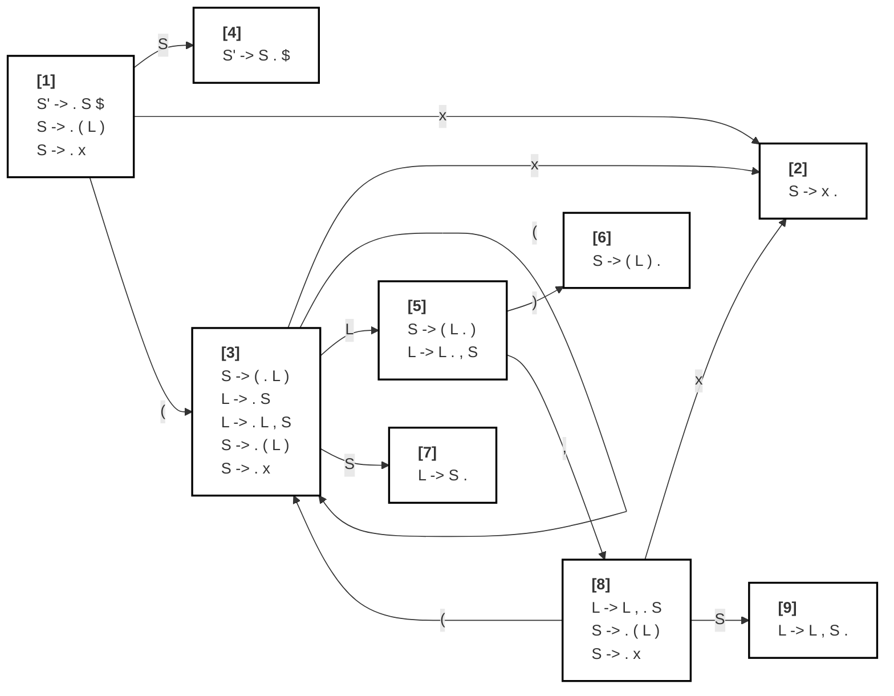
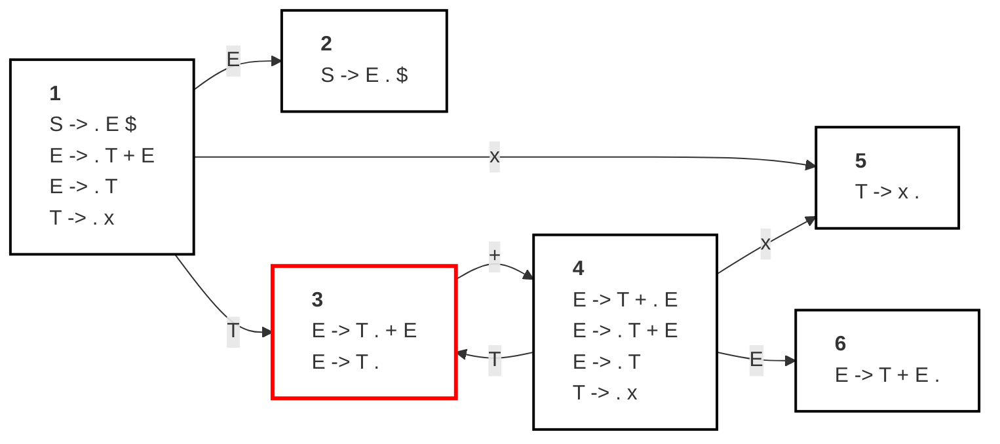
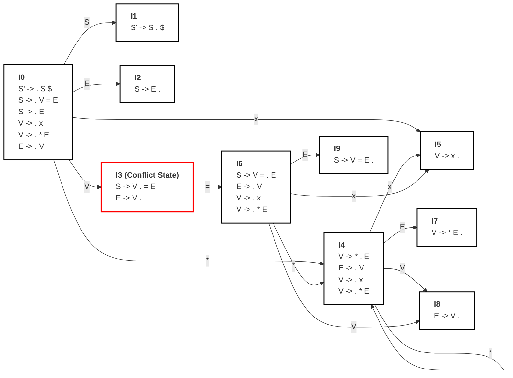
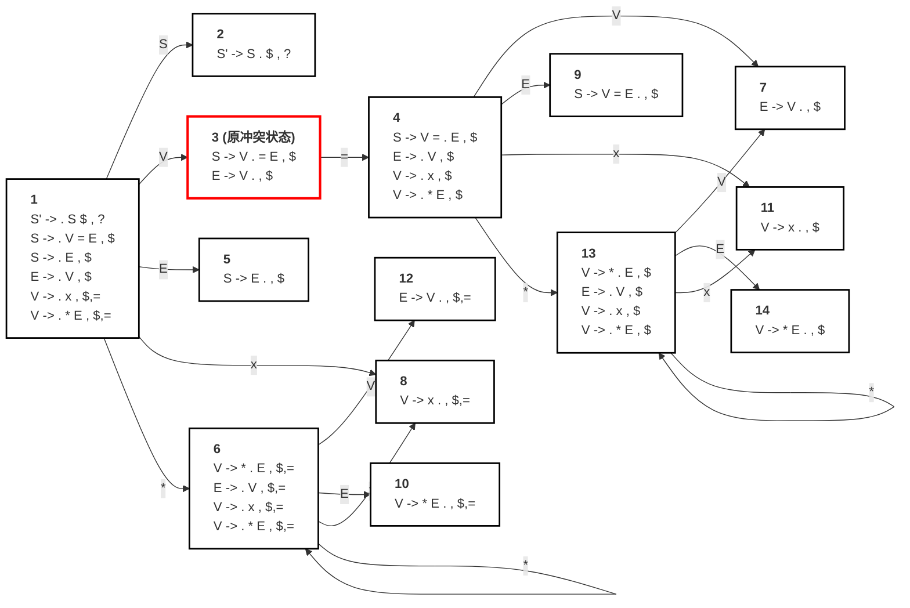
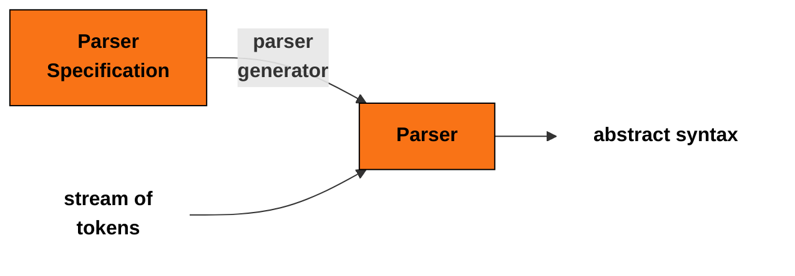

# Chapter 3 Parsing 语法分析

这一章讲的是**语法分析（Parsing）**，也就是编译器前端里“词法分析之后、语义分析之前”的那一步：把 lexer 输出的 **token 串**，按照某个文法规则，识别成一个有结构的程序，并构造出 **语法树**，供后面的语义分析、类型检查、代码生成继续使用。

全章大致分成四部分：
1. **CFG（上下文无关文法）**：怎么形式化描述“哪些 token 串是合法程序”
2. **自顶向下分析**：递归下降、预测分析、FIRST/FOLLOW/Nullable、LL(1)
3. **自底向上分析**：Shift-Reduce、LR(0)、SLR、LR(1)、LALR
4. **Parser Generator 与错误恢复**：Yacc、优先级、结合性、错误处理

目录：
- 用 CFG 描述程序语言语法
- 基于 CFG 构造 parser：
  - Top-Down Parsing
  - Predictive Parsing
  - Bottom-Up Parsing
- 更多内容：
  - Automatic parser generation
  - Error recovery


## 3.0. 语法分析的意义

### 3.0.1. 什么是 Syntax Analysis？

- **Syntax**：词怎么组合成短语、子句、句子；在编译器里对应“token 怎么组合成表达式、语句、程序”
- **Syntax analysis**：分析程序的短语结构，也就是 **parsing**
- parser 是根据 **grammar（文法）** 手工或自动构造出来的。编译器前端流程是：
  ```
  source code -> Lexer -> token stream -> Parser -> abstract syntax -> Semantic Analysis
  ```

### 3.0.2. 为什么需要语法分析？

#### 3.0.2.1 查语法错

这段有语法错误的 C 风格代码：
```c
if ((x > 0) // 少了一个右括号 
y = 0 //后面少了分号
```
- 即使**没有词法错误**
- 仍然可能有**多个语法错误**
- 语法错误应该在 **syntax analysis** 阶段尽早发现
- 不应把它拖到 semantic analysis 再查，因为语义分析通常默认输入已经是语法正确的程序

语法分析的第一项任务不是“理解意思”，而是先回答这串 token 组合得对不对？

#### 2.0.2.2. 构造结构

用表达式 `1 + 2 * 3` 举例：

- lexer 只能切成 `num(1) plus num(2) times num(3)`
- parser 要进一步构造 **parse tree**
- 这样才能正确知道它表示的是 `1 + (2 * 3)`，而不是 `(1 + 2) * 3`


token 串只有线性顺序，没有结构。

“运算先后关系、括号归属、谁和谁结合”这些都属于结构，必须靠 parser 来恢复。


## 3.1. Context-Free Grammar（CFG，上下文无关文法）

### 3.1.0. 为什么需要文法？

#### 3.1.0.1. 为什么需要语言？

- 不是所有 token 串都是程序
- parser 必须区分**合法串**和**非法串**
- 所以我们需要：
  1. 一个形式化方法描述哪些 token 串合法
  2. 一个方法判断某串是否属于该语言

- **语言（language）** = 某个字母表上的字符串集合

- 在 parsing 里，这里的“符号”就是 lexical token

所以 parser 的数学基础就是：
> 给定一个形式语言，判断输入串是否属于它。


#### 3.1.0.2. 正则语言不够强

平衡括号语言：`ε, (), (()), ((())), ...` 不是 regular language，不能仅靠正则表达式表达。编程语言里这种递归结构非常常见，例如：
- 嵌套括号
- 嵌套语句块
- 递归表达式
- 嵌套函数调用

结论：
* 要描述编程语言，通常需要比正则更强的形式系统，所以引入 **CFG**。


### 3.1.1. CFG 的正式定义

#### 3.1.1.1. 组成

一个 Context-Free Grammar 包含四部分：

1. **终结符集合 T**：来自字母表的符号，也就是最终出现在字符串中的符号
2. **非终结符集合 N**：中间结构名，比如 `E`、`S`、`L`
3. **开始符号 S**：一个特殊非终结符，推导从它开始
4. **产生式（production）**：形如 `X -> Y1 Y2 ... Yk`，`X` 必须是非终结符，右边可以是终结符、非终结符，或者 `ε`

讲义举的括号语言例子：

- `S -> (S)`
- `S -> ε`

其中：

- `T = {(, )}`
- `N = {S}`

#### 3.1.1.2. 推导（Derivation）

CFG 生成字符串的过程是：
1. 从开始符号 `S` 出发
2. 找一个非终结符 `X`
3. 用某条产生式右边替换它
4. 重复，直到串里全是终结符

讲义用括号文法举例：

- `S -> (S)`
- `(S) -> ((S))`
- `((S)) -> (())`
- 再结合 `S -> ε` 完成推导


推导过程中：
- **终结符一旦出现就不会再变**
- 被替换的只有非终结符

#### 3.1.1.3. 正式定义：

某个上下文无关文法 `G` 生成的语言 `L(G)`，就是从开始符号 `S` 经过 **零步或多步推导** 最终得到的所有只包含终结符/不包含非终结串的集合


#### 案例：直线型程序语法

这一页给出一个更像程序语言的 CFG，终结符包括：`;`、`id`、`:=`、`print`、 `num`、`+`、`(`、`)`、`,`

非终结符有：`S`（statement）、`E`（expression）、`L`（list）

产生式共有 9 条：

1. `S -> S ; S`
2. `S -> id := E`
3. `S -> print ( L )`
4. `E -> id`
5. `E -> num`
6. `E -> E + E`
7. `E -> ( S , E )`
8. `L -> E`
9. `L -> L , E`

一些属于这个文法的串：

- `id := num`
- `id := num + num`
- `print ( num )`
- `id := id + (id := num + num, id)`

对应真实源代码可以写成：

```c
a := 7
b := c + (d := 5 + 6, d)
```


### 3.1.2. Derivation 与 Parse Tree

#### 3.1.2.0. 为什么还要研究 Derivation？

- 我们不仅想描述合法串
- 还想知道如何判断一个串是否在文法语言里

于是引入：

- **A derivation**：从开始符号出发，不断替换非终结符的过程
- 一个串属于 `L(G)`，当且仅当存在一条从开始符号到它的推导路径

#### 3.1.2.1. Left-most Derivation

- 每一步总是替换“当前串中最左边的那个非终结符”

例如文法：
1. `E -> E * E`
2. `E -> E / E`
3. `E -> E + E`
4. `E -> E - E`
5. `E -> id`
6. `E -> num`
7. `E -> (E)`

用它推导串 `id * id + id`，按步骤展示：


**第 1 步：起始符号 `E`**

推导式：`E`

```text
  E
```

**第 2 步：将 `E` 展开为 `E + E`**

推导式：`E => E + E`

```text
       E
     / | \
    E  +  E
```

**第 3 步：将最左侧的 `E` 展开为 `E * E`**

推导式：`E + E => E * E + E`

```text
             E
           / | \
         /   |   \
        E    +    E
      / | \
     E  *  E
```

**第 4 步：将最左侧的 `E` 替换为终结符 `id`**

推导式：`E * E + E => id * E + E`

```text
             E
           / | \
         /   |   \
        E    +    E
      / | \
     E  *  E
     |
     id
```

**第 5 步：将中间的 `E` 替换为终结符 `id`**

推导式：`id * E + E => id * id + E`

```text
             E
           / | \
         /   |   \
        E    +    E
      / | \
     E  *  E
     |     |
     id    id
```

**第 6 步：将最右侧的 `E` 替换为终结符 `id`** (最终完整的语法树)

推导式：`id * id + E => id * id + id`

```text
             E
           / | \
         /   |   \
        E    +    E
      / | \       |
     E  *  E      |
     |     |      |
     id    id     id
```

#### 3.1.2.2. Right-most Derivation

- 每一步都替换最右边的非终结符

**第 1 步：起始符号 `E`**

推导式：`E`

```text
  E
```

**第 2 步：将 `E` 展开为 `E + E`**

推导式：`E => E + E`

```text
       E
     / | \
    E  +  E
```

**第 3 步：替换最右侧的 `E` 为终结符 `id`**

推导式：`E + E => E + id`

```text
       E
     / | \
    E  +  E
          |
          id
```

**第 4 步：将剩下的 `E` 展开为 `E * E`**

推导式：`E + id => E * E + id`

```text
             E
           / | \
         /   |   \
        E    +    E
      / | \       |
     E  *  E      id
```

**第 5 步：替换当前最右侧的非终结符 `E`（即乘号右边的 `E`）为 `id`**

推导式：`E * E + id => E * id + id`

```text
             E
           / | \
         /   |   \
        E    +    E
      / | \       |
     E  *  E      id
           |
           id
```

**第 6 步：替换最后一个非终结符 `E`（即乘号左边的 `E`）为 `id`** (最终完整的语法树)

推导式：`E * id + id => id * id + id`

```text
             E
           / | \
         /   |   \
        E    +    E
      / | \       |
     E  *  E      id
     |     |
     id    id
```

无论是**最左推导**还是**最右推导**，对于同一个无二义性的文法，它们最终生成的**语法树结构是完全一样**的。区别仅仅在于树节点“生长”出来的先后顺序：最左推导是从左往右长出叶子，而最右推导是从右往左长出叶子。


还有既不是 left-most 也不是 right-most 的推导


#### 3.1.2.3. Parse Tree 的性质

语法树特征：
- 叶子节点是终结符，内部节点是非终结符
- 按叶子从左到右遍历，得到原始输入串
- 语法树展示了**运算的结合关系**
- 输入串本身并不显式展示这种结构
  - `id * id + id` 这个字符串本身，不会告诉你先乘还是先加；
  - 但 parse tree 会。


#### 3.1.2.4. Parse Tree 的应用


我们不只是关心 `s ∈ L(G)` 是否成立，我们还需要 **parse tree**，因为后续语义分析需要知道短语结构和运算归属，例如运算优先级。
- 一个 derivation 决定一棵 parse tree
- 一棵 parse tree 可能有多个 derivation
- left-most / right-most derivation 对 parser 实现特别重要
  - 如果文法是有二义性的那么左推导和右推导不唯一

### 3.1.3. Ambiguous Grammars（歧义/二义性文法）

#### 3.1.3.0.一个串对应两棵树

```text
1. E -> E * E         4. E -> E - E         7. E -> (E)
2. E -> E / E         5. E -> id
3. E -> E + E         6. E -> num
```

字符串：**`id * id + id`**

如果我们只有一个自动程序来生成语法树，不允许手写优先级，按照这个规则会生成两棵，但是其中一个优先级是错误的
- 同一个输入串可以对应两棵不同的 parse tree
  - 一棵表示 `(id * id) + id`
  - 另一棵表示 `id * (id + id)`


```text

              E                                     E
            / | \                                 / | \
          /   |   \                             /   |   \
         E    +    E                           E    *    E
       / | \       |                           |       / | \
      E  *  E      id                         id      E  +  E
      |     |                                         |     |
      id    id                                        id    id
```

对于同一个输入的句子，文法可以推导产生两棵（或以上）结构完全不同的语法树，这会导致编译器无法确定代码的真实执行顺序。

这就叫歧义，也就是一个字符串可以被同一个文法赋予不止一种结构。


#### 3.1.3.1. 歧义文法的定义与危害

定义：

- 如果某个文法能为同一个字符串构造出两棵不同 parse tree
- 等价地，某个串存在多个 left-most 或多个 right-most derivation
- 那这个文法就是 **ambiguous grammar**

歧义文法会让程序含义不确定，编译器无法稳定工作。

#### 3.1.3.2 如何消除歧义

例如对于这个例子：

```text
1. E -> E * E         4. E -> E - E         7. E -> (E)
2. E -> E / E         5. E -> id
3. E -> E + E         6. E -> num
```

最直接的办法是把歧义文法改写成无歧义文法，并希望满足：

- `*` 和 `/` 的优先级高于 `+` 和 `-`
- 运算符左结合
- `1 - 2 - 3` 应理解为 `(1 - 2) - 3` 而不是 `1 - (2 - 3)`

我们引入一些非终结符，就可以处理优先级和结合性的问题


```text
1. E -> E + T  4. T -> T * F  7. F -> id
2. E -> E - T  5. T -> T / F  8. F -> num   
3. E -> T      6. T -> F   9. F -> (E)
```

### 3.1.4. 终结符

程序常常使用 `$` 表示程序的结束


## 3.2. Top-Down Parsing


语法分析方法分成三类：

1. **Universal parsing**
   - 能处理任意文法
   - 但太慢，不适合生产编译器
2. **Top-Down**
   - 从根到叶构造树
3. **Bottom-Up**
   - 从叶到根构造树


- Top-Down 和 Bottom-Up 都是从左到右扫描输入
- 最高效的 Top-Down 和 Bottom-Up 方法通常只适用于某些文法子类，例如 **LL grammars** 和 **LR grammars** 两个子类，但是他们表示能力足够大部分现代编程语言使用。
- 手写 parser 往往用 LL
- 更强大的 LR 往往交给自动工具生成


### 3.2.1. 什么是 Top-Down Parsing？

Top-down parsing：
- 从树根往下构造
- 从左到右推进
- 可以看成是在为输入串寻找一个 **leftmost derivation**

top-down 例子：

- 文法：
  - `S -> if E then S else S`
  - `S -> begin S L`
  - `S -> print E`
  - `L -> end`
  - `L -> ; S L`
  - `E -> num = num`

- 输入串：`begin print num = num end`

过程：


- 从 `S`

```text
        S
```
- 展开成 `begin S L`

```text
        S
     /  |  \
  begin S   L
```
- 再展开内部 `S -> print E`

```text
          S
     /    |    \
  begin   S     L
        /  \  
     print  E 
```
- 再展开 `E -> num = num`

```text
          S
     /    |    \
  begin   S     L
        /  \    
     print  E 
            |
         num=num
```
- 最后 `L -> end`

```text
          S
     /    |    \
  begin   S     L
        /  \     \
     print  E     end
            |
         num=num
```

这就是自顶向下构造语法树的过程。

### 3.2.2. Recursive Descent Parsing（递归下降）

- Recursive descent 是 top-down parsing 的一般形式
- 简单，适合手写
- 但有时需要 **backtracking（回溯）** 才知道选哪条产生式


#### 3.2.2.1. 递归下降 parser的表示

对于每个非终结符写一个函数：

- 调用这个函数就表示“我要匹配这个非终结符”
- 它的每一条产生式对应函数里的一个分支

例如文法中的 `L` 可以写成：

```c
void L(void) {
  switch(tok) {
    case END: eat(END); break;
    case SEMI: eat(SEMI); S(); L(); break;
    default: error();
  }
}
```

说明 parser 代码直接映射文法结构。

#### 3.2.2.2. 手写递归下降 parser 的三步
对于文法：
  - `S -> if E then S else S`
  - `S -> begin S L`
  - `S -> print E`
  - `L -> end`
  - `L -> ; S L`
  - `E -> num = num`

最终预期
```c
enum token {IF, THEN, ELSE, BEGIN, END, PRINT, SEMI, NUM, EQ};
extern enum token getToken(void);
enum token tok; 
void advance() {tok=getToken();} 
void eat(enum token t) {if (tok==t) advance(); else error();}
void S(void) {
  switch(tok) { 
    case IF: eat(IF); E(); eat(THEN); S(); eat(ELSE); S(); break; 
    case BEGIN: eat(BEGIN); S(); L(); break; 
    case PRINT: eat(PRINT); E(); break; 
    default: error();
  }
}

void L(void) {
  switch(tok) {
    case END: eat(END); break;
    case SEMI: eat(SEMI); S(); L(); break;
    default: error();
  }
}
void E(void) {
    eat(NUM); eat(EQ); eat(NUM);
}
```

1. 定义 token 枚举

```c
enum token {IF, THEN, ELSE, BEGIN, END, PRINT, SEMI, NUM, EQ};
```

2. 和 lexer 对接

```c
// call lexer
extern enum token getToken(void);
// store the next token
enum token tok; 
void advance() {tok=getToken();} 
// consume the next token and get the new one
void eat(enum token t) {if (tok==t) advance(); else error();}
```

- `getToken()` 从 lexer 取下一个 token
- `tok` 保存当前 lookahead
- `advance()` 读取下一个 token
- `eat(t)` 检查当前 token 是否是 `t`，是就吃掉，否则报错

3. 为每个非终结符写函数

- `S()`
- `L()`
- `E()`

例如：

```c
void S(void) {
  switch(tok) { 
    case IF: eat(IF); E(); eat(THEN); S(); eat(ELSE); S(); break; 
    case BEGIN: eat(BEGIN); S(); L(); break; 
    case PRINT: eat(PRINT); E(); break; 
    default: error();
  }
}

void L(void) {
  switch(tok) {
    case END: eat(END); break;
    case SEMI: eat(SEMI); S(); L(); break;
    default: error();
  }
}
void E(void) {
    eat(NUM); eat(EQ); eat(NUM);
}
```

#### 3.2.2.3. 为什么这个例子能顺利写出来？

因为它很“特殊”：
- 对同一个非终结符，各条产生式右边的第一个符号是不同终结符
- 例如 `S` 的三条产生式分别以 `if`、`begin`、`print` 开头
- 所以看一眼当前 token 就知道走哪一条

但如果再加上：

- `S -> S L`
- `S -> begin E , S L`

那么当 `tok == begin` 时就不确定了。

这暴露的问题：**递归下降不是万能的。**

#### 3.2.2.4 经典表达式文法的问题

表达式文法：

- `E -> E + T | E - T | T`
- `T -> T * F | T / F | F`
- `F -> id | num | (E)`

当当前 token 是 `num` 时：

- 你不能只看这一项就决定 `E` 用哪条产生式
- 因为三条都可能以 `num` 开头推导出来

于是普通递归下降会需要回溯，而回溯可能非常昂贵，甚至路径数爆炸。

### 3.2.3. Predictive Parsing

#### 3.2.3.1. Predictive Parsing 定义

为了解决回溯问题，引入 **predictive parsing**：

- 它是递归下降的特例
- **不需要回溯**
- 通过向前看固定数量个 token（通常 1 个）来唯一决定产生式
- 能处理 **LL(k)** 文法

LL(k) 的含义：

- 第一个 L：从左到右扫描输入
- 第二个 L：构造最左推导
- `k`：向前看 `k` 个 token


#### 3.2.3.2. 为什么需要 FIRST / FOLLOW？

如果 `k = 1`，当 `tok == num` 时怎么选产生式？

要回答这个问题，需要知道：
- FIRST
  - 选择某条产生式后，它将来**最先可能出现哪些终结符**
- FOLLOW
  - 如果某条产生式还能推出空串 `ε`
  - 那么还得看这个非终结符后面可能跟什么

定义：

- `FIRST(γ)`：串 `γ` 推导出来后，开头可能出现的终结符集合
- `FOLLOW(X)`：在某些句型中，`X` 后面可能紧跟的终结符集合

并且：

- 对于产生式 `X -> γ`
  - 可能可用的输入 token 包括 `FIRST(γ)`
  - 如果 `γ =>* ε`，还要把 `FOLLOW(X)` 加进来


#### 3.2.3.3. Predictive Parsing Table（预测分析表）

对于第 `X` 行第 `t` 列，表示我在 `X` 这个非终结符下，看到输入 token `t` 时应该选哪条产生式。

建表规则：

对产生式 `X -> γ`：

- 若 `t ∈ FIRST(γ)`，就在表项 `M[X, t]` 填入这条产生式
- 若 `γ` 可空且 `t ∈ FOLLOW(X)`，也填入这条产生式


1. **if** t $\in$ First($\gamma$) **then** enter (**X $\rightarrow \gamma$**) in row **X**, col **t**
   > 如果一个终结符 $t$ 能作为产生式右部 $\gamma$ 的开头（即存在于 First 集中），就把这条产生式填入表格的第 $X$ 行、第 $t$ 列。意思是：当你期望解析 $X$ 并且正好遇到了 $t$，你就应该顺理成章地使用这条产生式。

2. **if** $\gamma$ is Nullable **and** t $\in$ Follow(X)
   enter (**X $\rightarrow \gamma$**) in row **X**, col **t**
   > 如果产生式右部 $\gamma$ 可以完全推导为空（Nullable），并且终结符 $t$ 是可以合法跟在 $X$ 后面的符号（即存在于 Follow 集中），就把这条推导为空的产生式也填入表格的第 $X$ 行、第 $t$ 列。意思是：既然遇到的是 $X$ 后面的符号，说明 $X$ 此时应该是“空”的，必须使用能推导为空的规则把它消去。

**空表项表示什么？**

- 空表项表示：当前输入下这是**语法错误**。

**如果一个格子里有多条规则怎么办？**

- 那就说明该文法不能用这种预测分析表唯一决定动作
- 也就是**不是 LL(1)** 文法。

##### 预测分析表构建实例

1. 文法 (Grammar)
* **Z** $\rightarrow$ X Y Z 
* **Z** $\rightarrow$ d
* **Y** $\rightarrow$ c
* **Y** $\rightarrow$ *(推导为空)*
* **X** $\rightarrow$ a
* **X** $\rightarrow$ Y

2. 计算出的属性集合如下表：

| 非终结符 | nullable (是否可为空) | first (起始符号集) | follow (后继符号集) |
| :---: | :--- | :--- | :--- |
| **Z** | no | d, a, c | *(空)* |
| **Y** | yes | c | a, c, d |
| **X** | yes | a, c | a, c, d |


3. 构建预测分析表 (Parsing Table)


| | a | c | d |
| :---: | :--- | :--- | :--- |
| **Z** | Z $\rightarrow$ XYZ | Z $\rightarrow$ XYZ | Z $\rightarrow$ XYZ<br>Z $\rightarrow$ d |
| **Y** | Y $\rightarrow$ | Y $\rightarrow$ c<br>Y $\rightarrow$ | Y $\rightarrow$ |
| **X** | X $\rightarrow$ a<br>X $\rightarrow$ Y | X $\rightarrow$ Y | X $\rightarrow$ Y |

*从表中可以看出，表格中出现了同一个单元格包含多条产生式的情况，例如 `Z` 行的 `d` 列、`Y` 行的 `c` 列、`X` 行的 `a` 列。这意味着该文法**不是 LL(1) 文法**，解析器遇到这些情况时会产生歧义/冲突。)*

#### 3.2.3.4. LL(1) 的定义

定义：如果按上述方法构造的预测分析表中**没有重复项**，就称这个文法是 **LL(1)** 文法


- LL(k) 表的列会更复杂，要考虑长度为 `k` 的 lookahead 串
- 任何**歧义文法**都不可能是 LL(k)

### 3.2.4. FIRST、FOLLOW 和 NULL

定义：

- `FIRST(γ)`：串 `γ` 推导出来后，开头可能出现的终结符集合
- `FOLLOW(X)`：在某些句型中，`X` 后面可能紧跟的终结符集合

#### 3.2.4.1. FIRST 集的计算

规则是迭代求不动点：

- 若 `X` 是终结符，`FIRST(X) = {X}`
- 若 `X` 是非终结符，`FIRST(X)` 先初始化为空集
- 若 `X -> Y1 Y2 ... Yk`
  - `FIRST(X)` 先加 `FIRST(Y1)`
  - 如果 `Y1` 可空，`FIRST(X)` 再加 `FIRST(Y2)`
  - 如果 `Y1Y2` 都可空，`FIRST(X)` 再加 `FIRST(Y3)`
  - ......
  - 如果 `Y1Y2...Yj` 都可空，`FIRST(X)` 再加 `FOLLOW(Yj)`
  - 如果 `Y1Y2...Yk` 都可空，`FIRST(X)` 再加 `FOLLOW(X)`


看右边串从左往右，直到遇到一个“不可空”的符号为止。


#### 3.2.4.2.FOLLOW 集的计算

规则：

- 初始化每个 FOLLOW 为空
- 若有产生式 `Y -> α X β`
  - 把 `FIRST(β)` 加入 `FOLLOW(X)`
- 若有产生式 `Y -> α X β`，且 `β =>* ε`
  - 还要把 `FOLLOW(Y)` 加入 `FOLLOW(X)`

FOLLOW 是“别人后面可能跟什么，我这里也可能跟什么”的传播。


#### 3.2.4.3.Nullable（可空）怎么求


`Nullable(X) = True` 当且仅当 `X =>* ε`


做法也是迭代：

- 先假设所有符号都不可空
- 若有产生式 `X -> Y1...Yk`
- 且右边所有 `Yi` 都可空
- 那么 `X` 可空
- 重复直到不再变化


#### 3.2.4.4. 例子：

文法：

- `Z -> X Y Z`
- `Z -> d`
- `Y -> c`
- `Y -> ε`
- `X -> a`
- `X -> Y`


##### Nullable 的迭代

初始：

- `Z = False`
- `Y = False`
- `X = False`

然后因为 `Y -> ε`：

- `Y = True`

再因为 `X -> Y` 且 `Y` 可空：

- `X = True`

而 `Z` 不能推出空，所以保持 False。
最终：

- `Nullable(Z) = False`
- `Nullable(Y) = True`
- `Nullable(X) = True`

##### FIRST 的迭代

初始化都为空。

然后根据直接产生式：

- `FIRST(Z)` 先有 `{d}`
- `FIRST(Y)` 有 `{c}`
- `FIRST(X)` 先有 `{a}`

再因为 `X -> Y`：

- `FIRST(X)` 还要加上 `FIRST(Y)`，变成 `{a, c}`

再因为 `Z -> X Y Z`，而 `X`、`Y` 都可空：

- `FIRST(Z)` 除了 `d` 以外，还要加 `FIRST(X)` 和 `FIRST(Y)`，最终变成 `{d, a, c}`

结果：

- `FIRST(Z) = {d, a, c}`
- `FIRST(Y) = {c}`
- `FIRST(X) = {a, c}`

##### FOLLOW 的迭代

初始化为空，再根据产生式传播：

最终得到：

- `FOLLOW(Y) = {d, a, c}`
- `FOLLOW(X) = {a, c, d}`
- `FOLLOW(Z)` 在这个例子中初始化为空且没有新的传播项出现，讲义表里保持 `{}`


##### 统一算法图

这是一份将图中的算法转换为 Markdown 格式的版本。为了做到“通俗易懂但是完整”，我在保留原始逻辑和中英数学符号的基础上，利用引用区块（`>`）为每一个推导步骤添加了直白易懂的逻辑解释：


**【1. 初始化阶段 (Initialization)】**
* 将所有的 **FIRST** 和 **FOLLOW** 集合初始化为空集。
* 将所有的 **nullable** (可为空) 标记初始化为 `false`。

**【2. 终结符处理 (Terminal Symbols)】**
* **for** (对于) 每一个终结符 $Z$：
    * FIRST[$Z$] $\leftarrow \{Z\}$
    > 终结符是最底层的符号，不能再往下推导，因此它的 First 集合里只有它自己。

**【3. 核心迭代计算 (Main Loop)】**

**repeat** (重复执行以下步骤)：
* **for** (对于) 每条产生式规则 $X \rightarrow Y_1 Y_2 \cdots Y_k$：
    * **for** (对于) 每一个 $i$ (从 $1$ 到 $k$)，以及每一个 $j$ (从 $i + 1$ 到 $k$)：

        * **if** (如果) 所有的 $Y_i$ 都是 nullable：
            * **then** (那么) nullable[$X$] $\leftarrow$ `true`
            > 如果产生式右侧所有的符号都能推导为空，那么左侧的整体 $X$ 自然也能推导为空。

        * **if** (如果) $Y_i$ 之前的前缀 $Y_1 \cdots Y_{i-1}$ 全都是 nullable：
            * **then** (那么) FIRST[$X$] $\leftarrow$ FIRST[$X$] $\cup$ FIRST[$Y_i$]
            > 如果 $Y_i$ 前面的符号全都能“消失”（变成空），那么 $Y_i$ 就暴露在了最前面，所以 $Y_i$ 的起始符号集合也要并入 $X$ 的 First 集合中。

        * **if** (如果) $Y_i$ 之后的后缀 $Y_{i+1} \cdots Y_k$ 全都是 nullable：
            * **then** (那么) FOLLOW[$Y_i$] $\leftarrow$ FOLLOW[$Y_i$] $\cup$ FOLLOW[$X$]
            > 如果 $Y_i$ 后面的符号全都能“消失”（或者 $Y_i$ 本来就是最末尾的符号），这意味着 $X$ 结束了，$Y_i$ 也跟着结束了。那么能紧跟在 $X$ 后面的符号，自然也可以紧跟在 $Y_i$ 的后面。

        * **if** (如果) $Y_i$ 和 $Y_j$ 之间的中间部分 $Y_{i+1} \cdots Y_{j-1}$ 全都是 nullable：
            * **then** (那么) FOLLOW[$Y_i$] $\leftarrow$ FOLLOW[$Y_i$] $\cup$ FIRST[$Y_j$]
            > 如果 $Y_i$ 和 $Y_j$ 之间的符号都能“消失”（或者它们俩本来就紧挨着），那么 $Y_j$ 开头的符号，就顺理成章地可以直接跟在 $Y_i$ 的后面。

**until** (直到) FIRST、FOLLOW 集合以及 nullable 标记在当前这一轮循环中 **没有发生任何改变** 为止。

- 初始化 `FIRST`、`FOLLOW` 为空
- 初始化 `nullable = false`
- 对每条产生式 `X -> Y1...Yk`
  - 看整个右边是否可空
  - 看每个前缀是否可空，用来更新 FIRST
  - 看每个后缀是否可空，用来更新 FOLLOW
  - 看中间子串是否可空，用来把 `FIRST(Yj)` 传给 `FOLLOW(Yi)`
- 整体重复直到不再变化


为了高效：

- 通常不必三者完全同时算
- 最好顺序是：
  1. Nullable
  2. FIRST
  3. FOLLOW

本质是对一组集合方程做**不动点迭代**。

### 3.2.5.非递归预测分析

除了递归写法，还可以写 **非递归 predictive parser**：

- 显式维护一个分析栈
- 栈顶若是终结符，就匹配输入
- 栈顶若是非终结符，就查表决定用哪条产生式展开

这和手写递归下降本质上做的是同一件事，只是：

- 一个用函数调用栈
- 一个用显式数据栈

这是一份关于幻灯片中“非递归预测分析器（Non-Recursive Predictive Parser）”部分的详细整理与讲解。


在每一步中，分析器会查看**栈顶符号**与**当前输入符号**：
* **如果是终结符 (Terminal)**：执行 **Match（匹配）** 动作，即将栈顶符号弹出，并将输入指针移向下一个符号 [cite: 714]。
* **如果是非终结符 (Non-terminal)**：执行 **Derive（推导）** 动作，即根据预测分析表查找到对应的产生式，将栈顶的非终结符弹出，并将其替换为产生式右侧的符号序列（注意：右侧符号需要逆序压栈，以保证最左侧的符号在栈顶）。

语法与预测分析表
| 非终结符 ($N$) | 输入: `(` | 输入: `)` | 输入: `$` (EOF) |
| :--- | :--- | :--- | :--- |
| **S** | $S \rightarrow (S)S$ | $S \rightarrow \epsilon$ | $S \rightarrow \epsilon$ |

运行实例：解析字符串 `()`


| 步骤 (Steps) | 分析栈 (Parsing Stack) | 输入串 (Input) | 动作 (Action) |
| :---: | :--- | :--- | :--- |
| 1 | `$` `S` | `()$` | $S \rightarrow (S)S$ |
| 2 | `$` `S` `)` `S` `(` | `()$` | match |
| 3 | `$` `S` `)` `S` | `)$` | $S \rightarrow \epsilon$ |
| 4 | `$` `S` `)` | `)$` | match |
| 5 | `$` `S` | `$` | $S \rightarrow \epsilon$ |
| 6 | `$` | `$` | accept |

* **第 1 步**：
    * **状态**：栈顶是 `S`（非终结符），当前输入是 `(`。
    * **查找**：查表 $M[S, (]$，得到产生式 $S \rightarrow (S)S$。
    * **动作**：弹出栈顶的 `S`，将产生式右侧 `(S)S` 逆序压入栈中，变为 `)`、`S`、`)`、`S`、`(`。此时新的栈顶为 `(`。输入不消耗。
* **第 2 步** ：
    * **状态**：栈顶是 `(`（终结符），当前输入也是 `(`。
    * **动作**：发生 **Match（匹配）**。弹出栈顶的 `(`，同时输入读取下一个字符，变为 `)$`。
* **第 3 步**：
    * **状态**：栈顶是 `S`（非终结符），当前输入是 `)`。
    * **查找**：查表 $M[S, )]$，得到产生式 $S \rightarrow \epsilon$。
    * **动作**：弹出栈顶的 `S`，将其替换为空（即无新符号压栈）。此时暴露出的新栈顶为 `)`。
* **第 4 步**：
    * **状态**：栈顶是 `)`（终结符），当前输入也是 `)`。
    * **动作**：发生 **Match（匹配）**。弹出栈顶的 `)`，输入读取下一个字符，变为结束符 `$`。
* **第 5 步**：
    * **状态**：栈顶是 `S`（非终结符），当前输入是 `$`。
    * **查找**：查表 $M[S, \$]$，得到产生式 $S \rightarrow \epsilon$。
    * **动作**：弹出栈顶的 `S`，替换为空。
* **第 6 步**：
    * **状态**：栈顶是 `$`（结束符），当前输入也是 `$`（结束符）。
    * **动作**：栈和输入串同时到达底部/末尾，字符串完全匹配。分析器接受（**Accept**）该输入，证明 `()` 符合该文法。

### 3.2.6. 消除左递归

#### 3.2.6.1. 为什么要消除左递归

因为左递归会让递归下降/LL 分析器陷入无限递归。

#### 3.2.6.2. 改写

原式：

- `E -> E + T | T`

改写成：

- `E -> T E'`
- `E' -> + T E' | ε`

一般形式：

- `A -> A α | β`
- 改成
  - `A -> β A'`
  - `A' -> α A' | ε`

含义是：

- 把“左边不断重复”的结构
- 改写成“右递归地追加重复”


#### 3.2.6.3. 左因子提取（Left Factoring）

如果同一非终结符的多条产生式前缀相同，例如：

- `S -> if E then S else S`
- `S -> if E then S`

那么 LL(1) 看一个 token 不够区分。
解决方法是提取公共前缀：

- `S -> if E then S X`
- `X -> else S | ε`

### 3.2.7.Predictive Parsing 的错误恢复

> 见上文，如果遇到一个空的表格，那么说明出现了错误

讲义讲了两种思路：

1. **直接报错退出**
2. **报错并尝试恢复**

恢复方法里，比较安全的是：

- **删除输入 token**，一直删到遇见某个同步符号（通常是 FOLLOW 集中的 token）
- 因为插入 token 容易导致不终止，而删除至少会向 EOF 逼近

示例代码里，`skipto(Tprime_follow)` 就是在跳过 token，直到遇到合适同步点。

## 3.3. Bottom-Up Parsing / LR

### 3.3.0. 从 LL 过渡到 LR

#### 3.3.0.1. LL 分析器的缺点：

- LL(k) 容易手写，也高效
- 但弱点是：必须在**只看到右边前几个 token**时就预测产生式
- 有些文法做不到这一点，例如：
  - `E -> T + E | T`
  - `T -> int * T | int`

当栈顶是 `T`、当前 token 是 `int` 时，LL(1) 无法决定走哪条。

#### 3.3.0.2. Bottom-Up Parsing 的思想

如果预测太早，那就**晚一点再决定**。

Bottom-up parsing：

- 从叶子到根构造 parse tree
- 一般形式叫 **shift-reduce parsing**

LR(k) 的意思：

- Left-to-right scan
- Rightmost derivation 的逆过程
- k-token lookahead

并强调：

- LR 文法族比 LL 更强
- LALR 是最常用变体之一
- Yacc 就基于它。

#### 3.3.0.3 Top-down 与 Bottom-up 的对比

讲义用 `int * int + int` 举例：

* Top-down

  - 从 `E` 出发逐层展开，像“生成”这个串。
      - `E`
      - `T + E`
      - `T + T`
      - `T + int`
      - `int * T + int`
      - `int * int + int`

* Bottom-up

   * 从输入串出发不断**归约（reduce）**：
      - `int * int + int`
      - `int * T + int`
      - `T + int`
      - `T + T`
      - `T + E`
      - `E`

这里：
- **Derive**：用产生式左边替换右边，属于生成
- **Reduce**：用产生式左边替换右边，属于识别时反向操作

特别注意：

- 不能一开始就把第一个 `int` 归约为 `T`
- 因为那样可能归约过早，破坏正确结构
- Bottom-up 实际是在**反演 rightmost derivation**


### 3.3.1. LR Parsing

#### 3.3.1.1. 基本形式


文法规则 (Grammar)

* **S -> E $**
* **E -> T + E**
* **E -> T**
* **T -> int * T**
* **T -> int**

把分析状态写成：`α . β`

- 左边 `α` 是栈中的部分
- 右边 `β` 是还期待看到可以和栈中部分合起来处理的部分

parser 维护：

- 当前 parser 吃到的输入串位置
- 当前栈中的状态

一个例子如下：

|分析状态 | 栈状态 | 剩余的输入 |
| :--- | :--- | :--- |
| `. int * int + int $` | | `. int * int + int $` |
| | `int` | `. * int + int $` |
| | `int *` | `. int + int $` |
| | `int * int` | `. + int $` |
| `int * T . + int $` | `int * T` | `. + int $` |
| `T . + int $` | `T` | `. + int $` |
| | `T +` | `. int $` |
| | `T + int` | `. $` |
| `T + T . $` | `T + T` | `. $` |
| `T + E . $` | `T + E` | `. $` |
| `E . $` | `E` | `. $` |


#### 3.3.1.2. 可能动作有四种：

1. **shift**：读一个输入 token 压栈

2. **reduce**：若栈顶匹配某规则右边，就归约成这条规则左边

3. **accept**：成功
4. **error**：失败

### 3.3.2. LR(0)

#### 3.3.2.1. 基本形式

最简单的 LR 是 **LR(0)**：

- 只根据“当前栈/状态”决定 shift（读一个输入 token 压栈） 还是 reduce（若栈顶匹配某规则右边，就归约成这条规则左边）
- 不看任何向前看符号

关键问题是：

> 怎样把 parser 的状态形式化成数学符号？

思路：基于语法，总结“解析状态”并枚举所有有效的解析状态以及它们之间的事务，简单来说，用一条 CFG 的语法规则加上光标位置，表示一个状态。这个状态只负责在一个非常小的滑动窗口里，识别出当前这几个符号是不是符合某一条简短的产生式规则。一旦符合，它就指挥栈把这部分规约起来。



- `.`：解析器光标的当前位置
- 从 `S'-> . S $` 开始：栈初始应为空，且输入预期为一个完整的 `S` 语句，后跟 `$`
- `A->𝛼.β`：LR(0)项，表示解析器已处理 `𝛼`，并希望接下来处理 `β`，或者用 3.3.1.1. 的例子来说，左边的 `α` 是已经压入栈中的状态，右边的 `β` 是没有进栈的待匹配字符串。
- ε 边表示本质上这两个状态是等价的。由于有 CFG 推导，所以右侧如果是非终结符，那么这个非终结符做个推导本质上和这个非终结符一样，都可以被认可，所以都可以被这个状态接受。
- 我们得到一个 NFA，我们可以通过 𝜀-闭包和状态合并将其转换为 DFA，因为本质上 𝜀 边就是把原本的状态用 CFG 文法做了个推导，是等价的。


这个 NFA 的核心作用只有一个：**识别“前缀”（Viable Prefix）**，从而告诉语法分析器当前应该执行“移进”（Shift）还是“归约”（Reduce）。

我们可以把这个 NFA 拆解为两个核心部分来理解：**节点中写的东西（状态）** 和 **连接节点的边（转移）**。

NFA 中的每一个节点（状态），里面写的都是一个 **LR(0) 项目**。
所谓的“项目”，其实就是在文法的产生式中加入一个**圆点 ($\cdot$)**。

**圆点 ($\cdot$) 的物理意义是：一条时间分界线。**

*   **圆点左边：** 表示在当前的语法分析过程中，我们**已经**在栈中看到并匹配了的符号（即过去）。
*   **圆点右边：** 表示为了完成这条产生式的归约，我们**期望**在未来看到的符号（即未来）。

**常见的四种项目状态：**

1.  **初始项目：** $A \to \cdot X Y Z$
    *   *理解：* 我们正准备开始匹配 $A$，目前什么都没看到，期望接下来能依次看到 $X$、$Y$、$Z$。
2.  **待约项目：** $A \to X \cdot Y Z$
    *   *理解：* 我们已经成功匹配了 $X$，接下来期望看到 $Y$ 和 $Z$。
3.  **移进项目：** $A \to X Y \cdot a Z$ （点后面是终结符 $a$）
    *   *理解：* 期望下一个输入的字符是 $a$。如果输入确实是 $a$，就可以把它“移进”栈中。
4.  **归约项目：** $A \to X Y Z \cdot$
    *   *理解：* 圆点走到了最后。说明整条产生式所期望的东西我们都已经看到了！此时就可以执行“归约”操作，将栈顶的 $X Y Z$ 替换为 $A$。

有了节点（项目），我们需要通过边将它们连接起来。NFA 中的边代表着**分析状态的推进**，分为两种非常不同的类型：

* 匹配边（实边/符号边）:当圆点后面紧跟着一个符号（终结符或非终结符）时，说明我们正在等待这个符号。如果确实等到了这个符号，圆点就可以跨过它。
    *   **公式：** $A \to \alpha \cdot X \beta \xrightarrow{\text{ } X \text{ }} A \to \alpha X \cdot \beta$
    *   **如何理解：** 假设状态是 $E \to E \cdot + T$。这表示我们在等一个 `+` 号。如果此时输入流中真的来了一个 `+` 号，状态就会顺理成章地沿着标有 `+` 的边，转移到下一个状态 $E \to E + \cdot T$。这是一种**实实在在的进度推进**。

* 预测边（$\epsilon$-边 / 等价边）:它对应于算法中的 **Closure（闭包）** 操作。当圆点后面紧跟着一个**非终结符**时，情况就变得有趣了。
    *   **公式：** 如果有 $A \to \alpha \cdot B \beta$，且 $B$ 有产生式 $B \to \gamma$，那么就会有一条 $\epsilon$-边：
        $$A \to \alpha \cdot B \beta \xrightarrow{\text{ } \epsilon \text{ }} B \to \cdot \gamma$$
    *   **如何理解：** 假设当前状态是 $E \to E + \cdot T$。圆点告诉我们：“接下来我期望看到一个 $T$”。
        但是，怎么才能得到一个 $T$ 呢？我们必须从头开始去寻找 $T$ 的某一个产生式（比如 $T \to F$）。
        因此，NFA 在这里会分岔：**“既然我期望接下来是一个 $T$，那么在此刻，我也同时处于准备开始匹配 $T$ 的初始状态。”**
        因为这种状态转移不需要消耗任何实际的输入字符，所以是用 $\epsilon$（空串）来标记的。它表达的是一种**逻辑上的等价推导**或**预测**。


在实际的 LR Parser 中，我们并不会直接拿着这个 NFA 去解析代码，因为 NFA 遇到 $\epsilon$-边会产生很多不确定性（同时处于多个状态）。

解析器生成工具（如 Yacc, Bison）会在后台做一件事：**子集构造法（Subset Construction）**。

它会把这个 NFA 中通过 $\epsilon$-边能互相到达的节点，全部打包合并成一个“大状态”（这就叫 **Item Set 项目集闭包**）。

*   NFA 的节点 = 单个 LR(0) 项目
*   NFA 的 $\epsilon$-边 = 将多个项目合并成一个集合的胶水（Closure 操作）
*   DFA 的节点 = 包含多个项目的集合（State）
*   DFA 的边 = 针对集合的匹配推导（Goto 操作）

**圆点代表进度**，**实边代表匹配推进**，**$\epsilon$-边代表期望预测**。

#### 3.3.2.2. 基本组成

##### 基础变量定义
*   **$I$**: 一个项目集（也就是 DFA 中的一个**状态节点**，里面包含了一组进度条）。
*   **$X$**: 一个文法符号（可能是终结符如 `a`、`+`，也可能是非终结符如 `S`、`E`）。
*   **$T$**: 所有状态的集合（也就是整个 DFA 中**所有节点的集合**）。
*   **$E$**: 所有转移边的集合（也就是整个 DFA 中**所有连线的集合**）。


##### LR(0) item
> 描述局部状态

形如：

- `A -> α . β`

表示：

- 已经压栈了 `α` 这个字符
- 接下来希望看到 `β` 在没有处理的字符串中


##### `Closure(I)` (求闭包函数)


当你给定一个初始的项目集合 $I$ 时，这个函数负责把它扩充成一个“完整”的状态。

*   **核心逻辑**：检查集合 $I$ 里的每一个项目 $A \rightarrow \alpha . X \beta$。如果圆点 `.` 后面紧跟着的是一个非终结符 $X$（说明接下来期待看到 $X$），那么就把文法中关于 $X$ 的所有推导规则 $X \rightarrow \gamma$ 都加进来，并且把圆点放在最前面（变成 $X \rightarrow . \gamma$）。

*   **`repeat ... until I does not change`**：因为新加进来的规则里，圆点后面可能还是非终结符，需要继续展开（比如 $S$ 展开出 $E$，$E$ 又要展开出 $T$）。程序会一直循环，直到没有任何新项目可以被加入为止。

```python
function Closure(I):
    // 输入: I 是一个初始的项目集合 (Set of items)
    // 输出: 扩展后的完整项目集合
    
    do:
        old_I = copy(I)  // 记录扩展前的状态，用于判断是否发生变化
        
        for each item (A -> α . X β) in I:
            // 如果圆点后的符号 X 是一个非终结符 (Non-terminal)
            if is_non_terminal(X):
                // 遍历文法中所有以 X 为左部的产生式
                for each production (X -> γ) in Grammar:
                    // 生成新项目：圆点放在最开头
                    new_item = (X -> . γ)
                    
                    // 将新项目加入集合 I 中 (集合会自动去重)
                    I.add(new_item)
                    
    while (I != old_I)  // 重复循环，直到 I 不再增加任何新项目为止
    
    return I

```

##### `Goto(I, X)` (状态转移函数)


状态 `I` 在读到符号 `X` 后：

- 把所有 `A -> α . X β` 变成 `A -> α X . β`
- 再做 𝜀-closure，这是为了找到所有用 CFG 文法推导得到的状态

这个函数用来计算：当分析器处于状态 $I$ 时，如果接收到了一个确定的符号 $X$，接下来会进入什么新状态。

*   **核心逻辑**：
    1.  **移动光标**：遍历状态 $I$ 中的所有项目。只有当项目的圆点 `.` 刚好在 $X$ 前面时（即 $A \rightarrow \alpha . X \beta$），才说明它可以吃掉这个 $X$。此时将圆点跨过 $X$（变成 $A \rightarrow \alpha X . \beta$），并把这个新进度放入临时集合 $J$ 中。
    2.  **触发新闭包**：圆点移动完毕后，相当于来到了一个新的逻辑路口。因此必须对临时集合 $J$ 调用一次 `Closure(J)`，把新路口的“预期”全部展开，最后返回这个完整的闭包作为下一个状态。

```python
function Goto(I, X):
    // 输入: I 是当前状态(项目集)，X 是当前读入的文法符号(终结符或非终结符)
    // 输出: 接收符号 X 后的下一个状态 (完整闭包)
    
    J = empty_set()  // 初始化一个空的临时集合
    
    // 1. 筛选并移动圆点 (实物匹配与推进)
    for each item (A -> α . Y β) in I:
        // 只有当圆点后面紧跟的符号 Y 刚好等于我们读入的 X 时
        if Y == X:
            // 生成新项目：将圆点跨过 X，向右移动一位
            new_item = (A -> α X . β)
            J.add(new_item)
            
    // 2. 如果 J 为空，说明在状态 I 下无法接受符号 X，直接返回空集 (Error/死胡同)
    if J is empty:
        return empty_set()
        
    // 3. 对移动后的临时集合求闭包，得到完整的下一个状态
    return Closure(J)
```


##### 主控算法 (构建整个 DFA)
**目的：从起点出发，遍历并算出图中的所有节点 ($T$) 和连线 ($E$)。**

这是一个图的广度优先搜索（BFS）构建过程。

*   **初始化阶段**：
    *   先创建一个万物起源的项目：$S' \rightarrow . S\$$。
    *   对这个起点求一次闭包 `Closure({S' -> . S$})`，这就是我们的**初始状态 0**。把它放进状态集 $T$ 中。边集合 $E$ 初始化为空。

*   **循环探索阶段 (`repeat ... until`)**：
    *   从已知状态集 $T$ 中拿出一个状态 $I$。
    *   看看状态 $I$ 里的项目，圆点后面有哪些符号 $X$（找出所有可能的岔路口）。
    *   对每一个可能的符号 $X$：
        1.  **Calculate the new state (计算新状态)**：调用 `Goto(I, X)` 算出目标状态 $J$。
        2.  **Store the state (存储状态)**：把状态 $J$ 加入到状态集 $T$ 中（集合有去重机制，如果 $J$ 之前算出来过就不重复加）。
        3.  **Store the edge (存储连线)**：在边集合 $E$ 中记录一条从 $I$ 出发，经过符号 $X$，到达 $J$ 的边（即 $I \xrightarrow{X} J$）。
*   **终止条件**：当这个循环再也跑不出新的状态 $J$，也连不出新的边时，算法结束。此时 $T$ 和 $E$ 就是一个完整的 LR(0) 状态转移自动机。

```python
function Build_LR0_Automaton():
    // 输出: T (所有状态的集合), E (所有转移边的集合)
    
    // 1. 初始化
    // 假设 S 为原起始符号，增加一条起步规则 S' -> S $
    start_item = (S' -> . S $)  
    
    // 计算初始状态 (节点 0)
    I0 = Closure({ start_item })
    
    T = { I0 }      // 状态集：初始只包含节点 0
    E = empty_set() // 边集：初始为空
    
    // 2. 广度优先搜索 (BFS) 构建完整的图
    do:
        old_T_size = size(T)
        old_E_size = size(E)
        
        for each state I in T:
            // 找出状态 I 中圆点后面出现过的所有可能的符号 X (找寻所有可能的岔路口)
            // X 包括所有的终结符和非终结符
            possible_symbols = get_symbols_after_dot(I) 
            
            for each symbol X in possible_symbols:
                // 尝试走入这条岔路，计算目标状态
                J = Goto(I, X)
                
                if J is not empty:
                    // 如果计算出了有效的状态 J，不管它是不是新状态，都要记录这条边
                    E.add( edge(from=I, by=X, to=J) )
                    
                    // 如果状态 J 是以前没见过的新状态，把它加入状态集 T
                    if J not in T:
                        T.add(J)
                        
    // 重复搜索，直到在这一轮遍历中，没有发现任何新的状态，也没有连出任何新的边
    while (size(T) != old_T_size  OR  size(E) != old_E_size)
    
    return T, E
```


#### 3.3.2.3. 一个完整 LR(0) 解析过程

文法是：

1. `S' -> S $`
2. `S -> ( L )`
3. `S -> x`
4. `L -> S`
5. `L -> L , S`

状态转移为：



过程大致是：

| Stack (states) | Stack (symbols) | Input | Action |
| :--- | :--- | :--- | :--- |
| **1** | | **( x ) $** | **shift 3** |
| **1, 3** | **(** | **x ) $** | **shift 2** |
| **1, 3, 2** | **( x** | **) $** | **reduce 2 S -> x** |
| **1, 3** | **( S** | **) $** | **goto 7** |
| **1, 3, 7** | **( S** | **) $** | **reduce 3 L -> S** |
| **1, 3** | **( L** | **) $** | **goto 5** |
| **1, 3, 5** | **( L** | **) $** | **shift 6** |
| **1, 3, 5, 6** | **( L )** | **$** | **reduce 1 S -> ( L )** |
| **1** | **S** | **$** | **goto 4** |
| **1, 4** | **S** | **$** | *(Accept)* |

* Shift (移进) —— 局部探索与状态压栈
    *   **动作：** 把当前的输入字符“吃”进符号栈，并根据自动机（DFA）跳转到一个**新状态**压入状态栈。
    *   **全局意义：** 当表格第一步遇到 `(` 时，执行 `shift 3`。这里的**状态 3** 绝不仅仅代表“我刚刚吃了一个左括号”。状态 3 在内部实际上包含了一个预期（项目集）：**“我现在处于一对括号的内部，我接下来极度渴望看到一个 `L` 或者 `S`，为了最终拼凑出 `S -> ( L )` 这个大规则。”**
    *   **栈的魔力：** 底层的**状态 1** 并没有消失，它被压在了下面。状态 1 默默记住了全局的最外层预期（“我要找一个完整的 S”）。

* Reduce (归约) —— 局部收网与结构合并
    *   **动作：** 当栈顶的符号串满足某条文法规则的右部（RHS）时，将其替换为左部的非终结符（LHS），同时**弹出**对应的状态。
    *   **全局意义：** 这是局部向全局跨越的关键一步。在第 3 步，符号栈顶是 `x`，状态是 `2`。分析器果断执行 `reduce 2 S -> x`。
    *   **精妙之处：** `x` 被浓缩成了 `S`。此时，为了归约，必须把状态 `2` 弹栈（因为它只是为了识别 `x` 存在的临时状态）。弹栈后，栈顶**露出了原来的状态 3**。

* Goto (状态跳跃) —— 承上启下的连接
    *   **动作：** 归约出新的非终结符（比如 `S`）后，需要结合“露出来的前一个状态”（状态 3）和“刚归约出的符号”（`S`），去查 Goto 表，决定下一步进入什么状态。
    *   **全局意义：** 在第 4 步，状态 3 看到刚生成的 `S`，执行 `goto 7`。这就是在告诉解析器：**“刚刚那个局部的 `x` 已经被确认为 `S` 了，而我们在状态 3（括号内部）看到 `S`，意味着括号里的内容进展顺利，我们进入状态 7 继续等后面的逗号或右括号。”**

* 连续归约与全局视角的最终闭环
    *   接下来，局部的 `S` 再次归约成了 `L`（第5步），然后顺理成章地 `shift )`（第7步）。
    *   **高潮来到第 8 步：** 此时符号栈是 `( L )`，对应的状态是 `1, 3, 5, 6`。分析器执行了最宏大的一次动作：`reduce 1 S -> ( L )`。
    *   这一次归约，直接弹出了 3 个状态（`6, 5, 3`），露出了最底层的**起源状态 1**。
    *   这说明什么？说明那个曾经在状态 3 里苦苦等待括号闭合的“局部预期”终于被完全满足了！这一大块结构 `( L )` 被整体打包成了一个最高级的 `S`。

#### 3.3.2.4. LR(0) 解析表与通用算法

表中动作规则：

- 若有终结符边 `i --t--> n`，则 `T[i, t] = shift n`
- 若有非终结符边 `i --X--> n`，则 `T[i, X] = goto n`
- 若状态 `i` 中有 `X -> A...C .`，则对所有终结符第 i 行填 `reduce k`，`k` 是这条规约规则的编号
- 若状态 `i` 含 `S' -> S . $`，则 `T[i, $]` 上填 `accept`

通用 LR 算法：

- 看栈顶状态和当前输入
- 查表得到 action
- 根据 shift / reduce / accept / error 行动

### 3.3.3. SLR

#### 3.3.3.1. 为什么 LR(0) 不够？




| 状态 | x | + | $ | E | T |
| :---: | :---: | :---: | :---: | :---: | :---: |
| **1** | s5 | | | g2 | g3 |
| **2** | | | a | | |
| **3** | r2 | s4, r2 | r2 | | |
| **4** | s5 | | | | g6, g3 (注: 图中为g6, g3) |
| **5** | r3 | r3 | r3 | | |
| **6** | r1 | r1 | r1 | | |

这个文法，构造 LR(0) 表时出现冲突：

- 同一个表项里既想 `shift` 又想 `reduce`

这说明该文法**不是 LR(0)**。

* 为什么在 LR(0) 中，状态 3 会爆发 Shift-Reduce（移进-归约）冲突？
    * 这取决于 **LR(0) 的“短视”特性**。LR(0) 分析器做决策时**绝对不往后看（不看下一个输入字符）**。
    * 在状态 3 的盒子里，同时存在两条进度：

        *   **进度 A（移进预期）**：`E -> T . + E`。这表示分析器刚处理完 `T`，期望下一个输入是 `+`。如果看到 `+`，它想执行 **Shift（移进）** 动作，去往状态 4。
        *   **进度 B（归约预期）**：`E -> T .`。圆点已经走到了最后，这表示 `T` 已经完整出现，可以把它打包 **Reduce（归约）** 成 `E` 了。

    * 当 LR(0) 运行到状态 3 时，它的大脑死机了：**“我到底是应该等下一个加号（移进），还是现在立刻把手头的 T 归约成 E 呢？”** 因为它不看下一个输入字符，所以它根本无法在“移进”和“归约”之间做出抉择，这就是典型的 **Shift-Reduce 冲突**。

#### 3.3.3.2. SLR 的正确性

为什么引入 SLR 的逻辑后，面对 `+` 号时“不做归约”才是正确的？

假设分析器现在处于状态 3，并且瞥了一眼外部输入的下一个字符，发现是一个 **`+`** 号。

*   **如果选择归约**：手里的 `T` 变成了 `E`。那么接下来的输入串就变成了 `E + ...` 的结构。但是我们刚才算了，`E` 的后面（FOLLOW(E)）是不允许跟着 `+` 的！如果强行归约，下一步就会直接报语法错误。
*   **如果选择移进**：下一个字符是 `+`，正好完美匹配状态 3 里的第一条项目 `E -> T . + E`。

在状态 3 看到下一个字符是 `+` 时，**“不做归约（选择移进）”才是保命和顺理成章的做法**。只有当下一个字符是 `$` 时，它才会放心地执行归约操作。这样，状态 3 的冲突就被 Lookahead 机制完美化解了。

SLR 的精明逻辑： 如果我看到 `E -> T .`，我先不急。我去算一下全局文法中非终结符 `E` 的 FOLLOW 集。我只在属于 `FOLLOW(E)` 的输入列里，才填上“归约”。如果是其他的字符，我不允许归约。

因此，不要在“所有终结符”上都填 reduce，
而只在 `FOLLOW(A)` 里填 `A -> α` 的 reduce。


#### 3.3.3.3. SLR 分析表

- 若状态有 `A -> α .`
- 只对 `t ∈ FOLLOW(A)` 的列填 reduce

这就得到 **SLR (Simple LR)**。

这个例子中的 LR(0) 分析表就这样转换为 SLR 分析表：


| 状态 | x | + | $ | E | T |
| :---: | :---: | :---: | :---: | :---: | :---: |
| **1** | s5 | | | g2 | g3 |
| **2** | | | a | | |
| **3** | | s4 | r2 | | |
| **4** | s5 | | | g6 | g3 |
| **5** | r3 | r3 | r3 | | |
| **6** | r1 | r1 | r1 | | |

### 3.3.4. LR(1)

#### 3.3.4.1. SLR 的缺点


这是一个模拟 C 语言中“指针赋值”与“变量求值”的简化文法：
*   **0 S' -> S $** (增广文法起点)
*   **1 S -> V = E** (赋值语句，如 `x = y`)
*   **2 S -> E** (表达式语句，如 `*x`)
*   **3 E -> V** (变量可以作为表达式)
*   **4 V -> x** (`x` 是一个基础变量)
*   **5 V -> * E** (指针解引用，如 `*x`)


**状态 I3**。此时分析器刚刚读取了一个变量 `V`，状态内有两个项目：

1.  `S -> V . = E` （移进预期：期待遇到等号 `=`，构成赋值语句）
2.  `E -> V .` （归约预期：准备把 `V` 归约为表达式 `E`）

假设此时我们的**下一个输入字符刚好是 `=`**。分析器该怎么办？

SLR 解决冲突的绝招是查 `Follow` 集。

1. SLR 问自己：“如果我执行 `E -> V` 的归约，合法吗？这取决于 `=` 在不在 `E` 的 `Follow` 集合里。”
2. SLR 去全局文法中计算 `Follow(E)`：
    * 根据 `S -> E $`，`$` 在 `Follow(E)` 中。
    * 根据 `V -> * E`，`E` 的后继包含于 `V` 的后继。而根据 `S -> V = E`，`V` 的后面跟着 `=`。所以，**`=` 也混进了 `Follow(E)` 中**。
    * 结论：**`Follow(E) = {$, =}`**。
3. SLR 发现，当前的输入符号 `=` **恰好在** `Follow(E)` 中！于是它认为：“归约是合法的！”
4. 但同时，第一条项目 `S -> V . = E` 强烈要求进行**移进 (Shift)**。

SLR 分析器发现移进合法，归约竟然“也合法”。**Shift/Reduce 冲突再次爆发！** SLR 宣告失败。


SLR 觉得归约合法，是因为它做了一个**脱离当前语境的假设**。
它想：“文法 `* E = E` 这种情况下，`E` 的后面确实可以跟着 `=` 呀，所以我允许归约。”

**但是，请看我们是怎么走到状态 I3 的！**
我们是从初始状态 `I0` 直接通过 `V` 走过来的！这意味着，这句代码**是以 `V` 开头的**
如果在这种情况下，我们把起头的 `V` 强行归约成 `E`，这句代码的开头就变成了 `E = ...`。


也就是说，**在状态 I3 的特定上下文里，`E` 的后面绝对不可能跟着 `=`**。SLR 因为过于“宏观”，被全局的 `Follow` 集骗了。

为了解决 SLR “乱认亲戚”的问题，必须引入真正的 LR(1) 分析。

LR(1) 的做法非常硬核：**抛弃全局的 Follow 集，在构建状态图的第一天，就把“专属于当前路径的 Lookahead（向前看符号）”绑定在每个项目后面。**


#### 3.3.4.2. LR(1)

- SLR 仍可能冲突
- 因为 `FOLLOW(A)` 太粗糙，是“全局信息”
- 真实需要的是“这个状态里的这个项目，在当前上下文中后面到底允许跟什么”

于是引入 **LR(1) item**：

- `(A -> α . β, x)`

多出来的 `x` 是 lookahead。
它表示：

- 在当前上下文里，这条项目完整归约后，后面应该看到 `x`

#### 3.3.4.3. LR(1) closure

因此，如果有 `(A -> α . X β, z)`，展开 `X -> γ` 时，新 item 的 lookahead 不再是随便取，而是从 `FIRST(βz)` 里来。

```python
function LR1_Closure(I):
    // 输入: I 是一个包含 LR(1) 项目的初始集合
    // LR(1) 项目的通用结构为：[A -> α . X β, z]
    // 其中 z 是该项目专属的“向前看符号”(lookahead)
    
    // 输出: 达到不动点（收敛）后的完整 LR(1) 项目集合
    
    do:
        old_I = copy(I)  // 备份当前集合，用于循环终止条件的判断
        
        // 遍历当前集合中的每一个 LR(1) 项目
        for each item [A -> α . X β, z] in I:
            
            // 只有当圆点 '.' 后面紧跟的 X 是一个非终结符时，才需要展开预期
            if is_non_terminal(X):
                
                // 遍历文法中所有以 X 为左部的产生式 (X -> γ)
                for each production (X -> γ) in Grammar:
                    
                    // 核心区别所在：计算推导出的新项目的向前看符号
                    // β 是 X 后面的符号串，z 是当前项目的向前看符号
                    // 我们需要计算 FIRST(βz) 集合，找出所有可能紧跟在 X 后面的终结符 w
                    for each terminal_symbol w in FIRST(βz):
                        
                        // 生成全新的 LR(1) 项目：
                        // 1. 圆点放在新规则的最前面 (. γ)
                        // 2. 绑定计算出的精准向前看符号 (w)
                        new_item = [X -> . γ, w]
                        
                        // 将新项目加入集合 (集合会自动去重)
                        I.add(new_item)
                        
    // 如果在这一轮遍历中，集合 I 没有新增任何项目，说明闭包已经完整，退出循环
    while (I != old_I)  
    
    return I
```


在状态内部，我们试图解答一个问题：**“当我在期待解析一个非终结符 $X$ 的时候，如果 $X$ 成功解析完了，接下来可能会遇到什么终结符？”**

*   **从当前项目看：** `[A -> α . X β, z]`。
*   **分析：** $X$ 解析完之后，接下来要面对的就是串 $\beta$。
    *   如果 $\beta$ 不是空串，且能推导出一个具体的终结符，那么 $X$ 后面的符号显然由 $\beta$ 的头部决定（即 $\text{FIRST}(\beta)$）。
    *   如果 $\beta$ 是空串，或者 $\beta$ 最终推导成了空串（$\epsilon$），那等 $\beta$ 消耗完之后，接下来遇到的必然是继承自整个项目的兜底向前看符号 $z$。
*   **结论：** 因此，把串 $\beta$ 和符号 $z$ 拼接起来形成一个新串 $\beta z$，计算它的 $\text{FIRST}$ 集合，就能完美找出所有可能紧跟在 $X$ 之后的终结符 $w$。这些 $w$ 就会被作为 Lookahead 符号，精准地“遗传”给 $X$ 展开出的新项目中。

这就是 LR(1) 能够彻底解决 SLR 假阳性冲突的根本原因：**它不查全局，只看当前特定路径（项目）下的具体上下文。**


SLR 用的是“全局 FOLLOW”，
LR(1) 用的是“局部上下文 lookahead”，
因此更精确、更强，但状态更多。

#### 3.3.4.4. 示例

核心文法 (Grammar)

*   **0 S' -> S $**
*   **1 S -> V = E**
*   **2 S -> E**
*   **3 E -> V**
*   **4 V -> x**
*   **5 V -> * E**

状态转移图 (DFA)



LR(1) 图中的**状态 3**：
*   `S -> V . = E , $`
*   `E -> V . , $` 

注意第二条归约项目，它的 Lookahead 符号**只有 `$`**，根本没有 `=`

这意味着，LR(1) 分析器在状态 3 遇到外部输入字符 `=` 时，它会看一眼归约规则，发现：“哦，只有当你下一个字符是 `$` 的时候我才能归约。现在你是 `=`，不满足条件，我拒绝归约！”

冲突瞬间烟消云散，分析器会毫无悬念地沿着 `=` 边走入状态 4（执行移进操作）。

**这证明了：** LR(1) 的 `Closure` 函数在从起步推导时，通过精确计算 `FIRST` 集，完美算出了在状态 3 这种特定的上下文中，`V` 被归约成 `E` 后，面临的**真实未来只有一个 `$`**。


如果你仔细看这张图的后半部分，你会发现有很多“重复”状态：

*   **状态 8** (`V -> x . , $,=`) 和 **状态 11** (`V -> x . , $`)
*   **状态 6** (`... , $,=`) 和 **状态 13** (`... , $`)
*   **状态 12** (`E -> V . , $,=`) 和 **状态 7** (`E -> V . , $`)

它们的**核心项目（Core Items，也就是圆点的位置）一模一样**，唯一的区别仅仅是**逗号后面的 Lookahead 符号不同**。

*   当你从状态 1 的 `*` 号走下来时（可能是在解析 `*x = y` 的左边），你需要考虑后续有等号的情况，所以进入了带有 `$,=` 向前看的**状态 6 体系**。
*   当你从状态 4 的 `*` 号走下来时（已经越过了等号，正在解析 `y = *x` 的右边），后面只可能是句子结束，所以进入了只有 `$` 向前看的**状态 13 体系**。

LR(1) 语法分析表 (Parsing Table)

| 状态 (State) | x | * | = | $ | S | E | V |
| :---: | :---: | :---: | :---: | :---: | :---: | :---: | :---: |
| **1** | s8 | s6 | | | g2 | g5 | g3 |
| **2** | | | | a | | | |
| **3** | | | s4 | r3 | | | |
| **4** | s11 | s13 | | | | g9 | g7 |
| **5** | | | | r2 | | | |
| **6** | s8 | s6 | | | | g10 | g12 |
| **7** | | | | r3 | | | |
| **8** | | | r4 | r4 | | | |
| **9** | | | | r1 | | | |
| **10** | | | r5 | r5 | | | |
| **11** | | | | r4 | | | |
| **12** | | | r3 | r3 | | | |
| **13** | s11 | s13 | | | | g14 | g7 |
| **14** | | | | r5 | | | |

当状态中存在圆点在最后面的归约项目 $[A \to \alpha \cdot , a]$，并且当前输入流中读取到的下一个 Token（向前看符号）确实等于 $a$ 时，才执行归约。


### 3.3.5. LALR(1)


- LR(1) 表可能太大
- **LALR(1)** 通过把“核心相同、只在 lookahead 集不同”的 LR(1) 状态合并
- 获得比 LR(1) 更小的表
- 仍足够强，工程上非常常用
- Yacc 就以它为基础

LALR(1) 语法分析表 (Table b)

| 状态 | x | * | = | $ | S | E | V |
| :---: | :---: | :---: | :---: | :---: | :---: | :---: | :---: |
| **1** | s8 | s6 | | | g2 | g5 | g3 |
| **2** | | | | a | | | |
| **3** | | | s4 | r3 | | | |
| **4** | s8 | s6 | | | | g9 | g7 |
| **5** | | | | r2 | | | |
| **6** | s8 | s6 | | | | g10 | g7 |
| **7** | | | r3 | r3 | | | |
| **8** | | | r4 | r4 | | | |
| **9** | | | | r1 | | | |
| **10** | | | r5 | r5 | | | |


LR(1) 为了解决冲突，引入了精确的 Lookahead（向前看符号）。那些核心（圆点位置）一模一样，只有 Lookahead 不同的状态被硬生生分裂了。

**LALR(1) (Look-Ahead LR) 的核心思想就是：把那些“分裂”出去的状态，再强行合并回来！**

仔细对比两张表，你会发现 LALR(1) 将原本的 14 个状态压缩成了 10 个状态：
1.  **合并状态 8 和 11** $\rightarrow$ 新状态 8（归约动作 `r4` 的 Lookahead 取两者的并集：`=`, `$`）
2.  **合并状态 6 和 13** $\rightarrow$ 新状态 6
3.  **合并状态 7 和 12** $\rightarrow$ 新状态 7（归约动作 `r3` 的 Lookahead 取并集：`=`, `$`）
4.  **合并状态 10 和 14** $\rightarrow$ 新状态 10（归约动作 `r5` 的 Lookahead 取并集：`=`, `$`）

** "LALR(1) 表可能会产生 LR(1) 中没有的 reduce-reduce 冲突..."


**课件提问：** "How about shift-reduce conflicts?" (移进-归约冲突呢？)
**绝对答案：不会产生新的 Shift-Reduce 冲突！**

这是一个极其重要的编译原理考点。为什么不会？
*   **移进 (Shift) 动作是由核心（Core）决定的**。只要圆点后面是同一个终结符（比如 `.`后面是 `=`），它就一定会移进。
*   合并同心状态，**只改变了 Lookahead 集合，也就是只影响了归约 (Reduce) 的触发条件**，完全不影响移进逻辑。
*   既然 LR(1) 原本在这个状态没有 Shift-Reduce 冲突（意味着归约的 Lookahead 集合里没有包含那个要移进的字符），那么把它和另一个也没有冲突的同心状态合并后，它们的 Lookahead 并集，依然不可能包含那个移进字符。

### 3.3.6. 包含关系

*   **全集：所有文法 (All Grammars)**
    *   **右侧：多义文法 (Ambiguous Grammars)**
        *   *(没有任何 LR 或 LL 算法能直接处理这类文法)*
    *   **左侧：无二义性文法 (Unambiguous Grammars)**
        *   **LR 家族 (自底向上解析 - 核心同心圆)**
            *   `LR(k)` (最外层，包含所有 LR 和 LL 文法)
                *   `LR(1)`
                    *   `LALR(1)`
                        *   `SLR`
                            *   `LR(0)` (最内层)
        *   **LL 家族 (自顶向下解析 - 偏左侧的同心圆)**
            *   `LL(k)` (完全被包含在 `LR(k)` 中)
                *   `LL(1)` (完全被包含在 `LR(1)` 中，但跨越了 `LALR` 和 `SLR` 的边界)
                    *   `LL(0)`


* 任何二义性文法都不可能是 LL 或 LR 文法**。

*   **为什么？** 因为 LL 和 LR 都是**确定性**的解析算法。它们在任何时刻都必须明确知道下一步该移进还是归约。如果一个文法有二义性（比如经典的 `if-else` 悬挂问题），解析器在面对冲突时就会陷入死局，无法做出唯一选择。


*   **`LR(0)`**：最弱的底层。闭着眼睛归约，完全不向后看，极易产生冲突。
*   **`SLR`**：通过查看全局 `Follow` 集来缓解冲突。
*   **`LALR(1)`**：工业界的霸主（图中橘色气泡特别强调了它）。它拥有接近 LR(1) 的强大解析能力，却只占用和 LR(0) 一样小的内存（状态数）。
*   **`LR(1)`**：无限制的 1 字符 Lookahead。能力极强，但状态爆炸，体型极其臃肿。
*   **同心圆的意义：** 外圈**严格包含**内圈。也就是图右下角橘色气泡所说的话：**“所有的 SLR 文法一定都是 LALR(1) 文法，但反之不成立。”** 如果一个文法弱到连 SLR 都能搞定，那更高级的 LALR(1) 和 LR(1) 闭着眼睛也能搞定。


图的左侧画了 `LL` 家族的圆圈，仔细观察它和 `LR` 圆圈的交叉关系，极其讲究：
*   **`LL(k) ⊂ LR(k)`**：`LL(k)` 的圆圈完全在 `LR(k)` 内部。这在理论上证明了**自底向上（LR）的解析能力严格强于自顶向下（LL）**。对于相同数量的向前看符号 $k$，LR 能处理的语法范围比 LL 大得多。
*   **一个容易做错的考点（看 `LL(1)` 的位置）：**
    仔细看 `LL(1)` 这个圈，它**完全包裹在 `LR(1)` 内部**（说明所有 LL(1) 文法都是 LR(1) 文法）。
    但是！`LL(1)` 的圈**有一部分伸出了 `LALR(1)` 和 `SLR` 的边界**。
    这意味着：**并非所有的 LL(1) 文法都是 LALR(1) 或 SLR 文法！** 存在极少数极其特殊的文法，你可以用从左到右推导的 LL(1) 写出来，但在 LALR(1) 合并状态时却会产生冲突。


### 3.3.7. Ambiguous Grammar 在 LR 中怎么处理

讲义给出 dangling else 例子：

```text
S -> if E then S else S 
S -> if E then S 
S -> other
```

`if a then if b then s1 else s2` 显然有二义性

```text
(1) if a then { if b then s1 else s2 } 
(2) if a then { if b then s1 } else s2 
```


#### 3.3.7.1. 重写文法消除二义性

通过引入新的非终结符，从数学（文法）层面上彻底消灭二义性。


```text
S -> if E then S else S
S -> if E then S
S -> other
```

引入辅助非终结符 **`M`** (Matched if，完全匹配) 和 **`U`** (Unmatched if，包含未匹配的 if)。
*   **`M`** : 所有的 `then` 都有对应的 `else` 匹配。
*   **`U`** : 存在一些 `then` 没有对应的 `else`。

```text
S -> M
S -> U
M -> if E then M else M
M -> other
U -> if E then S                 (此时的 then 是未匹配的)
U -> if E then M else U          (此时的 then 是已匹配的)
```


课件在最后一条规则 `U -> if E then M else U` 中的 `M` 上画了个红圈，问为什么这里必须是 `M`，不能是 `S` 或者 `U`？

**答案在于编程语言中 `else` 的就近匹配原则：一个 `else` 必须和它前面最近的、且尚未匹配的 `then` 结合。**

我们反证一下，假设这里允许是 `U`，即规则变成了 `U -> if E1 then U else ...`。
既然中间的那个部分是 `U`（未匹配的 if），说明它内部包含了一个形如 `if E2 then S` 的悬空结构。
如果把它们拼起来，就会变成：
`if E1 then` **`if E2 then S`** `else ...`

这时候，灾难发生了！根据“就近匹配”原则，最后的这个 `else` 会被离它最近的 `E2` 所属的 `then` 给“抢走”，从而导致外层的 `if E1 then` 失去了它的 `else`。这就破坏了我们原本想要表达的语法结构。

**结论：** 在 `then` 和 `else` 中间夹着的语句段，**内部绝对不能有悬空的 `if`**。它必须是一个无懈可击的、内部完全自我匹配的结构（也就是 **`M`**）。只有这样，外面的那个 `else` 才能安全地越过中间部分，去和最外层的 `then` 牵手。


#### 3.3.7.2. 在分析表中解决冲突（工业界首选）

一种更“务实”的工程解法。

*   **保持文法不变。** 在构建语法分析表时，当遇到冲突，通过**移进 (Shifting)** 来解决。
*   **警告 (Caution):** 大多数移进-归约冲突，以及几乎所有的归约-归约冲突，都是文法设计不良的症状，它们本来都应该通过消除二义性来解决。

为什么“移进”能解决悬挂 else？

如果使用原始的二义性文法，当 LR 分析器读到这样的输入串时：`if E1 then if E2 then S1 . else S2`

此时，解析器的圆点 `.` 停在 `else` 前面，它会面临一个经典的 **Shift-Reduce 冲突**：
1.  **归约 (Reduce)：** 把 `if E2 then S1` 归约为一个单一的语句 `S`。这意味着当前的 `else` 将归属于外层的 `E1`。
2.  **移进 (Shift)：** 把 `else` 吃进栈里。这意味着这个 `else` 将归属于内层的 `E2`。


**不要把这种 Hack 手法当成万能药**。除了“悬挂 else”这种业界公认的特例外，遇到其他冲突时，你还是应该老老实实回去修改文法！


## 3.4. Parser Generator / Yacc / Error Recovery

### 3.4.0. 为什么需要自动生成 parser

- 可以手写 parser
- 也可以自动生成
- 因为 LL(k)、LR(k) 都有通用表驱动算法
- 不同文法只会产生不同分析表
- 所以完全可以把“文法规格”交给 parser generator，让它生成 parser 代码

优点：

- 通用
- 健壮
- 虽然有时不如手写 parser 高效
- 但很省事



### 3.4.1.  Yacc 的基本格式

Yacc 是 “Yet another compiler-compiler”。

输入：

- 一个 `.y` 规格文件

输出：

- 一个 C 语言 parser 源文件（通常 `tab.c`）

规格文件格式：

```yacc
{definitions}
%%
{rules}
%%
{auxiliary routines}
```


### 3.4.2. Yacc 组成

表达式文法：

- `exp -> exp addop term | term`
- `addop -> + | -`
- `term -> term mulop factor | factor`
- `mulop -> *`
- `factor -> (exp) | number`

对应 Yacc 代码中：

- `%token NUMBER`
- 规则部分写文法
- 花括号里写动作代码

比如：

```c
%{
  #include <stdio.h>
  #include <ctype.h>
  int yylex(void);
  int yyerror (char * s);
%}
%token NUMBER
%%
  command: exp {printf("%d\n", $1);};
  exp: exp '+' term {$$ = $1 + $3;}
  | exp '-' term {$$ = $1 - $3;}
  | term {$$ = $1}
  ;
  term: term '*' factor {$$ = $1 * $3;}
  | factor {$$ = $1;}
  ;
  factor: NUMBER {$$ = $1;}
  | '(' exp ')' {$$ = $2;}
  ;
%%
  int main() {
    return yyparse();
  }
  int yylex(void){
    int c;
    // eliminate blanks
    while ( (c=getchar()) == ' '); 
    if (isdigit(c)) {
      ungetc(c, stdin);
      scanf("%d", &yylval);
      return (NUMBER);
    }
    if (c == '\n')
      return 0; // stop the parse 
    return c;
  }
  int yyerror (char * s){ 
    fprintf (stderr, "%s\n",s ) ; 
    return 0;
  }
```
#### 3.4.2.1. 辅助函数
```c
  int main() {
    return yyparse();
  }
  int yylex(void){
    int c;
    // eliminate blanks
    while ( (c=getchar()) == ' '); 
    if (isdigit(c)) {
      ungetc(c, stdin);
      scanf("%d", &yylval);
      return (NUMBER);
    }
    if (c == '\n')
      return 0; // stop the parse 
    return c;
  }
  int yyerror (char * s){ 
    fprintf (stderr, "%s\n",s ) ; 
    return 0;
  }
```
Yacc 生成的 `yyparse()`：

- 成功返回 0
- 失败返回 1

它会调用 lexer `yylex()`：

- `yylex()` 返回 token 类型
- 返回 0 表示输入结束
- `yylval` 存 token 的语义值

`yyerror()` 用于打印错误信息。


综上所述
- `yylex()`：读 token
- `yyparse()`：做语法分析
- `yyerror()`：处理报错


#### 3.4.2.2. Definitions 区
```c
%{
  #include <stdio.h>
  #include <ctype.h>
  int yylex(void);
  int yyerror (char * s);
%}
%token NUMBER
```
两种识别 token 的方式：

1. 在规则里直接写字符，如 `'+'`
2. 通过 `%token NUMBER` 这种符号名字声明 token

还可以用 `%start` 指定开始符号。

#### 3.4.2.3. Rules 区
```c
  command: exp {printf("%d\n", $1);};
  exp: exp '+' term {$$ = $1 + $3;}
  | exp '-' term {$$ = $1 - $3;}
  | term {$$ = $1}
  ;
  term: term '*' factor {$$ = $1 * $3;}
  | factor {$$ = $1;}
  ;
  factor: NUMBER {$$ = $1;}
  | '(' exp ')' {$$ = $2;}
  ;
```
Yacc 里最重要的伪变量：

- `$1`：规则右边第 1 个符号的值
- `$2`：规则右边第 2 个符号的值
- ...
- `$$`：规则左边非终结符的值

这些值保存在 Yacc 的值栈里。

动作代码将在解析器使用该规则执行规约 (reduce) 动作之后执行。  

动作代码放置在每个文法规则选项的末尾。也可以在选择项中编写嵌入式动作。


默认：

```c
#define YYSTYPE int
```

用 `3 * 4` 演示：


| Action | Symbol Stack | Value Stack |
| :--- | :--- | :--- |
| shift | NUM | 3 (from yylval) |
| reduce | factor | 3 |
| reduce | term | 3 |
| shift | term, ‘*’ | 3, 0 (default) |
| shift | term, ‘*’, NUM | 3, 0, 4 |
| reduce | term, ‘*’, factor | 3, 0, 4 |
| reduce | term | 12 |
| reduce | exp | 12 |

- shift NUM 时，从 `yylval` 取数值
- reduce `factor -> NUMBER`
- reduce `term -> factor`
- 再读 `*`
- 再读 `4`
- 归约出结果 `12`


#### 3.4.2.4. 不同语法符号的值类型

因为 Yacc 生成的是 C 语言代码，而 C 语言是强类型的。如果值栈只支持默认的 int 类型，我们就无法同时存储带有小数的计算结果，也无法存储复杂的结构体指针（如 AST 节点）。因此，我们需要一种机制，让不同的语法符号可以拥有不同的值类型

如果不同非终结符需要不同类型的值，怎么办？

例如 `op -> '+' | '-'` 就需要是 char 类型，`exp -> exp addop term | term` 就需要根据右侧决定。 

Yacc 使用一个宏 YYSTYPE 来定义值栈中元素的类型。

默认情况下，YYSTYPE 被定义为 int。

Yacc 提供：

- `%union`：定义可能的值类型联合体
    ```c
    %union { 
        double val;
        char op;
    }
    ```
    Yacc 会将这段声明翻译成 C 语言中的一个 union 结构，并将其 typedef 为 YYSTYPE。这意味着值栈里的每一个槽位都变成了这个联合体，它可以同时兼容 double 和 char，但在某一时刻只占用其中一种数据的内存。在使用时，你还需要配合 %type 指令（课件此处未写出，但在完整代码中必需），告诉 Yacc：遇到 $exp$ 时用 val 字段，遇到 $op$ 时用 op 字段。

- `%type`：指定每个符号用联合体里的哪一类
    如果你在写一个真正的编译器，你通常需要构建一棵抽象语法树（AST）。
    ```c
      #define YYSTYPE ASTNode
    ```

    你可以在一个单独的头文件中定义好你的树节点结构体 `A`STNode`（或者 `ASTNode*` 指针）。然后在 Yacc 文件中，通过宏定义强制将 `YYSTYPE` 替换为你自定义的类型。

    正如课件最后提到的：适当的值必须在关联的动作代码中手工构造。这意味着在你的规约动作 `{ $$ = ... }` 中，你需要自己调用 C 语言函数去 malloc 创建节点并拼接它们。


例如：

```yacc
%union { double val; char op; }
%type <val> exp term NUMBER
%type <op> op
```

这样：

- 表达式值可以是 `double`
- 运算符值可以是 `char`

#### 3.4.2.5. Embedded Actions（嵌入动作）

有时你需要在整条规则还没完全识别完之前就执行动作。

例如声明语句：

- `decl -> type var-list`
- `type -> int | float`
- `var-list -> var-list, id | id`

你想在读到 `type` 后就把当前类型记下来，后面每个 `id` 都用它。

于是可以写：

```yacc
decl: type { current_type = $1; } var_list ;
```

讲义还说明：

- 中间动作会被 Yacc 转换成一个隐含规则
- 所以它本质上也是“归约时触发”

#### 3.4.2.6. Yacc 如何处理冲突

Yacc 会报告：

- shift-reduce conflict
- reduce-reduce conflict

默认策略：

- shift-reduce：**优先 shift**
- reduce-reduce：选**文法中更早出现**的规则

但讲义强调：大多数 shift-reduce conflict 以及所有 reduce-reduce conflict 都应当认真对待，最好通过改写文法消除。

#### 3.4.2.7. 优先级与结合性指令（声明符号优先级的指令）

我们希望用一些简单的文法，但是有时最简单的表达式文法是歧义的，比如：

- `E -> E + E`
- `E -> E * E`
- `E -> (E)`
- `E -> num`
- `E -> id`

它好写，但冲突多。

我们能不能让文法又简单又没有冲突呢？

Yacc 提供 **precedence directives** 来在不改文法结构的情况下消歧义。

例如：

```text
E -> E + E . +
```
应该 reduce，即 `E -> (E + E) . +`

```text
E -> E + E . *
```
应该 shift，即 `E -> E + (E . * ...)`

那么 Yacc 如何知道优先级呢？

##### 声明优先级

做如下声明

```yacc
%nonassoc EQ NEQ
%left PLUS MINUS
%left TIMES DIV
%right EXP
```

含义：

- `EQ NEQ`：最低优先级，且不可结合
- `PLUS MINUS`：左结合
- `TIMES DIV`：更高优先级，左结合
- `EXP`：右结合

##### Yacc 冲突解决规则

- shift 的优先级 = 当前输入 token 的优先级
    
    因为 shift 的优先级是由要 shift 的 token 决定的。
    
- reduce 的优先级 = 该规则右边**最后一个终结符**的优先级

    因为 reduce 的优先级是由该规则右边的最后一个终结符决定的。

然后：

1. 若 rule 优先级更高：reduce
2. 若 token 与 rule 优先级相同：
   - `%left`：左结合优先 reduce，因为先处理左边的操作是 reduce
   - `%right`：右结合优先 shift，因为先处理右边那么就是 shift 
   - `%nonassoc`：非结合报错

##### 更高优先级

对于一元负号这种场景：

- `-6 * 8` 应解释成 `(-6) * 8`

讲义用 `%prec UMINUS` 手动指定这条规则的优先级：

```c
%token INT PLUS MINUS TIMES UMINUS 
%start exp 
%left PLUS MINUS 
%left TIMES 
%left UMINUS 
%% 
exp : INT
 | exp PLUS exp 
 | exp MINUS exp
 | exp TIMES exp
 | MINUS exp %prec UMINUS 
```

这里 `%left UMINUS` 被声明为最高优先级，`%prec UMINUS` 用于使得 `exp : MINUS exp` 规则的优先级最高。UMINUS 从未被词法分析器返回，它只是一个占位符。


#### 3.4.2.8. Syntax vs Semantics

```c
stm : ID ASSIGN ae
 | ID ASSIGN be
be : be OR be
 | be AND be
 | ae EQUAL ae
 | ID 
ae : ae PLUS ae
 | ID 
```

如果想在语法阶段严格区分“算术式”和“布尔式”，可能会引入 reduce-reduce conflict（`be ID` 和 `ae ID`）。
- 这类问题可以推迟到 **semantic analysis** 阶段
- 即：某些串在语法上可以接受，但在语义上再判错
- 例如 `a + 5 & b` 可以视为“语法正确，但语义不合法”

### 3.4.3. Error Recovery

#### 3.4.3.1. 为什么需要错误恢复

用户通常希望编译器一次尽量报出多个错误，而不是看到第一个就停止。

错误恢复分成：

1. **Local error recovery**
2. **Global error repair**

#### 3.4.3.2. Yacc 的局部错误恢复

**工作原理**：局部错误恢复机制通过在检测到错误的位置调整解析栈（parse stack）和输入流，使得解析器能够恢复并继续工作。错误恢复不是“修好程序”，而是找一个合理的位置，重新让 parser 回到可继续工作的状态。

Yacc 的一种经典方法：使用特殊终结符 `error` 来控制恢复过程

添加这两个处理错误的产生式：

- `exp -> ( error )`
- `exps -> error ; exp`

含义是：如果在一个表达式中间遇到语法错误，我们可以指定解析器跳过后续内容
- 括号里的表达式出错就跳到下一个 `)` 处恢复
- 表达式列表出错就跳到下一个 `;` 再继续

这些 `)`、`;` 就叫 **synchronizing tokens（同步记号）**。

将 `error` 视为一个终结符（terminal symbol），并像处理普通标记一样，在解析表中为它输入“移入”（shift）动作


##### 解析器生成器如何处理错误符号？

> 解析器生成器具体是如何执行错误恢复的？

当前文法为:
```text
exp -> ID 
exp -> exp + exp 
exp -> ( exps )
exps -> exp 
exps -> exps ; exp
exp -> ( error )
exps -> error ; exp
```

用输入 `(ID++)$` 逐步演示恢复过程：


| Stack (符号栈) | Input (输入) | Action (动作) |
| :--- | :--- | :--- |
| | `( ID ++ ) $` | shift (移入)  |
| `(` | `ID ++ ) $` | shift (移入)  |
| `( ID` | `++ ) $` | reduce (归约，将 ID 归约为 exp)  |
| `( exp` | `++ ) $` | shift (移入)  |
| `( exp +` | `+ ) $` | **error,因为这个文法没有++, pop (报错，弹出栈顶的 +)**  |
| `( exp` | `error + ) $` | **pop (继续弹出栈顶的 exp)**  |
| `(` | `error + ) $` | **shift (遇到可接受 error 符号的栈状态，移入 error)**  |
| `( error` | `+ ) $` | **discard input (丢弃输入流中无法匹配的 +)**  |
| `( error` | `) $` | shift (移入右括号)  |
| `( error )` | `$` | reduce (归约，匹配 `exp -> (error)`)  |
| `exp` | `$` | 恢复正常解析  |

##### 局部错误恢复总结

当 LR 解析器到达错误状态时，它会采取以下 4 个步骤进行恢复：

1.  **弹出栈顶元素**（如有必要），直到到达一个状态，在该状态下对 `error` 标记的动作是“移入”（shift）。
2.  **移入 (Shift) 错误标记** `error` 。
3.  **丢弃输入符号**（如有必要），直到到达一个能够对当前的向前看（lookahead）标记执行非错误动作的状态 。
4.  **恢复正常的解析过程** 。

##### 局部错误恢复的注意事项 (Caution)
* **语义动作副作用的风险**：在局部错误恢复期间，从栈中弹出状态可能会导致似乎“不可能”发生的语义动作，特别是当这些动作包含副作用时。
    * **案例分析**：假设语法中有 `increment: LPAREN {nest=nest+1;}` 和 `decrement: RPAREN {nest=nest-1;}` 。
    * 如果在解析了一些左括号后发现了语法错误，解析器会：
        * 弹栈直到遇到上一个分号或栈为空
        * 移入错误
        * 丢弃输入直到看到分号。
    * **后果**：由于栈被直接弹出，`nest + 1` 执行了, 但是 `nest - 1` 这个动作将**永远不会被执行**，导致变量状态不一致。
* **解决方案**：编写无副作用（side-effect-free）的语义动作。

#### 3.4.3.3. Global Error Repair

##### 全局错误修复 (Global Error Repair) 的动机

* **复杂错误场景示例**：`let type a := intArray [10] of 0 in...`
    * 正确的语法应该是 `let var a := ...`，这里的 `type` 写错了，应该是 `var`。
* **局部恢复的局限性**：局部技术会在前瞻符号为 `:=` 时发现语法错误。它可能会：
    * 删除从 `type` 到 `0` 的整个短语。
    * 或者将 `:=` 替换为 `=`，但这又会在 `[` 标记处遇到另一个语法错误。

##### 全局错误修复的核心概念

* 我们需要一种能够找到**根本原因**（root cause）的技术（即 `type` 应该是 `var`），即使这个根本原因并不在解析器最初报告错误的位置。

* **定义**：全局错误修复寻找能够将源字符串转换为语法正确的字符串的**最小插入和删除集合**，即便这些插入和删除发生的位置并不在 LL 或 LR 解析器最初报告错误的位置 。

##### Burke-Fisher 错误修复算法
* **基本原理**：在解析器报告错误的位置之前，最多回溯 K 个标记，并在这个范围内尝试每一种可能的单标记插入、删除或替换。
* 这是一种有限但非常实用的方法。
* **如何选择最佳的修复方案？**
    * 允许解析器越过原始报错位置解析得最远的那个修复方案。
    * 通常情况下，如果一个修复能让解析器在原来卡住的地方继续向前解析 $R=4$ 个标记，这就被认为是“足够好”的修复了。
* **实现要求**：解析引擎必须能够后退 K 个标记并重新解析。

##### Burke-Fisher 机制的具体实现与流程
* **数据结构**：维护两个解析栈：**当前栈 (Current stack)** 和 **旧栈 (Old stack)**，以及一个包含 K 个标记的 **队列 (Queue)**（示例中为 6 个标记的队列）。
* **正常解析时的操作**：
    * 每当移入一个新标记时，它会被推入“当前栈”，并放入队列的尾部。
    * 队列头部的标记被移除，并移入到“旧栈”中。
    * 每次向旧栈或当前栈移入时，也会执行相应的归约 (reduce) 动作。
* **发现错误时的处理流程**：
    * 假设在当前标记处检测到语法错误。
    * Burke-Fisher 错误修复器会在队列的任何位置对标记进行各种可能的插入、删除或替换（在队列的副本上进行），然后尝试从**旧栈**重新开始解析。
    * **成功标准**：通常，如果能够成功解析当前标记之后的三个或四个标记，这就被认为是一次完全成功的修复。

