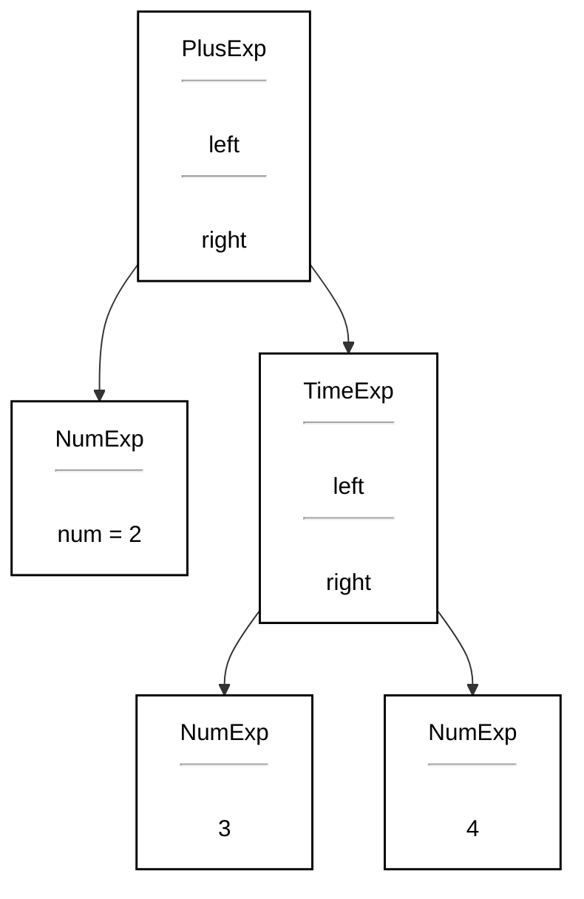

# Chapter 4 Abstract Syntax

## 4.0. 本章整体在讲什么

**编译器在完成语法分析时，不只是判断输入是否符合文法，还要把“结构化信息”（这里说的是中间语法树）保存下来，供后续语义分析、类型检查、IR 生成等阶段使用。** 


先讲 **Semantic Actions（语义动作）**，再讲 **Abstract Parse Trees / Abstract Syntax Tree（抽象语法树）**，最后讲 **Positions（源代码位置）**。

可以把这一章理解成这样一条主线：

> Token 流

> → Parser 按 concrete syntax 识别结构

> → 在识别过程中执行 semantic actions

> → 构造 AST

> → 后续阶段遍历 AST 做类型检查、翻译、报错定位

## 4.1 Semantic Actions


### 4.1.1. Parser 的基本职责

Parser（语法分析器）首先要判断：

- 输入句子是否属于某个文法定义的语言

也就是：

- token 流是否满足 grammar
- 程序的语法结构是否正确

但编译器不能只做到“识别”，编译器还必须做更有用的事情，例如：

- 构造抽象语法树（AST）
- 做语义分析（semantic analysis）
- 生成中间表示（IR, Intermediate Representation）

### 4.1.2. Semantic Actions 是什么

**语义动作**就是：当 parser 识别出某个短语、某条产生式时，顺手执行一些附加工作。

例如：

- 计算表达式的值
- 构造 AST 节点
- 填写符号表
- 产生 IR 指令


语义动作可以出现在：

- **Recursive Descent（递归下降分析器）**
- **Yacc-Generated Parsers（Yacc 自动生成的分析器）**

语法分析阶段不是一个纯“验证器”，它还常常是后续编译工作的入口。

### 4.1.3. Recursive Descent 示例

#### 4.1.3.1. 没有语义动作的递归下降分析器

文法：

```text
S → E $
E → T E′
E′ → + T E′
E′ → - T E′
E′ → ε
T → F T′
T′ → * F T′
T′ → / F T′
T′ → ε
F → id
F → num
F → (E)
```

递归下降分析器中“没有语义动作”的递归下降框架 `F()` 的代码框架：

```c
void F(void) {
    switch (tok) {
    case ID: { advance(); break; }
    case NUM: { advance(); break; }
    case LPAREN: { eat(LPAREN); E();
                   eatOrSkipTo(RPAREN, F_follow);
                   break; }
    case EOF:
    default:
        printf("expected ID, NUM, or left-paren");
        skipto(F_follow);
    }
}
```

- 如果当前 token 是 `ID`，接受它
- 如果是 `NUM`，接受它
- 如果是 `(`，那就匹配 `(E)`
- 否则报错并恢复

**目前 parser 只知道“对不对”，还不知道“值是多少”。**

这样可以判断是不是符合文法，但是：**如果我们希望在 parsing 的同时求值怎么办？**


`eatOrSkipTo`、`skipto`：是错误恢复用的，不是本页重点


#### 4.1.3.2. 在 Recursive Descent 中加入语义动作

> 如果需要在只能判断是不是正确语义的递归下降分析器中，加入判断语句类型的语义动作

把 `F()` 改成返回 `int`：

```c
int F(void) {
    switch (tok) {
    case ID: {
        int i = lookup(tokval.id);
        advance();
        return i;
    }
    case NUM: {
        int i = tokval.num;
        advance();
        return i;
    }
    case LPAREN: {
        eat(LPAREN);
        int i = E();
        eatOrSkipTo(RPAREN, F_follow);
        return i;
    }
    case EOF:
    default:
        printf("expected ID, NUM, or left-paren");
        skipto(F_follow);
        return 0;
    }
}
```

同时引入：

```c
union tokenval { string id; int num; ... };
enum token tok;
union tokenval tokval;
```

以及：

- `lookup(tokval.id)`：查变量值
- `tokval.num`：取数字 token 的值


原来 `F()` 是只负责识别 `id / num / (E)`

现在 `F()` 变成一边识别，一边返回这个因子的语义值


* `F -> id` 会做：
        ```c
        int i = lookup(tokval.id);
        advance();
        return i;
        ```
        意思是：当前 token 是一个变量名，符号表里查它的值，返回这个值

* `F -> num`
        ```c
        int i = tokval.num;
        advance();
        return i;
        ```
        意思是：当前 token 是数字，直接把数字值返回

* `F → (E)` 会发生：
    ```c
    eat(LPAREN);
    int i = E();
    eatOrSkipTo(RPAREN, F_follow);
    return i;
    ```
    意思是括
    


#### 4.1.3.3. 递归下降中的语义动作本质

在递归下降分析器中，语义动作可以是：

- 解析函数的**返回值**
    - `F()` 返回一个整数值
    - `E()` 返回一个表达式结果
    - `parseType()` 返回一个类型对象
- 这些函数的**副作用**
    
    函数虽然未必直接通过返回值传出结果，但它修改了外部状态。比如：

    - 更新符号表
    - 生成中间代码
    - 记录变量声明
    - 收集报错信息

    例子 `S -> id := num` 就很适合用副作用：

    - 匹配到赋值语句时
    - 直接更新变量表，把 `id` 变量当前的值设为 `num`


- 或两者都有

对每个终结符和非终结符，都可以关联一个“语义值类型”

这个类型用于表示：

- 该符号所派生出来的短语，对应的语义信息是什么

而且这个类型来自：

- 编译器实现语言本身
  比如 C 里的 `int`、`struct*`、`string` 等


每个符号都可以带语义值，比如：

- `NUM` token 的语义值可以是 `int`
- `ID` token 的语义值可以是字符串
- `exp` 非终结符的语义值可以是 `int`
- 以后如果构造 AST，`exp` 的语义值还可以是 AST 节点指针


#### 4.1.3.4. 解除左递归之后的困难

自然的规则：

```text
T -> T * F
```

语义动作很容易可以写成：

```c
int a = T();
eat(TIMES);
int b = F();
return a * b;
```

但问题是这种左递归的文法不适合直接递归下降。

对于改写后的右递归文法：

```text
E′ → + T E′
E′ → − T E′
T′ → * F T′
T′ → / F T′
```

- `T′` 自己并不知道左边已经算出的值是什么
- 但乘法需要左操作数和右操作数

语义动作怎么办？

所以需要把左边已经算出的值作为参数传给 `T′`。


```c
int T(void) {
    switch (tok) {
    case ID:
    case NUM:
    case LPAREN:
        return Tprime(F());
    default:
        print("expected ID, NUM, or left-paren");
        skipto(T_follow);
        return 0;
    }
}
int Tprime(int a) {
    switch (tok) {
    case TIMES:
        eat(TIMES);
        return Tprime(a * F());
    case PLUS:
    case RPAREN:
    case EOF:
        return a;
    default:
        ...
    }
}
```
在这段代码中：

- `T()` 先拿到第一个因子

    ```c
    return Tprime(F());
    ```

    意思是：

    - 先解析第一个 `F`
    - 得到它的值
    - 把它作为“当前累计结果”交给 `Tprime`

    比如表达式 `2 * 3 * 4`：

    - `F()` 先得到 `2`
    - 然后 `Tprime(2)`

- `Tprime(a)` 表示“当前已经算到 a 了”

如果看到 `*`：

```c
eat(TIMES);
return Tprime(a * F());
```

就是：

- 再读一个因子
- 把乘法结果并入累计值
- 继续往后处理

过程大概是：

- `Tprime(2)`
- 看到 `* 3`，变成 `Tprime(6)`
- 再看到 `* 4`，变成 `Tprime(24)`
- 到结尾返回 `24`


虽然文法形式是右递归，但计算方式其实是“累加器式”的：

```text
(((2 * 3) * 4))
```

它不是把结构算成：

```text
2 * (3 * 4)
```

而是每次都拿当前累计值 `a` 往前滚动，所以实现了左结合。


### 4.1.4. Yacc 规则写法：

#### 4.1.4.1. 基本语法

```yacc
%union { int num; string id; }
%token <num> INT
%token <id> ID
%type <num> exp
%left UMINUS

%%
exp: INT               { $$ = $1; }
   | exp PLUS exp      { $$ = $1 + $3; }
   | exp MINUS exp     { $$ = $1 - $3; }
   | exp TIMES exp     { $$ = $1 * $3; }
   | MINUS exp %prec UMINUS { $$ = -$2; }
```


- `{ ... }`：语义动作
- `$i`：右部第 `i` 个符号的语义值
- `$$`：左部非终结符的语义值
- `%union`：语义值可能有多种类型
- ``：指定终结符/非终结符使用哪种类型


##### Yacc 不是把动作写进函数，而是写在产生式后面

递归下降里，你会写：

```c
int E() { ... }
```

Yacc 里则是：

```yacc
exp: exp PLUS exp { $$ = $1 + $3; }
```

意思是：

- 如果按这条产生式归约成功
- 那么这个 `exp` 的语义值，等于左边 `exp` 的值加右边 `exp` 的值

##### `$1`、`$3`、`$$` 到底表示什么

对规则：

```yacc
exp: exp PLUS exp { $$ = $1 + $3; }
```

- `$1`：第一个 `exp` 的语义值
- `$2`：`PLUS` 的语义值（通常没什么用）
- `$3`：第三个符号 `exp` 的语义值
- `$$`：归约之后新得到的左部 `exp` 的语义值

##### `%union` 为什么需要

因为不同 token / nonterminal 可能带不同类型的数据：

- `INT` 带 `int`
- `ID` 带 `string`
- 某些非终结符可能带 AST 指针

所以要用 `%union` 把它们统一管理。

##### `%prec UMINUS`

这个用于处理**一元负号**优先级。
因为 `-x` 和 `a-b` 都用同一个 `MINUS` 符号，但语义和优先级不完全一样，所以用 `%prec UMINUS` 单独指定。


#### 4.1.4.2. 如何实现语义动作

Yacc 语法动作的底层机制：

- Yacc 生成的 parser 会维护一个**语义值栈**
- 这个栈与状态栈并行存在
- 当 parser 进行一次 reduction（归约）时：
    - 要执行对应的 C 语义动作

对于规则：

```text
A -> Y1 ... Yk
```

`$i` 是来自栈顶的这 `k` 个元素对应的语义值

归约时：

- 从符号栈里弹出 `Yk ... Y1`
- 同时从语义值栈里弹出这 `k` 个值
- 执行动作得到新值
- 再把 `A` 和它的新语义值压回去


##### 图解

在 Yacc（一种经典的语法分析器生成工具）中，分析 `1 + 2 * 3` 时，语法分析（Parsing）和语义动作（Semantic Actions）是如何同步进行的。


| 步骤 | 栈内容 (Stack) `[值, 符号]` | 剩余输入串 (Input) | 执行动作 (Action) |
| :-- | :--- | :--- | :--- |
| **1** | *(空)* | `1 + 2 * 3 $` | **shift** (移进 1) |
| **2** | `[1, INT]` | `+ 2 * 3 $` | **reduce** (归约为 exp) |
| **3** | `[1, exp]` | `+ 2 * 3 $` | **shift** (移进 +) |
| **4** | `[1, exp] [ , +]` | `2 * 3 $` | **shift** (移进 2) |
| **5** | `[1, exp] [ , +] [2, INT]` | `* 3 $` | **reduce** (归约为 exp) |
| **6** | `[1, exp] [ , +] [2, exp]` | `* 3 $` | **shift** (移进 *) |
| **7** | `[1, exp] [ , +] [2, exp] [ , *]` | `3 $` | **shift** (移进 3) |
| **8** | `[1, exp] [ , +] [2, exp] [ , *] [3, INT]` | `$` | **reduce** (归约为 exp) |
| **9** | `[1, exp] [ , +] [2, exp] [ , *] [3, exp]` | `$` | **reduce** (先算乘法：2*3 归约) |
| **10** | `[1, exp] [ , +] [6, exp]` | `$` | **reduce** (再算加法：1+6 归约) |
| **11** | `[7, exp]` | `$` | **accept** (解析成功，输出最终结果 7) |


| 动作阶段 | Yacc 伪代码/栈操作 | 深入原理解释 |
| :--- | :--- | :--- |
| **1. 计算语义值** | `$$ = $1 + $3` <br> `val = 1 + 6` | `$1` 代表第一个 `exp` 的值 (1)，`$3` 代表第二个 `exp` 的值 (6)。程序算出总和 `val = 7`，准备赋给左部 `$$`。 |
| **2. 弹栈清理 (pop)** | `<exp2, 6>` <br> `<+, NULL>` <br> `<exp1, 1>` | 归约发生时，将产生式右部的 3 个元素及其绑定的数值全部从解析栈中弹出废弃。 |
| **3. 结果压栈 (push)** | `<exp, val>` | 将归约生成的新符号 `exp`，连同刚刚算出的结果 `7`，作为一个全新的整体压入栈顶。这也就构成了第 11 步的最终状态。 |

### 4.1.5. Semantic Actions 小结


- 每个终结符和非终结符都可以关联自己的语义值类型，所以一条规则的动作必须产出正确类型。
    - `NUM` 可能是 `int`
    - `exp` 可能也是 `int`
    - 以后 `exp` 也可能是 `A_exp`（AST 节点指针）

- 对产生式：

```text
A -> B C D
```

语义动作必须返回一个值，其类型是 `A` 对应的类型
它可以由 `B、C、D` 的语义值构造出来

此外：

- LR parser 进行 reduction 以及对应语义动作的顺序是：
    - **deterministic and predictable**：确定和可预测的
    - **bottom-up, left-to-right traversal of the parse tree**：自底向上、从左到右遍历语法分析树
    - 虚拟的语法树遍历顺序是：
        - **postorder（后序）**： LR 归约也是这样：先把子结构规约完，再规约父结构，所以语义动作顺序和后序遍历很像


## 4.2 Abstract Parse Trees：抽象语法树

### 4.2.0. 为什么要抽象语法树

#### 4.2.0.1. 为什么需要语法树

- 理论上可以把整个编译器都塞进 Yacc 的语义动作里，语义检查语法检查都可以塞进语法动作的花括号里
- 但这样：
    - 难读
    - 难维护
    - 必须严格按“解析顺序”分析程序

一个例子（为什么“须严格按‘解析顺序’分析程序”是缺点）：

```c
void foo() { bar(); }
void bar() { ... }
```

先使用后定义在 C 语言中是很常见的，但是如果按照解析顺序分析，就会使语言的灵活性下降


于是提出改进目标：

- 把语法问题（parsing）和语义问题（type-checking / code generation）分开
- 一种解决办法是：
    - parser 先产生一棵 parse tree
    - 后续阶段再遍历它


#### 4.2.0.2. 为什么 concrete parse tree（具体语法树） 不好用。

##### concrete parse tree

- 对输入中每个 token，都有一个叶子节点
- 对每次按文法规则归约，都有一个内部节点

也就是它非常忠实地记录：

- 输入长什么样
- 文法怎么一步步匹配出来

但它不方便直接给后续阶段使用，因为：

- 有很多冗余、无用 token
    - 括号 token 例如 `(`、`)`
    - 为了表达优先级而引入的 `E/T/F`
    - 为了消左递归而产生的 `E' / T'`
- 占内存
- 过度依赖文法形式
    - 比如你为了适配 LL 分析，把文法重写了。
    - 程序语义没变，但 parse tree 结构可能大改。
    - 一旦文法改了，parse tree 结构也会跟着变
    - 后续类型检查器、IR 生成器不应该被迫跟着文法重写而一起重写。

一个 `2 + 3 * 4` 一类表达式的具体语法树，能看出树里有很多文法层次和括号相关节点。

语法

```text
E-> E+T | T
T->T* F | F
F-> n | ( E)
```

```mermaid
graph TD
    %% 定义节点并设置连线
    E_root["E"] --- E_left["E"]
    E_root --- op_mul["*"]
    E_root --- T_right["T"]

    E_left --- T_left["T"]
    T_left --- F_left["F"]
    F_left --- num2["2"]

    T_right --- F_right["F"]
    F_right --- lp["("]
    F_right --- E_inner["E"]
    F_right --- rp[")"]

    E_inner --- E_inner_L["E"]
    E_inner --- op_add["+"]
    E_inner --- E_inner_R["E"]

    E_inner_L --- T_inner_L["T"]
    T_inner_L --- F_inner_L["F"]
    F_inner_L --- num3["3"]

    E_inner_R --- T_inner_R["T"]
    T_inner_R --- F_inner_R["F"]
    F_inner_R --- num4["4"]

    %% 样式设置：去掉边框和背景，使其看起来像纯文本树
    classDef default fill:transparent, stroke:transparent, font-size:18px, font-weight:bold;
    %% 针对操作符和数字可以稍微调小一点字体，或者保持一致
```


### 4.2.1. abstract parse tree 的定义和作用：

抽象语法的作用

- 在 parser 和编译器后续阶段之间建立一个干净的接口

抽象语法不是给 parsing 用的

- parser 仍然用 concrete syntax 去识别输入
- 但 parser 可以据此构造出针对 abstract syntax 的 parse tree
- 这个树就是 **abstract syntax tree（AST）**

例如表达式语言：

- 具体语法：
    ```text
    E -> E + T | T
    T -> T * F | F
    F -> n | (E)
    ```

- 抽象语法：

    ```text
    E -> n
    | E + E
    | E * E
    ```

AST 表达的是：

- 程序短语结构
- 解析问题已经解决
- 但还没有做语义解释

课件用 `2 + 3 * 4` 画出 AST，根是 `+`，右子树是 `*`。

```mermaid
graph TD
    op_add["+"] --- num2["2"]
    op_add --- op_mul["*"]
    op_mul --- num3["3"]
    op_mul --- num4["4"]

    %% 样式设置：去掉边框和背景，放大字体，还原纯文本效果
    classDef default fill:transparent, stroke:transparent, font-size:28px, font-weight:bold;
```

什么叫“抽象”

- 把和语法识别相关、但和程序本质结构无关的部分去掉
- 只保留真正重要的程序结构

例如：

- 不再执着于 `E/T/F` 这种分层符号
- 不再保留多余括号 token
- 只保留“这是一个加法表达式”“这是一个乘法表达式”“这是一个数字”

AST 表示什么：

- 操作类型
- 组成关系
- 子结构关系

对 `2 + 3 * 4`：

- 根是 `+`
- 左子树是 `2`
- 右子树是 `3 * 4`

这就已经足够后续类型检查或代码生成使用了。

AST 不做“语义解释”，AST 只是告诉你：

- 结构是啥

它还没告诉你：

- 这个加法是否合法
- 类型是否兼容
- 结果寄存器怎么分配
- 最终机器码是什么

这些是后续阶段做的。

### 4.2.2. AST 的数据结构表示

给了一个表达式 AST 的 C 数据结构：

```c
typedef struct A_exp_ *A_exp;

struct A_exp_ {
    enum {A_numExp, A_plusExp, A_timesExp} kind;
    union {
        int num;
        struct {A_exp left; A_exp right;} plus;
        struct {A_exp left; A_exp right;} times;
    } u;
};

A_exp A_NumExp(int num);
A_exp A_PlusExp(A_exp left, A_exp right);
A_exp A_TimesExp(A_exp left, A_exp right);
```

对应的抽象语法是：

```text
E -> n
   | E + E
   | E * E
```

`typedef struct A_exp_ *A_exp` 表示：
- `A_exp` 是一个指向结构体 `A_exp_` 的指针
- 以后每个表达式节点都用 `A_exp` 表示

`kind` 表示“这个节点是什么种类”
```c
enum {A_numExp, A_plusExp, A_timesExp} kind;
```

也就是一个标签包含数字节点，加法节点，乘法节点

`union` 表示“不同 kind 用不同字段”

如果是：

- `A_numExp`，那就用 `u.num`
- `A_plusExp`，就用 `u.plus.left/right`
- `A_timesExp`，就用 `u.times.left/right`

工厂函数

```c
A_NumExp(...)
A_PlusExp(...)
A_TimesExp(...)
```

这些函数就是专门负责创建各类 AST 节点的构造器。


### 4.2.3. AST 构造函数


`A_PlusExp` 的实现：

```c
A_exp A_PlusExp(A_exp left, A_exp right) {
    A_exp e = checked_malloc(sizeof(*e));
    e->kind = A_plusExp;
    e->u.plus.left = left;
    e->u.plus.right = right;
    return e;
}
```


1. 分配节点空间

```c
A_exp e = checked_malloc(sizeof(*e));
```

创建一个新 AST 节点。

2. 设定节点类型

```c
e->kind = A_plusExp;
```

表明这是一个“加法表达式节点”。

3. 填左右孩子

```c
e->u.plus.left = left;
e->u.plus.right = right;
```

4. 返回节点

```c
return e;
```


另外两个函数也完全类似：

- `A_NumExp(int num)`
- `A_TimesExp(A_exp left, A_exp right)`

只是写入的字段不同。


### 4.2.4. 手工构造AST

算式  `2 + 3 * 4` 

```c
e1 = A_NumExp(2);
e2 = A_NumExp(3);
e3 = A_NumExp(4);
e4 = A_TimesExp(e2, e3);
e5 = A_PlusExp(e1, e4);
```

并强调：





先创建叶子：

- `2`
- `3`
- `4`

再创建：

- `3 * 4`

最后创建：

- `2 + (3 * 4)`


我们创建了：

- 一个 `PlusExp` 节点
- 它右边是一个 `TimesExp` 节点

但我们没有把它算成 `14`。
AST 只是结构表示，不是计算结果。


### 4.2.5. 自动构造 AST


- AST 可以由 Yacc 生成的 parser 或递归下降 parser 在解析 concrete syntax 时自动构造

并给出 Yacc 示例：

```yacc
%left PLUS
%left TIMES
%%
exp : NUM             { $$ = A_NumExp($1); }
    | exp PLUS exp    { $$ = A_PlusExp($1, $3); }
    | exp TIMES exp   { $$ = A_TimesExp($1, $3); }
```

parser 在归约时就可以顺便把 AST 拼出来。

```yacc
exp : NUM { $$ = A_NumExp($1); }
```
如果归约出一个数字表达式：就创建一个数字节点


```yacc
exp : exp PLUS exp { $$ = A_PlusExp($1, $3); }
```

左边子表达式和右边子表达式已经各自是 AST 了，那就直接把它们接成一个新的 `PlusExp` 节点。


```yacc
exp : exp TIMES exp { $$ = A_TimesExp($1, $3); }
```

同理创建乘法节点。


### 4.2.6. 位置（source position）

#### 4.2.6.1. 位置信息的意义

一遍编译器中，词法分析，语法分析，语义分析可能同时进行，如果此时发生类型错误，词法分析器当前保存的“当前位置”大致能拿来报错

因此一遍编译器里通常 lexer 维护一个全局“current position”

但如果编译器使用 AST 数据结构：

- 语法分析和语义分析不一定在同一遍完成
- 语义分析开始时，lexer 可能早就到文件末尾了

于是问题来了：如果后面做类型检查时发现错误，怎么知道错误在源代码哪个位置？

如果先 parse 完整个程序，再去遍历 AST 做类型检查：

- 此时 lexer 已经结束工作
- 你不能再靠“当前 token 位置”报错
- 所以必须把位置信息存下来

也就是说：

- AST 不仅要存“结构”
- 还要存“这个结构来自源码哪里”


#### 4.2.6.2. AST 节点要保存位置


- 每个 AST 节点都必须记住它对应的源文件位置

方法是：

- 在 AST 数据结构里加入 `pos` 字段

这个 `pos` 表示：

- 该抽象语法结构来自源代码中的哪个位置
    - 表达式节点有 `pos`
    - 语句节点有 `pos`
    - 变量节点有 `pos`
- 常见做法可能包括：
    - 行号
    - 列号
    - 起始 offset
    - 结束 offset

然后讲如何设置这些 `pos`：

1. lexer 必须把每个 token 的起始/结束位置传给 parser
2. parser 再把这些位置信息传入语义动作中，填到 AST 节点里


#### 4.2.6.3. 如何在 Yacc 中传位置

理想情况

- parser 维护一个**位置栈**,和语义栈一样,但是储存了每个 token 的位置
- 与语义值栈并行
- 每个符号的位置都可供语义动作使用

但是:

- **Bison 可以** 这么做
- **Yacc 不行**, 因为老 Yacc 没直接提供这个能力，所以要手工补一层。

Yacc 的一种解决办法: 定义一个非终结符 `pos`，其语义值就是一个 source location

示例：

```yacc
%{ extern A_OpExp (A_exp,A_binop,A_exp,position); %}
%union { int num; string id; position pos; ... };
%type <pos> pos

pos: { $$ = EM_tokpos; }

exp: exp PLUS pos exp
    { $$ = A_OpExp($1, A_plus, $4, $3); }
```

这里 `pos` 非终结符专门捕获 `PLUS` 的位置。

- `pos: { $$ = EM_tokpos; }`
- 在这个位置上，取当前 token 的位置
- 把它作为 `pos` 的语义值


然后规则写成：

```yacc
exp: exp PLUS pos exp
```

这样 `$3` 就不是普通表达式，而是：

- `PLUS` 这个操作符在源码中的位置

于是构造 AST 节点时：

```yacc
$$ = A_OpExp($1, A_plus, $4, $3);
```

参数含义大致是：

- 左操作数 `$1`
- 操作类型 `A_plus`
- 右操作数 `$4`
- 位置 `$3`
