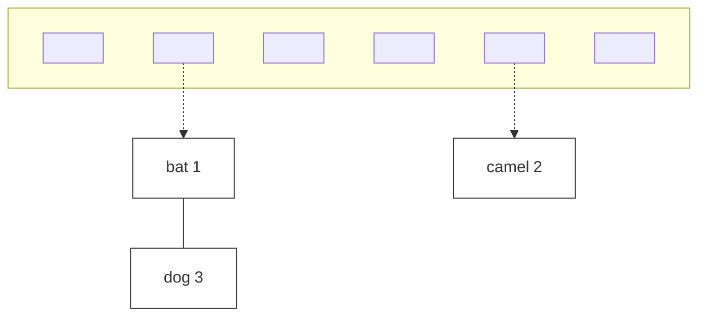
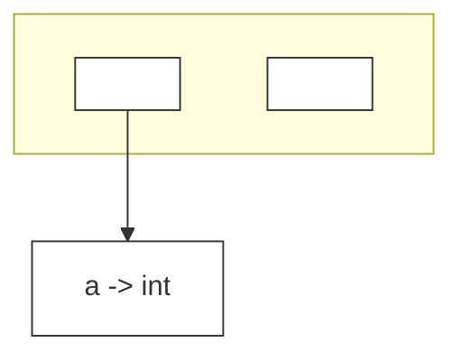
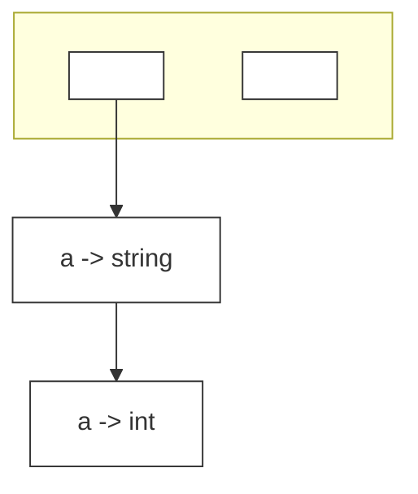
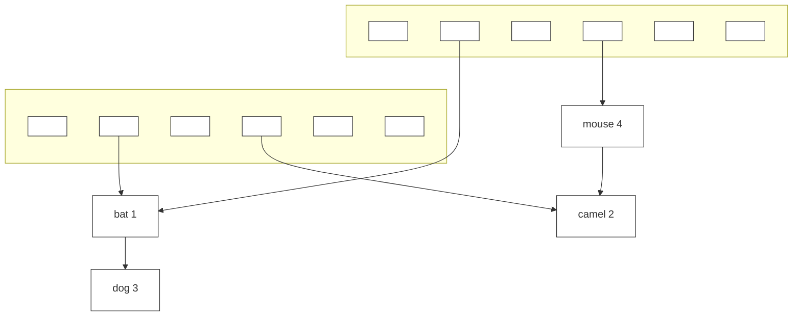
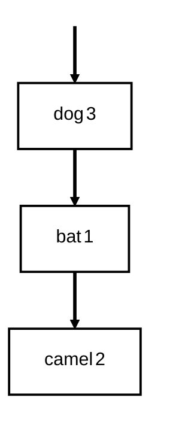
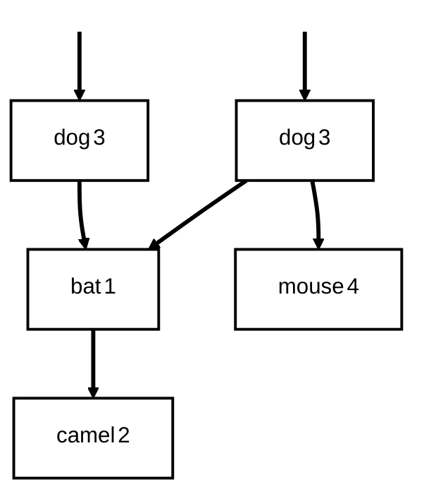

# Chapter 5 语义分析（Semantic Analysis）

## 5.0. 为什么需要语义分析？

### 5.0.1. 语义分析的任务

在编译器里，前面已经做过：

1. **词法分析**：把字符流切成 token
2. **语法分析**：根据文法把 token 组织成语法树 / 抽象语法树（AST）

但到了这里，编译器还不能马上生成代码。因为仅靠语法，很多“程序是否正确”的问题根本看不出来。

语义分析主要做两类事：

- **检查程序在“意义”上是否正确**
    - 变量有没有先声明后使用
    - 表达式类型是否匹配
    - 函数调用参数是否匹配
    - 作用域、可见性是否正确
- **为后续阶段准备更规整的信息**
    - 把 AST 转成更适合生成机器码的中间表示（IR）

这一章核心围绕 3 个主题展开：

1. **Symbol Tables（符号表）**
2. **Symbols in the Tiger Compiler（Tiger 编译器里的 symbol 设计）**
3. **Type Checking（类型检查）**

### 5.0.1. 语法分析的局限性 


> **很多程序正确性问题，不能靠语法分析决定。**

例如这个文法:

```txt
S -> Decl Stmt
Decl -> Type id ; | Decl; Decl
Type -> string | int
Stmt -> Stmt; Stmt | id = Exp | ...
Exp -> Exp + Exp | id | num | ...
```

`Decl` 规则允许声明多个变量，`Stmt` 规则允许多个语句

程序示例：

```txt
string x; int z;
x = "hello world";
z = x + 1
```

这个程序“语法上可能没问题”:

- `string x; int z;` 是声明
- `x = "hello world";` 是赋值语句
- `z = x + 1` 也是一个赋值语句
- `x + 1` 也匹配 `Exp + Exp`

所以**语法分析器**可能会接受它。

但它其实有语义错误,因为：

- `x` 的类型是 `string`
- `1` 的类型是 `int`
- `x + 1` 在这里就不成立（字符串和整数不能直接做整数加法）

所以这里说明：

- 语法分析能做的
    - 判断程序结构是否符合文法
    - 括号、分号、关键字位置是否合理
    - 表达式结构是否合法

- 语法分析不能做的

    - 变量声明类型和赋值类型是否匹配
    - 数组是否越界
    - 变量应该放在栈上还是堆上

因为这些都涉及：名字绑定/类型信息/值相关约束/作用域信息,而不是仅仅看语法对不对。


### 5.0.2. The Semantic Analysis Phase（语义分析阶段）

#### 5.0.2.1. 语义分析的正式任务。

编译器会通过 **AST（抽象语法树）** 去确定程序的一些**静态属性（static properties）**，包括：

- 名字的作用域和可见性
    - 这个变量名在这里能不能看见？
    - 这个变量是否声明在使用之前？

- 变量、函数、表达式的类型
    - `a + b` 的结果类型是什么？
    - `if` 条件是不是布尔/整数（视语言而定）
    - 函数返回值类型是否正确

    - 每个表达式是否有合适类型
        - `3 + 4` 没问题
        - `"hello" + 4` 可能有问题
        - 数组下标是不是整数

    - 函数调用是否符合定义

        - 函数参数个数是否匹配
        - 参数类型是否匹配
        - 返回值是否被正确使用

- 把 AST 翻译成更简单的中间表示 IR, 也就是说，语义分析不仅“检查”，还会“整理”为一个更简单的表示。


## 5.1. Symbol Tables（符号表）

> 怎么检查静态性质

使用“符号表”。

### 5.1.1. 什么是符号表？

语义分析阶段最典型的特征之一，就是：

> **维护从标识符（identifier）到其属性信息的映射。**

比如：

- 变量 `x` 映射到“它的类型是 int，需要访问内存中的某个偏移，值是什么”
- 函数 `f` 映射到“它的参数类型列表、返回值类型”
- 类型名 `a` 映射到“它代表某个类型对象”


#### 5.1.1.1. Binding（绑定）

绑定

- 给一个符号（名字）赋予某种含义
- 用 `↦` 表示“映射到”

例如：

```txt
g ↦ string
a ↦ int
```

意思是：

- `g` 绑定到 `string`
- `a` 绑定到 `int`

#### 5.1.1.2. Environment（环境）

环境就是一组绑定。

例如：

```txt
σ0 = {g ↦ string, a ↦ int}
```

表示当前程序点上，编译器“知道”：

- `g` 是 string
- `a` 是 int

#### 5.1.1.3. Symbol Table（符号表）


**environment 是概念层面的**，**symbol table 是程序实现层面的数据结构**

语义分析器在遍历 AST 时，会不断维护符号表。

也就是说，遍历语法树是：

- 一边走
- 一边看当前作用域有哪些名字
- 一边插入新声明
- 一边查已有名字
- 一边在进入/退出作用域时更新环境


#### 5.1.1.4. Motivating Example of Symbol Tables（符号表例子 1）

这一页开始用一个 Tiger 风格例子说明符号表怎么变化。

程序：

```pascal
function f(a:int,b:int,c:int)=
(
  print_int(a+c);
  let
    var j := a+b
    var a := "hello"
  in
    print(a); print_int(j)
  end;
  print_int(b)
)
```

课件设：

- 进入第一行之前环境是 `s0`

经过 `function f(a:int,b:int,c:int)=`

函数 `f(a:int,b:int,c:int)` 的参数进入函数体后可见

```txt
s1 = s0 + {a ↦ int, b ↦ int, c ↦ int}
```

经过 `var j := a+b`

在 `let var j := a+b ...` 时，因为 `a+b` 是两个 int 相加，所以 `j` 推出为 int，于是：

```txt
s2 = s1 + {j ↦ int}
```

先检查初始化表达式 `a+b`，得到这个表达式类型为 `int`，再把 `j ↦ int` 插入环境，变量类型有时来自显式声明，有时来自初始化表达式推导。


在 `let` 里又声明了：

```pascal
var a := "hello"
```

加入：

```txt
s3 = s2 + {a ↦ string}
```

这里又出现了一个 `a`，但它不是原来函数参数那个 `a:int`，而是一个**新的局部变量 `a:string`**。

`s2` 里已经有 `a ↦ int`，那么 `s3` 里的 `a` 绑定是什么？

```txt
a ↦ string
```

并且它会**覆盖（override）**原来的 `a ↦ int`。

也就是说，在当前更内层作用域里：

- 查 `a` 时，先看到最近插入的 `a ↦ string`
- 外层那个 `a ↦ int` 仍然存在，但被遮住了


`X + Y` 不等于 `Y + X`，因为环境相加不是普通交换律的加法，而是：

- 右边新的绑定优先
- 后插入的同名绑定遮蔽前面的

所以：

```txt
s2 + {a ↦ string}
```

和

```txt
{a ↦ string} + s2
```

语义不一定一样，因为同名变量会遮蔽。

**作用域结束后，要把局部绑定丢掉**：对于 `let D in E end`，在 `D` 中声明的标识符，从其声明处开始可见，直到 `end` 结束。

在这个例子中：

- `j`
- 内层 `a:string`

都只在 `let ... in ... end` 内可见。

当分析到 `end` 时：

- `s3` 被丢弃
- 恢复到 `s1`

然后第 7 行 `print_int(b)` 里查 `b`，就在 `s1` 中查。

### 5.1.2. The Interface of Symbol Tables（符号表接口）

符号表至少要支持四个基本操作：

- `insert`：向表中插入一个绑定

- `lookup`：查某个名字绑定到什么信息

- `beginScope`：进入一个新作用域

- `endScope`：退出当前作用域，并恢复到进入前状态


### 5.1.3. Multiple Symbol Tables（多个符号表）

某些语言中可能同时存在多个活跃环境。


#### 5.1.3.1. Java 例子

用 Java 的 package / class 例子说明：

```java
package M;
class E { 
  static int a = 5; 
}
class N { 
  static int b = 10; 
  static int a = E.a + b; 
}
class D { 
  static int d = E.a + N.a; 
}
```

每个类/模块可以有自己的符号表

比如：

- `E` 有表 `s1 = { a ↦ int }`
- `N` 有表 `s3 = { b ↦ int, a ↦ int }`
- `D` 有表 `s5 = { d ↦ int }`

然后外层包 `M` 的环境记录：

- s2 = { E ↦ s1 }
- s4 = { N ↦ s3 }
- s6 = { D ↦ s5 }

组合成更大环境 `s7 = s2 + s4 + s6`

名字可以映射到“另一个符号表”

- 类名 / 模块名 -> 它自己的成员表

也就是：

```txt
E ↦ s1
N ↦ s3
D ↦ s5
```

所以符号表的 value 不一定只是“一个类型”，也可能是“另一个环境”。

在 Java 中，forward reference is allowed

- 在编译某个类时，其他类即便在源程序后面，也可以已经被放进整体环境中
- 所以 `E, N, D` 都可以在环境 `s7` 中编译

最终结果是：

```txt
{M ↦ s7}
```

#### 5.1.3.2. ML 例子

用 ML 的 `structure` 说明同一个思想。

```ml
structure M = struct 
  structure E = struct 
    val a = 5; 
  end 
  structure N = struct 
    val b = 10 
    val a = E.a + b 
  end 
  structure D = struct 
    val d = E.a + N.a
  end 
end
```

```text
s1 = { a ↦ int }
s2 = { E ↦ s1 }
s3 = { b ↦ int , a ↦ int }
s4 = { N ↦ s3 }
s5 = { d ↦ int }
s6 = { D ↦ s5 }
s7 = s2 + s4 + s6
```

每个 class / structure 有自己的符号表。

### 5.1.4. Implementing Symbol Tables（实现符号表）

#### 5.1.4.1.  Imperative Style（命令式 / 破坏式更新）

思路：

- 直接修改现有表 `s1`，让它变成 `s2`
- 当 `s2` 活着时，原来的 `s1` 不再原样存在
- 退出作用域时，再“撤销修改”恢复 `s1`

这通常意味着：

- 一个全局环境
- 再加一个 undo stack（撤销栈）


#### 5.1.4.2. Functional Style（函数式 / 持久化）

思路：

- 不改旧表 `s1`
- 生成一个新表 `s2`、`s3`
- 原表 `s1` 始终保持不变

优点：

- 恢复旧环境非常容易
- 更符合函数式语言思想


### 5.1.5. Efficient Imperative Symbol Tables（高效实现命令式符号表）


#### 5.1.5.1. 思路

因为程序里可能有成千上万个标识符，所以**查找必须高效**

* lookup 要快

    - 使用 **Hash Table（哈希表）**实现插入操作

* deletion 要方便实现哈希表删除操作

    - **Hash Table with external chaining（外部链式哈希）**，每个数组（哈希表）项都是一个链表表头
    - 因为同一个名字在不同作用域可能重复出现，比如：

        - 外层 `a ↦ int`
        - 内层 `a ↦ string`

      - 用链表挂在同一个哈希桶里，可以自然形成：

        ```mermaid
            graph TD
            %% 定义样式：去除背景色，保持边框
            classDef default fill:#fff,stroke:#333,stroke-width:1px;
            %% 模拟图片中的数组/桶结构
            subgraph Bucket [ ]
                direction LR
                Slot1[ ]
                Slot2[ ]
            end

            %% 数据节点
            Node1[a -> string]
            Node2[a -> int]

            %% 连接关系
            Slot1 --> Node1
            Node1 --> Node2
        ```

        这样和作用域嵌套非常契合：

        - 查找时，先看到内层最新的绑定
        - 退出作用域时，只要把链表头弹掉，就恢复外层绑定

得出形如这样的结构：



#### 5.1.5.2 Efficient Imperative Symbol Tables 代码实现

##### 链表节点

```c
struct bucket {
  string key;
  void *binding;
  struct bucket *next;
};
#define SIZE 109
struct bucket *table[SIZE];
```

`key`：标识符名字，比如 `"a"`、`"x"`、`"print"`

`binding`：这个名字对应的信息。用 `void *` 是为了通用：

  - 可以指向类型信息
  - 可以指向变量信息
  - 可以指向函数信息

`next`：链到同一个桶里的下一个元素，用来处理哈希冲突，也支持同名遮蔽


##### 哈希函数

```c
unsigned int hash(char *s0)
{
  unsigned int h=0; char *s;
  for(s=s0; *s; s++)
    h=h*65599 + *s;
  return h;
}
```

- 把字符串映射成整数哈希值（字符串可视作多项式形式来累计哈希值）
- 再用 `% SIZE` 得到数组下标


##### `Bucket(...)` 构造函数

```c
struct bucket *Bucket (string key, void *binding, struct bucket *next) {
  struct bucket *b=checked_malloc(sizeof(*b));
  b->key = key;
  b->binding = binding;
  b->next = next;
  return b;
}
```

- 新建一个桶节点
- 填好 key / binding / next


##### 插入函数：

```c
void insert(string key, void *binding) {
  int index=hash(key)%SIZE;
  table[index]=Bucket(key, binding, table[index]);
}
```

**把新绑定插到桶链表最前面。**

例如本来已经有：

```txt
a ↦ int
```

现在进入内层作用域又声明：

```txt
a ↦ string
```




插入后变成：



lookup 总是从前往后找，所以最近声明的那个 `a` 会最先被找到，也就实现了内层遮蔽外层，这和作用域规则完全一致。


##### 查找函数：

```c
void *lookup(string key) {
  int index=hash(key)%SIZE
  struct bucket *b;
  for (b = table[index]; b; b=b->next)
    if (0==strcmp(b->key,key))
      return b->binding;
  return NULL;
}
```


1. 算哈希桶下标

    ```c
    index = hash(key) % SIZE
    ```

2. 沿该桶链表往下找

    ```c
    for (b = table[index]; b; b=b->next)
    ```
    因为插入时总把新绑定放在链表前面，所以如果有：`<a, string> -> <a, int>`，查 `a` 时，第一个就命中 `a ↦ string`。

3. 比较名字是否相同

    ```c
    strcmp(b->key, key) == 0
    ```

4. 找到就返回绑定

    ```c
    return b->binding;
    ```

5. 找不到就返回 `NULL`


##### 弹出函数：

```c
void pop(string key) { 
  int index=hash(key)%SIZE
  table[index]=table[index].next; 
}
```
它把某个桶链表的**第一个节点去掉**。

如果当前是：


执行 `pop(a)` 后就变成：


也就是把内层作用域的绑定撤销，恢复到外层绑定。

插入和弹出是“栈式”的（stack-like），也就是说：

- 新声明：push 到最前面
- 作用域结束：pop 掉最近那层

这正好对应嵌套作用域的后进先出结构。

`pop(key)` 本身只知道“把该 key 的当前头结点弹掉”。

那编译器怎么知道**退出某个作用域时，到底该 pop 哪些 key**？

这个问题后面 Tiger 的实现会专门解决。


### 5.1.6. Efficient Functional Symbol Tables（高效函数式符号表 ）


现在开始看函数式风格，目标是在 `s' = s + {a ↦ τ}` 但要求：

- 旧表 `s` 还要能继续使用
- 不能被修改

也就是说要“保留旧版本”。

最简单的思路是在在原哈希表对应桶上直接接一个，那么原来的符号表就被破坏了。

一个简单的改进思路是我们可以复制数组（哈希表），共享旧 bucket，



但因为哈希表的数组通常很大，这不高效。如果每次加一个绑定都要复制整个数组，即使只改一个位置，成本也很高。

普通哈希表不太适合高效做“持久化版本”的函数式环境。所以需要换数据结构。

search trees（二叉搜索树）可以高效地做函数式插入。每个节点放一个绑定，按照字符串比较顺序组织。

`m1` 是一棵树



`m2 = m1 + {mouse ↦ 4}` 后生成新树 `m2`，但不是整棵树全复制，只复制从根到插入位置父节点这条路径上的节点，其余没变的子树可以共享。



对平衡树，lookup 是 `O(log n)`，前提是树是平衡的。


### 5.1.7. Implementation of Symbol Tables（符号表实现总结）

命令式风格

- 进入作用域后，用副作用直接加绑定
- 旧表被改掉了
- 退出作用域时，靠辅助信息把旧表恢复出来

函数式风格

- 进入作用域后，通过旧环境构造新环境
- 旧表保持不变
- 退出作用域时，直接拿回旧表即可

## 5.2. Symbols in the Tiger Compiler

### 5.2.1. Issue with Table Implementations（表实现的问题）

一个性能问题：lookup 时需要做昂贵的字符串比较

在前面的 `lookup` 里有：

```c
strcmp(b->key, key)
```

如果标识符很多、查找很频繁，字符串比较会比较慢。所以要把字符串转换成 symbol：

- 每个 symbol 对象关联一个整数值
- 相同字符串的所有出现都映射到同一个 symbol
- 不同字符串映射到不同 symbol

以后就不必反复比较，而是比较：

- 指针是否相等
- 或整数编号是否相等

这会快很多：

- 提取整数 hash-key 很快：对于哈希表，可以直接把 symbol 指针当成整数 hash-key 使用。
- 相等比较很快：只要比较指针或整数 ID，不用逐字符比较字符串。
- 大小比较也很快：如果用于二叉搜索树，可以快速决定顺序关系。


### 5.2.2. Symbols in The Tiger Compiler（Tiger 里的接口）

给出 Tiger 编译器中 symbol 和 symbol table 的接口。

```c
typedef struct S_symbol_ *S_symbol;
S_symbol S_symbol (string);
string S_name(S_symbol);
```

- `S_symbol`：symbol 类型
- `S_symbol(string)`：把字符串转成 symbol
- `S_name(sym)`：把 symbol 取回原字符串名字

符号表接口

```c
typedef struct TAB_table_ *S_table;
S_table S_empty(void);
void S_enter(S_table t,S_symbol sym, void *value); 
void *S_look(S_table t, S_symbol sym);
void S_beginScope(S_table t); 
void S_endScope(S_table t);
```

因为编译器不同地方对“绑定值”有不同需求：

- 类型环境：symbol -> type
- 值环境：symbol -> 变量信息 / 函数信息

所以做成泛型接口 `value` 是 `void *`最方便。

### 5.2.3. The Implementation of Symbols（symbol 的实现）

#### 5.2.3.1.  构造函数

代码核心：

```c
S_symbol S_symbol (string name) {
  int index = hash(name)%SIZE;
  S_symbol syms = hashtable[index], sym;
  for (sym = syms; sym; sym = sym->next)
    if (0 == strcmp(sym->name, name)) return sym;
  sym = mksymbol(name,syms);
  hashtable[index] = sym;
  return sym;
}
```

代码流程：

- 看这个字符串以前有没有对应 symbol，到 `hashtable[index]` 链表里找
- 如果找到了，直接返回已有的 symbol 对象
- 如果没找到，创建一个新的 symbol 节点，插入哈希表，再返回，这就保证了**同一个字符串永远对应同一个 symbol 对象。**

于是比较两个标识符名字是否一样不再需要频繁比较字符串内容，只需比较 symbol 指针


#### 5.2.3.2. `S_name`

```c
string S_name (S_symbol sym) {
  return sym->name;
}
```

作用：从 symbol 取回原名字，通常用于报错信息显示。


### 5.2.4. The Implementation of Symbol Tables（Tiger 符号表实现）

Tiger 编译器在 C 中采用的是：**destructive-update environments（破坏式更新环境）**，也就是前面说的命令式风格。

代码：

```c
S_table S_empty(void) {
  return TAB_empty(); 
}
void S_enter(S_table t, S_symbol sym, void *value){ 
  TAB_enter(t,sym,value);
} 
void *S_look(S_table t, S_symbol sym) { 
  return TAB_look(t,sym); 
}
```


Tiger 把真正的底层哈希表功能封装在一个通用模块 `TAB` 里：

- `TAB_empty`
- `TAB_enter`
- `TAB_look`

而 `S_...` 是在其上封装的符号层接口。


```c
static struct S_symbol_ marksym = { "<mark>", 0 };

void S_beginScope ( S_table t) { 
  S_enter(t, &marksym, NULL); 
}

void S_endScope( S_table t) {
  S_symbol s;
  do
    s = TAB_pop(t); 
  while (s != &marksym);
}
```

实现作用域的关键技巧：**marker（标记）**

- `beginScope` 作用域开始时，往表里插入一个特殊符号 marker
- `endScope`：不断 `pop`，直到弹出 marker 为止

这意味着：

- 当前作用域里声明的所有名字，都是在这个 marker 之后压进去的
- 所以弹到 marker 为止，恰好把该作用域所有绑定撤掉


前面我们问：退出作用域时，编译器怎么知道该 pop 哪些 key？

答案就是：通过一个辅助的“插入顺序栈”，并用 marker 划分作用域边界。

为了能精确地在 `beginScope` 之后把对应绑定都弹掉，需要一个 auxiliary stack（辅助栈）

- 这个栈记录符号被 push 进符号表的顺序

- 一个 symbol 在辅助栈里被弹出时，它在对应哈希桶链表里的头绑定也会被移除

```c
struct TAB_table_ {
  binder table[TABSIZE];
  void *top;
};
```

这里的 `top` 表示最近绑定进去的 symbol。

插入时：

```c
t->table[index] = Binder(key, value, t->table[index], t->top);
```

`Binder` 结构中多了一个：

```c
prevtop
```

代码：

```c
static binder Binder(void *key, void *value, binder next, void *prevtop) {
  binder b = checked_malloc(sizeof(*b));
  b->key = key;
  b->value = value;
  b->next = next; 
  b->prevtop = prevtop;
  return b;
}
```

每个 binder 除了记录 `key`、 `value`、`next`，还记录 `prevtop`，这样就把“辅助栈”信息直接嵌入 binder 节点里了。

也就是说：
- 哈希桶链表负责按 key 找绑定
- `top / prevtop` 链负责按插入顺序回退作用域


## 5.3 类型检查（Type Checking）

### 5.3.1. Key Problems in Type Checking（类型检查的关键问题）

1. 什么是合法的类型表达式？

    例如：

    - `int`
    - `string`
    - `nil`
    - `array of int`
    - 记录类型等

2. 两个类型“等价”是什么意思？

    比如：

    - 名字不同但结构一样，算不算同一种类型？
    - `type a = {x:int, y:int}` 和 `type b = {x:int, y:int}` 是否相等？

3. 类型检查规则是什么？

    例如：
    - `+` 两边必须是 int 吗？
    - 赋值左右两边必须完全相同吗？
    - 函数实参与形参怎么匹配？


### 5.3.2. Types in Tiger Programming Language（Tiger 语言 的类型）

Tiger 里有两大类类型：

1. Primitive type（基本类型）

    - `int`
    - `string`

2. Constructed type（构造类型）

    - record（记录）
    - array（数组）

    这些构造类型可以由已有类型再构造出来。

规则如下：

```txt
typec -> type type-id = ty
ty -> type-id
   -> '{' tyfields '}'
   -> array of type-id
tyfields -> ε
         -> id: type-id {, id:type-id}
```

意思是 Tiger 的类型定义支持：

* 类型别名/基本类型

    ```tig
    type b = a
    ```

* 记录类型

    ```tig
    type a = {x:int, y:int}
    ```

* 数组类型

    ```tig
    type arr = array of int
    ```

例如：

```tig
let
  type a = {x: int, y: int}
  type b = a
  var i : a := ...
  var j : b := ...
in
  i := j
end
```

这个例子后面会结合“类型等价”来解释是否合法。


C 语言实现 Tiger 类型系统的代码大致如下：

```c
typedef struct Ty_ty_ *Ty_ty;
struct Ty_ty_ {
  enum {Ty_record, Ty_nil, Ty_int, Ty_string,
        Ty_array, Ty_name, Ty_void} kind;
  union {
    Ty_fieldList record;
    Ty_ty array;
    struct {S_symbol sym; Ty_ty ty;} name;
  } u;
};
```

kind 记录类型：

- `Ty_record`：记录类型
- `Ty_nil`：nil 类型
- `Ty_int`：整数类型
- `Ty_string`：字符串类型
- `Ty_array`：数组类型
- `Ty_name`：类型名（别名或占位名）
- `Ty_void`：无返回值类型（通常函数没有返回值时用）


```tig
type list = {first: int, rest: list}
```

这里 `list` 在自己的定义里又用到了 `list`。

所以需要先放一个占位：

```c
Ty_Name(sym, NULL)
```

先知道有个类型名 `sym`，但它真正指向的类型 `ty` 以后再补上


### 5.3.3. Type Equivalence（类型等价）

类型等价有两种经典定义：

1. Name Equivalence（名字等价，NE）

    两个类型等价，当且仅当：

    > 它们是**完全同一个类型名字**，并且来自同一条类型定义。

    也就是“按名字认类型”。

2. Structural Equivalence（结构等价，SE）

    两个类型等价，当且仅当：

    > 它们由相同的类型构造器按相同顺序组成。

    也就是“按结构认类型”。

Tiger 采用名字等价

- 不是看长得像不像
- 而是看是否真的是“同一个类型名体系”


#### 5.3.3.1. Type Equivalence in Tiger（Tiger 中的类型等价）

例子 1：非法

```tig
let
  type a = {x: int, y: int}
  type b = {x: int, y: int}
  var i : a := ...
  var j : b := ...
in
  i := j
end
```

虽然 `a` 和 `b` 的结构完全一样，都是 `{x:int, y:int}`，但在 Tiger 中，每个 record type expression 都会创建一个新的、不同的记录类型，所以 `a` 和 `b` 不是同一个类型，`i := j` 非法


例子 2：合法

```tig
let
  type a = {x: int, y: int}
  type b = a
  var i : a := ...
  var j : b := ...
in
  i := j
end
```

这里 `b` 不是新建一个结构相同的记录类型，而是：

- `b` 直接是 `a` 的别名

所以 `a` 和 `b` 等价，赋值合法。

### 5.3.4. Namespaces in Tiger（Tiger 的名字空间）

Tiger 有两个独立的命名空间：

* Types（类型名空间）：放类型名字
* Functions and variables（函数/变量名空间）：放变量名和函数名


```tig
let
  type a = int
  var a := 1
in ...
end
```

这里两个 `a` 都能同时存在，因为：

- 一个在类型名空间
- 一个在值名空间


```tig
let
  function a (b: int) = ...
  var a := 1
in ...
end
```

这里变量 `a` 会隐藏函数 `a`（在值空间中发生遮蔽）。

区分命名空间：

- 语法里能根据上下文判断 `a` 是在当类型名用，还是在当变量/函数名用
- 语言会更灵活


### 5.3.5. Environments for Type Checking（类型检查所需环境）

Tiger 维护两个环境：

* Type environment（类型环境）

    映射：

    ```txt
    symbol -> Ty_ty
    ```

    也就是：

    - 类型名 -> 类型对象

* Value environment（值环境）

    有两类绑定：

    变量

    ```txt
    symbol -> Ty_ty
    ```

    变量名 -> 它的类型

    函数

    ```txt
    symbol -> {Ty_tyList formals, Ty_ty result;}
    ```

    函数名 -> 参数类型列表 + 返回类型

怎么知道哪个 `a` 是类型，哪个 `a` 是变量？根据语法上下文

例如：

```tig
let
  type a = int
  var a: a := 5
  var b: a := a
in
  b + a
end
```

这里：

- `var a: a := 5` 中，冒号后的 `a` 一定是类型名
- `:= a` 里的 `a` 一定是变量
- `b + a` 里的 `a` 也是变量

所以语法位置决定去哪个环境查。

#### 5.3.5.1. Environments（值环境条目结构）代码

```c
typedef struct E_enventry_ *E_enventry;
struct E_enventry_ {
  enum {E_varEntry, E_funEntry} kind;
  union {
    struct {Ty_ty ty;} var;
    struct {Ty_tyList formals; Ty_ty result;} fun;
  } u;
};
```


值环境里并不是只放类型，而是放一个“环境条目”：

* 如果是变量条目 `E_varEntry`

    里面有：

    - 变量类型 `ty`

* 如果是函数条目 `E_funEntry`

    里面有：

    - 参数类型列表 `formals`
    - 返回值类型 `result`

    还定义了构造函数：

    ```c
    E_enventry E_VarEntry(Ty_ty ty); 
    E_enventry E_FunEntry(Ty_tyList formals, Ty_ty result);
    ```

    以及基础环境：

    ```c
    S_table E_base_tenv(void); /* Ty_ty environment */
    S_table E_base_venv(void); /* E_enventry environment */
    ```


### 5.3.6.Type-Checking for Tiger（Tiger 类型检查总入口）

课件说 Tiger 的 `Semant` 模块负责语义分析，包括类型检查。

有四个递归处理 AST 的核心函数：

```c
struct expty transVar (S_table venv, S_table tenv, A_var v);//处理变量/lvalue
struct expty transExp (S_table venv, S_table tenv, A_exp a);//处理表达式
void transDec (S_table venv, S_table tenv, A_dec d);//处理声明
Ty_ty transTy (S_table tenv, A_ty a);//处理语法中的类型表达式，把它翻译成内部 `Ty_ty`
```


### 5.3.7. 为tiger做类型检查

后面要展开的类型检查对象：

1. 表达式
2. 声明
    - 变量声明
    - 类型声明
    - 函数声明
    - 递归声明

#### 5.3.7.1. 表达式类型检查

`transExp` 的职责：

- 查询环境
- 必要时更新环境
- 返回表达式类型

输入参数：

- `venv`：值环境
- `tenv`：类型环境
- `a`：表达式 AST

输出结果：

- 翻译后的表达式
- 它的类型

例如为了检查 `a + b`：

1. 分别递归检查 `a`
2. 分别递归检查 `b`
3. 确认它们都是 int
4. 整个表达式类型也是 int


##### 以加法表达式为例

判断用的代码大意为：

```c
case A_opExp: {
  // 检查左右表达式是否正确，并获得两个表达式的类型
  left = transExp(...left...);
  right = transExp(...right...);
  if (oper == A_plusOp) {//如果类型一样就返回
    if (left.ty->kind != Ty_int) 
    	error("integer required");
    if (right.ty->kind != Ty_int) 
    	error("integer required");
    return expTy(NULL, Ty_Int());
  }
}
```

注意对于 Tiger 的 `e1 + e2`：
- `e1` 必须是 `int`
- `e2` 必须是 `int`

正确时结论应当为：
- `e1 + e2` 的类型是 `int`

如果不满足报错：

- `integer required`

但编译器往往还会返回一个默认类型（这里返回 `Ty_Int()`），这样可以继续分析后续代码，而不是一报错就完全停掉。这是编译器错误恢复中的常见策略。


##### 以 Type-Checking Variables, Subscripts and Fields（变量、下标、字段）为例


l-value ：

```txt
lvalue → id
       → lvalue . id
       → lvalue [ exp ]
```

也就是：

- 普通变量 `x`
- 记录字段 `r.a`
- 数组下标 `arr[i]`

它们统称 **l-value**，即“可作为位置被读/写的东西”。


这里看 `transVar` 对简单变量的处理：

```c
case A_simpleVar: {
  E_enventry x = S_look(venv, v->u.simple);//去值环境查变量名
  if (x && x->kind == E_varEntry)// 如果找到了，并且确实是变量条目
    return expTy(NULL, actual_ty(x->u.var.ty));//返回它的真实类型
  else {//否则报错，并随便返回一个类型
    EM_error(..., "undefined variable %s", ...);
    return expTy(NULL, Ty_Int());
  }
}
```


为什么这里用 `actual_ty(...)`？

因为变量类型可能是：

- `Ty_name`
- 或者某个别名链

`actual_ty` 通常表示：

> 把类型别名不断展开，得到真正的实际类型

比如：

```tig
type a = int
var x : a := 3
```

`x` 表面是 `a`，但实际类型是 `int`。


#### 5.3.7.2. Type-Checking Declarations（声明类型检查）

对于声明语句 `let decs in body end` 的处理。


```c
case A_letExp: {//如果表达式是let表达式
  A_decList d; 
  //Tiger 声明只能在 `let` 中进行，会引入新的作用域，因此要对值环境 `venv` （变量的值）和类型环境（变量类型） `tenv` 都 `beginScope`
  S_beginScope(venv);
  S_beginScope(tenv);
  //先处理所有声明
  for (d in decs)//遍历每一格声明
    transDec(venv, tenv, d);
  //再处理 body
  exp = transExp(venv, tenv, body);
  // 最后退出作用域
  S_endScope(tenv);
  S_endScope(venv);
  return exp;
}
```


#### 5.3.7.3. Variable Declarations（变量声明）

##### 没有显式类型约束的变量声明：

```tig
var x := exp
```

课件代码大意：

```c
case A_varDec: {
    structexptye = transExp(venv,tenv,d->u.var.init);
    S_enter(venv, d->u.var.var, E_VarEntry(e.ty));
}
```

如果没有写类型注解，那么变量类型由初始化表达式类型推导出来。

例如：

```tig
var x := 3
```

则：

- `init` 类型是 `int`
- 所以 `x : int`

##### 带类型约束的变量声明

现在看：

```tig
var x : type-id := exp
```

除了检查 `exp` 的类型，还要检查声明类型约束 与 初始化表达式类型 是否兼容。


初始化表达式如果是 `Ty_Nil`，必须被约束为 `Ty_Record` 类型

- `nil` 不能随便赋给任意类型
- 在 Tiger 中，`nil` 只和 record 类型兼容

合法

```tig
type rec = {a:int}
var x : rec := nil
```

非法

```tig
var x : int := nil
```


#### 5.3.7.4. Type Declarations（类型声明）

对于非递归类型声明：

```tig
type type-id = ty
```

实现思路：

- 用 `transTy` 把语法中的 `A_ty` 递归翻译成内部 `Ty_ty`
- 再插入类型环境 `tenv`

代码大意：

```c
case A_typeDec: {
    S_enter(tenv, d->u.type->head->name, transTy(d->u.type->head->ty)); 
}
```

这里的程序片段只处理长度为 1 的类型声明列表

也就是说，这是一个精简版，不处理一组 `type ... type ...` 的复杂情况，尤其还没处理递归和互递归。

#### 5.3.7.5. Function Declarations（函数声明）

代码大意：

```c
case A_functionDec: {
  A_fundec f = ...;
  Ty_ty resultTy = S_look(tenv, f->result); 
  Ty_tyList formalTys = makeFormalTyList(tenv, f->params); 
  S_enter(venv, f->name, E_FunEntry(formalTys, resultTy));

  S_beginScope(venv); 
  for (each param)
    S_enter(venv, paramName, E_VarEntry(paramType));

  transExp(venv, tenv, f->body); 
  S_endScope(venv); 
}
```

1. 查返回类型

    从 `tenv` 查 `f->result`

2. 构造参数类型表

    ```
    makeFormalTyList(...)
    ```

3. 先把函数头加入 `venv`

    即记录：

    - 函数名
    - 参数类型列表
    - 返回值类型

4. 进入函数体作用域

    参数名在函数体内可见，所以开新 scope

5. 把每个形参当作变量加入 `venv`

6. 检查函数体表达式

7. 退出函数作用域

##### Function Declarations（函数声明的不足）

没处理的内容包括：

1. 只处理单个函数，没处理函数列表
2. 只处理有返回值的函数
3. 没处理程序错误
4. 没检查函数体类型是否和声明返回类型匹配
5. 等等


#### 5.3.7.6. Recursive Declarations（递归类型声明问题）

```tig
type list = {first: int, rest: list}
```

要处理这条声明时，如果你按普通方式先处理右边：

```tig
{first: int, rest: list}
```

那么你会在字段 `rest: list` 处需要查 `list`。

但这时：

- `list` 还没放进类型环境
- 就会报“undefined type”


##### Recursive Declarations（递归类型声明解决方案）

解决方法：**两遍处理（two passes）**

1. 先放 header

    也就是先把 `type list =` 这个“头”放进环境。

    具体方式

    ```c
    S_enter(tenv, name, Ty_Name(name, NULL));
    ```

    表示：

    - 先声明有个类型名 `list`
    - 暂时内容未知，用 `NULL` 占位


2. 再处理 body

    现在再去翻译：

    ```tig
    {first: int, rest: list}
    ```

    这时查 `list` 就能找到刚才那个占位 `Ty_Name(list, NULL)` 了。

    然后把真正翻译出来的类型对象，填回这个 `Ty_Name` 的 `ty` 字段。

其实是在：
- 就是先建立“名字节点”，再把它连向真实定义。

这样就能支持：

- 递归类型
- 互递归类型


##### 递归类型中的非法环

在一组互递归类型声明中，每个环都必须经过 record 或 array。如果只是名字互相指来指去，没有真正落到一个具体结构上，类型展开就会无穷循环。

合法例子

```tig
type a = b
type b = {i: a}
```

这里环经过了 `record`，所以是有实际结构承载的，可以接受。

非法例子 1

```tig
type a = b
type b = a
```

这只是名字互相指，没有落到 record/array 上，会无限循环。所以非法。

非法例子 2

```tig
type a = b
type b = d
type c = a
type d = a
```

这里存在非法环：

```txt
a -> b -> d -> a
```

仍然没有经过 record/array 的“实体化”结构，所以非法。


类型检查器不仅要支持递归类型，还必须能检测**非法递归环**。

##### 互递归函数

现在把递归问题扩展到函数。

情况：

- `f` 调 `g`
- `g` 调 `f`

如果你一边看见 `f`，一边立即检查 `f` 的函数体，那么在 `f` 的 body 里遇到 `g` 时，`g` 可能还没加入值环境，就会报找不到

解决方案也是两遍处理

1. 收集每个函数的“头信息”：

    - 函数名
    - 形参类型
    - 返回类型

    先全部放进值环境

2. 再在扩展后的环境中检查所有函数体

    这样：

    - `f` 的 body 能看见 `g`
    - `g` 的 body 也能看见 `f`
