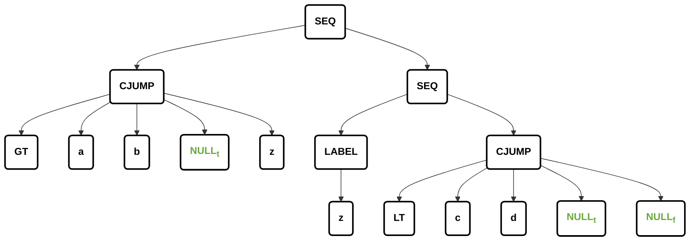
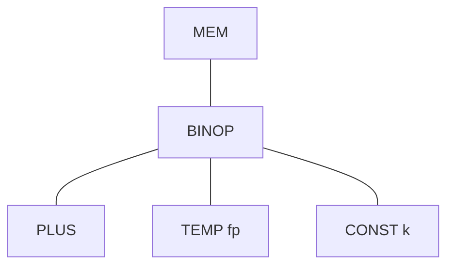
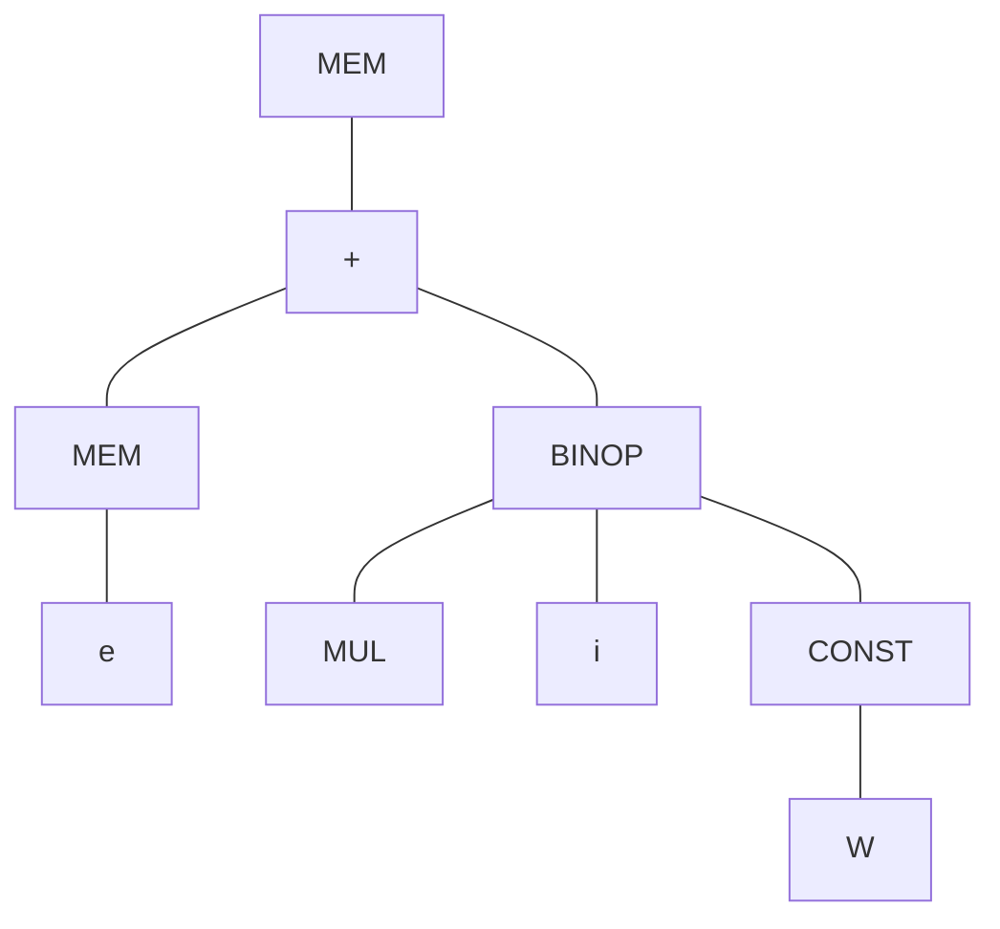
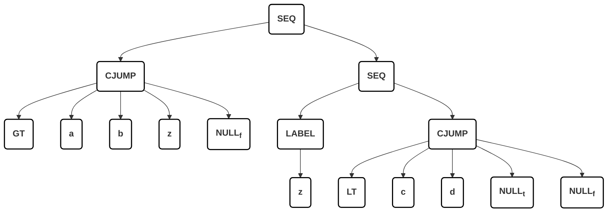

# Chapter 7：翻译为中间代码（Intermediate Code）

## 7.0. 整体背景与动机

### 7.0.1. 编译流程

* 源代码（Source Code）
* 词法分析（Lexical Analysis）
* 语法分析（Parsing）
* 语义分析（Semantic Analysis）
* 中间表示生成（IR Generation）
* IR优化（IR Optimization）
* 代码生成（Code Generation）
* 机器代码（Machine Code）

编译器结构 

* 前端：

    * 词法分析
    * 语法分析
    * 语义分析
    * 生成 IR

* 后端：

    * IR优化
    * 生成机器代码

### 7.0.2. 为什么需要中间表示（IR）？ 

* 为什么不直接从 AST 生成机器码？
    - 模块化（Modularity）：前端（语义分析）与后端（代码生成）解耦
    - 可移植性（Portability）：N 种语言 × M 种机器  ->  N + M ✔


### 7.0.3. 什么是 IR？ 

* 一种“抽象机器语言”
* 不依赖源语言
* 不绑定具体机器

常见 IR 类型：

* 表达式树（Expression Tree）
* 三地址码（Three-Address Code）
    * SSA（静态单赋值）

## 7.1. 三地址码（Three-Address Code）

### 7.1.1. 基本形式 

三地址一符号，y 和 z 经过符号 op 运算得到 x。每条语句最多一个运算符

```
x = y op z
```


地址可以是：
* 变量名
* 常量
* 临时变量（t1, t2）


源语言表达式可能被翻译成三地址指令序列：

```
2*a + (b-3)
```

转换为：

```
t1 = 2 * a
t2 = b - 3
t3 = t1 + t2
```

对于编程语言中的不同结构，有必要改变三地址码的形式，例如，

```
t2 = - t1
```

三地址码没有标准形式，其中一个原因是需要发明新的形式以表达语言中不寻常的特性

### 7.1.2. 控制流示例 

高层代码（阶乘）：

```
read x
if 0 < x then 
  fact:=1;
  repeat 
    fact:=fact*x;
    x:=x-1
  until x=0;
  write fact 
end
```

对应三地址码：

```
read x
t1=x>0
if_false t1 goto L1
fact=1
label   L2
t2 = fact * x
fact = t2
t3 = x - 1
x = t3
t4 = x==0
if_false t4 goto  L2
write fact
label   L1
halt
```

### 7.1.3. 实现方式

整个三地址指令序列被实现为四元式数组或链表

```
(op, arg1, arg2, result)
```
如果少于三个地址就用 `_` 替代

例如

```
t1=x>0
if_false t1 goto L1
fact=1
label   L2
```
就可以写成：

```
(gt, x, 0, t1)
(if_f, t1, L1, _)
(asn, 1, fact, _)
(lab, L2, _, _)
```


## 7.2. IR 树（Intermediate Representation Trees）

### 7.2.0. 设计目标 

* 易于语义分析生成
* 易于翻译成机器码
* 每个结构简单清晰
* 易优化

抽象语法的各个部分可能是很复杂的东西例如，数组下标、过程调用。单个“真实机器”指令也可能有复杂的效果。

不幸的是，抽象语法中的复杂部分并不总是与机器可以执行的复杂指令完全对应。

因此，中间表示(IR)应该具有描述极其简单事情的单独组件：一次取值、存储、加法、移动或跳转。

任何“笨重”的抽象语法部分应当对应的一组抽象机器指令(IR指令)。抽象机器指令的组合对应 “真实”机器指令

### 7.2.1. 表达式（T_exp） 

| 类型                | 含义          |
| ----------------- | ----------- |
| CONST(i)          | 常量          |
| NAME(n)           | 标签          |
| TEMP(t)           | 临时变量        |
| BINOP(op, e1, e2) | 二元运算        |
| MEM(e)            | 内存访问，从地址e开始的内存的 wordSize（目标机器字长） 字节的内容。当MEM用作MOVE 的左子节点时，它的意思是 store，但在其他地方，它的意思是 fetch。|
| CALL(f, args)     | 函数调用 f，参数列表为 args       |
| ESEQ(s, e)        | 先执行语句 s 判断，再返回表达式 e 的值作为返回值|

常见 BINOP：

- 整数算术运算符：PLUS, MINUS, MUL, DIV
- 整数位运算逻辑运算符：AND, OR, XOR
- 逻辑移位运算符：左移（LSHIFT）、右移（RSHIFT）
- 右移：ARSHIFT

### 7.2.2. 语句（T_stm） 

| 类型             | 含义    |
| -------------- | ----- |
| MOVE(TEMP t, e)| 计算 e 的值然后赋值到临时变量 t 中|
| MOVE(MEM(e1), e2)| 将 e2 算出的值存储到地址 e1（通过 e1 算出来的地址） 开始的内存的 wordSize（目标机器字长） 字节中|
| EXP(e)         | 执行表达式 e ，忽视其返回值 |
| JUMP(e, labs) | 将控制权（跳转）转移到地址e。目的地e可以可以是文字标签，如NAME(lab)。也可以是地址，通过任何其他类型的表达式计算。 |
| CJUMP(o, e1, e2, t, f)    | 条件跳转，用比较运算符 o 比较算式 e1 和算式 e2 的值，如果结果为真，则跳转到 t 标签，否则跳转到 f 标签。 |
| SEQ(s1, s2)    | 顺序执行 s1 后执行 s2 |
| LABEL(n)       | 将名称 n 的常数值定义为当前机器代码地址|


## 7.3. Translation into IR Trees

> 如何把 AST 转换为一个 IR 树？

### 7.3.1.  expressions 表达式 


表达式被定义为一个结构体 `Tr_exp_`，它包含一个枚举 `kind` 和一个联合体 `u`，用来表示以下三种类型：

*   **Ex (Expression - 有返回值的表达式)**：
    *   对应 Tree IR 中的 `T_exp`。
    *   **含义**：这类表达式在执行后会产生一个具体的值。
    *   **例子**：算术运算、简单的变量读取等。
*   **Nx (No result - 无返回值的语句)**：
    *   对应 Tree IR 中的 `T_stm`（Tree statement）。
    *   **含义**：这类表达式只执行操作并产生副作用，但不返回任何值。
    *   **例子**：某些过程调用（Procedure calls）或者 `while` 循环。
*   **Cx (Conditional - 条件跳转表达式)**：
    *   对应一个特定的结构体 `struct Cx`。
    *   **含义**：这类表达式代表布尔值（如 $a > b$）。它们在 IR 中不直接生成值为 1 或 0 的代码，而是生成一段包含条件跳转语句（`CJUMP`）的控制流代码。
    *   **结构**：它包含了一段跳转语句 `stm`，以及两个“补丁列表”（`trues` 和 `falses`）。

```c
// 课件中定义的结构体
struct Tr_exp_ {
    enum { Tr_ex, Tr_nx, Tr_cx } kind;
    union {
        T_exp ex;
        T_stm nx;
        struct Cx cx; 
    } u;
};
```

| 类型 | 含义    |
| -- | ----- |
| Ex | 有返回值的表达式  |
| Nx | 无返回值的语句  |
| Cx | 条件表达式，可能跳转到 true 或者 false 标签 |

例如，表达式 `a>b | c<d` 可以描述为：

```
Temp_label z = Temp_newlabel ( );
T_stm  s1 = T_Seq(T_Cjump(T_gt,a,b,  NULLt, z), T_Seq (T_Label (z), T_Cjump (T_lt,c,d, NULLt, NULLf )));
```



即用第一个 `CJUMP` 实现：

- 如果 a <= b 则跳转到 z 标签执行 `c < d` 的 `CJUMP` 
- 如果 a > b 则跳转到 t 标签（无条件跳转）

`c < d` 的 `CJUMP` 实现：

- 如果 c < d 则跳转到 t 标签（无条件跳转）
- 如果 c >= d 则跳转到 f 标签（无条件跳转）

我们不知道 true 的目的地和 false 的目的地，因此我们列出了现在用 NULL 填充的地方，当 t/f 已知时，需要填写t/f。

- 技术称为：Backpatching
- 填写的位置称为：True patch list and false patch list

在实际编程中，表达式的类型和它所处的上下文可能不匹配。例如 `flag := (a > b | c < d)` 在这个例子中，等号右边的 `(a > b | c < d)` 是一个布尔条件，默认会被翻译为 Cx（条件跳转）。但是，赋值操作要求右边必须是一个能产生具体值的 Ex 表达式。

为了解决这个问题，编译器提供了三个转换函数：

*   `unEx(Tr_exp e)`: 将任何表达式转换为 `T_exp`。
*   `unNx(Tr_exp e)`: 将任何表达式转换为 `T_stm`。
*   `unCx(Tr_exp e)`: 将任何表达式转换为 `struct Cx`。

**以 `unEx` 转换 `Cx` 为例（非常经典的处理方式）**：

```c
static T_exp unEx(Tr_exp e) {
  switch (e->kind) {
    case Tr_ex:
      return e->u.ex;
    case Tr_cx: {
      Temp_temp r = Temp_newtemp( );
      Temp_label t = Temp_newlabel( ), f= Temp_newlabel( );
      doPatch(e->u.cx.trues, t);
      doPatch(e->u.cx.falses, f);
      return T_Eseq(T_move(T_Temp(r),T_Const(1)),T_Eseq(e->u.cx.stm, T_Eseq(T_Label(f),T_Eseq(T_Move(T_Temp(r), T_Const(0)),T_Eseq(T_Label(t), T_Temp(r))))));
    }
    case Tr_nx:
      return T_Eseq(e->u.nx, T_Const(0));
  }
  assert(0);
}

```

如果把一个条件跳转（Cx）强行当成一个值（Ex）来用，`unEx` 函数在内部会这样做：

1.  分配一个新的临时寄存器 `r`。
2.  创建两个新的标签：`t`（真标签）和 `f`（假标签）。
3.  利用回填技术，将 `Cx` 的 `trues` 列表指向标签 `t`，`falses` 列表指向标签 `f`。
4.  生成一段连续的指令（使用 `T_Eseq`）：
    *   在标签 `t` 处，将常数 `1` 赋值给寄存器 `r`。
    *   在标签 `f` 处，将常数 `0` 赋值给寄存器 `r`。
5.  最后返回寄存器 `r` 中的值作为整个表达式的结果。

通过这种方式，原本只负责跳转的 `Cx`，就被巧妙地封装成了一个返回 `0` 或 `1` 的 `Ex` 表达式。


### 7.3.2. 简单变量 

```
MEM(FP + k)
```

* FP：帧指针
* k：偏移

局部变量存储在栈中


```
 MEM(BINOP(PLUS,TEMP fp, CONST k))
```



Tiger 中每个变量长度都是字长

为了在课件和绘图中更直观地展示庞大的 IR 树，引入一种简写符号：将 `BINOP(PLUS, e1, e2)` 简写为普通的加法符号 `+(e1, e2)`。

翻译变量时需要依赖两个与机器强相关的参数：帧指针和字长。因此，需要在 `Frame` 模块中添加相应的定义。

```c
/* frame.h */
......
Temp_temp F_FP(void);
extern const int F_wordSize;
T_exp F_Exp(F_access acc, T_exp framePtr);
```

*   `Temp_temp F_FP(void);`：用于获取当前帧指针寄存器。
*   `extern const int F_wordSize;`：定义机器的自然字长常量。
*   `T_exp F_Exp(F_access acc, T_exp framePtr);`：这是最关键的转换函数。`Translate` 模块会调用它，将变量的物理存取路径 (`F_access`) 和传入的帧指针转换为一棵真实的 `Tree` 表达式。


具体实例：

*   **场景一：变量在内存栈帧中 (`InFrame(k)`)**
    *   如果变量的访问权 $a$ 被分配在内存中（偏移量为 $k$），调用 `F_Exp(a, T_Temp(F_FP()))`。
    *   **返回值**：函数会构建并返回我们之前见过的经典树结构 `MEM(BINOP(PLUS, TEMP FP, CONST(k)))`。
*   **场景二：变量在寄存器中 (`InReg`)**
    *   在编译器的寄存器分配优化后，有些局部变量可能直接存放在虚拟寄存器中（例如 $t_{832}$）。
    *   **返回值**：此时无需进行复杂的内存加法偏移，`F_Exp` 会直接且简单地返回代表该寄存器的树节点：`TEMP t832`。

### 7.3.3. 数组变量 

不同语言差异：

| 语言     | 数组语义 | 使用|
| ------ | ---- | ----|
| Pascal | 完整数组内容  |允许 `a=b`|
| C      | 指针   |只允许 `*a = b`|
| Tiger  | 指针   |

```pascal
let
 type intArray = array of int
 var a:= intArray[12] of 0
 var b:= intArray[12] of 7
 in a:= b
end 
```

让 a 指向 b 所指向的内存块。a 原本指向的那 12 个 0 的内存块将被直接丢弃

Tiger 语言中的 record（记录/结构体）的值也是指针。记录的赋值行为与数组完全一致，都是指针赋值，不会拷贝内部的所有字段。

### 7.3.4. Structured L-Values

左值 (L-value)：可以出现在赋值等号**左侧**的表达式（如 `x`, `y.p`, `a[i+2]`）。它标识的是一个**可以被写入的内存位置 (Location)**。左值当然也可以放在等号右侧去读取它的值。

右值 (R-value)：只能出现在赋值等号**右侧**的表达式（如 `a+3`, `f(x)`）。它仅仅代表一个计算结果，不占用固定的、可重新赋值的内存空间。


标量 (Scalar)：只包含单一组件的值（如整数、指针）。在 Tiger 中，**所有**的变量和左值都是标量（因为数组和记录全是指针）。

结构化左值 (Structured L-Values)：在 C (structs) 或 Pascal (arrays/records) 中，左值可以是一块巨大的、包含多个组件的复合内存。不是标量。


如果你在写 C 语言的编译器，原本简单的 `MEM` 节点就不够用了。必须将获取内存节点的函数更新为带大小参数的版本：`T_exp T_Mem(T_exp, int size);`，即在 IR 树中体现为 `Mem(+(TEMP fp, CONST kn), S)`，这里的 $S$ 告诉后端：这里需要抓取或写入一个占 $S$ 字节的巨大对象，而不是一个普通的字 (Word)。


### 7.3.5. 数组下标与字段选择 (Subscripting and Field Selection)


要计算 `a[i]` 的物理地址，公式为：$(i-l) \times s + a$。

*   `a`：数组第一个元素的基地址。
*   `l`：数组下标的下界（比如 C 是 0，Pascal 可能是自定义的 1）。
*   `s`：单个元素占用的字节大小。

如果 `a` 是整体的，那么 `a – s × l` 可以在编译阶段计算。

计算记录 `a` 的字段 `f` 的地址，公式为：$offset(f) + a$（即对象基地址加上字段在内部的固定偏移量）。

如果将 Pascal 的数组变量 `a` 直接翻译为取值操作 `MEM(+(TEMP fp, CONST k))`，当我们要计算 `a[i]` 时，将无法在这个基础上继续做加法运算（因为 `MEM` 已经把值取出来了，我们丢掉了物理地址）。对于结构化类型的左值 $a$，应将其翻译为**表示其地址的树表达式**，即裸的 `+(TEMP fp, CONST k)`。做左值的时候 `a[i]` 应该不加上 MEM ，作为地址参与处理，但是做右值的时候  `a[i]` 应该加上 MEM 可以用于赋值。 

因为 Tiger 中的数组变量其实是个**指针**，存放指针的内存单元本身并不能当作数组首地址，对于 `a[i]` 的计算，



1.  先算出变量 `a` 的地址并读取其中的指针值：`MEM(e)`（`e` 通常是 `+(fp, k)`）。这代表数组真正的**基地址**。
2.  计算偏移量：`BINOP(MUL, i, CONST W)`（因为 Tiger 数组从 0 开始，且所有元素大小为字长 `W`）。
3.  基址加偏移量：`+(MEM(e), i*W)` 得到元素真实地址。
4.  最外层再套一个 `MEM`：获取或存入该地址的数据。

**最终 IR**：`MEM(+(MEM(e), BINOP(MUL, i, CONST W)))`。


严格来说，左值就只是一个“地址”，根本不应该带最顶层的 `MEM` 节点。只有当我们要从这里读取数据（作为右值）时，才应该加上 `MEM` 去 fetch；如果我们要往里存数据（赋值），应该直接把这个“地址”送给后端的 store 指令。

但是在生成这段 IR 树时，我们往往不知道它到底会被当成左值还是右值。因此，我们统一在最外端附加上 `MEM` 节点。

在最终的树中，`MEM` 被赋予了智能语义：如果它作为 `MOVE` 节点的左孩子（比如 `MOVE(MEM(...), 5)`），它就代表 **"store" (存入/写入)**；如果在任何其他地方，它就代表 **"fetch" (取出/读取)**。


### 7.3.6. Arithmetic 算术表达式

在 Tiger 编程语言中，每个整数算术运算符都对应一个树运算符。

树 IR 中的一元算术运算符：

- 整数的一元取反：实现为从零减去零; 
- -n => 0 - n
- 整数的一元补码：实现为与全 1 进行异或运算

Tiger 中不支持浮点数。

浮点数的一元取反不能实现为从零减去，许多浮点数表示允许负零，负零的取反结果为正零，反之亦然，

树语言对一元取反的支持并不完善。

### 7.3.7. 条件表达式 (Conditionals)

#### 7.3.7.1. `&` 和 `|` 的树结构对比

表达式 `a>b | c<d` 可以描述为：

```
Temp_label z = Temp_newlabel ( );
T_stm  s1 = T_Seq(T_Cjump(T_gt,a,b,  NULLt, z), T_Seq (T_Label (z), T_Cjump (T_lt,c,d, NULLt, NULLf )));
```


表达式 `a > b & c < d`

```
Temp_label z = Temp_newlabel ( );
T_stm  s1 = T_Seq(T_Cjump(T_gt,a,b, z, NULLf),T_Seq (T_Label (z),T_Cjump (T_lt,c,d, NULLt, NULLf )));
```




Tiger 语言的条件表达式很容易通过逻辑与 (`&`) 和逻辑或 (`|`) 进行组合。课件指出了如何合并两个 `Cx` 表达式的跳转列表：

* 对于 $a>b | c<d$ ：如果 $a>b$ 为真，直接跳到整个表达式的 True 出口（短路）；如果为假，则跳到标签 `z`，继续计算 $c<d$。
*  对于 $a>b \& c<d$ ：如果 $a>b$ 为假，直接跳到整个表达式的 False 出口（短路）；如果为真，才跳到标签 `z` 继续计算。

#### 7.3.7.2. if-then-else 表达式的翻译

`if e1 then e2 else e3` 的底层翻译策略:

* **简单但低效的做法**：对 `e1` 使用 `unCx`（强转为条件），对 `e2` 和 `e3` 使用 `unEx`（强转为值）。分配一个临时变量 `r`，在 True 分支把 `e2` 赋给 `r`，False 分支把 `e3` 赋给 `r`，最后跳到同一个 `join` 标签。这虽然正确，但如果 `e2` 或 `e3` 本身也是一个条件跳转语句，强转为值会生成极其低效的“跳转纠缠 (tangle of jumps)”。
    ```
    unCx(e1)
    LABELt
    r = unEx(e2)
    JUMPjoin
    LABELf
    r = unEx(e3)
    JUMPjoin
    ...
    LABELjoin
    TEMPr
    ...
    ```

*   **优化的做法**：如果发现 `e2` 或 `e3` 是 `Cx` 表达式，编译器会在代码中进行特判（recognize this case specially），直接复用其本身的真假跳转出口，避免不必要的“跳转-赋值-再跳转”过程。

`if x<5 then a>b else 0` 在特判优化后生成的精简 IR 树。

```mermaid
graph TD
    seq1[SEQ] --- cjump1[CJUMP]
    seq1 --- seq2[SEQ]
    
    cjump1 --- lt[LT]
    cjump1 --- x[x]
    cjump1 --- const[CONST]
    cjump1 --- z1[z]
    cjump1 --- f1[f]
    
    const --- five[5]
    
    seq2 --- label[LABEL]
    seq2 --- cjump2[CJUMP]
    
    label --- z2[z]
    
    cjump2 --- gt[GT]
    cjump2 --- a[a]
    cjump2 --- b[b]
    cjump2 --- t[t]
    cjump2 --- f2[f]

    classDef plain fill:none,stroke:none,color:#000,font-weight:bold,font-size:18px;
    class seq1,seq2,cjump1,cjump2,lt,x,const,z1,f1,five,label,z2,gt,a,b,t,f2 plain;
```

```
SEQ(s1(z,f), SEQ(LABEL Z, s2(t,f)))
```

### 7.3.8.  While 循环 (While Loops) 

**标准布局**：

```text
test:
  if not(condition) goto done
  body
  goto test
done:
```

如果在循环体 (`body`) 内遇到了 `break` 语句，直接将其简单翻译为 `JUMP done` 即可。
    

为了让里层的 `break` 知道自己该跳到哪个 `done` 标签（尤其是多层循环嵌套时），翻译函数 `transExp` 必须增加一个新的形式参数 `break`，这个参数专门用来向内层子节点传递**“离它最近的外层循环的 done 标签”**。

### 7.3.9. For 循环 (For Loops) 

`for` 循环其实可以看作是 `while` 循环的“语法糖”，并在 IR 阶段将其重写 (rewrite)。

`for i:= lo to hi do body`，可以等价转换为 `let var i:=lo var limit:=hi in while i<=limit do (body; i:=i+1) end`。
   
**致命陷阱 (Problem)**：如果 `hi` 的值恰好是机器能够表示的最大整数（`maxint`），当循环执行到最后一次，`i` 等于 `maxint`，执行循环体后，`i:=i+1` 就会发生**整数溢出 (overflow)**，变成一个负数，导致循环永远无法结束（死循环）。

为了彻底解决这个问题，编译器不能简单地使用 `<=` 来判断，而必须生成更加谨慎的 IR 汇编控制流：先判断如果 `lo > hi` 直接跳过整个循环；然后在循环体**内部的最后**，先判断 `i >= limit`，如果满足就退出，**然后再执行** `i:=i+1`。这样完美避开了对极值进行加一操作

### 7.3.10. 函数调用 (Function Call)

带有静态链的函数调用

*   **核心转换**：一个普通调用 $f(a_1,...,a_n)$ 的翻译过程其实非常简单，主要就是生成一个 `CALL` 节点：`CALL(NAME l_f, [sl, e_1, e_2, ..., e_n])`。
*   **关键附加物 (Implicit Extra Argument)**：除了源语言里写明的 $n$ 个参数外，编译器必须在参数列表的最前面强行插入一个**隐藏参数：静态链 (Static Link, `sl`)**。这个 `sl` 是一个极其重要的指针，用于在运行时支持嵌套函数访问外层作用域的变量。`l_f` 则代表函数 $f$ 在汇编代码里的真实入口标签。


## 7.4.声明处理 Translation of Declarations
 
### 7.4.1.声明与环境更新 (Declarations)


在处理声明时，调用翻译函数 `transDec` 不仅仅是生成一棵抽象树，它还会对底层表示产生重要的**副作用 (side-effect)**：直接修改帧数据结构 (frame data structure)。

*   **变量声明**：对于函数体内的每一个变量声明，编译器会在栈帧中（即相对帧指针 `FP + offset` 的位置）为该变量**保留额外的空间**。
*   **函数声明**：对于每一个函数声明，编译器会为其函数体单独保留一个新的树代码**片段 (fragment)**，而不是将其混入当前函数的执行流中。

### 7.4.2.  Variable Declarations

`transDec` 会更新值环境和类型环境，并将变量的初始化动作翻译成**赋值表达式 (assignment expressions)**。这些赋值表达式的树节点会被有序地安插在 `let` 核心执行体 (body) 的最前面。


如果 `transDec` 处理的是类型声明或函数声明，它会返回一个**“无操作”表达式 (no-op expression)**，例如 `EXP(CONST(0))`。因为类型只是编译期的概念，而函数体已经被提取到了外部片段中。


### 7.4.3. 函数定义的底层解剖 (Function Declarations) 


函数定义包含三大组件：

* 序言 (Prologue)
    1. 写入伪指令 (pseudo-instructions) 以标记函数的开始。
    2. 定义该函数的**汇编标签 (label)**（供其他地方 Jump/Call 过来）。
    3. **调整栈指针**（向下移动），为当前函数分配一个全新的栈帧 (allocate a new frame)。
    4. 处理参数：将“逃逸 (escaping)”的参数（包括隐含的静态链 `sl`）保存到栈帧的内存中；将不逃逸的参数移动到新鲜的临时寄存器中。
    5. 保存**被调用者保存寄存器 (callee-save registers)**：包括返回地址寄存器和函数内部将要使用的关键寄存器，把它们原本的值压入栈中保护起来。

* 函数体 (Body)
    6. **函数体**：执行翻译后的核心表达式逻辑。

* 结语 (Epilogue)
    7. **返回值**：将函数执行的结果移动到专门存放返回值的标准寄存器中。
    8. **恢复寄存器**：通过 Load 指令，将被调用者保存寄存器恢复到函数调用前的状态。
    9. **销毁栈帧**：重置栈指针，回收为该函数分配的栈空间。
    10. **返回跳转**：执行一条 Return 指令（`JUMP` 到之前保存的返回地址处）。
    11. 写入结束伪指令以宣布函数结束。


### 7.4.4. 代码片段 (Fragment) 与输出模块化


在整个 Translate 阶段的最后，编译器并不会直接输出一串又长又乱的代码。相反，它会为每一个函数生成一个标准化的 **Fragment (片段)**。

*   **片段的组成**：
    *   `frame`：包含该函数局部变量和参数底层机器特定信息的帧描述符。
    *   `body`：由 `procEntryExit1` 处理并返回的核心树形结构代码。


### 7.4.5. Fragment 在 C 语言中的代码实现


`F_frag`：使用了 `enum` 和 `union` 来定义。一个 Fragment 要么是一个**字符串片段 (`F_stringFrag`)**（用于存放全局的字符串字面量常量），要么是一个**函数片段 (`F_procFrag`)**（包含函数的语句体 `body` 和帧 `frame`）。


提供了一个单向链表结构 `F_fragList`。在 `translate.h` 中，提供接口 `Tr_procEntryExit` 来将当前函数打包成片段放入后台；最终翻译完成后，顶层调用 `Tr_getResult(void)` 就能一口气获取到整个程序包含的所有片段列表 (return the list of all function fragments)。
