# Chapter 8: 基本块

## 8.0. IR tree 的不足

IR必须被翻译成汇编或机器码。IR Tree 匹配大多数机器的处理能力。然而Tree语言的某些方面与机器语言并不完全对应。Tree语言的某些方面会干扰编译时的优化分析。

### 8.0.1. 示例

* `CJUMP` 指令可以跳转到两个标签中的任何一个，真实机器的条件跳转指令，如果条件为假，会直接顺序执行到下一条指令。

* 表达式内的 `ESEQ` 节点很不方便。`ESEQ(s, e)`语句 (Statements) 会产生副作用，影响 `e` 的值，所以子树的表达式和求值按照不同顺序执行会产生不同的结果。但是我们希望能够以任意顺序求值/执行语句。

* 表达式内的 `CALL` 节点会导致相同的问题。`CALL` 默认是会把返回值放到某组固定的参数寄存器，所以如果有几个 `CALL`，将会引发问题。例如：`CALL(f, [e1, CALL(g, [e2, ...])])`， `e1` 的结果存储在 `r1` 中，`e2` (注: 这里指内层 `CALL` 的结果) 的结果将会覆盖 `r1` 。

### 8.0.2.解决方案 (Solution)


1. 将树重写为一个不包含 `SEQ` 或 `ESEQ` 节点的**规范树 (canonical trees)** 列表。消除与 `ESEQ` 和 `CALL` 相关的冲突。


2. 将此列表分组为一组**基本块 (basic blocks)**，块内不包含内部跳转或标签。

3. 将这些基本块排序为一组**轨迹 (traces)**，在轨迹中，每个 `CJUMP` 后面都紧跟着它的如果错误就走的分支。消除与 `CJUMP` 相关的冲突 。


## 8.1. 规范树 (Canonical Trees)

### 8.1.1. 定义


* 规范树被定义为具有以下属性：
    1. 没有 `SEQ` 或 `ESEQ`。
        * 意味着每个规范树最多包含一个语句 (statement) 节点，即根节点。其他节点全部是非 `ESEQ` 的表达式节点。
    2. 每个 `CALL` 的父节点只能是 `EXP(...)` 或 `MOVE(TEMP t, ...)`。
        * 意味着 `CALL` 节点的子节点不能是 `CALL` 节点。

综合两点性质可以看出：1说明只有一个 statement 且是 root，2 说明 `call` 节点的父亲就是这个 statement 节点，然后这个 statement 节点只能是 `EXP(...)` 和 `MOVE(TEMP t, ...)` ，它们只能包含一个 `CALL`。所以`CALL` 节点的父节点必须是规范树的根节点。一棵规范树中最多只能有一个 `CALL` 节点。


### 8.1.2. 构建规范树的操作

为了将树重写为规范树列表，我们需要：

* 消除 `ESEQ`
* 将 `CALL` 移动到顶层
* 消除 `SEQ` 


### 8.1.3. 消除 `ESEQ` 节点

> 核心思想是将 `ESEQ` 节点在树中不断“拔高 (lift)”，直到它们能够变成 `SEQ` 节点。

例如 `ESEQ(s1, ESEQ(s2, e))` 

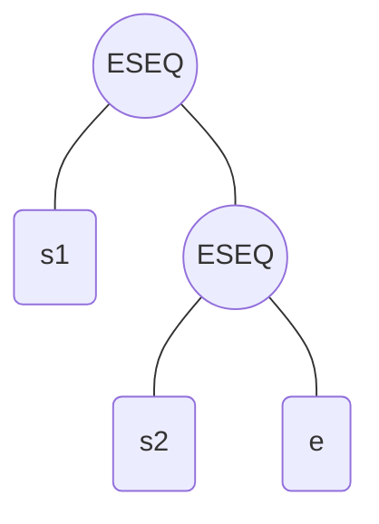

显然可以重写为 `ESEQ(SEQ(s1, s2), e)` ，因为语句执行顺序一样，返回值还是 `e`

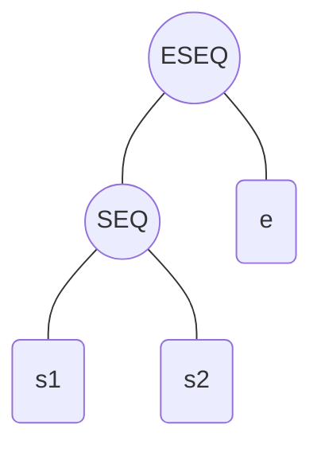

另一个例子`BINOP(op, ESEQ(s, e1), e2)`：

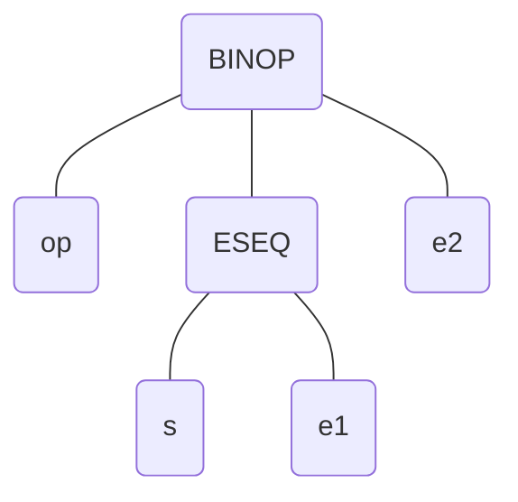


`ESEQ(s, BINOP(op, e1, e2))`

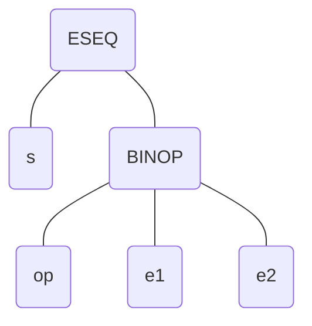

更多例子：


* $MEM(ESEQ(s, e_1)) \Rightarrow ESEQ(s, MEM(e_1))$

* $JUMP(ESEQ(s, e_1)) \Rightarrow SEQ(s, JUMP(e_1))$
* $CJUMP(op, ESEQ(s, e_1), e_2, l_1, l_2) \Rightarrow SEQ(s, CJUMP(op, e_1, e_2, l_1, l_2))$ 


#### 8.1.3.2. 规则：

* 给定 `ESEQ(s, e)`：
* 提取出 `s`。
* 将它的父节点重写为包含 `s` 的 `ESEQ` 或 `SEQ`。

#### 8.1.3.3. 临时变量解除副作用

`BINOP(op, e1, ESEQ(s, e2))` 

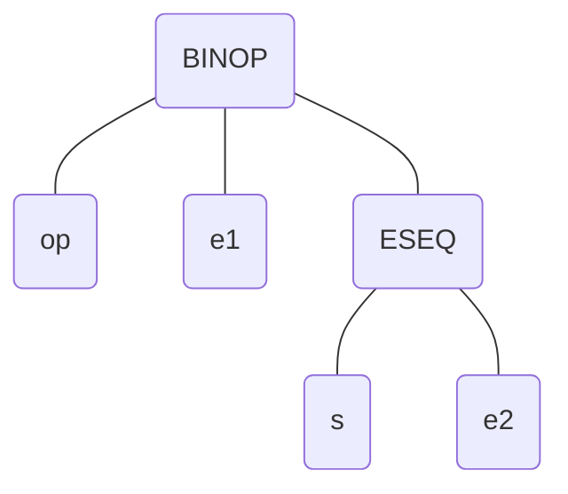

把 `s` 提到最前面，变成了 `ESEQ(s, BINOP(op, e1, e2))`


***存在副作用***，假设 `s = MOVE(MEM(x), y)`，`e1 = MEM(x)`，为了保留求值的顺序，我们必须将 `e1` 从包含 `s` 的 `BINOP` 中拉出来。


总之，如果 `ESEQ` 在右子树，你硬把它的副作用 $s$ 提到最前面，会导致 $s$ 比左子树 $e1$ 先执行！如果 $s$ 恰好修改了 $e1$ 要读取的变量内存，那就全乱套了。

怎么解决求值顺序被打乱的问题？很简单，我们把左子树 $e1$ 的原值提前“缓存”起来！创建一个新的临时寄存器 $t$，先算 $e1$ 并存入 $t$，然后再去执行右子树里的副作用 $s$，最后拿着缓存的 $t$ 去和 $e2$ 进行运算。完美保证了原有的语义。

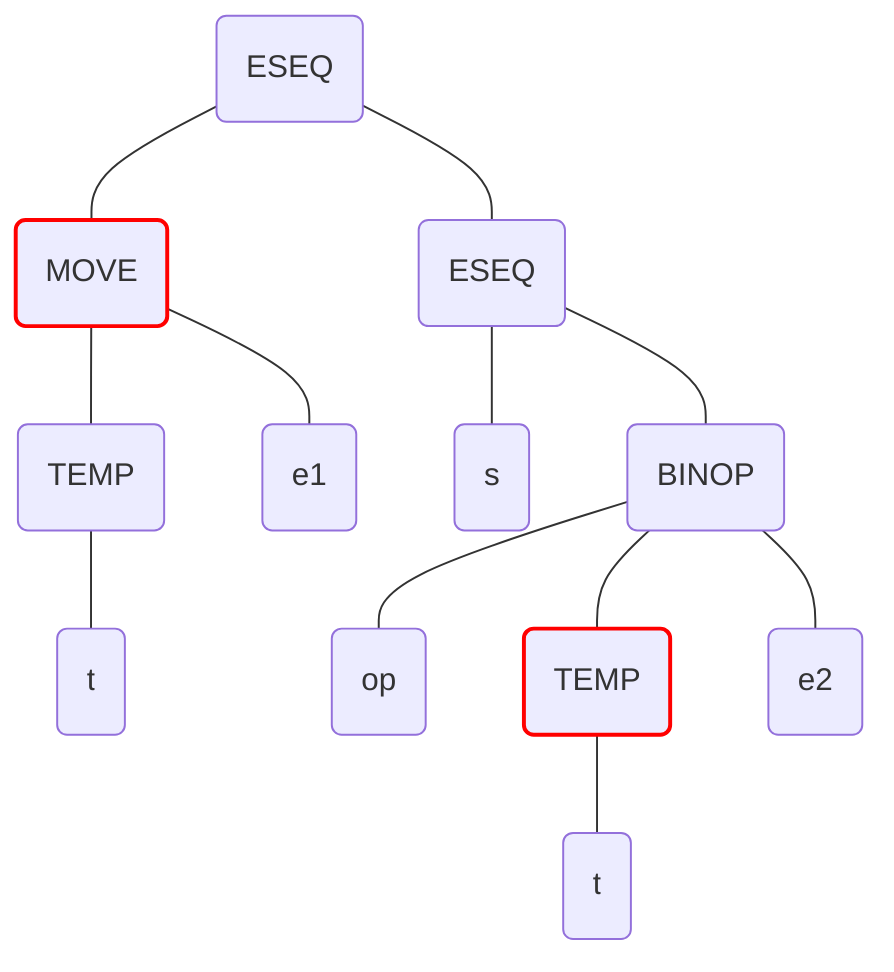


$BINOP(op, e_1, ESEQ(s, e_2))$ 和 $CJUMP(op, e_1, ESEQ(s, e_2), l_1, l_2)$ 引入一个新的临时变量 `t`：

原来 $BINOP(op, e_1, ESEQ(s, e_2))$ 变成 $ESEQ(MOVE(TEMP~t, e_1), ESEQ(s, BINOP(op, TEMP~t, e_2)))$

另一类似规则：$CJUMP(op, e_1, ESEQ(s, e_2), l_1, l_2)$ 变成 $SEQ(MOVE(TEMP~t, e_1), SEQ(s, CJUMP(op, TEMP~t, e_2, l_1, l_2)))$ 。

#### 8.1.3.4. 基于交换律的优化 (Commute)

“加临时变量”法虽然通用，但每次都加个新变量太浪费寄存器了。如果编译器分析出 $s$ 和 $e1$ 八竿子打不着（比如 $s$ 修改变量 $a$，而 $e1$ 是计算 $b+c$），那它们就可以随便换位置，直接套用最简提取法则即可。

如果 `s` 和 $e_1$ 满足交换律 (commute)，即如果 `s` 和 `e1` 可以交换，**被 `s` 分配（修改）的临时变量和内存位置，没有被 `e1` 引用（并且 `s` 和 `e1` 也没有同时执行外部I/O） **那么：

$BINOP(op, e_1, ESEQ(s, e_2)) = ESEQ(s, BINOP(op, e_1, e_2))$

$CJUMP(op, e_1, ESEQ(s, e_2), l_1, l_2) = SEQ(s, CJUMP(op, e_1, e_2, l_1, l_2))$


#### 8.1.3.5. 判定交换律


那么如何知道一个语句 `s` 是否与一个表达式 `e` 满足交换律？在编译时，我们无法总是知道这一点，例如：
`s = MOVE(MEM(x), y)`，`e = MEM(z)`，`x` 是否等于 `z`？

（不知道，这往往是在运行时决定的）

所以我们保守地近似语句是否可以交换：

* `commute(s, e) = True` 如果 `s` 和 `e` 绝对可以交换。
    * 常数可以与任何语句交换。
    * 空语句（例如 `EXP(CONST X)`）可以与任何表达式交换。

* `commute(s, e) = False` 其他所有情况 。
    * 其他任何东西都被假定为不交换。


```c
static bool isNop(T_stm x) {
    return x->kind == T_EXP && x->u.EXP->kind == T_CONST;
}
static bool commute (T_stm x, T_exp y) {
    return isNop(x) || y->kind == T_NAME || y->kind == T_CONST;
}

```


#### 8.1.3.6. 一般重写规则与算法 (General Rewriting Rules)

对于每种树语句或表达式，都可以制定类似的规则，将 `ESEQ` 提取出来。给定一个Tiger程序，可以递归执行此转换，将所有 `ESEQ` 拔高为 `SEQ` 。

一般来说，对于每种节点，我们可以识别它的子表达式（如 `[e1, e2, ESEQ(s, e3)]`）

原始 IR tree：

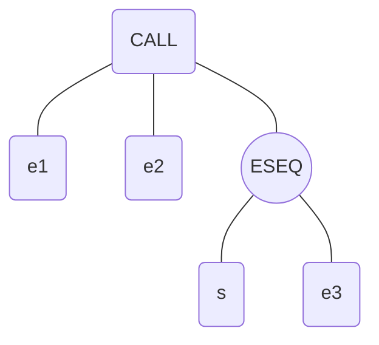

* 都满足交换律：

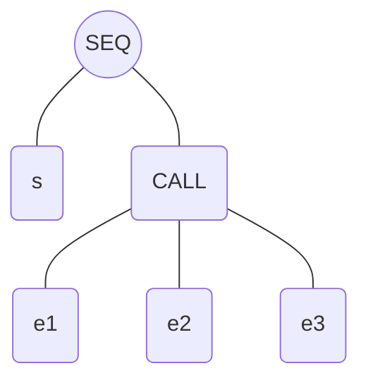

语句 $s$ 与紧邻的左侧表达式 $e2$ 不满足交换律（例如 $s$ 修改了 $e2$ 要读取的变量） 

需要重写为：

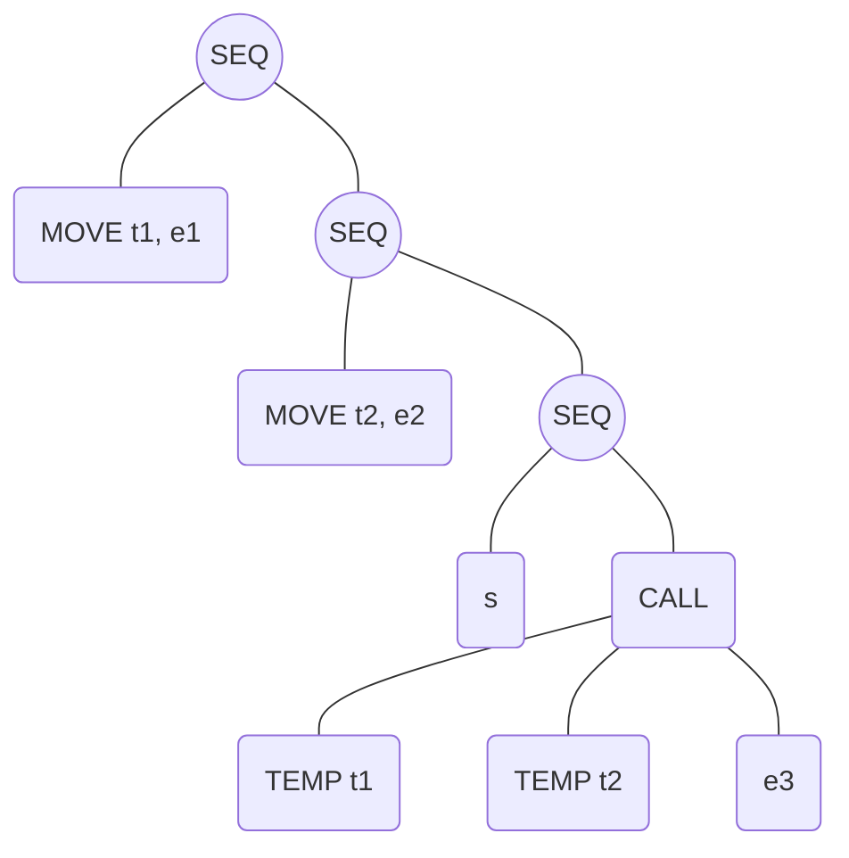

$e2$ 可以与 $s$ 交换，但更左侧的 $e1$ 不行。根据 reorder 的保守原则，一旦左侧出现冲突，该位置及其左侧所有表达式都要移动到临时变量中 。

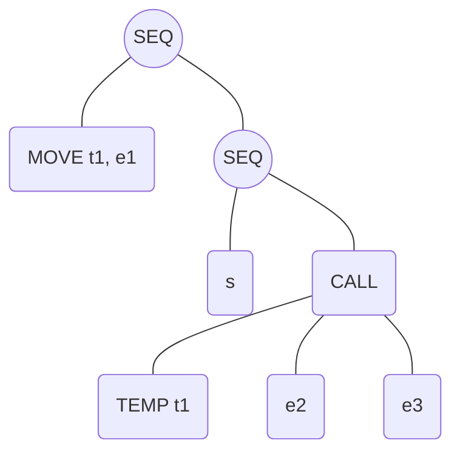

算法包含两步：

1. 为每种节点制定“提取子表达式”方法，转为纯净版。
2. 制定“插入子表达式”方法，用干净的子表达式重建节点，并将抽出来的 `s` 用 `SEQ` 连在前面 。


### 8.1.4. 将 CALL 移动到顶层 (Move CALLs to Top Level)

问题在于 `CALL` 节点可以作为子表达式，但函数总是将结果返回到**同一个**专用的返回值寄存器 `TEMP(RV)` 中。比如 `BINOP(PLUS, CALL(...), CALL(...))`，第二个函数的调用会把第一个函数的返回值寄存器给覆盖掉！

当遇到有多个 `CALL` 的情况，对于每一格 `CALL`：

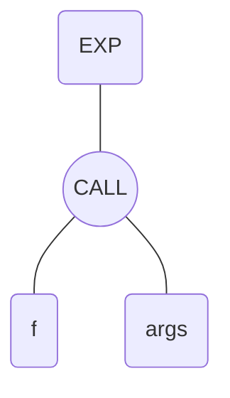

立刻将每个返回值分配给一个全新的临时寄存器：
`CALL(f, args)` -> `ESEQ(MOVE(TEMP t, CALL(f, args)), TEMP t)` 。

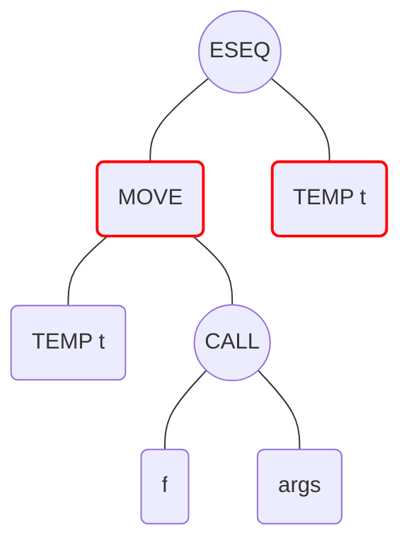

### 8.1.5. 消除 SEQ 形成线性列表

一旦处理完整个函数体，结果是一棵将所有 `SEQ` 节点都堆在顶部的树 `SEQ(SEQ(SEQ(..., sx), sy), sz)`。

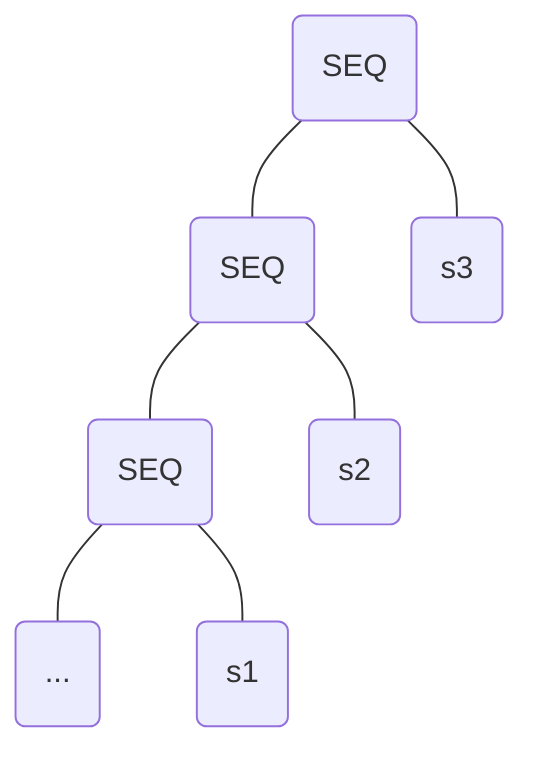

我们重复应用规则：`SEQ(SEQ(a,b), c) = SEQ(a, SEQ(b,c))`。


整个树被线性化为：`SEQ(s_1, SEQ(s_2, ..., SEQ(s_{n-1}, s_n)...))`。

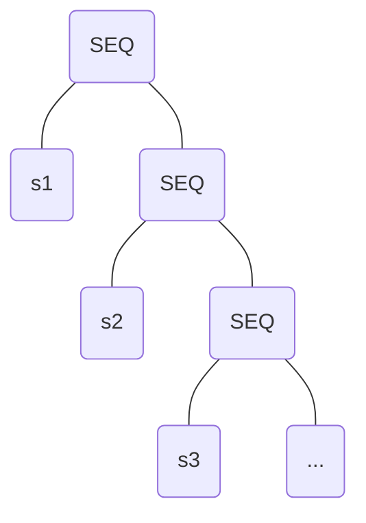

这等价于一个纯粹的语句线性列表：$S_1, S_2, ..., S_n$。所有的 $S_i$ 都不再包含 `SEQ` 或 `ESEQ` 节点 。


## 8.2. 驯服条件分支 (Taming Conditional Branches)--> 基本块 (Basic Blocks)

现在进入阶段2和3：将列表分组为“基本块”，并将块排序为“轨迹”，使得 `CJUMP` 后面立刻跟随着 `False` 标签。这使得可以直接在真机上将其翻译为单向的条件分支。


### 8.2.1.  基本块 (Basic Blocks) 的动机与定义

在确定程序中的跳转指令指向何处时，我们实际上是在分析程序的控制流。

**控制流**是指*忽略寄存器和内存中的数据值*且*忽略算术运算*程序中指令的执行顺序。


我们无法预知条件跳转指令会跳转到其标签为真还是假的位置；因此，我们简单地说，这类跳转指令
可以跳转到任何位置。在分析程序的控制流时，任何非跳转指令的行为都完全不值得关注。将所有非分支指令序列归为基本块，并分析基本块之间的控制流。

在分析程序的控制流时，我们只看程序指令的执行顺序，忽略数据值和算术计算。非跳转指令的控制流行是不起眼的。因此，把所有非分支指令捆绑在一起形成“基本块”，只去分析基本块之间的控制流 。

#### 8.2.1.2. 基本块的定义：

一段总是从开头进入、从结尾退出的语句序列。也就是：

* 第一条语句是 `LABEL`。
* 最后一条语句是 `JUMP` 或 `CJUMP`。
* 中间绝对没有其他的 `LABEL`、`JUMP` 或 `CJUMP` 。

> 只要你进入了这个块，在中途绝不会被任何 GOTO 打断，也绝对不能中途 GOTO 到别的地方去，必须一口气走到黑，直到最后一句跳出。编译器极其喜欢基本块，因为在里面做优化不用担心逻辑错乱。


### 8.2.2. 基本块的划分算法

#### 8.2.2.1. 基本块划分算法

1. 从头到尾扫描语句序列；
2. 每当发现一个 `LABEL`，就开始一个新块（前一个块结束）；
3. 每当发现一个 `JUMP` 或 `CJUMP`，就结束一个块（下一个块开始）；
4. 如果这导致任何块没有以 `JUMP` 或 `CJUMP` 结尾，就在该块后面追加一个指向下一个块标签的 `JUMP`；
5. 如果任何块开头没有 `LABEL`，就发明一个新的 label 贴在开头 。

> 这个切分算法极其暴力且有效。看到入口（Label）就一刀切，看到出口（Jump）也一刀切。如果不符合“一头一尾”的标准，编译器就强行给你补上（自己造一个跳转或者标签）。

#### 8.2.2.2. 基本块划分示例

原始三地址码代码：

```pascal
(1) x := input
(2) y := x - 1
(3) z := x * y
(4) if z < x goto (7)
(5) p := x / y
(6) q := p + y
(7) a := q
(8) b := x + a
(9) c := a - b
(10) if p == q goto (12)
(11) goto (3)
(12) return
```

首先三地址码每条指令都是 label，但是真正的 label 是 `JUMP` 指令的目的地

1. 找 Label 开头：由于指令(3), (7), (12)是被别人goto过来的，相当于隐含的Label，所以以它们为新块起点 。

2. 找 Jump 结尾：(4), (10), (11) 都是 jump 或 cjump，所以在这三处结束基本块，并在后面的 (5), (11), (12) 开启新块 。

3. 最终分出的基本块起点为：(1), (3), (5), (7), (11), (12) 。

    ```mermaid
    flowchart TD
        I1["(1) x := input"] --> I2["(2) y := x - 1"]
        I2 --> L3["(3) LABEL"]
        L3 --> I3["z := x * y"]
        I3 --> I4["(4) if z < x goto (7)"]
        I4 -. "结束块: 遇到CJUMP" .-> I5["(5) p := x / y"]
        I5 --> I6["(6) q := p + y"]
        I6 --> L7["(7) LABEL"]
        L7 --> I7["a := q"]
        I7 --> I8["(8) b := x + a"]
        I8 --> I9["(9) c := a - b"]
        I9 --> I10["(10) if p == q goto (12)"]
        I10 -. "结束块: 遇到CJUMP" .-> I11["(11) goto (3)"]
        I11 -. "结束块: 遇到JUMP" .-> L12["(12) RETURN"]
    ```

4. 给上述代码强行加入 Tree 语言的 `LABEL` 和 `JUMP` 后形成规范树节点形态。
    * 这是因为可以强制把执行顺序固定下来，从而方便后续随便换顺序。

    ```mermaid
    graph TD
        subgraph TAC ["原始三地址码片段 (TAC)"]
            direction TB
            T1["(5) p := x / y<br/>(6) q := p + y"]
            T2["(7) a := q<br/>(8) b := x + a<br/>(9) c := a - b<br/>(10) if p == q goto (12)"]
        end

        TAC ==>|"变换为 Tree 语言"| TREE

        subgraph TREE ["Tree 语言基本块 (Canonical Trees)"]
            direction TB
            B1["<b>LABEL(five)</b><br/>MOVE(TEMP p, BINOP(DIV, TEMP x, TEMP y))<br/>MOVE(TEMP q, BINOP(PLUS, TEMP p, TEMP y))<br/>JUMP(NAME seven)"]
            
            B2["<b>LABEL(seven)</b><br/>MOVE(TEMP a, TEMP q)<br/>MOVE(TEMP b, BINOP(PLUS, TEMP x, TEMP a))<br/>MOVE(TEMP c, BINOP(MINUS, TEMP a, TEMP b))<br/>CJUMP(EQ, TEMP p, TEMP q, twelve, eleven)"]
        end

        %% 关键点染色
        style B1 fill:#e3f2fd,stroke:#1976d2
        style B2 fill:#e3f2fd,stroke:#1976d2
    ```

## 8.3. 驯服条件分支 (Taming Conditional Branches)--> 轨迹 (Traces) 

> 再次强调最后阶段目标：重排基本块，确保 `CJUMP(cond, It, If)` 后面立即跟着 `LABEL(If)` 。基本块是散落的珠子，现在我们要把它们串起来，形成“轨迹”。

### 8.3.1. 轨迹的动机与定义

基本块可以按任意顺序排列，执行结果相同。基于此，我们可以选择一种顺序，满足：每个 `CJUMP` 后面紧跟着它的假标签。我们还可以让许多无条件 `JUMP` 后面紧跟着它们的目标标签，从而允许删除这些无用的 jump 语句，让程序跑得更快一点。

轨迹的定义：可以在程序执行期间连续执行的一系列语句序列，可以包含条件分支。

我们希望找出一个“完全覆盖 (exactly covers)”程序的轨迹集合：

* 每个块必须且只能处于一条轨迹中。
* 每条轨迹不能有循环。
* 我们希望这个覆盖集合里的轨迹数量越少越好（以最小化跨轨迹的无条件跳转 JUMP） 。

### 8.3.2. 生成轨迹的算法 (DFS)

如何找到覆盖轨迹集？

思路是从某个块开始（轨迹起点），沿着一条可能的执行路径一直摸索。如果 `b1` jump到 `b4`，`b4` jump到 `b6`，轨迹就是 `b1, b4, b6`。如果遇到条件分支 `CJUMP(cond, b7, b3)`，我们把假分支 `b3` 丢进当前轨迹，而真分支 `b7` 留给其他轨迹去串 。

```pascal
把程序所有的块放进列表 Q。

while Q not empty：
    启动一条新轨迹 T。
    从 Q 中取出【第一个】未 marked 的块 b。
    while b not marked：
        mark b；
        把 b 追加到 T 的末尾。
        for (b 的所有后续块(它分支指向的块)):
            if 任何未 marked 的后继块 c：
                b -> c
    如果没有未标记的后继块了，结束当前轨迹 T。
不断重复，直到所有块都被串联 。
```


### 8.3.3. 最后的修整 (Finishing Up)

为了简化后续编译阶段的实现，Tiger 编译器会将整理好的轨迹列表重新展平为一个极长的语句列表。执行一些细微调整：

* 任何 `CJUMP` 后面紧跟着假标签：
    * 放着别动（符合预期）。


* 任何 `CJUMP` 后面紧跟着真标签：
    * 反转条件（比如大于变小于等于），并交换真假标签。


* 任何 `CJUMP(cond, a, b, It, If)` 后面既没跟真标签，也没跟假标签：
    * 发明一个新的假标签 `If'`。
    * 将这条语句重写为三条：
        ```
        CJUMP(cond, a, b, It, If')
        LABEL If'
        JUMP(NAME If)
        ```
        总有倒霉的时候：比如一个岔路口的两个目标分支都已经别分配到其他轨迹了。此时无论怎么排，`CJUMP` 后面都没法紧跟它的 False 标签。没办法，编译器只好强行在它下面“垫”一条指令，建一个虚拟的 False 标签，然后利用一个无条件 `JUMP` 把它硬生生地“弹射”回正确的 False 轨道。

### 8.3.4. 最优轨迹 (Optimal Traces)

任何频繁执行的指令序列（如循环体）都应占据属于自己的轨迹。这有助于尽量减少无条件跳转的数量，并且有助于其他的优化（寄存器分配、指令调度） 。

三种 While 循环编译后的轨迹排布方案。

* 循环体包含一个开头的 CJUMP(跳出) 和末尾的一个 JUMP(回开头)。

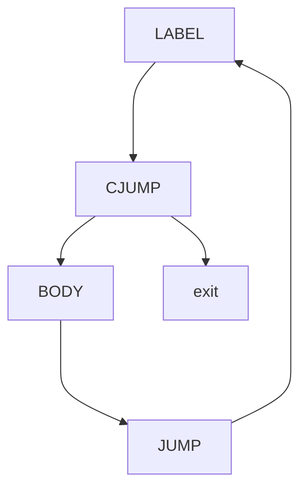

* 将循环体放入和`CJUMP`不同的轨迹：仍然包含一个 CJUMP 和 JUMP。


* 最优排布：在开头先执行一次 JUMP 跳转到条件测试。循环体结尾直接使用一个反向的 `CJUMP(≤)` 跳回开头。除了第一次迭代外，后续每次迭代只有1条 `CJUMP`，少执行了一条 `JUMP` 。

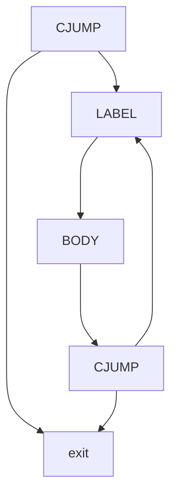


## 8.4核心总结 (Summary)


* 问题：IR树与机器指令不匹配。
    * `CJUMP` vs 机器条件跳转
    * `ESEQ` 和 `CALL` 中的子树评估顺序问题。
    * `CALL` 作为另一个 `CALL` 的参数。


* 解决：分三阶段转换树。
    1. 重写为无 `SEQ/ESEQ` 的规范树列表（消灭 `ESEQ/CALL` 冲突）。
    2. 将列表分组为基本块（无内部跳转/标签）。
    3. 将基本块重排为轨迹，确保 `CJUMP` 紧跟假标签（消灭 `CJUMP` 冲突） 。


## 8.5 附录：Canon 模块的 C 语言源码解析


*(以下为附录代码部分，详细展示了前面讲述的转换规则在C语言中的具体实现)*

### 第52页：规范树构造规则汇总

**【完整翻译】**
以表格形式汇总了第14、16、17页提到的所有 `ESEQ`、`CALL` 等重写公式规则 。
**【讲解】**
这是一张 Cheat Sheet（备忘录），在写编译器代码时，对着这张表写递归即可。

### 第53-62页：Canon 模块的 C 语言源码解析

**【完整翻译与讲解整合】**
(第53页)：展示了 `Canon` 模块的核心接口：`linearize` (拔除 ESEQ，扁平化)、`basicBlocks` (生成基本块) 和 `traceSchedule` (轨迹排布) 的 C 语言函数签名定义 。
(第54-56页)：展示了 `reorder`、`do_stm`、`do_exp` 的结构体和签名。`reorder` 的作用是从子表达式列表中提取语句，更新表达式为干净版本 。
(第57-59页)：详细给出了 `do_stm` (处理语句) 的代码实现。使用巨大的 `switch-case` 匹配节点类型 (`T_SEQ`, `T_JUMP`, `T_MOVE` 等)。一旦发现嵌套，就调用 `reorder` 把副作提取出来，用纯净的表达式重新拼装 。
(第60-62页)：给出了 `do_exp` (处理表达式) 的代码。当遇到 `ESEQ` 表达式时，会将其内部的 `stm` 提出，并通过 `StmExp` 结构返回给上一层，实现副作用语句的不断“向上传递” 。
**【讲解】**
如果您不打算亲手手写一套基于 C 语言的 Tiger 编译器，这几页的源码大致浏览其设计模式即可。其核心逻辑完全印证了前面“递归下降 + 节点重写 + 向上提权”的数学转换思路。

