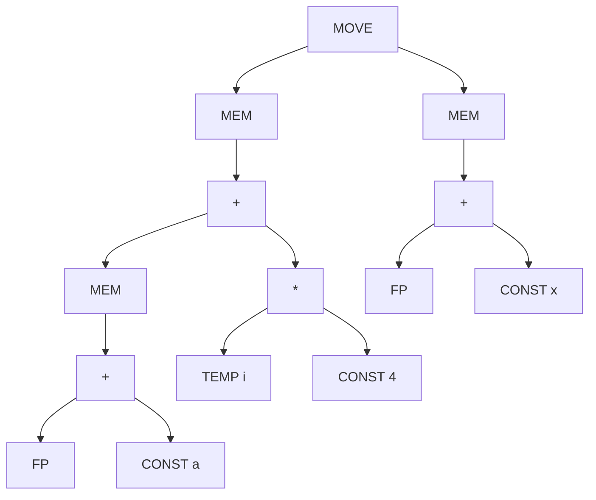

# Chapter9 指令选择 Instruction Selection

## 9.0. 引入

### 9.0.1. 为什么需要指令选择？

IR 与实际机器指令之间的不匹配。
	* IR 树语言在每个节点只表达一个操作（如：取值、存储、加法、跳转等） 。
	* 而真正的机器指令通常一条就能完成多个原始操作 。

### 9.0.2. 实现技术

**模式匹配技术：** 寻找匹配 IR 片段的机器指令 。

介绍了两种主流的匹配技术：

* **树形 IR：** 建议使用树匹配。例如：基于**动态规划**的匹配 。
* **线性 IR：** 建议使用字符串匹配。例如：文本匹配、**窥孔优化**匹配（Peephole matching） 。

## 9.1. 树模式（Tree Patterns）

每条机器指令都可以表示为一个 IR 树片段，称为**树模式** 。

**指令选择的过程：** 用一组不重叠的树模式（瓦片）来覆盖整棵 IR 树 。


### 9.1.1. Jouette 架构

* 本课件使用教材中发明的 **Jouette 架构** 来演示 。


Jouette 架构指令集展示了模拟架构的指令、效果及其对应的 IR 树模式。

以下是 Jouette 架构的部分指令对应关系表：

<table>
    <thead>
        <tr>
            <th>指令名称</th>
            <th>效果 (Effect)</th>
            <th>对应的树模式描述 (Tree Pattern)</th>
        </tr>
    </thead>
    <tbody>
        <tr>
            <td><strong>—</strong></td>
            <td> $r_i$ </td>
            <td>
                <div class="mermaid">
                    ```mermaid
                    graph TD
                        A1[TEMP]
                    ```
                </div>
            </td>
        </tr>
        <tr>
            <td><strong>ADD</strong></td>
            <td> $r_i \leftarrow r_j + r_k$ </td>
            <td>
                <div class="mermaid">
                    ```mermaid
                    graph TD
                        A1(+) --> A2[ ]
                        A1 --> A3[ ]
                    ```
                </div>
            </td>
        </tr>
        <tr>
            <td><strong>MUL</strong></td>
            <td> $r_i \leftarrow r_j * r_k$ </td>
            <td>
                <div class="mermaid">
                    ```mermaid
                    graph TD
                        A1(*) --> A2[ ]
                        A1 --> A3[ ]
                    ```
                </div>
            </td>
        </tr>
        <tr>
            <td><strong>SUB</strong></td>
            <td> $r_i \leftarrow r_j - r_k$ </td>
            <td>
                <div class="mermaid">
                    ```mermaid
                    graph TD
                        A1(SUB) --> A2[ ]
                        A1 --> A3[ ]
                    ```
                </div>
            </td>
        </tr>
        <tr>
            <td><strong>DIV</strong></td>
            <td> $r_i \leftarrow r_j / r_k$ </td>
            <td>
                <div class="mermaid">
                    ```mermaid
                    graph TD
                        A1(/) --> A2[ ]
                        A1 --> A3[ ]
                    ```
                </div>
            </td>
        </tr>
        <tr>
            <td><strong>ADDI</strong></td>
            <td>$r_i \leftarrow r_j + c$</td>
            <td>
                <div class="mermaid">
                    ```mermaid
                    graph TD
                        A1(+) --> A2[ ]
                        A1 --> A3[CONST]
                    ```
                </div>
                <hr> 
                <div class="mermaid">
                    ```mermaid
                    graph TD
                        A1(+) --> A2[CONST]
                        A1 --> A3[ ]
                    ```
                </div>
                <hr> 
                <div class="mermaid">
                    ```mermaid
                    graph TD
                        A1[CONST]
                    ```
                </div>
            </td>
        </tr>
        <tr>
            <td><strong>SUBI</strong></td>
            <td>$r_i \leftarrow r_j - c$</td>
            <td>
                <div class="mermaid">
                    ```mermaid
                    graph TD
                        A1(SUB) --> A2[ ]
                        A1 --> A3[CONST]
                    ```
                </div>
            </td>
        </tr>
        <tr>
            <td><strong>LOAD</strong></td>
            <td>$r_i \leftarrow M[r_j + c]$</td>
            <td>
                <div class="mermaid">
                    ```mermaid
                    graph TD
                        A1(MEM) --> A2(+)
                        A2 --> A3[ ]
                        A2 --> A4[CONST]
                    ```
                </div>
                <hr>
                <div class="mermaid">
                    ```mermaid
                    graph TD
                        A1(MEM) --> A2(+)
                        A2 --> A3[CONST]
                        A2 --> A4[ ]
                    ```
                </div>
                <hr>
                <div class="mermaid">
                    ```mermaid
                    graph TD
                        A1(MEM) --> A2[CONST]
                    ```
                </div>
                <hr>
                <div class="mermaid">
                    ```mermaid
                    graph TD
                        A1(MEM) --> A2[ ]
                    ```
                </div>
            </td>
        </tr>
        <tr>
            <td><strong>STORE</strong></td>
            <td>$M[r_j + c] \leftarrow r_i$</td>
            <td>
                <div class="mermaid">
                    ```mermaid
                    graph TD
                        A1(MOVE) --> A2(MEM)
                        A1 --> A3[ ]
                        A2 --> A4(+)
                        A4 --> A5[ ]
                        A4 --> A6[CONST]
                    ```
                </div>
                <hr>
                <div class="mermaid">
                    ```mermaid
                    graph TD
                        A1(MOVE) --> A2(MEM)
                        A1 --> A3[ ]
                        A2 --> A4(+)
                        A4 --> A5[CONST]
                        A4 --> A6[ ]
                    ```
                </div>
                <hr>
                <div class="mermaid">
                    ```mermaid
                    graph TD
                        A1(MOVE) --> A2(MEM)
                        A1 --> A3[ ]
                        A2 --> A4[CONST]
                    ```
                </div>
                <hr>
                <div class="mermaid">
                    ```mermaid
                    graph TD
                        A1(MOVE) --> A2(MEM)
                        A1 --> A3[ ]
                        A2 --> A4[ ]
                    ```
                </div>
            </td>
        </tr>
        <tr>
            <td><strong>MOVEM</strong></td>
            <td>$M[r_j] \leftarrow M[r_i]$</td>
            <td>
                <div class="mermaid">
                    ```mermaid
                    graph TD
                        A1(MOVE) --> A2(MEM)
                        A1 --> A3(MEM)
                        A2 --> A4[ ]
                        A3 --> A5[ ]
                    ```
                </div>
            </td>
        </tr>
    </tbody>
</table>


**补充规范：** 

* 寄存器 `r0` 始终包含 0；
* 某些指令对应多种树模式 。


### 9.1.2. 覆盖示例 (a[i] := x)

用 IR tree 表示为：



* 同一棵树可以有多种覆盖方式 。


* **方案 (a)：** 使用了较多的小指令，如普通的 `LOAD` 和 `STORE` 。

```text
LOAD r1, [fp + a]
ADDI r2, r0, #4
MUL r2, ri, r2
ADD r1, r1, r2
LOAD r2, [fp + x]
STORE [r1 + 0], r2
```

* **方案 (b)：** 使用了 `MOVEM` 等更大块的指令 。

```text
LOAD   r1 ← M[fp + a]
ADDI   r2 ← r0 + 4
MUL    r2 ← ri × r2
ADD    r1 ← r1 + r2
ADDI   r2 ← fp + x
MOVEM  M[r1] ← M[r2]
```


* **极端情况：** 也可以用最碎的瓦片覆盖（每个节点一个瓦片），但效率极低 。

```text
ADDI r1 ← r0 + a
ADD r1 ← fp + r1
LOAD r1 ← M[r1 + 0]
ADDI r2 ← r0 + 4
MUL r2 ← ri × r2
ADD r1 ← r1 + r2
ADDI r2 ← r0 + x
ADD r2 ← fp + r2
LOAD r2 ← M[r2 + 0]
STORE M[r1 + 0] ← r2
```


---

### 第 17-18 页：最佳与最优覆盖（Optimal vs. Optimum）

**内容描述：** 区分了两种质量等级的指令选择结果。

* **翻译：**
* 
**最优覆盖（Optimum）：** 所有瓦片成本之和最低。属于“全局最优” 。


* 
**最佳覆盖（Optimal）：** 没有两个相邻瓦片可以被合并成一个成本更低的瓦片。属于“局部最优” 。


* 
**结论：** 每一个“最优”覆盖都是“最佳”的，但反之不然 。


---

### 第 19-24 页：Maximal Munch 算法

**内容描述：** 详细介绍了一种顶向下的贪心算法。

* **算法逻辑 (Maximal Munch)：**
1. 从树根开始，找到能匹配根节点的**最大**瓦片 。


2. 覆盖根节点，并留下若干子树 。


3. 对每个子树重复此过程 。


4. 指令是按**逆序**生成的 。


* 
**特点：** 总是能找到“最佳（Optimal）”覆盖，但不一定是“最优（Optimum）” 。


---

### 第 25-32 页：动态规划算法

**内容描述：** 介绍了一种底向上的算法，旨在寻找“最优（Optimum）”覆盖。

* **算法逻辑：**
1. 
**底向上计算成本：** 为树中的每个节点分配一个成本 $f(x)$ 。


2. 
**公式：** 节点 $x$ 的成本 = $\min(当前瓦片成本 + 瓦片叶子节点的预计算成本)$ 。


3. 
**指令发射：** 从根节点开始，递归发射匹配到的最小成本指令 。


* 
**示例过程（第29-31页）：** 展示了从 `CONST` 节点开始，逐步向上计算 `+` 节点和 `MEM` 节点最低成本的过程 。


---

### 第 34 页：效率对比

**内容描述：** 分析了两种算法的时间复杂度。

* **翻译：**
* $N$ 为树节点数。
* 
**Maximal Munch 复杂度：** 正比于 $((K' + T')N / K)$ 。


* 
**动态规划复杂度：** 正比于 $((K' + T')N)$ 。


* 
**结论：** 由于各常数因子固定，两种算法在实际运行中都是**线性时间复杂度** 。


---

### 总结图表：算法对比

| 特性 | Maximal Munch (最大吞噬) | Dynamic Programming (动态规划) |
| --- | --- | --- |
| **策略** | 顶向下 (Top-down) 

 | 底向上 (Bottom-up) 

 |
| **性质** | 贪心算法 

 | 最优子结构 

 |
| **结果质量** | 局部最佳 (Optimal) 

 | 全局最优 (Optimum) 

 |
| **复杂度** | 线性 

 | 线性 

 |

---

注：课件最后几页提到了 CISC 机器以及 Tiger 编译器的具体实现方案，主要作为大纲展示 。