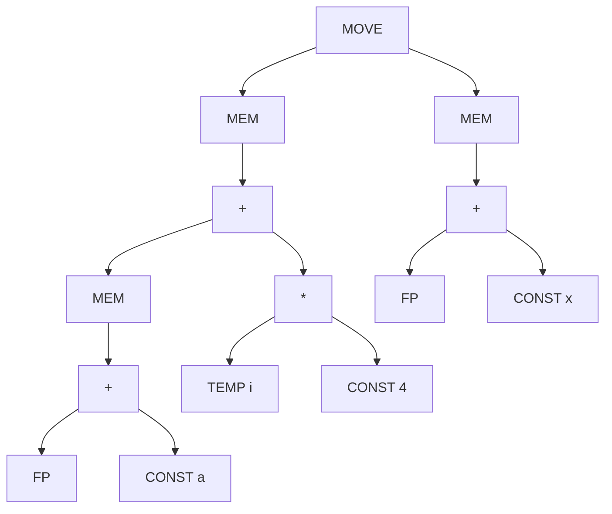
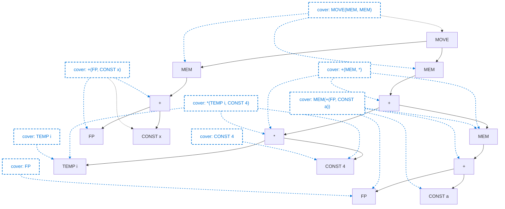
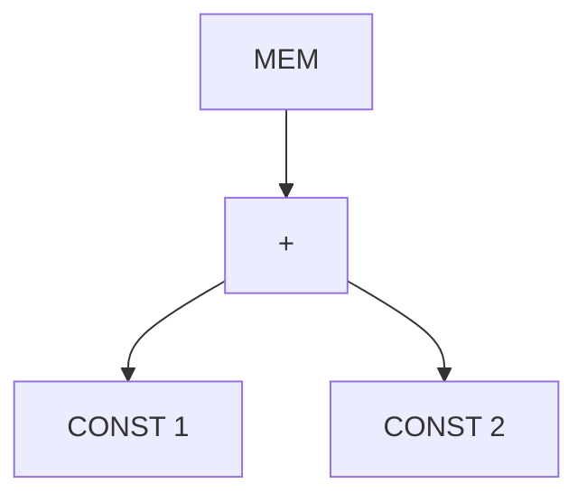
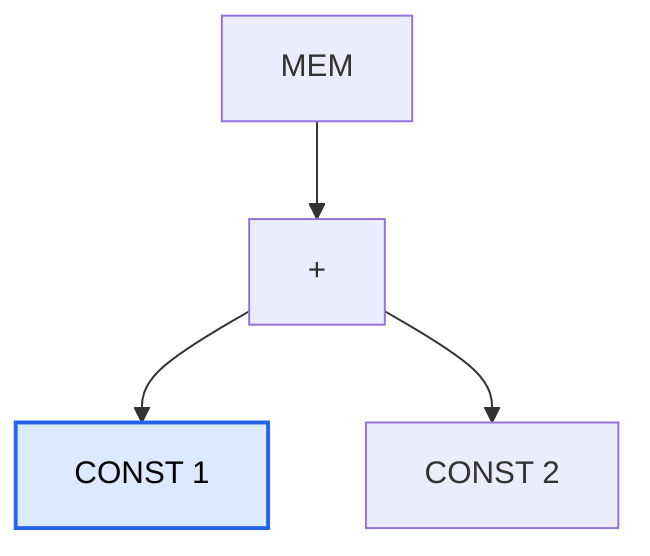
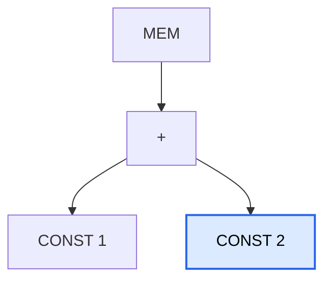
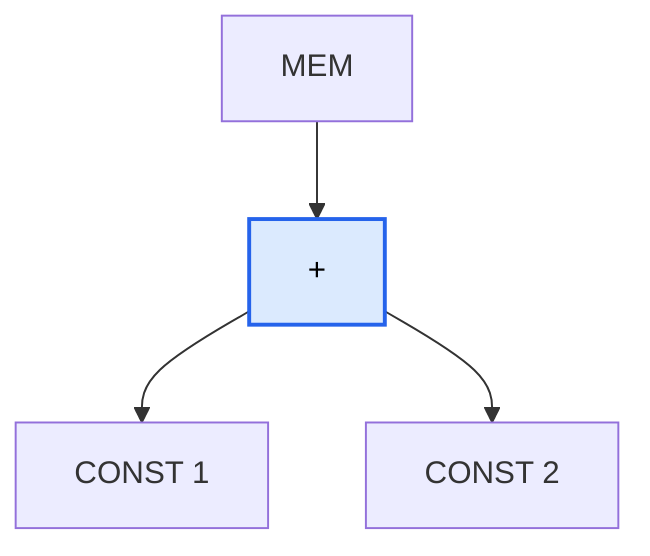
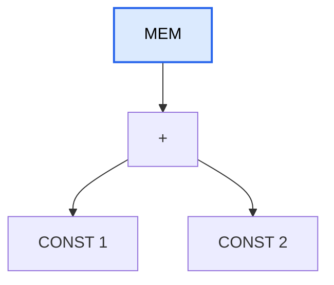

# Chapter9 指令选择 Instruction Selection

> 把 IR tree 映射为具体的汇编指令

## 9.0. 引入

### 9.0.1. 为什么需要指令选择？

IR 与实际机器指令之间的不匹配。

* IR 树语言在每个节点只表达一个操作（如：取值、存储、加法、跳转等） 。
* 而真正的机器指令通常一条就能完成多个原始操作 。

### 9.0.2. 实现技术

**模式匹配技术：** 寻找匹配 IR 片段的机器指令 。

介绍了两种主流的匹配技术：

* **树形 IR：** 建议使用树匹配。例如：基于**动态规划**的匹配 。
* **线性 IR：** 建议使用字符串匹配。例如：文本匹配、**窥孔优化**匹配（Peephole matching） 。

## 9.1. 树模式（Tree Patterns）

每条机器指令都可以表示为一个 IR 树片段，称为**树模式** 。

**指令选择的过程：** 用一组最小的不重叠的树模式（瓦片）来覆盖整棵 IR 树 。


### 9.1.1. Jouette 架构

* 本课件使用教材中发明的 **Jouette 架构** 来演示 。


Jouette 架构指令集展示了模拟架构的指令、效果及其对应的 IR 树模式。

以下是 Jouette 架构的部分指令对应关系表：

<table>
    <thead>
        <tr>
            <th>指令名称</th>
            <th>效果 (Effect)</th>
            <th>对应的树模式描述 (Tree Pattern)</th>
        </tr>
    </thead>
    <tbody>
        <tr>
            <td><strong>—</strong></td>
            <td> $r_i$ </td>
            <td>
                <div class="mermaid">
                    ```mermaid
                    graph TD
                        A1[TEMP]
                    ```
                </div>
            </td>
        </tr>
        <tr>
            <td><strong>ADD</strong></td>
            <td> $r_i \leftarrow r_j + r_k$ </td>
            <td>
                <div class="mermaid">
                    ```mermaid
                    graph TD
                        A1(+) --> A2[ ]
                        A1 --> A3[ ]
                    ```
                </div>
            </td>
        </tr>
        <tr>
            <td><strong>MUL</strong></td>
            <td> $r_i \leftarrow r_j * r_k$ </td>
            <td>
                <div class="mermaid">
                    ```mermaid
                    graph TD
                        A1(*) --> A2[ ]
                        A1 --> A3[ ]
                    ```
                </div>
            </td>
        </tr>
        <tr>
            <td><strong>SUB</strong></td>
            <td> $r_i \leftarrow r_j - r_k$ </td>
            <td>
                <div class="mermaid">
                    ```mermaid
                    graph TD
                        A1(SUB) --> A2[ ]
                        A1 --> A3[ ]
                    ```
                </div>
            </td>
        </tr>
        <tr>
            <td><strong>DIV</strong></td>
            <td> $r_i \leftarrow r_j / r_k$ </td>
            <td>
                <div class="mermaid">
                    ```mermaid
                    graph TD
                        A1(/) --> A2[ ]
                        A1 --> A3[ ]
                    ```
                </div>
            </td>
        </tr>
        <tr>
            <td><strong>ADDI</strong></td>
            <td>$r_i \leftarrow r_j + c$</td>
            <td>
                <div class="mermaid">
                    ```mermaid
                    graph TD
                        A1(+) --> A2[ ]
                        A1 --> A3[CONST]
                    ```
                </div>
                <hr> 
                <div class="mermaid">
                    ```mermaid
                    graph TD
                        A1(+) --> A2[CONST]
                        A1 --> A3[ ]
                    ```
                </div>
                <hr> 
                <div class="mermaid">
                    ```mermaid
                    graph TD
                        A1[CONST]
                    ```
                </div>
            </td>
        </tr>
        <tr>
            <td><strong>SUBI</strong></td>
            <td>$r_i \leftarrow r_j - c$</td>
            <td>
                <div class="mermaid">
                    ```mermaid
                    graph TD
                        A1(SUB) --> A2[ ]
                        A1 --> A3[CONST]
                    ```
                </div>
            </td>
        </tr>
        <tr>
            <td><strong>LOAD</strong></td>
            <td>$r_i \leftarrow M[r_j + c]$</td>
            <td>
                <div class="mermaid">
                    ```mermaid
                    graph TD
                        A1(MEM) --> A2(+)
                        A2 --> A3[ ]
                        A2 --> A4[CONST]
                    ```
                </div>
                <hr>
                <div class="mermaid">
                    ```mermaid
                    graph TD
                        A1(MEM) --> A2(+)
                        A2 --> A3[CONST]
                        A2 --> A4[ ]
                    ```
                </div>
                <hr>
                <div class="mermaid">
                    ```mermaid
                    graph TD
                        A1(MEM) --> A2[CONST]
                    ```
                </div>
                <hr>
                <div class="mermaid">
                    ```mermaid
                    graph TD
                        A1(MEM) --> A2[ ]
                    ```
                </div>
            </td>
        </tr>
        <tr>
            <td><strong>STORE</strong></td>
            <td>$M[r_j + c] \leftarrow r_i$</td>
            <td>
                <div class="mermaid">
                    ```mermaid
                    graph TD
                        A1(MOVE) --> A2(MEM)
                        A1 --> A3[ ]
                        A2 --> A4(+)
                        A4 --> A5[ ]
                        A4 --> A6[CONST]
                    ```
                </div>
                <hr>
                <div class="mermaid">
                    ```mermaid
                    graph TD
                        A1(MOVE) --> A2(MEM)
                        A1 --> A3[ ]
                        A2 --> A4(+)
                        A4 --> A5[CONST]
                        A4 --> A6[ ]
                    ```
                </div>
                <hr>
                <div class="mermaid">
                    ```mermaid
                    graph TD
                        A1(MOVE) --> A2(MEM)
                        A1 --> A3[ ]
                        A2 --> A4[CONST]
                    ```
                </div>
                <hr>
                <div class="mermaid">
                    ```mermaid
                    graph TD
                        A1(MOVE) --> A2(MEM)
                        A1 --> A3[ ]
                        A2 --> A4[ ]
                    ```
                </div>
            </td>
        </tr>
        <tr>
            <td><strong>MOVEM</strong></td>
            <td>$M[r_j] \leftarrow M[r_i]$</td>
            <td>
                <div class="mermaid">
                    ```mermaid
                    graph TD
                        A1(MOVE) --> A2(MEM)
                        A1 --> A3(MEM)
                        A2 --> A4[ ]
                        A3 --> A5[ ]
                    ```
                </div>
            </td>
        </tr>
    </tbody>
</table>


**补充规范：** 

* 寄存器 `r0` 始终包含 0；
* 某些指令对应多种树模式 。


### 9.1.2. 覆盖示例 (a[i] := x)

用 IR tree 表示为：



* 同一棵树可以有多种覆盖方式 。


* **方案 (a)：** 使用了较多的小指令，如普通的 `LOAD` 和 `STORE` 。

```text
LOAD r1, [fp + a]
ADDI r2, r0, #4
MUL r2, ri, r2
ADD r1, r1, r2
LOAD r2, [fp + x]
STORE [r1 + 0], r2
```

* **方案 (b)：** 使用了 `MOVEM` 等更大块的指令 。

```text
LOAD   r1 ← M[fp + a]
ADDI   r2 ← r0 + 4
MUL    r2 ← ri × r2
ADD    r1 ← r1 + r2
ADDI   r2 ← fp + x
MOVEM  M[r1] ← M[r2]
```


* **极端情况：** 也可以每个节点都匹配，但这样效率极低，并不是很好的选择，所以需要选择合适的覆盖方式。

```text
ADDI r1 ← r0 + a
ADD r1 ← fp + r1
LOAD r1 ← M[r1 + 0]
ADDI r2 ← r0 + 4
MUL r2 ← ri × r2
ADD r1 ← r1 + r2
ADDI r2 ← r0 + x
ADD r2 ← fp + r2
LOAD r2 ← M[r2 + 0]
STORE M[r1 + 0] ← r2
```


### 9.1.3. 最佳与最优覆盖（Optimal vs. Optimum）

IR 树可以采用多种方式进行分块。

* **最佳分块（Best tiling）**：成本最低的指令序列。
    * 对于单发射固定延迟机器，意味着最少的指令数。
* **最优覆盖（Optimum tiling）：** 所有可能覆盖中，所有瓦片成本之和最低。属于“全局最优” 。
* **最佳覆盖（Optimal tiling）：** 没有两个相邻瓦片可以被合并成一个成本更低的瓦片。属于“局部最优” 。
    * 如果存在某种块可以拆分成多个总成本更低的块，那么我们应该将该模式从我们的块集合中移除。因为这一个没有存在的意义

每个 Optimum 分块也是 Optimal 的，反之则不然。


#### 9.1.3.2. 例子

还是上面的例子：假设除 `MOVEM` 指令外，每条指令的成本均为 1 个单位；MOVEM 指令的成本为 m 个单位。

* **方案 (a)：** 使用了较多的小指令，如普通的 `LOAD` 和 `STORE` 。

```text
LOAD r1, [fp + a]
ADDI r2, r0, #4
MUL r2, ri, r2
ADD r1, r1, r2
LOAD r2, [fp + x]
STORE [r1 + 0], r2
```

* **方案 (b)：** 使用了 `MOVEM` 等更大块的指令 。

```text
LOAD   r1 ← M[fp + a]
ADDI   r2 ← r0 + 4
MUL    r2 ← ri × r2
ADD    r1 ← r1 + r2
ADDI   r2 ← fp + x
MOVEM  M[r1] ← M[r2]
```

两个覆盖方式都是 `Optimal tiling` ，因为无法通过合并瓦片来降低成本。

方案 a 需要 6 个单位，b 需要 5+m 个单位，所以判断 m 确定谁是 `Optimum` 覆盖。

## 9.2.  Algorithms for Instruction Selection（指令选择算法）

### 9.2.1. Maximal Munch 算法

#### 9.2.1.1. 算法流程

**内容描述：** 详细介绍了一种顶向下的贪心算法。

* **算法逻辑 (Maximal Munch)：**

    1. 从树根开始，找到能匹配根节点的**最大**瓦片 。
        * ***最大：*** 子节点最多的的
    2. 覆盖根节点，并留下若干子树 。
    3. 对每个子树重复此过程 。
    4. 指令是按**逆序**生成的 。

* **特点：** 总是能找到“最佳（Optimal）”覆盖，但不一定是“最优（Optimum）” 。
    * 原因：为了更加 optimal 总要有一个瓦片要合并相邻的指令，所以贪心算法不会成立，所以贪心算出来的一定是 optimal 的。

#### 9.2.1.2. 示例

依然 `a[i] := x`，用 IR tree 表示为：


<table>
    <thead>
        <tr>
            <th>指令名称</th>
            <th>效果 (Effect)</th>
            <th>对应的树模式描述 (Tree Pattern)</th>
        </tr>
    </thead>
    <tbody>
        <tr>
            <td><strong>—</strong></td>
            <td> $r_i$ </td>
            <td>
                <div class="mermaid">
                    ```mermaid
                    graph TD
                        A1[TEMP]
                    ```
                </div>
            </td>
        </tr>
        <tr>
            <td><strong>ADD</strong></td>
            <td> $r_i \leftarrow r_j + r_k$ </td>
            <td>
                <div class="mermaid">
                    ```mermaid
                    graph TD
                        A1(+) --> A2[ ]
                        A1 --> A3[ ]
                    ```
                </div>
            </td>
        </tr>
        <tr>
            <td><strong>MUL</strong></td>
            <td> $r_i \leftarrow r_j * r_k$ </td>
            <td>
                <div class="mermaid">
                    ```mermaid
                    graph TD
                        A1(*) --> A2[ ]
                        A1 --> A3[ ]
                    ```
                </div>
            </td>
        </tr>
        <tr>
            <td><strong>SUB</strong></td>
            <td> $r_i \leftarrow r_j - r_k$ </td>
            <td>
                <div class="mermaid">
                    ```mermaid
                    graph TD
                        A1(SUB) --> A2[ ]
                        A1 --> A3[ ]
                    ```
                </div>
            </td>
        </tr>
        <tr>
            <td><strong>DIV</strong></td>
            <td> $r_i \leftarrow r_j / r_k$ </td>
            <td>
                <div class="mermaid">
                    ```mermaid
                    graph TD
                        A1(/) --> A2[ ]
                        A1 --> A3[ ]
                    ```
                </div>
            </td>
        </tr>
        <tr>
            <td><strong>ADDI</strong></td>
            <td>$r_i \leftarrow r_j + c$</td>
            <td>
                <div class="mermaid">
                    ```mermaid
                    graph TD
                        A1(+) --> A2[ ]
                        A1 --> A3[CONST]
                    ```
                </div>
                <hr> 
                <div class="mermaid">
                    ```mermaid
                    graph TD
                        A1(+) --> A2[CONST]
                        A1 --> A3[ ]
                    ```
                </div>
                <hr> 
                <div class="mermaid">
                    ```mermaid
                    graph TD
                        A1[CONST]
                    ```
                </div>
            </td>
        </tr>
        <tr>
            <td><strong>SUBI</strong></td>
            <td>$r_i \leftarrow r_j - c$</td>
            <td>
                <div class="mermaid">
                    ```mermaid
                    graph TD
                        A1(SUB) --> A2[ ]
                        A1 --> A3[CONST]
                    ```
                </div>
            </td>
        </tr>
        <tr>
            <td><strong>LOAD</strong></td>
            <td>$r_i \leftarrow M[r_j + c]$</td>
            <td>
                <div class="mermaid">
                    ```mermaid
                    graph TD
                        A1(MEM) --> A2(+)
                        A2 --> A3[ ]
                        A2 --> A4[CONST]
                    ```
                </div>
                <hr>
                <div class="mermaid">
                    ```mermaid
                    graph TD
                        A1(MEM) --> A2(+)
                        A2 --> A3[CONST]
                        A2 --> A4[ ]
                    ```
                </div>
                <hr>
                <div class="mermaid">
                    ```mermaid
                    graph TD
                        A1(MEM) --> A2[CONST]
                    ```
                </div>
                <hr>
                <div class="mermaid">
                    ```mermaid
                    graph TD
                        A1(MEM) --> A2[ ]
                    ```
                </div>
            </td>
        </tr>
        <tr>
            <td><strong>STORE</strong></td>
            <td>$M[r_j + c] \leftarrow r_i$</td>
            <td>
                <div class="mermaid">
                    ```mermaid
                    graph TD
                        A1(MOVE) --> A2(MEM)
                        A1 --> A3[ ]
                        A2 --> A4(+)
                        A4 --> A5[ ]
                        A4 --> A6[CONST]
                    ```
                </div>
                <hr>
                <div class="mermaid">
                    ```mermaid
                    graph TD
                        A1(MOVE) --> A2(MEM)
                        A1 --> A3[ ]
                        A2 --> A4(+)
                        A4 --> A5[CONST]
                        A4 --> A6[ ]
                    ```
                </div>
                <hr>
                <div class="mermaid">
                    ```mermaid
                    graph TD
                        A1(MOVE) --> A2(MEM)
                        A1 --> A3[ ]
                        A2 --> A4[CONST]
                    ```
                </div>
                <hr>
                <div class="mermaid">
                    ```mermaid
                    graph TD
                        A1(MOVE) --> A2(MEM)
                        A1 --> A3[ ]
                        A2 --> A4[ ]
                    ```
                </div>
            </td>
        </tr>
        <tr>
            <td><strong>MOVEM</strong></td>
            <td>$M[r_j] \leftarrow M[r_i]$</td>
            <td>
                <div class="mermaid">
                    ```mermaid
                    graph TD
                        A1(MOVE) --> A2(MEM)
                        A1 --> A3(MEM)
                        A2 --> A4[ ]
                        A3 --> A5[ ]
                    ```
                </div>
            </td>
        </tr>
    </tbody>
</table>

1. 首先头上可以匹配到 

    ```mermaid
    graph TD
        A1(MOVE) --> A2(MEM)
        A1 --> A3(MEM)
        A2 --> A4[ ]
        A3 --> A5[ ]
    ```

    和
    ```mermaid
    graph TD
        A1(MOVE) --> A2(MEM)
        A1 --> A3[ ]
        A2 --> A4[ ]
    ```
    这一组其他的 const 位置不符合只能匹配这个

    选最大的 

    ```mermaid
    graph TD
        A1(MOVE) --> A2(MEM)
        A1 --> A3(MEM)
        A2 --> A4[ ]
        A3 --> A5[ ]
    ```


最终：



#### 9.2.1.3. 算法实现

* 两个递归函数：

    * munchStm 用于语句

    * munchExp 用于表达式

* munchExp 的每个子句将匹配一个图块。

* 子句按图块优先级排序（最大的图块优先）。


### 9.2.2. 动态规划算法


介绍了一种底向上的算法，旨在寻找“最优（Optimum）”覆盖。

#### 9.2.2.1. 算法流程

**算法逻辑：**

1. **底向上(bottom-up)计算成本：** 为树中的每个节点分配一个成本 $f(x)$ 。

    * `f(x)`：覆盖以 x 为根的子树的最优 `cost`。
    * ct：tile cost
    * i：tile leaves

2. **公式：** 节点 $x$ 的成本 = $\min(当前瓦片成本 + 瓦片叶子节点的预计算成本)$ 。
    $$
        f(x)=
        \min_{\substack{\forall\ \text{tile } t\\ \text{covering } x}}
        \left(
        c_t+\sum_{\substack{\forall\ \text{leaf } i\\ \text{of } t}} f(i)
        \right)
    $$
3. **指令发射：** 从根节点开始，递归发射匹配到的最小成本指令 。


#### 9.2.2.2. 动态规划细节


步骤：

1. 递归计算子节点 cost
2. 枚举当前节点所有匹配 tile
3. 计算：

    tile cost + leaves cost

4. 选择最小值

#### 9.2.2.3. DP 示例：



##### 叶子节点





CONST 节点是叶子节点，所以没有 leaf 的 cost，只要考虑本身消耗

| Pattern (Tile) | Cost | Leaves Cost | Total |
|---|---:|---:|---:|
| (8) `CONST` | 1 | 0 | 1 |


##### 加法



有三种匹配方法：

1. 纯加号：本身消耗 1 ，两个叶子每个消耗 1，共 3。
2. 立即数左加法指令：本身消耗 1 ，吃掉了左侧的 const，右叶子每个消耗 1，共 2。
3. 立即数右加法指令：本身消耗 1 ，吃掉了右侧的 const，左叶子每个消耗 1，共 2。

最后 2，3 随便选一个都可以

| Pattern (Tile) | Cost | Leaves Cost | Total |
|---|---:|---:|---:|
| (2) `+(e1, e2)` | 1 | 2 | 3 |
| (6) `+(CONST, e1)` | 1 | 1 | 2 |
| (7) `+(e1, CONST)` | 1 | 1 | 2 |

反正 + 这个节点消耗最小就是 2 了。

##### MEM 节点




MEM 节点可匹配：

1. `MEM(e1)`：本身消耗 1，子节点 + 消耗是 2，一共是 3。
2. `MEM(+(e1,CONST))` 或者 `MEM(+(CONST,e1))`：子节点都是只有一个 const，+和另一个 const被吃掉了

后者更便宜，随便选一个。

| Pattern (Tile) | Cost | Leaves Cost | Total |
|---|---:|---:|---:|
| (13) `MEM(e1)` | 1 | 2 | 3 |
| (10) `MEM(+(e1, CONST))` | 1 | 1 | 2 |
| (11) `MEM(+(CONST, e1))` | 1 | 1 | 2 |

#### 指令流出（Instruction Emission）

找到 root 最优 cost 后，开始生成 instruction。

算法：Emission(node n)

1. 对每个叶子节点递归 emission，emission(li)
2. emit 当前 instruction

### 9.2.3. Fast Matching

*我们称表格中每一格可供匹配的对应一条语句的部件结构为 tile* 

以上两种算法在匹配的时候，会且近会考虑每一个 match 节点的 tile（就是匹配上的一块），避免了所有 tile 都被扫一遍太慢

* match 表示这个 tile 的每个非叶子节点都与当前节点以及其儿孙的 label 匹配。例如：

    switch(label)

    * MEM
    * BINOP
    * CONST

* 我们希望 IR tree 的每个节点都只被检查一次


### 9.2.4. 算法复杂度

我们下面要分析贪心和动态规划的复杂度

设：

* N：IR tree 节点数
* K：平均一个 tile 有 K 个节点
    * 所以需要匹配出 $N/K$ 个 tile
* K'：为了确定每个节点匹配哪个 tile 最多要看多少个节点
* T'：每个节点平均能和多少个 tile 匹配

则：

Maximal Munch 需要：

$$
O((K'+T')N/K)
$$

次匹配，因为当且仅当每个成功匹配时要算一遍 $K'+T'$

Dynamic Programming 需要：

$$
O((K'+T')N)
$$

次匹配，因为每个节点都要算一遍 $K'+T'$


因为常数固定，两者都近似线性。


## 9.3. CISC

### 9.3.1.  RISC vs CISC
| RISC machine | CISC machine |
|---|---|
| 32 个寄存器 | 少量寄存器（16、8 或 6 个） |
| 只有一种整数/指针寄存器类别 | 寄存器被划分为不同类别，某些操作只能用于特定寄存器 |
| 算术运算只能在寄存器之间进行 | 算术运算可以通过“寻址模式”访问寄存器或内存 |
| “三地址”指令形式：`r1 ← r2 ⊕ r3` | “二地址”指令形式：`r1 ← r1 ⊕ r2` |
| load/store 指令只支持 `M[reg+const]` 寻址模式 | 支持多种不同的寻址模式 |
| 每条指令长度固定为 32 位 | 指令长度可变，由可变长度 opcode 与可变长度寻址模式组成 |
| 每条指令只产生一个结果或效果 | 指令可能具有副作用，例如“自动递增（autoincrement）”寻址模式 |

### 9.3.2. CISC 问题

所以对于 CISC 机器我们需要做适配

#### 9.3.2.1. 寄存器少

指令选择阶段不需要关心，等寄存器分配阶段解决

#### 9.3.2.2. 多种寄存器

Pentium 上的乘法，左操作数必须是 eax 寄存器，结果的高位被放入 edx 寄存器

显式 move 来解决。

例如 `t1 ← t2 × t3`

```
mov eax, t2  /* eax ← t2 */
mul t3    /* eax ← eax × t3;     edx ← garbage */
mov t1, eax  /* t1 ← eax */
```

#### 9.3.2.3. Two-address instruction

例如 `add t1,t2` 表示 `t1 ← t1+t2`

为了将三地址指令转为两地址指令，需要插入额外 move。

三地址：`a=b+c` 两地址：`a=a+c`

因此需要：
```
mov a,b
add a,c
```

然后我们希望寄存器分配器能够将 a 和 b 分配给同一个寄存器，以便删除 mov 指令。

#### 9.3.2.4. CISC 内存操作

CISC 的算术 instruction 可直接访问 memory。

需要先 load 到 register。再操作。

RISC 风格的

```
mov eax, [ebp - 8]
add eax, ecx                 
mov [ebp - 8], eax
```

实际上就是 CISC 风格的

```
add [ebp - 8], ecx
```

物理实现

但是 CISC 风格的好处是不会破坏 eax 寄存器

#### 9.3.2.5. CISC Addressing Modes

有多种寻址模式的复杂 addressing mode 优势：

* 少用寄存器，避免影响更多寄存器
* instruction 更短

但并不一定更快。因为例如复杂的六个功能的指令会被拆成六条单一功能


#### 9.3.2.6. 可变长度指令：

对编译器来说并非真正的问题；一旦选择了指令，汇编器生成编码就成了一件简单（尽管繁琐）的事情。

#### 9.3.2.7 Side Effects

例如 autoincrement：

```
r2 ← M[r1]
r1 ← r1+4
```

一个 instruction 两个 effect，一个是读内存，一个是自增。


解决方法：

* 直接不用了
* 用一些方法实现
* 匹配的时候换匹配方法


### 9.3.3. 指令选择算法

对于 RISC，optimal 与 optimum 基本没区别。因为 tile 小，cost 接近，因此简单算法足够。

对于 CISC 架构，optimal 与 optimum 之间的差异很明显。有些指令可以完成多个操作。

## 9.4. Tiger 的指令选择


tile root 对应：

某个 intermediate result。

这个值放在哪个 register？

由 register allocation 决定。

寄存器分配放在 instruction selection 后面。

---

## 讲解

这是经典设计：

先生成：

TEMP t1
TEMP t2

后续再：

* graph coloring
* linear scan

映射到真实寄存器。

---

# 第53页

## 抽象汇编结构

### 翻译

定义：

AS_instr

包含：

* I_OPER
* I_LABEL
* I_MOVE

---

## 讲解

这是 Tiger 编译器中的：

Machine-independent assembly IR。

非常重要。

它已经：

“像汇编”

但还没：

“真正绑定机器寄存器”。

---

# 第54页

## OPER

### 翻译

OPER 包含：

* assem：汇编字符串
* src：源寄存器
* dst：目标寄存器
* jumps：跳转目标

---

## 讲解

这是 dataflow analysis 的基础。

后面 register allocation：

会用：

* use
* def

信息构建 interference graph。

---

# 第55页

## LABEL

### 翻译

LABEL 表示：

程序中的跳转目标。

---

## 讲解

例如：

L1:

就是 LABEL。

CFG（控制流图）建立时会用到。

---

# 第56页

## MOVE

### 翻译

MOVE 只能做数据传输。

AS_print：

负责真正打印汇编。

---

## 讲解

后续 register coalescing：

会重点优化 MOVE。

例如：

mov r1,r1

可以删除。

---

# 第57页

## Machine Independence

### 翻译

AS_instr 与具体机器无关。

示例：

LOAD `d0 <- M[`s0+8]

其中：

* `s0：第0个 source
* `d0：第0个 destination

---

## 讲解

这其实是：

模板汇编。

真正 register allocation 后：

`s0 → r27

才会最终打印。

---

# 第58页

## Machine Independence 示例2

### 翻译

instruction selector 生成：

* t908
* t909
* t910

这些 temporary。

后续 register allocation：

映射到：

* r1
* r2

---

## 讲解

TEMP 是 SSA/value 的前身思想。

编译器中：

* TEMP 无限多
* 真寄存器有限

register allocation：

就是解决这个矛盾。

---

# 第59页

## Two-address 指令

### 翻译

例如：

add t1,t2

表示：

t1 ← t1+t2

---

## 讲解

注意：

src 与 dst 重叠。

因此：

instruction representation

必须支持：

一个寄存器同时是 use 和 def。

---

# 第60页

## Procedure Calls

### 翻译

CALL 会：

* 破坏 caller-save registers
* 修改 return register

因此必须在 dst 中声明。

---

## 讲解

这是 dataflow correctness 的关键。

否则 register allocator：

会错误认为：

某寄存器值还存在。

---

# 第61页

## 没有 Frame Pointer

### 翻译

Virtual frame pointer：

用 SP 替代 FP。

FP+k

改写成：

SP+k+frameSize

---

## 讲解

现代编译器经常：

-fomit-frame-pointer

节省一个寄存器。

但会让调试更难。

---

# 第62页

## 作业

9.1

---

# 第63页

## munchStm 续

### 讲解

这里补全了：

MOVE(TEMP i,e2)

情况。

本质：

把 expression 结果放入 TEMP。

---

# 第64页

## munchExp 总结

### 翻译

不同 pattern：

* MEM(BINOP(...))
* CONST
* BINOP

对应：

* LOAD
* ADDI
* ADD

---

## 讲解

这页几乎是：

instruction selector 的“规则表”。

真实 compiler 会更大。

LLVM x86 backend：

有几万条 pattern。

---

# 第65页

## Temp_map

### 翻译

Temp_map：

TEMP → string

支持 layered map。

---

## 讲解

例如：

TEMP t1 → rax

就是通过 map 完成。

layered map：

允许：

* 默认映射
* 覆盖映射

---

# 第66页

## Producing Assembly Instructions

### 翻译

munchExp：

返回结果所在 TEMP。

munchStm：

生成 instruction side effect。

---

## 讲解

这是经典 codegen 风格：

表达式：

返回值。

语句：

只产生 side effect。

---

# 第67页

## munchExp 代码

### 讲解

这里展示：

真正如何 emit：

AS_Oper(
"LOAD ..."
)

说明：

instruction selection 最终只是：

构造 instruction object。

---

# 第68页

## munchStm emit STORE

### 讲解

STORE instruction：

没有 dst。

因为：

它写 memory。

src：

* address register
* value register

---

# 第69页

## emit 函数

### 翻译

emit：

只是把 instruction 加进链表。

---

## 讲解

整个 codegen 最终结果：

AS_instrList。

后续：

* register allocation
* CFG
* liveness

都会基于它进行。

---

# 全章总结（非常重要）

## 本章核心思想

Instruction Selection = Tree Tiling

即：

> 用机器指令模式覆盖 IR Tree。

---

## 三大核心算法

### 1. Maximal Munch

* 贪心
* top-down
* 快
* optimal
* 不保证 optimum

---

### 2. Dynamic Programming

* bottom-up
* 全局最优
* optimum
* 更复杂

---

### 3. Tree Grammar / BURS

* 工业级 instruction selection
* 自动生成 matcher
* 适合复杂 ISA

---

# 与现代编译器的联系

## LLVM

LLVM SelectionDAG：

* 本质是 DAG tiling
* 比 Tree 更强

---

## GCC

machine description + RTL

也是 pattern matching。

---

## TVM / XLA / Tensor Compiler

本质也是：

pattern rewrite + cost model。

只是对象从：

CPU instruction

变成：

tensor kernel。

---

# 一句话理解本章

> 指令选择的本质：
>
> “把 IR Tree 用机器指令模式最优覆盖。”


---

### 第 34 页：效率对比

**内容描述：** 分析了两种算法的时间复杂度。

* **翻译：**
* $N$ 为树节点数。
* 
**Maximal Munch 复杂度：** 正比于 $((K' + T')N / K)$ 。


* 
**动态规划复杂度：** 正比于 $((K' + T')N)$ 。


* 
**结论：** 由于各常数因子固定，两种算法在实际运行中都是**线性时间复杂度** 。


# 第25页

## munchStm 代码

### 核心翻译

代码在匹配：

MOVE(MEM(...),e2)

并识别不同地址模式：

* MEM(PLUS,e1,CONST)
* MEM(CONST,e1)
* MEM(MEM)

然后 emit：

* STORE
* MOVEM

---

## 讲解

这里是真正 code generator。

本质是：

if AST shape == 某模式
→ emit 某 instruction

现代编译器本质也类似。

LLVM TableGen 只是自动化了这件事。

---

# 第26页

## 大纲切换

进入：

Dynamic Programming

---

# 第27页

## 如何找到 Optimum Tiling

### 翻译

Maximal munch：

只能保证 optimal。

不能保证 optimum。

如何找到真正全局最优？

暴力搜索？

---

## 讲解

这里开始进入：

DP（动态规划）tiling。

核心思想：

子树最优 → 整体最优。

---
